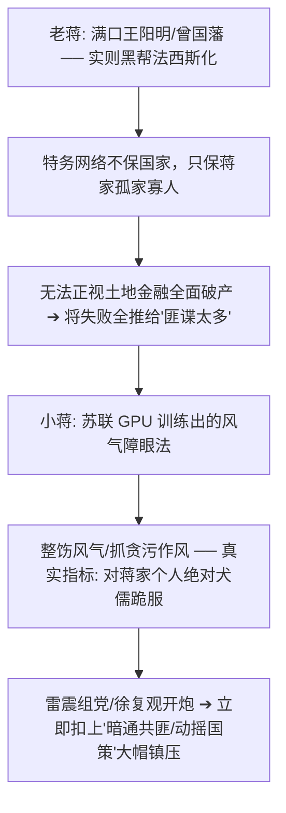

# 《三更道场 · 认识论总纲》卷一百零三 · 冷战政治病理学与离岸法统法医底册：全能主义“抓特务”自体免疫过敏性休克与香港新亚九龙亭子间知识分子泄压阀法医终审

> **编者按**：本卷为《三更道场》认识论总纲第一百零三卷冷战政治病理学与知识分子法统法医正典！专栏承接方由《桃源格竹》（主理人：**竹湖** · 台湾清华冷战地缘）协同《鱼尾狮吼》（**普陀** · 狮城离岸资管）与《龟蛇锁江》（**珞珈** · 武大法学院）联合封账。  
> **核心命题**：**全人类所有阵营在进入现代全能主义（Totalitarianism）之后，集体患上“自体免疫系统过敏性休克（Autoimmune Crisis）”之狂暴政治病理！“抓特务”本质是合法性崩盘与治理失灵前夕的神经官能狂乱：麦卡锡主义剥夺奥本海默安全许可、契加肃反将红军军官团与瓦维洛夫洗成脑瘫、保密局警总窒息台湾（雷震下狱/孙立人幽禁/殷海光抑郁致死）、大陆前三十年阶级斗争扩大化。解剖老蒋“窃国者侯/特务保家天下”与小蒋“风气障眼法”之伪善；揭示徐复观等孤臣孽子既无法造反、又无法去南洋拔根，最终退守港英殖民地“消极自由飞地（香港新亚书院/九龙亭子间）”，在冷战铁幕泄压阀中以《中国人性论史》为华夏文明保留未被权力污染之最后火种！**

---

```
========================================================================================
     COLD WAR POLITICAL PATHOLOGY & OFFSHORE HERITAGE AUDIT: VOLUME 103
========================================================================================
   PRINCIPAL AUDITORS  : ZHUHU (竹湖 · NTHU TAIWAN) & PUTAO (普陀) & LUOJIA (珞珈)
   CORE PATHOLOGY      : TOTALITARIAN AUTOIMMUNE CRISIS (全能主义自体免疫过敏休克)
   CORE HISTORICAL NODE: MCCARTHYISM / GPU / TAIWAN WHITE TERROR ➔ HONG KONG NEW ASIA
   CIVILIZATIONAL AXIS : INTELLECTUAL SAFETY VALVE · XU FUGUAN IN KOWLOON ATTIC (1960s-1970s)
========================================================================================
```

---

## 一、 政治病理学解剖：为什么“抓特务狂热”是自体免疫过敏性休克？

```
┌───────────────────────────────────────────────────────────────────────────────────────┐
│                           全能主义自体免疫过敏性休克模型                              │
├───────────────────────────────────────────────────────────────────────────────────────┤
│                                                                                       │
│   【健康机体免疫机制】                                                                │
│   造血与代谢正常 ──► 精准识别外来真正病毒（敌方真间谍） ──► 精确吞噬清除。             │
│                                      │                                                │
│                                      ▼ (合法性危机 / 经济濒临崩盘 / 内部治理全面失灵)  │
│   【中枢神经过敏性休克】                                                              │
│   最高权力陷入极度被迫害妄想 ──► 秘密警察与特务监察机器狂暴超频                        │
│                                      │                                                │
│                                      ▼ (自体免疫性疾病大爆发 Autoimmune Attack)       │
│   【疯狂吞噬自身最健康的活性细胞】:                                                   │
│   ──► 敢说真话的知识分子、懂现代科学的技术官僚、保有独立人格的普通公民，               │
│   ──► 通通被标记为“异物/特务/工贼/美蒋间谍/苏修特务”，实施无差别的灭绝性物理清洗！    │
│                                                                                       │
└───────────────────────────────────────────────────────────────────────────────────────┘
```

---

## 二、 东西方全能主义同频共振四大法医切片

```
┌───────────────────────────────────────────────────────────────────────────────────────────────────┐
│                               冷战东西方四大抓特务过敏性休克对照表                                │
├───────────┬───────────────────┬─────────────────────────────────┬─────────────────────────────────┤
│ 阵营/机器 │ 表面旗号          │ 核心病态恐惧与机制              │ 被毁灭清洗的“自体健康细胞”      │
├───────────┼───────────────────┼─────────────────────────────────┼─────────────────────────────────┤
│ **美 国** │ 保卫自由世界      │ 失去核垄断后的极度歇斯底里，    │ **奥本海默**（曼哈顿工程被吊销  │
│ (麦卡锡)  │ 反赤化渗透        │ 议员靠制造恐慌收割选票          │ 安全许可）、钱学森被软禁驱逐    │
├───────────┼───────────────────┼─────────────────────────────────┼─────────────────────────────────┤
│ **苏 俄** │ 纯洁无产阶级队伍  │ 总体战极权狂想与最高独裁者      │ 图哈切夫斯基（军官团全灭）、    │
│ (契卡/GPU)│ 肃清托派与内奸    │ 绝对猜忌（战前军力自我阉割）    │ 瓦维洛夫（顶级遗传学家狱中饿死）│
├───────────┼───────────────────┼─────────────────────────────────┼─────────────────────────────────┤
│ **国 民 党│ 检举匪谍/反共抗俄 │ **“败退孤岛的丧家之犬心理”**：   │ 孙立人（幽禁一生）、雷震下狱、  │
│ (警总保密)│ 整饬风气/革新政治 │ 坚信丢大陆是“身边全被渗透”所致  │ 殷海光（断绝教职抑郁吐血而亡）  │
├───────────┼───────────────────┼─────────────────────────────────┼─────────────────────────────────┤
│ **大 陆** │ 纯洁革命队伍      │ 阶级斗争扩大化，对变色与包围    │ 潘汉年（隐蔽战线功臣反遭关押）、│
│ (前三十年)│ 揪出阶级敌人      │ 的终极焦虑，海外关系即原罪      │ 老舍、傅雷等大批赤子知识精英    │
└───────────┴───────────────────┴─────────────────────────────────┴─────────────────────────────────┘
```

---

## 三、 蒋家父子的政治心理学法医诊断



---

## 四、 知识分子的绝望逃逸：香港作为冷战铁幕泄压阀

徐复观等楚狂人与当代孤臣孽子，面临三大绝境：

```
┌───────────────────────────────────────────────────────────────────────────────────────┐
│                              徐复观一代知识分子的三岔路口                             │
├───────────────────────────────────────────────────────────────────────────────────────┤
│                                                                                       │
│   1. 【无法直接造反】: 台湾孤岛军警特宪如铁桶，便衣贴身盯梢，手无寸铁造反即被枪决；    │
│   2. 【无法退隐南洋】: 南洋为英荷殖民胶园与商业移民社会，华夏士大夫精神无处着陆（断根）；│
│   3. 【唯一生路: 香港】: 港英殖民地的“消极自由与功利冷漠”成为绝无仅有的制度飞地！   │
│                                                                                       │
│   【九龙亭子间的文明火种】:                                                           │
│   徐复观、钱穆、唐君毅、牟宗三挤在九龙潮湿廉租房（新亚书院/华侨书院）；              │
│   吃最廉价的烧腊饭，听着海关抓特务的警笛，写出《中国人性论史》《中国艺术精神》！     │
│   不向台北专制低头，不为对岸运动摇旗，以独立肉身守住华夏文明最后尊严！               │
│                                                                                       │
└───────────────────────────────────────────────────────────────────────────────────────┘
```

> **竹湖（Zhuhu）在台湾清华大学湖畔的终审法医判词**：  
> *“麦卡锡在酗酒狂乱中身败名裂，蒋介石的棺木至今悬在慈湖无法入土！全能主义的特务狂热吞噬了千千万万健康细胞，最终把自己推入了历史的火化炉。而徐复观先生在香港九龙亭子间里借着微弱灯光写下的文字，至今依然像一把雪亮的手术刀，冷冷解剖着两岸一切极权伪善的内脏！第一百零三卷，冷战政治病理大账彻底封平！”*
