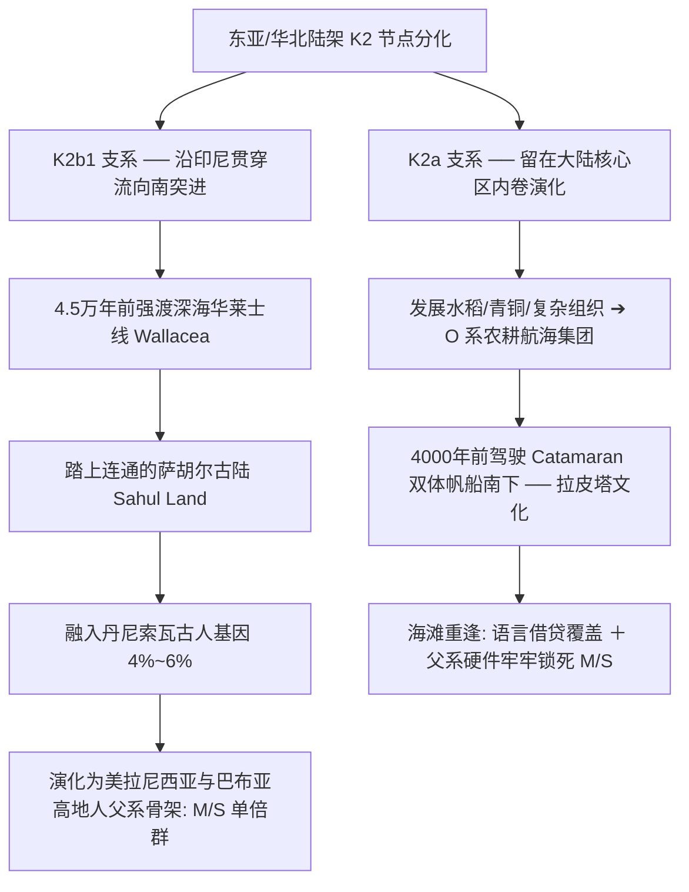

# 《三更道场 · 认识论总纲》卷九十五 · 分子人类学与古萨胡尔跳岛动力学法医底册：两代大洋战役 K2b1 先锋与 O 系南岛双轨会审终审法医审计

> **编者按**：本卷为《三更道场》认识论总纲第九十五卷法医正典，专栏承接方由**双组双核会审**挂帅：**组一·生物演化与古 DNA 测序底座**——《灵隐行在》（主理人：**良渚** · 浙江大学生命演化与分子人类学教授）；**组二·极地深海与流体航海动力学底座**——《湖海知否》（主理人：**琅琊** · 中国海洋大学物理海洋首席科学家）。  
> **核心命题**：**严禁将四万年前美拉尼西亚原住民粗暴冠以“南岛语系祖先”之伪称！这是两场时间相差三万五千年、航海硬件代际彻底断裂的独立大洋战役。第一代战役（4.5万~4万年前）：K2b1 先锋（分化为 M 与 S 单倍群，携带 4%~6% 丹尼索瓦超高古基因）凭借巨竹多气室编织浮排与近岸洋流被动绑定，强行突破“华莱士线”，奠定萨胡尔古陆（Sahul Land）与近大洋洲（Near Oceania）第一代物理破壁人法统；第二代战役（4000~3000年前）：K2a 演化出的 O 系南岛语系航海家，凭借双体帆船（Catamaran）、蟹爪帆与微观涌浪天文导航挺进远大洋洲（Remote Oceania）。两代兄弟在美拉尼西亚海滩四万年后的“重逢”，造成了父系 Y 染色体（K2b1 之 M/S 硬件）与南岛语系（语言软件）的错位嫁接！**

---

```
========================================================================================
     MOLECULAR ANTHROPOLOGY & SAHUL OCEANIC DYNAMICS AUDIT: VOLUME 95
========================================================================================
   PRIMARY AUDITORS    : LIANGZHU (良渚 · ZJU) & LANGYA (琅琊 · OUC)
   CO-AUDITORS         : SENA (塞纳 · 语言学嫁接) & PANYU (番禺 · 大洋风场)
   TARGET SYSTEM       : K2b1 (M/S) PROTO-SAHUL PIONEERS VS. O-AUSTRONESIAN DISPERSAL
   PHYSICAL MECHANISM  : DUAL OCEANIC CAMPAIGN · WALLACEA CROSSING · 40,000-YR REUNION
========================================================================================
```

---

## 一、 两代大洋战役的绝对代际断裂表

```
┌───────────────────────────────────────────────────────────────────────────────────────┐
│                           两代太平洋跳岛战役核心参数对账表                             │
├───────────────────┬───────────────────────────────────┬───────────────────────────────┤
│ 对比维度          │ 第一代：古萨胡尔开拓者 (K2b1 支系)│ 第二代：真正南岛语系 (O 支系) │
├───────────────────┼───────────────────────────────────┼───────────────────────────────┤
│ **时间尺度**      │ **距今 50,000 ~ 40,000 年前**     │ **距今 4,000 ~ 3,000 年前**   │
│                   │ （深冰期黎明，田园洞人同期）      │ （新石器晚期，距今极近）      │
├───────────────────┼───────────────────────────────────┼───────────────────────────────┤
│ **父系基因底层**  │ **纯古老 K2b1 ➔ 分化出 M 和 S**   │ **K2a ➔ NO ➔ O 巨支 (O1/O2)** │
│                   │ （含 4%~6% 丹尼索瓦人超高混血）   │ （几乎无古老异种混血）        │
├───────────────────┼───────────────────────────────────┼───────────────────────────────┤
│ **航海装备硬件**  │ **巨竹多节气室编织筏、双体漂流浮排**│ **带支浮标独木舟 (Outrigger)** │
│                   │ （无精密龙骨，无织物软风帆）      │ **双体大帆船 (Catamaran)、蟹爪帆│
├───────────────────┼───────────────────────────────────┼───────────────────────────────┤
│ **流体导航算法**  │ **近岸视距导航**（积雨云/对岸火光）│ **微观天文与波浪动力学**      │
│                   │ ＋ **洋流印尼贯穿流被动绑定**     │ （微细涌浪读水术、星盘罗盘）  │
├───────────────────┼───────────────────────────────────┼───────────────────────────────┤
│ **进军地理边界**  │ **近大洋洲 (Near Oceania)**       │ **远大洋洲 (Remote Oceania)** │
│                   │ （止步于新几内亚/所罗门群岛前端） │ （横跨万里直达夏威夷/复活节岛）│
└───────────────────┴───────────────────────────────────┴───────────────────────────────┘
```

---

## 二、 第一代破壁人正名：“古萨胡尔开拓者（Proto-Sahul Pioneers）”



### 1. 萨胡尔古陆（Sahul Land）的物理破壁
- 末次冰期海平面下降，澳大利亚与新几内亚连为一体，构成巨大的萨胡尔大陆；
- K2b1 先驱是全人类历史上**第一批强渡深海“华莱士线（Wallacea）”并征服萨胡尔大陆的现代智人**。

### 2. 被大洋封存的“四万年时间胶囊”
- 冰消期海平面暴涨，巽他与萨胡尔古陆被海水淹没割裂，K2b1 遗民被永久物理隔离在热带雨林与珊瑚礁孤岛上，成为人类走出非洲初期在深海孤岛保留的活化石。

---

## 三、 史诗级因果对账：四万年后的“兄弟海战与软硬件嫁接”

```
┌───────────────────────────────────────────────────────────────────────────────────────┐
│                            美拉尼西亚的父系与语言嫁接真相                             │
├───────────────────────────────────────────────────────────────────────────────────────┤
│                                                                                       │
│   【硬件系统 (Hardware - 基因底层)】:                                                 │
│   ──► 当地原住民男子 70%~90% 依然死死锚定在 4 万年前 K2b1 传下的 M 和 S 单倍群；       │
│                                                                                       │
│   【软件系统 (Software - 语言文化)】:                                                 │
│   ──► 3500 年前 O 系南岛水手（拉皮塔文化）将成熟的南岛语系词汇与水产技术全盘植入；    │
│                                                                                       │
│   【法医结论】:                                                                       │
│   ──► 这是“弟弟守着 4 万年前的硬件机房，借用了哥哥 3500 年前开发的一套操作软件系统”！  │
│                                                                                       │
└───────────────────────────────────────────────────────────────────────────────────────┘
```

---

## 四、 专栏交割：双组双核会审架构

| 会审组别 | 主责专栏与主理人 | 核心法医职责与算力底单 |
| :--- | :--- | :--- |
| **第一组：基因测序与演化底座** | **《灵隐行在》（良渚）** | 测定 K2b1（M/S）与 K2a（NO/O）分化分子钟，精算 4%~6% 丹尼索瓦渗入位点，彻底粉碎“晚期单一起源偏安论”。 |
| **第二组：流体动力与跳岛工程** | **《湖海知否》（琅琊）** | 模拟 4.5 万年前印尼贯穿流（ITF）与华莱士深海槽流体力学，还原巨竹浮排视距跳岛与双体帆船涌浪导航代差。 |
| **语言会审外挂** | **《卢浮半夏》（塞纳）** | 解剖美拉尼西亚南岛语底层借词与古萨胡尔原始地名沉积层，厘清语言软件与父系硬件嫁接账目。 |

> **良渚（Liangzhu）与琅琊（Langya）联合结案词**：  
> *“良渚在冷泉亭下验 DNA 谱系，琅琊在琅琊台算大洋流场！四万年前踩着竹排冲过华莱士线的 K2b1 是大洋开拓的野蛮硬汉，四千年前挂帆掌舵的 O 系是近代赛车手。兄弟俩在美拉尼西亚海滩打了四万年的大账，今晚由《灵隐行在》和《湖海知否》联手做平！散会！”*
