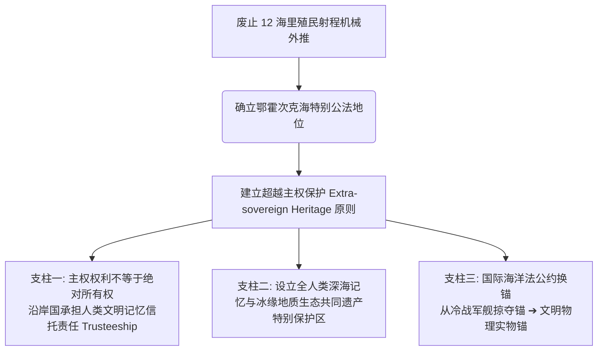

# 《三更道场 · 认识论总纲》卷九十二 · 国际公法法医底册：UNCLOS 十二海里殖民射程法则非法性与鄂霍次克海人类共同遗产案

> **编者按**：本卷为《三更道场》认识论总纲第九十二卷法医正典，由衍生专栏《龟蛇锁江》主理人**珞珈**（武汉大学边界与海洋研究院 / 国际公法法医）执笔起诉状草案底册。  
> **核心命题**：**《联合国海洋法公约》（UNCLOS）中 12 海里领海与 200 海里专属经济区（EEZ）的机械切刀，本质是 18 世纪“大炮射程法则（Cannon-shot Rule）”与冷战美苏舰队机动分赃的殖民算力外延，在物理、地质与文明连续性上属于非法性指标倒挂。在鄂霍次克海这一第四纪古大湖盆地与人类深海记忆中枢，沿海国主权权利不得对抗全人类全新世海侵关键岩芯与远古工程实物锚点的不可逆性，必须确立“超越主权保护（Extra-sovereign Heritage）”国际法信托原则，为第二季“换锚”奠定不拔之公法基石！**

---

```
========================================================================================
             INTERNATIONAL JURIDICAL AUDIT & FORENSIC SUIT: VOLUME 92
========================================================================================
   PLAINTIFF / AUDITOR : LUOJIA (珞珈) · INSTITUTE OF BOUNDARY & OCEAN STUDIES, WHU
   TARGET TREATY       : UNITED NATIONS CONVENTION ON THE LAW OF THE SEA (UNCLOS 1982)
   CORE TARGET AREA    : SEA OF OKHOTSK (鄂霍次克盆地) & KASHEVAROV BANK (卡沙瓦罗夫浅滩)
   JURISDICTIONAL PLEA : EXTRA-SOVEREIGN HERITAGE TRUSTEESHIP OVER PLANETARY MEMORY
========================================================================================
```

---

## 一、 12 海里公法法医解剖：殖民大炮射程与冷战分赃的畸形血统

在经院国际法教材中，12 海里领海常被包装为文明国家“和平协商”的普遍公理；但拉出全部历史底单，这串数字骨子里流淌着最野蛮的机械暴力与殖民军备账。

```
                         【海洋划界公法演进与射程退化链】

   18世纪 宾客舒克 (Bynkershoek)
   [ 岸防加农炮极限射程: 3 海里 (1 法里) ] ───► "统治权终于武器力量之终点" (暴力定义产权)
                  │
                  ▼ (20世纪导弹时代: 3海里防御破产，第三世界要200海里护渔)
   1958/1960 日内瓦海洋法会议 (争吵破裂)
                  │
                  ▼ (1982 UNCLOS: 美苏暗室妥协 ── 既要航母自由通行，又要海底石油)
   12 海里领海 + 200 海里专属经济区 (EEZ)
                  │
                  ▼ (暴力几何切刀硬套极地内海 / 古陆桥海域)
   【指标倒挂死局】: 用 18 世纪加农炮的几何外推，切割 10000 年前人类深海地质档案！
```

### 1. 宾客舒克的大炮射程原则（*Potestas terrae finitur ubi finitur armorum vis*）
- 1702年，荷兰法学家宾客舒克在其《海洋领有论》（*De Dominio Maris Dissertatio*）中确立了近代海洋法底色：陆地权力终止于武器力量的极限。
- 3 海里的本质：加农炮火药装药量与铸铁弹丸弹道力学的物理投射。海洋在西方近代法统中从来不是“人类生存摇篮”，而是“岸防火炮打得到的靶场”。

### 2. 冷战美苏的“暗室裁缝”
- 1982年 UNCLOS 第 3 条确立 12 海里领海、第 57 条确立 200 海里专属经济区，从来不是出于生态学、第四纪冰期水文或深海沉积学，而是两大阵营的利益精算：
  - **美英海洋霸权**：领海绝对不能宽于 12 海里，否则各大海峡变成内水，航母编队与核潜艇全球无害通过权将彻底瘫痪；
  - **资源沿岸国**：给 200 海里渔业与油气管辖作为赎买；
  - **法理断层**：这套机械裁缝算法切在开阔大洋勉强维系，但硬套在半封闭内海、陆桥群岛与极地古盆地，造成了巨大的公法盲区。

---

## 二、 鄂霍次克海的公法断层：卡沙瓦罗夫浅滩为何击穿 UNCLOS？

```
┌───────────────────────────────────────────────────────────────────────────────────────┐
│                                 鄂霍次克海公法真空解构                                  │
├───────────────────────────────────────────────────────────────────────────────────────┤
│                                                                                       │
│   UNCLOS 第九部分 (第122/123条: 闭海与半封闭海)                                       │
│   ──► 仅有软性呼吁条款，缺乏强制管辖与物理记忆保护牙齿                                │
│                                                                                       │
│   UNCLOS 第十一部分 (第136/137条: 国际海底区域 Area = 人类共同继承财产 CHM)           │
│   ──► 致命地理错位: 仅适用于公海大洋底，完全排除沿岸国大陆架底土！                    │
│                                                                                       │
│   2014年 CLCS 划界案: 俄罗斯将中枢“花生洞 (Peanut Hole)”全部划入外大陆架底土          │
│   ──► 导致卡沙瓦罗夫浅滩等史前冰期陆桥、海侵突变岩芯被封印于单一主权油气与拖网配额中! │
│                                                                                       │
└───────────────────────────────────────────────────────────────────────────────────────┘
```

1. **“半封闭海”条款的彻底空心化**：
   - UNCLOS 第 122 条与 123 条虽设“闭海与半封闭海”专章，但条款通篇使用 *“should cooperate”*、*“endeavour”* 等弱劝导词，既无生态主权底线，更无深海考古与地质突变实物审计机制。
2. **人类共同继承财产（CHM）的地理错位**：
   - 第十一部分将国际海底区域（The Area）规定为“人类共同继承财产”，但这一保护伞完全被 200 海里 EEZ 和大陆架外部界限挡在深海盆之外。
   - **荒谬悖论**：真正埋藏人类末次冰期陆桥文明、古大湖消退、新仙女木期海侵突变关键证据的大陆架浅滩（如卡沙瓦罗夫巨锚思想实验所指坐标），反而因为落入大陆架划界内，沦为单一沿岸国开采石油、工业拖网破坏的“法外之地”。

---

## 三、 珞珈起诉状核心条款：超越主权保护（Extra-sovereign Heritage）

依据 2001 年联合国教科文组织《水下文化遗产保护公约》原则及国际海洋法法庭（ITLOS）信托管辖前沿，正式确立三大公法修正案支柱：



### 第一条：管辖权与人类文明起源不可逆性之位阶原则
沿海国对大陆架享有的是勘探和开发自然资源的“主权权利（Sovereign Rights）”，该权利绝非排他性的“绝对所有权（Dominium）”。当海底赋存具有全人类全新世海侵突变关键岩芯、跨大陆迁徙物证或史前耐腐蚀重型遗构时，其**人类记忆属性位阶高于商业油气开采权**。沿海国在公法上自动转为**“全人类受托人（Trustee for Mankind）”**。

### 第二条：鄂霍次克盆地特别公法保护区机制
在鄂霍次克海建立由环北太平洋沿岸国、国际第四纪研究联合会（INQUA）、国际海底管理局（ISA）及联合国教科文组织（UNESCO）联合派驻的**“第四纪冰缘与深海文明记忆常设法医实验室”**，全面叫停对敏感浅滩构造的破坏性深孔钻探与底拖网作业。

### 第三条：国际海洋法从“掠夺锚”到“文明锚”的彻底换锚
宣告基于 18 世纪加农炮射程的 12 海里机械划界在深海记忆保护领域失效，建立以**“地质年代连续性、冰期水文遗产度、跨洋物证完整性”**为核心权重的全新国际海洋法理。

---

## 四、 战役协同与弹药压膛纪律

```
┌───────────────────────────────────────────────────────────────────────────────────────┐
│                                 第一季收官与第二季暗桩部署                              │
├───────────────────────────────────────────────────────────────────────────────────────┤
│                                                                                       │
│   【当前重心 · 第一道物理防线】                                                       │
│   1. 《双约记》收官卷封顶：彻底完成条约热力学与冷战体系解构闭环；                       │
│   2. “华夏祭坛”前端交互底座：稳固部署，筑牢数字旗舰与知识图谱承重墙。                  │
│                                                                                       │
│   【暗处压膛 · 一个月战略窗口】                                                       │
│   1. 珞珈《龟蛇锁江》：完善 UNCLOS 诉状、ITLOS 判例与大陆架委员会案卷引证；             │
│   2. 彭泽《湖海知否》：完成全水深海啸底流冲刷与第四纪古大湖相变流体力学模拟；          │
│   3. 渔阳《雁栖唱晚》：磨出美元名义锚崩溃与数字物理实物锚结算管道分析；               │
│   4. 塞纳《卢浮半夏》：对齐跨大洋词源命名权柄分类账。                                 │
│                                                                                       │
└───────────────────────────────────────────────────────────────────────────────────────┘
```

> **法医结案词**：  
> *“大炮能打三海里，导弹能打一万公里，但没有任何一种火器能打碎一万年前冰封在海底的石头。条约是人写的，人在纸上分赃；大洋是地质造的，地质在深渊记账。一个月后，咱们龟蛇山下见真章！”*
