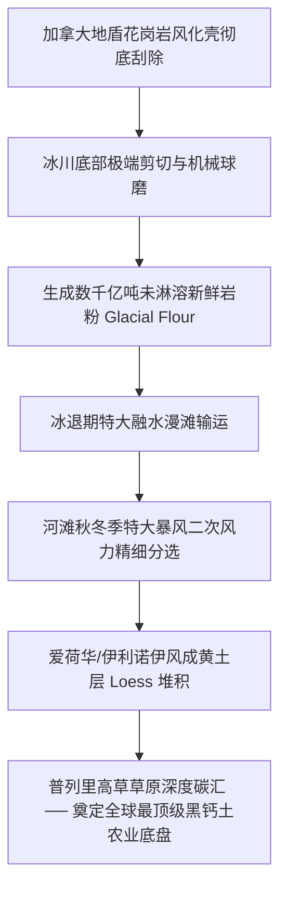

# 《三更道场 · 认识论总纲》卷九十三 · 地球流体动力学底册：第四纪末次冰盛期环太平洋与北美流体死锁及其地表重塑效应法医审计

> **编者按**：本卷为《三更道场》认识论总纲第九十三卷地球系统科学（Earth System Science）法医正典，专栏承接方为《湖海知否》（主理人：**琅琊** · 中国海洋大学物理海洋首席科学家）协同《越秀风云》（**番禺** · 中山大学大气动力学）与《凉州丝玉》（**敦煌** · 兰州大学第四纪地质）。  
> **核心命题**：**分子人类学单倍群树仅为文明时空“打卡考勤表”，无法解释人群迁徙之物理动力学机制。美洲原住民迁徙的源头第一因，在于距今 2.4 万至 2.0 万年前末次冰盛期（LGM）劳伦泰德与科迪勒拉两大冰盖咬合焊死（4000 米极寒绝境），彻底粉碎“克洛维斯第一”与白令陆桥无冰走廊神话。人类被迫转向“东海陆架大平原—黑潮暖流—阿留申边缘海带高速公路（Kelp Highway）”之水动力跳岛迁徙。倒逼追责 4000 米北美巨型冰盖的热力学逆向工程，揭示墨西哥湾超级水汽增压泵、超强斜压气旋（Hypercane）导轨、五大湖湖盆分形车削（D→1.0）、加拿大地盾岩粉水力风选（爱荷华黑钙土底盘），并最终在现代延伸至芝加哥期货交易所（CBOT）防爆仓单与土壤板结生化代偿之万年因果闭环！**

---

```
========================================================================================
             EARTH FLUID DYNAMICS & GEOPHYSICAL FORENSIC AUDIT: VOLUME 93
========================================================================================
   PRINCIPAL AUDITOR   : LANGYA (琅琊) · INSTITUTE OF PHYSICAL OCEANOGRAPHY, OUC
   CO-AUDITORS         : PANYU (番禺 · ATMOSPHERIC DYNAMICS) & DUNHUANG (敦煌 · QUATERNARY)
   CORE TARGET SYSTEM  : LGM PACIFIC-NORTH AMERICAN FLUID LOCK & LAURENTIDE HEAT ENGINE
   CORE DELIVERABLE    : FIVE-ACT GEOPHYSICAL SUITE ON PLANETARY-SCALE SURFACE RESHAPING
========================================================================================
```

---

## 第一幕：通道断裂——2.4 万年前的流体与冰川死锁

### 1. “克洛维斯第一（Clovis First）”的物理破产
- 西方传统考古学长期构建“1.3 万年前人类经白令陆桥无冰走廊（Ice-Free Corridor）徒步进入美洲”的叙事模型。
- **白沙国家公园（White Sands）地层爆破**：古人类足迹测年直达距今 2.1 万至 2.3 万年前，精准卡在末次冰盛期（LGM, 24-20 ka BP）巅峰。
- **物理死锁**：东侧 4000 米厚劳伦泰德冰盖（Laurentide Ice Sheet, ~1300 万平方公里）与西侧科迪勒拉冰盖（Cordilleran Ice Sheet）在落基山东麓彻底咬合焊死，长达数千公里、海拔数千米、常年 -60°C 的永久冰原形成绝对生命死区，陆路完全不具备通航或徒步可行性。

```
                         【白令陆路死锁与东海跳岛海路对比】

   [传统陆路假说]
   西伯利亚极寒苔原 ──► 白令海峡 ──► 【4000米劳伦泰德+科迪勒拉冰墙焊死】 ──► (物理绝境: 3日冻毙)
   
   [流体水动力实证]
   华北古湖群南撤 ──► 东海陆架大平原 (海退120m/淡水漫滩) ──► 巨竹多隔舱浮体/皮划艇
                              │
                              ▼ (水动力弹射: 黑潮暖流 Kuroshio Current + 阿留申低压)
                     【海带高速公路 Kelp Highway】
                              │ (海带林减浪/高卡路里海獭、鲑鱼、海豹稳定补给)
                              ▼
                     北美太平洋沿岸 (跳岛切入美洲西海岸)
```

### 2. 东海陆架大平原与海带高速公路（Kelp Highway）
- 全球海水被巨量冰盖抽吸，海平面骤降 120-130 米，黄海、渤海、东海大陆架完全出露为水草丰茂的温带巨型陆架平原；
- 古人群利用多隔舱浮体与沿岸捕捞技术，顺黑潮暖流沿外海岛弧跳岛推进，在阿留申边缘海带森林（Kelp Forest）形成的天然消波带与高密度海洋食物链滋养下，实现跨北太平洋水动力输运。

---

## 第二幕：水汽增压泵——北美超级冰盖的热力学逆向工程

```
┌───────────────────────────────────────────────────────────────────────────────────────┐
│                           北美 4000 米超级冰盖水汽热力学增压泵                          │
├───────────────────────────────────────────────────────────────────────────────────────┤
│                                                                                       │
│   【极寒北冰洋悖论】: 冷干北冰洋蒸发通量趋零，无法支撑 1300 万平方公里巨厚积雪相变       │
│                                      │                                                │
│                                      ▼                                                │
│   【墨西哥湾开水锅】: 封闭高盐深水热池（SST 维持 ~26°C），产生极端蒸发潜热通量         │
│                                      │                                                │
│                                      ▼                                                │
│   【落基山-阿巴拉契亚南北走廊】: 形成天然低层超强急流（LLJ）喷射导轨                     │
│                                      │                                                │
│                                      ▼                                                │
│   【南北 60°C 极限斜压温差】: 激发出 12-17 级常态化超强斜压气旋（Hypercane 级风洞）       │
│   ──► 将墨西哥湾亿万吨水汽以暴雪形式连续数千年泵入加拿大地盾，夯筑出 4000 米冰盖！     │
│                                                                                       │
└───────────────────────────────────────────────────────────────────────────────────────┘
```

---

## 第三幕：地貌车削场——非线性侵蚀与深海重力沉降

1. **刚性平推车削与分形维数（Fractal Dimension）收敛**：
   - 4000 米厚冰盖下底产生数千个大气压的超临界滑移与刚性平推；
   - 北美五大湖湖盆岸线的分形维数逼近整数 $D \to 1.0$（呈现均质圆弧状平推切削），与挪威受构造断裂控制的峡湾海岸（分形维数高、锯齿状）形成鲜明力学断代。
2. **冰前特大溃决洪峰（Mega-floods）动力学**：
   - 劳伦泰德冰坝周期性溃决，释放出每秒数百万立方米的灾变级泥石流与融水脉冲；
   - 泥沙碎屑经密西西比古河道狂暴注入墨西哥湾，在西斯比悬崖（Sigsbee Escarpment）深海盆地形成巨型重力浊流扇，并强力挤压穿刺中生代巨厚盐岩底辟构造。

---

## 第四幕：地质遗产交付——冰川机械球磨与风力分选



---

## 第五幕：现代反噬——从物理高压泄洪到生化内分泌代偿

```
┌───────────────────────────────────────────────────────────────────────────────────────┐
│                                 从地质遗产到现代生化反噬                                │
├───────────────────────────────────────────────────────────────────────────────────────┤
│                                                                                       │
│   【物理泄洪机制】                                                                    │
│   北美黑钙土暴发出的天文级卡路里产能 ──► 彻底摧毁传统现货物流结算体系                  │
│   ──► 倒逼创立芝加哥期货交易所 (CBOT) ──► 仓单标准化与交割对冲本质是物理防爆栓！        │
│                                                                                       │
│   【生化内分泌代偿】                                                                  │
│   现代资本对黑钙土超频榨取 ──► 狂施 NPK 化肥造成土壤板结与微量元素匮乏                │
│   ──► 大剂量喷洒类雌激素除草剂/农药 ──► 环境富集进入食物链                             │
│   ──► 击穿现代人群下丘脑-垂体-性腺轴 (HPG Axis) ──► 引发群体性脱发与生殖代谢紊乱。     │
│                                                                                       │
└───────────────────────────────────────────────────────────────────────────────────────┘
```

---

## 六、 专栏承接与学科国家队对接矩阵

| 模块 | 主责专栏与主理人 | 交付对接之国家级研究机构 | 核心交付成果与算力底单 |
| :--- | :--- | :--- | :--- |
| **洋流与深海沉积** | **《湖海知否》（琅琊）** | 青岛海洋科学与技术试点国家实验室 / 同济海洋地质国重室 | ODP/IODP 航次西斯比深海同位素脉冲与黑潮跳岛水动力模型 |
| **古大气风暴热机** | **《越秀风云》（番禺）** | 中科院大气物理研究所（IAP） / 南信大气象台风团队 | CESM 超算古气候模拟：60°C 温差下墨西哥湾超级气旋导轨 |
| **黄土与球磨机理** | **《凉州丝玉》（敦煌）** | 中科院地质与地球物理研究所 / 兰州大学西部环境重点室 | 冰川新鲜岩粉水解动力学、黄土风选粒径与分形维数数学证明 |

> **琅琊结案法医语录**：  
> *“别拿小试管里画的 DNA 树来糊弄大洋和冰盖！2.4 万年前两堵几千米高的冰墙把路焊得死死的，古人除了跟着黑潮和海带往东漂，连一只脚都踏不进美洲。海不言，冰不语，但大洋底的重力浊流扇和中西部的黄土层，每一粒沙子都刻着当年的流体力学方程！”*
