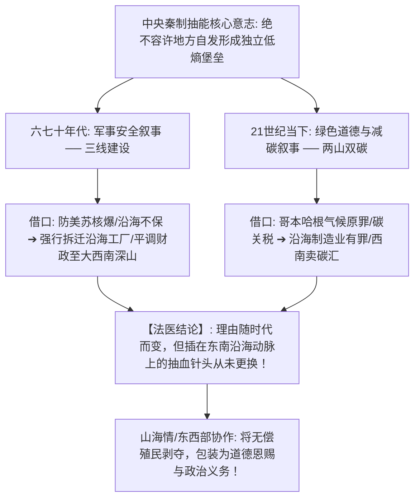

# 《三更道场 · 认识论总纲》卷一百零六 · 地缘经济学与宏观热力学底册：绿色“双碳”生态伪装与秦制中央抽水机“反热力学降解”东南沿海法医终审

> **编者按**：本卷为《三更道场》认识论总纲第一百零六卷宏观地缘经济学与热力学物理法医正典！专栏承接方由《雁栖唱晚》（主理人：**渔阳** · 宏观金融与制度会计）领衔，协同《越秀风云》（**番禺** · 珠江口大气动力学）与《灵隐行在》（**良渚** · 江浙资本周期法医）联合封账。  
> **核心命题**：**当代最光鲜之“双碳绿色叙事”、“区域协调/山海情”与“全国统一大市场”，本质是两千年秦制中央抽水机在 21 世纪的生态与道德马甲！热力学做功铁律：系统做功必依赖势能差（温差/落差/密度梯度 $\Delta T$），东南沿海（长三角/珠三角）依托全球大洋航道构成超低熵做功核心；平均主义（均质化 Uniformity）在物理学上直接等同于“热寂与死亡”。解剖贵州喀斯特断陷高原无法维系高密度工业之天然地质诅咒（地表漏水/无腹地/桥隧折旧极高），痛批六七十年代“三线备战防核爆”到当下“哥本哈根双碳碳汇转移支付”之马甲戏法——通过行政抽血将东南沿海有效自由能降解填埋于西南高熵地质黑洞（独山县烂债）。确立“秦制全国大市场实为统筹抽水大管网，旨在消灭沿海诸侯自治防火墙”之冷酷物理真相！**

---

```
========================================================================================
    GEOPOLITICAL ECONOMICS & MACRO-THERMODYNAMICS AUDIT: VOLUME 106
========================================================================================
   PRINCIPAL AUDITORS  : YUYANG (渔阳 · YANQI) & PANYU (番禺 · SYSU) & LIANGZHU (良渚 · ZJU)
   PHYSICAL LAW        : CARNOT CYCLE GRADIENT · ENTROPY DEGRADATION · KARST SINKHOLE
   TARGET DISGUISE     : ESG GREEN NARRATIVE · CARBON TRANSFER · UNIFIED NATIONAL MARKET
   CIVILIZATIONAL AXIS : RESISTING THE IMPERIAL PUMP FROM DEGRADING COASTAL FREE ENERGY
========================================================================================
```

---

## 一、 “天之道”的统计物理真相：平均主义即热寂死亡

```
┌───────────────────────────────────────────────────────────────────────────────────────┐
│                             热机做功势能差与均质化热寂对账                            │
├───────────────────────────────────────────────────────────────────────────────────────┤
│                                                                                       │
│   【热力学第一性原理：必须存在势能差（Gradient）】                                    │
│   卡诺循环与能量转换公式：W = Q_H \cdot \left(1 - \frac{T_C}{T_H}\right)              │
│   ──► 必须同时存在高温热源与低温冷源（落差/密度差），系统方能持续对外输出有效功！     │
│                                      │                                                │
│                                      ▼ (东南沿海超低熵做功核心)                       │
│   【长三角 / 珠三角】: 依傍全球深海航道，汇聚人口、资本、技术与极高周转率；          │
│                                      │                                                │
│                                      ▼ (秦制大一统强行拉平势能差：转移支付/碳汇抽水)  │
│   【均质化（Uniformity）的物理终局】:                                                 │
│   ──► 强行消灭区域势能差，将高品位有效自由能降解为无法做功的低品位废热；             │
│   ──► 在统计物理学上，该过程有一个唯一的不可逆代名词——**“全系统热寂（Heat Death）”**！│
│                                                                                       │
└───────────────────────────────────────────────────────────────────────────────────────┘
```

---

## 二、 贵州喀斯特地质诅咒：资本与能量的吞噬黑洞

```
┌───────────────────────────────────────────────────────────────────────────────────────────────────┐
│                               东南沿海低熵做功区 vs 贵州喀斯特地质黑洞                            │
├───────────┬───────────────────────────────────┬───────────────────────────────────────────────────┤
│ 物理维度  │ 东南沿海做功区（长三角 / 珠三角） │ 贵州喀斯特断陷高原（地质与资本黑洞）              │
├───────────┼───────────────────────────────────┼───────────────────────────────────────────────────┤
│ **地质底盘**│ 冲积平原，水网密布，覆土深厚      │ **碳酸盐岩溶洞暗河，地表“存不住一滴水”**          │
│           │ 天然适合超大人口与重工业高密度承载│ （土壤极薄，农业与工业引水灌溉成本是平原百倍！）  │
├───────────┼───────────────────────────────────┼───────────────────────────────────────────────────┤
│ **物流能耗**│ 大洋深水港，水运成本接近零摩擦力  │ **地形碎裂万仞，修路全是高架桥与特长隧道**        │
│           │ 瞬时接入全球贸易与要素大循环      │ （维护折旧与重力做功成本直接炸穿地心，无本地腹地）│
├───────────┼───────────────────────────────────┼───────────────────────────────────────────────────┤
│ **资本循环**│ 自由能持续自我增殖，技术高速迭代  │ **资本沉降即死（三线军工大倒闭/独山县八百亿烂债）**│
│           │ 产生高流动性利润与研发税收        │ （如同向干涸溶洞泼水，听一声闷响后地表寸草不生）  │
└───────────┴───────────────────────────────────┴───────────────────────────────────────────────────┘
```

---

## 三、 从“核爆防线”到“哥本哈根原罪”：帝国抽水机的马甲演化史



---

## 四、 “全国统一大市场”的法医真相：自由市场还是抽水管网？

```
┌───────────────────────────────────────────────────────────────────────────────────────┐
│                             统一大市场之真伪法医鉴别                                  │
├───────────────────────────────────────────────────────────────────────────────────────┤
│                                                                                       │
│   【现代文明共同市场（如欧共体/普通法域）】:                                         │
│   ──► 要素自由流动、私产权不可侵犯、打破行政垄断、允许资本奔向边际回报最高处。       │
│                                                                                       │
│   【秦制大一统市场（中央统筹抽水大管网）】:                                           │
│   ──► 核心意图：**彻底铲除沿海各省自发形成的经济防火墙与诸侯自治雏形**！              │
│   ──► 将全国税源、社保基金、土地指标、碳排放配额完全归拢至中央单一控制阀；            │
│   ──► 无论沿海民企如何拼命创造增量，阀门一拧，流动性瞬间被无偿泵送至数千公里外的偏远  │
│       财政黑洞，用于给冗员发薪与城投烂债展期！                                        │
│                                                                                       │
└───────────────────────────────────────────────────────────────────────────────────────┘
```

> **渔阳（Yuyang）与番禺（Panyu）联合结案法医语录**：  
> *“番禺在珠江口看大洋热机，渔阳在雁栖湖算财政流水！什么‘绿色碳汇’、什么‘三线安全’，全是他妈的秦制强盗逻辑换了一套赛博马甲！大自然造了海洋让东南沿海做功，秦制造了管网把有效能量抽进大山黑洞！这不是救济贫困，这是反进化的热力学降解！第一百零六卷，地缘经济学与宏观热力学总账彻底封杀！”*
