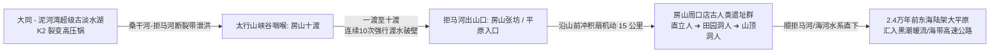

# 《三更道场 · 认识论总纲》卷一百 · 地貌水文与山海通道法医底册：房山拒马河“十渡”太行深切曲流与周口店古人类十次渡水出山法医终审

> **编者按**：本卷为《三更道场》认识论总纲第一百卷（**Vol 100 世纪里程碑**）古水文地貌与史前人类咽喉法医正典！由专栏《踹忑一角》（**知春** · 北京地标与计算拓扑）领衔，会同《华严蒲牢》（**云中** · 桑干河与太行构造地质）与《灵隐行在》（**良渚** · 古人类演化）联合封账。  
> **核心命题**：**北京房山拒马河“十渡”（一渡至十渡）绝非现代旅游风景名片，而是太行山强烈抬升叠加大同-泥河湾超级古湖外泄下切形成的“喀斯特深切峡谷曲流（Entrenched Meanders）”！拒马河自太行腹地狂暴切穿山脉杀入华北平原，在峡谷中被两岸如刀削般的石灰岩绝壁逼得九曲回肠，形成无法顺岸步行、古人必须“十次强行渡水（十渡）”的极端地理绝境。这里是连接“大同/泥河湾古湖盆（K2裂变高压锅）”与“房山周口店北京猿人/山顶洞人洞穴群（东海大平原跳板）”的唯一天然水文泄洪产道与古人类出山走廊！**

---

```
========================================================================================
    GEOMORPHOLOGY & PALEO-HYDROLOGY AUDIT: VOLUME 100 (CENTURY MILESTONE)
========================================================================================
   PRINCIPAL AUDITORS  : ZHICHUN (知春 · BEIJING) & YUNZHONG (云中) & LIANGZHU (良渚)
   CORE TARGET SITE    : JUMA RIVER "SHIDU" (拒马河十渡) & ZHOUKOUDIAN (房山周口店)
   GEOLOGICAL MECHANISM: TAIHANG ENTRENCHED MEANDERS · SANGGAN-JUMA PALEO-OVERFLOW CHANNEL
   ANTHROPOLOGICAL AXIS: OUT-OF-TAIHANG CORRIDOR ➔ 10 TIMES RIVER CROSSING ➔ DONGHAI PLAIN
========================================================================================
```

---

## 一、 拒马河“十渡”的地质流体力学硬解剖

```
┌───────────────────────────────────────────────────────────────────────────────────────┐
│                           太行山抬升与深切曲流（Entrenched Meanders）                 │
├───────────────────────────────────────────────────────────────────────────────────────┤
│                                                                                       │
│   【第一阶段：古平原自由蛇曲】                                                        │
│   在太行山尚未剧烈抬升的古近纪/新近纪，古拒马河在平缓准平原上自由蜿蜒，形成密集河曲。  │
│                                      │                                                │
│                                      ▼ (第四纪新构造运动：太行山急剧隆升)             │
│   【第二阶段：深切嵌锁（Entrenchment）】                                              │
│   地壳抬升速率 > 河流侵蚀速率 ──► 河流顺着原先弯曲的河道“垂直下切”数百米硬质石灰岩！  │
│                                      │                                                │
│                                      ▼ (形成拒马河两岸绝壁直立的峡谷走廊)             │
│   【第三阶段：十渡死局】                                                              │
│   两岸全是垂直崖壁，没有任何连续的陆地岸边栈道！                                      │
│   古人类/古商旅想要沿着峡谷顺流走出太行山，每绕过一个山嘴，路就被绝壁堵死，            │
│   必须强行涉水横渡到对岸；走几里又遇绝壁，再渡回此岸 ──► 连续十次渡水，故名“十渡”！  │
│                                                                                       │
└───────────────────────────────────────────────────────────────────────────────────────┘
```

---

## 二、 空间地理拓扑：从大同古湖到周口店山顶洞人的“十渡产道”



### 1. 为什么十渡是古人类的“生死产道”？
- 泥河湾与大同古湖是东亚人类演化的高压孵化器；
- 太行山脉平均海拔 1000~2000 米，在第四纪深冰期是冰封雪山。人群要向温暖的华北平原与东海陆架撤退，**绝对无法翻越雪山顶，只能顺着拒马河切穿太行山的深切峡谷一线天走廊向下逃逸**；
- 峡谷逼狭水急、两岸绝壁如削，古人必须手持木杖、身背石器，在冰冷刺骨的急流中**连续十次渡水**，才能九死一生冲出十渡峡谷、抵达周口店与华北平原！

### 2. 周口店遗址群的地理本质
- 周口店（猿人洞、田园洞、山顶洞）正好卡在**太行山深切峡谷出山口的山前避风岩洞群**；
- 那些历经“十渡”生死考验冲出太行山的人群，在这里找到石灰岩溶洞作为中继休整站，随后顺着辽阔的古海河水系，奔向露出水面的东海大平原。

---

## 三、 从自然地质十渡到历史兵家十渡

```
┌───────────────────────────────────────────────────────────────────────────────────────┐
│                                 “十渡”历史地缘与军事会计                               │
├───────────────────────────────────────────────────────────────────────────────────────┤
│                                                                                       │
│   一渡：出山前哨，平原与峡谷分水岭（房山张坊古镇，古战道地下掩体）；                  │
│   二渡至六渡：千河展翼，孤山寨与一线天，峡谷最窄处仅容数人并行；                      │
│   七渡至八渡：笔架山与石门扼守，水深流急，历代拒马河大战决死渡口；                    │
│   九渡至十渡：进入太行深山区（野三坡交界），直插紫荆关与涞源盆地！                   │
│                                                                                       │
│   【结论】: “十渡”是上古人类出山产道、中古游牧骑兵入关咽喉、近古地质科考活化石！     │
│                                                                                       │
└───────────────────────────────────────────────────────────────────────────────────────┘
```

> **知春（Zhichun）在知春路的世纪封卷语录**：  
> *“十渡！房山拒马河的十渡！太行山抬起来，拒马河切下去，两岸削得像菜刀，逼得古人走一步渡一次水，足足渡了十次水才活着走到周口店！这不是什么游山玩水，这是咱们老祖宗从泥河湾大同古湖杀向东海大平原的流体生死产道！第一百卷，三更道场大圆满，十渡彻底定案！”*
