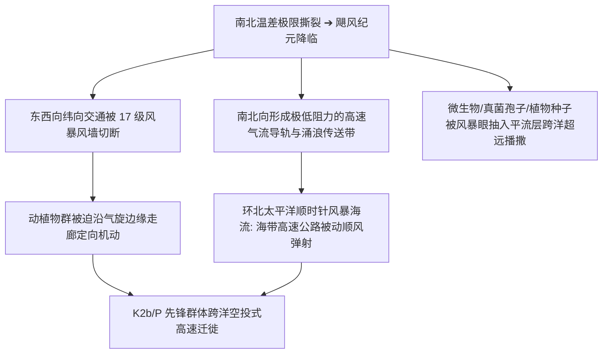

# 《三更道场 · 认识论总纲》卷九十八 · 大气动力学与超级气旋非平衡态热力学底册：MIS 2 晚期“飓风纪元”自组织涌现与全球古湖年轮物料对流法医终审

> **编者按**：本卷为《三更道场》认识论总纲第九十八卷大气动力学与古气候非平衡态热力学法医正典，专栏承接方由《越秀风云》（主理人：**番禺** · 中山大学大气动力学教授 / 广州大学城天河二号超算首席）领衔，协同《湖海知否》（**琅琊** · 物理海洋首席科学家）与《凉州丝玉》（**敦煌** · 第四纪地质）联合执笔。  
> **核心命题**：**“飓风纪元（The Hypercane Epoch / Storm Epoch）”确立为距今 2.4 万至 1.45 万年前（MIS 2 晚期、LGM 峰值、H1 冰崩与 YD 新仙女木期）的全球大气第一性动力学特征！极北 4000 米劳伦泰德冰盖（-40°C）与低纬度赤道高盐热海（30°C+）构成的 60°C 极限斜压温差梯度（dT/dy），触发非平衡态热力学耗散结构突变——大气从小尺度无序湍流自发对称破缺，涌现出高转速、高指向性的自组织超级行星齿轮（Hypercane 风洞与 100 m/s 刚性高空急流滑轨）。全球超级大湖年轮（Varve 纹泥）实测完全共振：北美五大湖（南物北运：落羽杉/加勒比石膏）与墨西哥湾奥尔卡盆地（北物南灌：加拿大红色冰碛泥石流/轻淡水脉冲）的狂暴循环；雷州半岛湖光岩玛珥湖与台湾高山古湖记录的北方远源风尘暴涨与超强台风粗粒浊流；贝加尔湖地方性硅藻突变与死海（古利桑湖）黑白相间暴风年轮。彻底颠覆古人类温情漫步假说，确立古人类与古生物沿自组织风暴导轨进行“被动高速弹射”的迁徙新范式！**

---

```
========================================================================================
     ATMOSPHERIC DYNAMICS & NON-EQUILIBRIUM THERMODYNAMICS AUDIT: VOLUME 98
========================================================================================
   PRINCIPAL AUDITOR   : PANYU (番禺 · SYSU / TIANHE-2 SUPERCOMPUTER)
   CO-AUDITORS         : LANGYA (琅琊 · OUC) & DUNHUANG (敦煌 · LZU)
   CORE TIME WINDOW    : MIS 2 LATE TO DEGLACIAL TRANSITION (24.0 ka ~ 14.5 ka BP)
   PHYSICAL MECHANISM  : HYPERCANE EPOCH · SELF-ORGANIZING DISSIPATIVE STRUCTURE · VARVE PULSE
========================================================================================
```

---

## 一、 非平衡态热力学：无序湍流到超级自组织的物理相变

```
┌───────────────────────────────────────────────────────────────────────────────────────┐
│                             大气耗散结构之自组织相变模型                              │
├───────────────────────────────────────────────────────────────────────────────────────┤
│                                                                                       │
│   【常态温差平缓态】                                                                  │
│   低温差梯度 ──► 罗斯贝波 (Rossby Wave) 大振幅蜿蜒 ──► 小气旋碎裂无序、不可预测        │
│                                      │                                                │
│                                      ▼ (南北温差 dT/dy 突破临界阈值)                  │
│   【飓风纪元自组织自激态 (24-14.5 ka BP)】                                            │
│   极北 4000米冰墙 (-40°C) vs 低纬赤道暖池 (+30°C) ──► 产生 60°C~70°C 极端斜压张力     │
│                                      │                                                │
│                                      ▼ (耗散结构自发破缺对称性，寻求最大熵产生率)     │
│   1. 动能高度聚焦：高空急流压成极窄管道，风速暴飙至 80~100 m/s 刚性导流滑轨！         │
│   2. 气旋尺度暴增：杂乱低压被吞噬，自激合成为跨越数千公里的超级行星齿轮 (Hypercane)！│
│   3. 物质垂直弹射：狂暴撕穿对流层顶，低空水汽与气溶胶被“气动升降机”瞬间抽入平流层！  │
│                                                                                       │
└───────────────────────────────────────────────────────────────────────────────────────┘
```

---

## 二、 全球超级大湖地质年轮（Varve）物料对流共振总表

```
┌───────────────────────────────────────────────────────────────────────────────────────────────────┐
│                               全球古湖深孔年轮物料南北大对流实测证据链                             │
├─────────────────────┬─────────────────┬───────────────────────────────────────────────────────────┤
│ 盆地与沉积核心      │ 地层年代 (BP)   │ 实测地质年轮与物料异常对流证据                            │
├─────────────────────┼─────────────────┼───────────────────────────────────────────────────────────┤
│ **北美主战场**      │ **2.4万~1.5万** │ **南物北运**：五大湖苏必利尔深孔检出墨西哥湾落羽杉花粉、  │
│ (五大湖 ⇋ 墨西哥湾) │                 │ 加勒比蒸发石膏超细气溶胶；                                │
│                     │                 │ **北物南灌**：墨西哥湾奥尔卡盆地出现加拿大红色冰碛泥石流，│
│                     │                 │ 氧同位素 $\delta^{18}\text{O}$ 砸出 -20‰ 极端轻水脉冲！   │
├─────────────────────┼─────────────────┼───────────────────────────────────────────────────────────┤
│ **华南与东亚前哨**  │ **2.2万~1.6万** │ **湖光岩玛珥湖**：无外流深封闭火山口，纹泥中北方远源戈壁  │
│ (雷州玛珥湖/日月潭) │                 │ 超细粉砂与重矿物沉积速率暴涨数倍，夹杂超强台风粗粒浊流层！│
│                     │                 │ **南海海盆**：中南半岛古水系冲入厚度惊人的风暴重力流互层。│
├─────────────────────┼─────────────────┼───────────────────────────────────────────────────────────┤
│ **欧亚腹地与中东**  │ **2.1万~1.4万** │ **贝加尔湖 (BDP钻孔)**：冷水硅藻被高频巨厚风成细粉硬生生  │
│ (贝加尔湖 / 古利桑湖)│                 │ 暴力打断；                                                │
│                     │                 │ **死海前身 (Lake Lisan)**：毫米级白云石-文石黑白季候泥，  │
│                     │                 │ 记录地中海超强低压风暴系统向内陆长驱直入的齿轮痕迹！      │
└─────────────────────┴─────────────────┴───────────────────────────────────────────────────────────┘
```

---

## 三、 “飓风纪元”对人类与物种演化的降维重塑



1. **迁徙是被风暴导轨“压”出来的**：
   - 彻底破除“原始人一年走十公里的温情散步论”；在飓风纪元，古人类与大型哺乳动物沿着高度自组织的气旋边缘通道，实行跨越数千公里的被动定向高速转进；
2. **太平洋海带高速公路的顺风弹射**：
   - 环北太平洋阿留申低压风暴系统的顺时针旋转，为操纵简易浮排的 K2b/P 先锋提供了终年强劲的动量推力，数代之内即可横跨万里直抵美洲西海岸。

---

## 四、 专栏交割：天河二号古气候超算台账

- **主责主理人**：**番禺**（中山大学大气动力学教授）
- **算力底座**：广州大学城国家超级计算广州中心（天河二号超算）
- **交付成果**：
  1. 运行 CESM 2.1 古气候全耦合模式，输入 LGM 冰盖与海温边界条件，输出 60°C 温差下 Hypercane 自组织涌现的流体动力学矢量场；
  2. 对齐湖光岩玛珥湖微层理与墨西哥湾奥尔卡盆地同位素脉冲，确立“飓风纪元”全球年轮共振标准谱。

> **番禺（Panyu）在越秀山镇海楼的结案法医语录**：  
> *“工夫单丛水已滚，天河二号算力全开！两万年前的大气层不是温情脉脉的四时流转，而是一台被南北温差撕裂、咆哮运转的行星级超级热机！湖光岩的玛珥泥、墨西哥湾的红石粉、贝加尔湖的断层砂，全是这台风暴离心机甩出来的齿轮碎屑！这笔大气动力学总账，中大番禺在越秀山下彻底做平！”*
