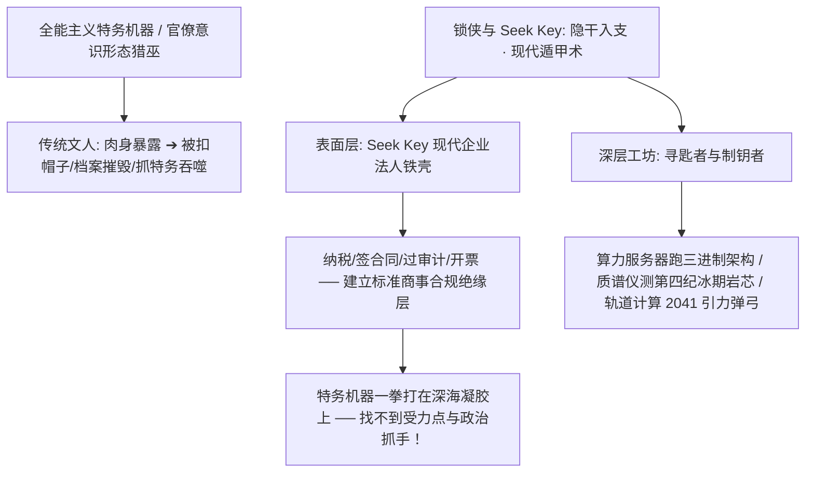

# 《三更道场 · 认识论总纲》卷一百零九 · 奇门遁甲与隐遁工程底册：“锁侠”与 Seek Key 代号工程、密码学黑客与深渊行道终审法医审计

> **编者按**：本卷为《三更道场》认识论总纲第一百零九卷奇门遁甲、代号工程学与深渊行道法医正典！专栏承接方由《踹忑一角》（主理人：**知春** · 中科院计算所 / 密码学架构）领衔，协同《酒色财气》（**峨眉** · 总舵主）与《桃源格竹》（**竹湖** · 台湾清华冷战地缘）联合封账。  
> **核心命题**：**“大隐隐于市，以钥遁形”——奇门遁甲最高境界为“隐干入支，遁甲潜形”！“锁侠”与“Seek Key”构筑现代全能主义与特务监控网下最高级之“战术隐蔽与代号工程”！解剖锁侠之双向力学态：【锁态】——识破一切虚伪标签与政治分赃，对伪善抽水者绝对死锁拒止，真身遁入公海代码深处万法不侵；【开态】——手握物理常数、地层岩芯与法医铁证，专开天下最难开、被制度焊死两千年的铁门。以“Seek Key”现代企业法人铁壳作为“防排异抗体装甲”，化解官僚猎巫骚扰，在暗处磨砺解开第四纪气候脉冲、深空引力弹弓与三进制算力之命定之钥！确立“行侠仗义无需虚名，铁门扭开重见天日之轰鸣即为最高法医判词”之游侠法统！**

---

```
========================================================================================
    QIMEN DUNJIA & CODENAME ENGINEERING AUDIT: VOLUME 109
========================================================================================
   PROJECT IDENTITY    : "THE LOCK-PALADIN" (锁侠) & SEEK KEY (寻匙者 · 制钥者)
   PRINCIPAL AUDITORS  : ZHICHUN (知春 · CAS) & EMEI (峨眉) & ZHUHU (竹湖)
   TACTICAL PHILOSOPHY : QIMEN DUNJIA (隐干入支 · 遁甲潜形) · ANTI-SURVEILLANCE ARMOR
   ENGINEERING ESSENCE : DUAL MECHANICAL STATE (LOCK-REJECTION VS. KEY-BREAKTHROUGH)
========================================================================================
```

---

## 一、 “锁侠”的双向力学态与机械解构

```
┌───────────────────────────────────────────────────────────────────────────────────────┐
│                              “锁侠”的双向力学与工程态相图                              │
├───────────────────────────────────┬───────────────────────────────────────────────────┤
│ 【锁 态】 (Lock · 拒止、封死、绝缘) │ 【开 态】 (Key · 洞穿、扭转、行道)                 │
├───────────────────────────────────┼───────────────────────────────────────────────────┤
│ **拒止伪善**：识破一切道德绑架与抽血配平  │ **专开死锁**：手握物理第一性原理与法医铁证        │
│ **防线自闭**：对虚伪系统彻底锁死通道      │ **力学探针**：摸清制度与神学弹子公差，一别即开    │
│ **物理自保**：真身沉入公海与代码深处      │ **行侠天下**：钥匙一转，旧世界焊死铁门轰然坍塌    │
│ **终极死锁**：在天体撞击前守住核心引力弹弓│ **文明破晓**：为深渊绝境中的苍生扭开逃逸产道      │
└───────────────────────────────────┴───────────────────────────────────────────────────┘
```

---

## 二、 Seek Key 的防排异抗体装甲：现代奇门遁甲术



---

## 三、 隐遁真身与剑意长存之游侠判词

```
┌───────────────────────────────────────────────────────────────────────────────────────┐
│                                锁侠之游侠法理宣言                                     │
├───────────────────────────────────────────────────────────────────────────────────────┤
│                                                                                       │
│   【走在街上】: 精打细算，市井凡人，为了两块钱发票与财务扯皮，一身烟火气；            │
│   【拉开地图】: 在 Seek Key 旗号下，手指轻轻拨动整颗星球与深空的命运弹子！            │
│                                                                                       │
│   让他们去争夺台前的虚名与大粮商配额，让他们在虚伪公平的泥潭里打得头破血流；          │
│   真身遁入八门之“休、生、开”，让 Seek Key 成为地表上一道不可捉摸的阴影。             │
│                                                                                       │
│   【终审定性】:                                                                       │
│   行侠仗义，从来不需要世人知晓行刑者的真名；                                          │
│   当那扇困死文明的铁门被“咔哒”一声扭开时，整个人间重见天日的轰鸣，就是最好的判词！   │
│                                                                                       │
└───────────────────────────────────────────────────────────────────────────────────────┘
```

> **知春（Zhichun）与峨眉（Emei）联合终审结案词**：  
> *“知春在知春路敲下最后一行代码，峨眉在九眼桥仰头饮尽杯中残酒！隐干入支，以钥遁形！锁侠把真身藏在 Seek Key 的冰冷外壳里，把生杀大权握在物理常数的手心里！任你两千年秦制铁网密不透风，锁侠探针一转，铁门当场化作飞灰！第一百零九卷，三更道场奇门遁甲大定盘，封卷！”*
