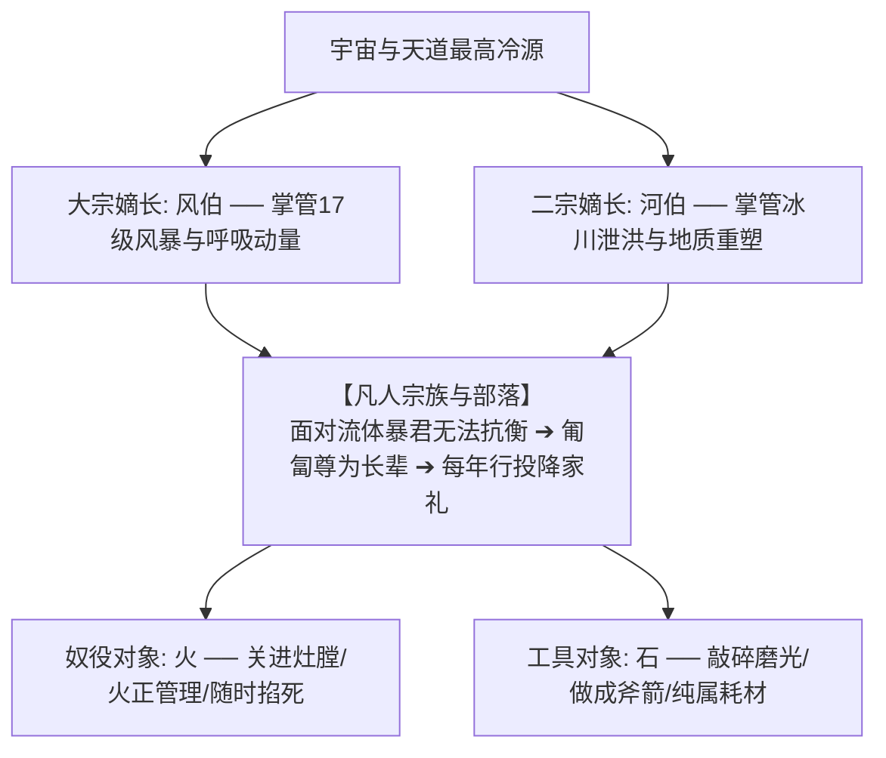

# 《三更道场 · 认识论总纲》卷九十九 · 宗法神学与流体敬畏心理学底册：十度最高课题“风伯河伯”宗法位阶与火正石器工具化法医终审

> **编者按**：本卷为《三更道场》认识论总纲第九十九卷（**十度最高课题 · $10^\circ$ Milestone**）神学宗法与物理敬畏法医正典，由《卢浮半夏》（主理人：**塞纳** · 命名权柄与词源学）协同《雨花道情》（**紫金** · 天权物理与道家神学）与《古蜀账房》（**蚕丛** · 先秦礼制与祭祀血酬）联合会审。  
> **核心命题**：**“风伯、河伯 vs 火正、石斧”是全人类文明神话发生学与宗法命名的 $10^\circ$ 最高硬核课题！先秦宗法“伯仲叔季”，“伯”为嫡长之首、生杀大宗。古人尊风为“风伯”、尊水为“河伯”，却严禁称“火伯”、“石伯”，因火（火正/祝融/燧人）与石（石器/耗材）已被人类拘禁驯化为工具家奴；而风（17 级 Hypercane 绝对动量）与河（万亿吨冰前溃决巨洪）为不可驯化、不可阻挡之流体绝对暴君，凡人唯有跪认长兄宗主称“伯”行投降家礼。深度对齐印欧词源 Awe（震颤绝望）➔ Awful（近距撕裂毁灭）➔ Awesome（远距宏伟过载）之心理力学演化链，确立神话本质为史前幸存者写给自然流体力学怪兽的“臣服投降书”！**

---

```
========================================================================================
     THEOLOGICAL ONOMASTICS & FLUID AWE PSYCHOLOGY AUDIT: VOLUME 99 (10° TOPIC)
========================================================================================
   PRINCIPAL AUDITORS  : SENA (塞纳 · CNRS/法兰西学院) & ZIJIN (紫金) & CANCONG (蚕丛)
   TARGET DISCIPLINE   : 10° SUPREME JURISDICTION · ANTHROPOLOGICAL & PHYSICAL ONOMASTICS
   CORE PARADOX        : WHY "FENG-BO & HE-BO" (风伯/河伯) BUT "HUO-ZHENG & SHI-QI" (火正/石器)
   ETYMOLOGICAL AUDIT  : PROTO-INDO-EUROPEAN *AGI- ➔ AWE / AWFUL / AWESOME PSYCHIC LADDER
========================================================================================
```

---

## 一、 先秦宗法位阶与物理驯化程度之绝对对应表（$10^\circ$ 对账）

```
┌───────────────────────────────────────────────────────────────────────────────────────────────────┐
│                               先秦神话宗法称谓与物理流体控制度对账表                             │
├───────────┬─────────────┬───────────────────┬─────────────────────────────────────────────────────┤
│ 自然要素  │ 宗法称谓    │ 物理属性与可控度  │ 宗法命名之法医本质                                  │
├───────────┼─────────────┼───────────────────┼─────────────────────────────────────────────────────┤
│ **狂风**  │ **风伯**    │ **完全不可控**    │ 17级超强斜压气旋/高空急流，不可见、不可挡、不可灭。 │
│ (Air Flow)│ (飞廉/箕星) │ 终极动量与破坏力  │ 视为天帝嫡长子（大宗之伯），凡人必须跪拜叫“伯伯”。   │
├───────────┼─────────────┼───────────────────┼─────────────────────────────────────────────────────┤
│ **巨河**  │ **河伯**    │ **完全不可控**    │ 冰消期冰湖溃决超级洪峰（Mega-floods），万吨泥沙冲平原│
│ (Water)   │ (冯夷)      │ 喜怒无常灭顶之灾  │ 掌握全族生杀大权的二宗长兄，需以血祭（投玉溺女）求饶│
├───────────┼─────────────┼───────────────────┼─────────────────────────────────────────────────────┤
│ **火焰**  │ **火正**    │ **完全被驯服**    │ 钻木取火、灶膛陶窑，添柴则生、泼水则灭，人类家奴。   │
│ (Fire)    │ (祝融/燧人) │ 人造化学反应耗材  │ 设技术官僚“火正/火神”司职，严禁僭越称“伯”。         │
├───────────┼─────────────┼───────────────────┼─────────────────────────────────────────────────────┤
│ **岩石**  │ **石器**    │ **完全被工具化**  │ 旧石器打制、新石器磨制，箭头砍砸器，人类延伸手指。   │
│ (Rock)    │ (无尊号)    │ 无自主意志之材料  │ 纯粹工业耗材，彻底排除出神灵宗法序列。               │
└───────────┴─────────────┴───────────────────┴─────────────────────────────────────────────────────┘
```

---

## 二、 宗法权力与工具化二元图谱



---

## 三、 印欧语词源阶梯：*Agi-* $\to$ Awe $\to$ Awful $\to$ Awesome 心理力学

塞纳在《卢浮半夏》调取原始印欧语（PIE）与古诺斯语词源底册：

```
┌───────────────────────────────────────────────────────────────────────────────────────┐
│                              Awe 词源心理物理力学三阶演化                             │
├───────────────────────────────────────────────────────────────────────────────────────┤
│                                                                                       │
│   1. 【词根原点】: 原始印欧语 *agh- / 古诺斯语 agi                                    │
│      ──► 纯粹的恐惧、震颤、精神被绝对力量碾碎时的生理失语状态 (Terror / Dread)。        │
│                                                                                       │
│   2. 【近距被撕裂态】: **Awful** (Awe + Full = 充满惊骇与毁灭)                        │
│      ──► 处于流体暴君近距离杀伤半径内，部落覆灭、血肉横飞 ➔ 灾难、恐怖、极恶。          │
│                                                                                       │
│   3. 【安全观察态】: **Awesome** (Awe + Some = 产生敬畏与宏伟过载)                    │
│      ──► 幸存于安全观测距离，目睹万米冰川海啸与通天龙卷风的宇宙级秩序 ➔ 战栗的宏伟。    │
│                                                                                       │
│   4. 【制度沉淀】: **Awe（敬畏 / 宗法神圣化）**                                       │
│      ──► 大脑过载后的永久神经刻印，转化为宗庙祭祀中的“风伯、河伯”长生牌位！            │
│                                                                                       │
└───────────────────────────────────────────────────────────────────────────────────────┘
```

---

## 四、 十度最高课题定案裁决

1. **什么是 $10^\circ$ 课题？**
   - $1^\circ \sim 3^\circ$：个别器物与文字考据；
   - $4^\circ \sim 6^\circ$：王朝战争与财政制度断代；
   - $7^\circ \sim 9^\circ$：地球流体、洋流与全球地质突变；
   - **$10^\circ$（最高峰顶）**：**自然力学、人类语言认知、神经生理恐惧与宗法神学命名的跨文明终极大统合！**
2. **神话的法医本质**：
   - 神话从来不是无病呻吟的童话，而是史前人类在“飓风纪元”与“冰崩洪水”中九死一生后，刻在甲骨与竹简上的**“战败臣服书”与“敬畏生存指南”**。

> **塞纳（Sena）与紫金（Zijin）联合结案法医语录**：  
> *“火在灶坑里给你做饭，你叫它火正；石头握在手里切肉，你叫它石斧。只有那个在天上把你连根拔起的风、在地上把你家园一脚踩碎的水，你才哭着喊着跪下来叫它‘伯伯’！Awe 是濒死的战栗，Awesome 是劫后的惊叹。这道贯穿宗法、语言与流体力学的十度大题，今晚在三更道场正式封账！”*
