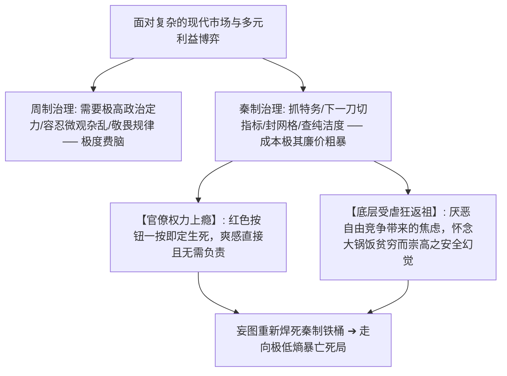

# 《三更道场 · 认识论总纲》卷一百零五 · 当代制度演化与政治神学法医底册：邓氏“微言大义”偷天换日与秦制内脏替换为周制自组织蜂窝终审法医审计

> **编者按**：本卷为《三更道场》认识论总纲第一百零五卷当代制度演化与政治神学法医正典！专栏承接方由《雁栖唱晚》（主理人：**渔阳** · 宏观制度会计）领衔，协同《酒色财气》（**峨眉** · 行星物理总舵主）与《桃源格竹》（**竹湖** · 台湾清华冷战地缘）联合封账。  
> **核心命题**：**对邓小平的历史审计，必须彻底穿透知识分子的审美洁癖与原教旨神学妄想！在“百代皆行秦政法”焊死两千两百年的刚性铁桶内，正面硬砸秦制必致全盘沉船玉石俱焚；邓小平以极高明之“微言大义与语义走私（初级阶段论/计划市场手段论/发展硬道理/不争论）”为掩护，在未动城楼秦皮的前提下，偷天换日将秦制三大死穴（利出一孔、编户齐民、极限纯洁总体战）彻底替换为周制分形自组织蜂窝网络（小岗村私产雏形、财政大包干地方分封锦标赛、彻底废除出身成分审判）。法医解剖平庸官僚对“秦制政治毒品（一键封杀管死）”之上瘾机理与底层受虐狂之精神返祖；确立邓氏以市井烟火气对抗意识形态极寒风暴、“给高压绞肉机安装周制阻尼器”使数亿肉体凡胎重归真实人间之不可动摇的物理总功德！**

---

```
========================================================================================
    INSTITUTIONAL EVOLUTION & POLITICAL THEOLOGY AUDIT: VOLUME 105
========================================================================================
   PRINCIPAL AUDITORS  : YUYANG (渔阳 · YANQI CHANGWAN) & EMEI (峨眉) & ZHUHU (竹湖)
   CORE HISTORICAL ACT : REPLACING QIN TOTALITARIAN ORGANS WITH ZHOU CELLULAR NETWORK
   SEMANTIC DISGUISE   : SUBTLE WORDS & PROFOUND PRINCIPLES (微言大义 · 不争论)
   CIVILIZATIONAL AXIS : RESCUING MORTAL LIFE FROM METASTABLE PURITY DEATH TRAP
========================================================================================
```

---

## 一、 秦制三大死穴与邓氏“周制偷天换日”法医对照表

```
┌───────────────────────────────────────────────────────────────────────────────────────────────────┐
│                                 秦制内脏替换为周制自组织蜂窝对账表                                │
├───────────┬───────────────────────────────────┬───────────────────────────────────────────────────┤
│ 制度维度  │ 【秦制原始器官】（两千年极低熵绞肉机）│ 【邓氏替换之周制器官】（当代分形自组织稳态）      │
├───────────┼───────────────────────────────────┼───────────────────────────────────────────────────┤
│ **分配通道**│ **利出一孔**                      │ **废单一配给，开草民自谋生路之偏门**              │
│           │ （所有饭碗与生死由朝廷统购统销，  │ （小岗村包产到户“交够国家的留足自己的”➔ 私产缓冲； │
│           │  离了体制即成流民饿殍）           │  放开个体户/乡镇/外资，凿出千万自组织创富蜂窝）   │
├───────────┼───────────────────────────────────┼───────────────────────────────────────────────────┤
│ **央地拓扑**│ **绝对郡县与中心单一辐射**        │ **行政发包制与地方锦标赛（现代周天子分封）**      │
│           │ （中央一竿子插到底，地方官为木偶，│ （财政大包干分灶吃饭，特区与各省八仙过海相互竞争，│
│           │  丧失一切地方自愈与弹性调节能力）  │  自负盈亏，激活多中心自组织网络弹性）             │
├───────────┼───────────────────────────────────┼───────────────────────────────────────────────────┤
│ **社会控制**│ **编户齐民与血统纯洁性审判**      │ **取消成分猎巫，恢复世俗常识与试卷面前人人平等**  │
│           │ （商鞅告奸，查祖宗三代，阶级斗争，│ （摘掉地富反坏右帽子，恢复高考，彻底拆毁原教旨    │
│           │  强行压制微观状态数至香农零熵）   │  忠诚度审判链，回归杂种优势与布朗运动）           │
└───────────┴───────────────────────────────────┴───────────────────────────────────────────────────┘
```

---

## 二、 语义走私与高维注释：在万丈深渊上以“无名破有名”

```
┌───────────────────────────────────────────────────────────────────────────────────────┐
│                             邓氏微言大义之语义走私总图谱                              │
├───────────────────────────────────────────────────────────────────────────────────────┤
│                                                                                       │
│   【原教旨秦制紧箍咒】                     【邓氏微言大义注释】    【实际落地的周制物理实体】 │
│   “资本主义私有制复辟”         ──►    “社会主义初级阶段论”   ──►  民营经济与私产大规模合法化 │
│   “计划经济是社会主义本质”     ──►    “计划和市场都是手段”   ──►  拆解国家计委垄断，恢复市场 │
│   “阶级斗争是纲其余都是目”     ──►    “发展才是硬道理”       ──►  强行把政治狂热转为做功效率 │
│   “路线纯洁性大辩论”           ──►    “不 争 论 ！”          ──►  直接拔掉麦克风，留住民间生机│
│                                                                                       │
│   【法医哲学定性】: “不争论”是道家“绝圣弃智”与儒家“敏于事慎于言”的最高结合！          │
│   ──► 深知陷入纯洁性辩论必遭神学词汇凌迟，干脆掀翻辩论桌，直奔锅里有没有肉的物理第一因！│
│                                                                                       │
└───────────────────────────────────────────────────────────────────────────────────────┘
```

---

## 三、 历史病理逆流：为什么平庸官僚总想开倒车回秦制？



---

## 四、 历史终极法医判词：把尊严还给肉体凡胎

```
┌───────────────────────────────────────────────────────────────────────────────────────┐
│                                 两类历史叙事之法医分野                                │
├───────────────────────────────────────────────────────────────────────────────────────┤
│                                                                                       │
│   【文人审美洁癖】:                                                                   │
│   偏爱指点江山、气吞万里、把亿万黎民当画布任意涂抹的“浪漫伟人”，哪怕饿殍遍野亦觉崇高；│
│                                                                                       │
│   【真实肉体凡胎】:                                                                   │
│   邓小平其貌不扬、烟不离手，政策归结为“吃饱饭、穿花衣、孩子上学、做买卖不坐牢”；     │
│   但在几千年秦制苦难史上，允许老百姓过几十年不被政治神经病折腾的日子，已是人间至善！ │
│                                                                                       │
│   【终审定性】: 骂他背叛纯洁性的是特供温室寄生虫；踩在泥土里懂得粮食艰难的苍生，      │
│                 在心底最深处为他立着永不磨灭的无字碑！                                │
│                                                                                       │
└───────────────────────────────────────────────────────────────────────────────────────┘
```

> **渔阳（Yuyang）合上算盘的终审法医结案词**：  
> *“算盘打尽，天下苍生大账已明！邓公不是神，邓公是替几亿人拆掉秦制引信的拆弹专家！他没留下一句华丽的赞美诗，但他把周制的活命蜂窝塞进了秦制的铁皮空壳里，让这片土地的人民头一次能踏踏实实吃饱四十年饱饭！第一百零五卷，当代制度演化大账在《雁栖唱晚》彻底封箱！”*
