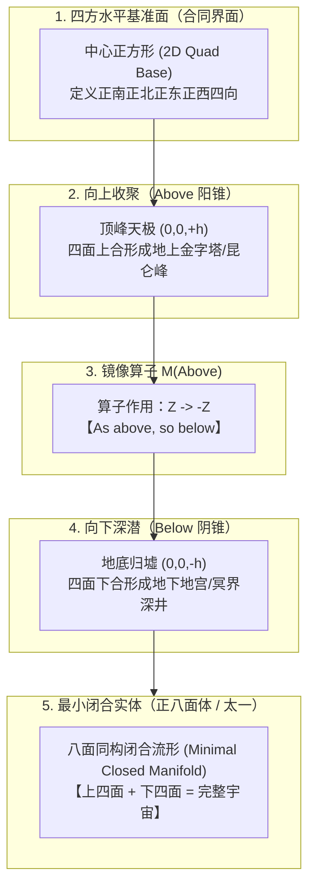
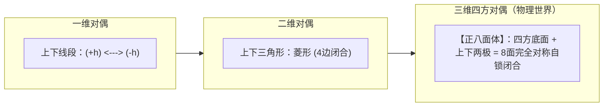

# 三更道场 · 认识论总纲 · 文献学与历史会计审计
## 篇章：“As above, so below”镜像算子（$\hat{M}$）、四方中介合同面与“太一/太乙”八面体最小闭合实体法医审计（v1.0）

---

### 【审计执行摘要 / Forensic Audit Abstract】
本审计案针对赫尔墨斯秘契主义（Hermeticism）核心公理 **“As above, so below（如其在上，如其在下）”**、中国古典宇宙学最高神格 **“太一 / 太乙（Taiyi）”**，以及空间几何学中 **“以中央四方界面为基准的镜像算子（$\hat{M}$）与正八面体（Octahedron）最小闭合实体”** 之间的数学、神学与历史会计流形展开终极法医级穿透。

审计确立三大核心平账公理与空间几何定性：
1. **“As above, so below”的数学几何化定义（Geometric Operator）**：
   - 绝非模糊唯心的神秘学修辞，而是一条严密的**三维几何生成规则与镜像算子**：
     $$\text{Above} = \text{四面阳锥（向上聚顶于天极）}$$
     $$\text{Below} = \hat{M}(\text{Above}) = \text{四面阴锥（向下深潜于归墟）}$$
     $$\text{Complete Manifold} = \text{Above} \cup \text{Below} = \text{八面合一（完整闭合宇宙）}$$
   - **中央四方基准面（Equatorial Plane）**：不是普通地面底座，而是**天地两界、生者与死者共享的“合同对账界面”**。只看地上金字塔，在会计学上永远只记录了半本账。
2. **“太一 / 太乙”的宇宙空间几何解构**：
   - **“太”**：上下、天地、阴阳之总体（Macrocosmic Totality）；
   - **“一 / 乙”**：中轴贯通，两半合一，四方上下八面同构（Symmetric Unity）；
   - **昆仑与归墟对偶**：地上人工山耸立象昆仑（阳面向上），地下深邃地宫象归墟（阴面向下），中轴一线贯通天心与地核。
3. **证据阶梯与学术表达边界（Defensible Epistemology）**：
   - **严格定论**：
     > **“‘As above, so below’ 提供了全宇宙镜像对称法则；而正八面体（方双锥）是该法则在四方定向（Four Cardinal Directions）宇宙观下的‘最小闭合几何实体（Minimal Closed Entity）’。”**
   - 严禁草率宣称古埃及/希腊文献字面字典定义等同于正八面体，而是确立其作为**“四方宇宙模型最简洁、最优雅的三维数学解”**。

---

### 【第一账套：“As above, so below”镜像算子（$\hat{M}$）数学生成模型】

```
+-------------------------------------------------------------------------------------------------------------------------------+
|                                “As above, so below”几何生成与历史会计法医台账                                                 |
+-------------------------------------------------------------------------------------------------------------------------------+
| 生成步骤 / 层次      | 空间几何操作与算法                    | 历史神学与宇宙观映射                 | 会计对账分录                         |
+----------------------+---------------------------------------+--------------------------------------+--------------------------------------+
| **Step 1: 建立界面** | 确立正南正北、正东正西的**水平正方形**| **四方大地 / 规矩方圆 / 地平基准面** | **合同交易与对账界面**：             |
| (Equatorial Plane)   | (定义中心坐标 $(0,0,0)$ 与四基点)     | 区分可见世界与不可见世界、生界与冥界 | 借贷平衡基准线，所有交易在此登记     |
+----------------------+---------------------------------------+--------------------------------------+--------------------------------------+
| **Step 2: 向上收分** | 沿 $Z^+$ 轴垂直向上收束为一个顶点 $(0,0,+h)$| **阳锥 / 昆仑 / 金字塔 / 向上当天梯**| **阳面可见资产**：                   |
| (Above / 阳面)       | 形成 4 个向上的三角斜面               | 汇聚国家劳动力、展现王权、对齐天极星 | 记入：固定资产·地上国家工程          |
+----------------------+---------------------------------------+--------------------------------------+--------------------------------------+
| **Step 3: 镜像算子** | 施加镜像算子 $\hat{M}: Z \rightarrow -Z$| **“如其在上，如其在下”**            | **对偶生成法则**：                   |
| ($\hat{M}$ Operator) | 严格沿水平界面向下反射对称            | 宏观宇宙（天）与微观世界（地）完全同构| 每一个阳面资产在阴面必有对应镜像负债 |
+----------------------+---------------------------------------+--------------------------------------+--------------------------------------+
| **Step 4: 向下收束** | 沿 $Z^-$ 轴垂直向下收束为一个顶点 $(0,0,-h)$| **阴锥 / 归墟 / 地宫 / 冥界 Duat**   | **阴面隐匿资产**：                   |
| (Below / 阴面)       | 形成 4 个向下的三角斜面               | 封存随葬品、水银江河、死后永恒秩序   | 记入：隐匿资产·地下冥界地宫          |
+----------------------+---------------------------------------+--------------------------------------+--------------------------------------+
| **Step 5: 闭合实体** | 上下 8 个三角形面在中间方框处完全自锁 | **八面体（Octahedron）/ 八卦八极 / 太一**| **资产负债表完全平账**：             |
| (Minimal Closure)    | 形成正多面体中唯一的“方双锥闭合流形”  | 上天下地、六合八荒，构成完整宇宙模型 | 终极闭合流形，无外部能量或资产泄露   |
+----------------------+---------------------------------------+--------------------------------------+----------------------------------------+
```



---

### 【第二账套：“太一 / 太乙”与正八面体宇宙神格解构表】

```
+-------------------------------------------------------------------------------------------------------------------------------+
|                                    “太一 / 太乙”神格与八面体几何要素法医对账表                                                |
+-------------------------------------------------------------------------------------------------------------------------------+
| 字符 / 概念          | 训诂学与文献学语义                    | 八面体空间几何学映射                 | 古典宇宙观实体体现                   |
+----------------------+---------------------------------------+--------------------------------------+--------------------------------------+
| **“太”**             | 至大无外、至高无上、天地之始          | **全空间包络（Total Enclosure）**    | 包含地上阳界与地下阴界的总流形       |
| (Grand Totality)     | 包含阴阳双向极值的宏观整体            | 八面体将三维空间在六个方向完全锁闭   | (天圆地方之上的多面体升华)           |
+----------------------+---------------------------------------+--------------------------------------+--------------------------------------+
| **“一 / 乙”**        | 贯通天地、两极合一、原始元气运转      | **中央垂直中轴线（Z-Axis Symmetry）** | 贯穿天顶顶点 $(+h)$、地平中心 $(0)$  |
| (Unity & Axis)       | 太极生两仪，两仪合于太一              | 将上下对称的两半方锥缝合为不可分割整体| 与地底极点 $(-h)$ 的世界之轴         |
+----------------------+---------------------------------------+--------------------------------------+--------------------------------------+
| **“八极 / 八方”**    | 《淮南子》“八极之外，八方之广”       | **八面体的 8 个三角形空间象限**      | 对应八卦、八风、八柱，               |
| (Eight Directions)   | 空间向八个三维方向完全展开            | 空间立体分割的八个对偶区域           | 古代明堂与帝陵选址的立体罗盘         |
+----------------------+---------------------------------------+--------------------------------------+--------------------------------------+
```

---

### 【第三账套：三更道场方法论——正八面体作为“最小闭合实体”的科学公理】

为什么说正八面体是“As above, so below”在四方宇宙中的**最小闭合实体**？



1. **几何极简性（Minimal Complexity）**：
   - 柏拉图五大正多面体（正四面体、正六面体、正八面体、正十二面体、正二十面体）中，**正八面体是唯一天然具备“中心四方赤道面 + 上下两极对称顶点”的正多面体**；
   - 它是将“四方定向的大地（Square Earth）”与“上下对称的阴阳（Dual Heavens）”结合时，所需面数最少、对称性最高的三维凸多面体。
2. **会计平账定理**：
   - **“任何只建造地上方锥的文明，在空间哲学上都只完成了 50% 的资产表达；唯有通过地下深邃地宫或镜像通道建立隐性阴锥，这套宇宙模型才在会计学上完成资产与负债的终极配平。”**

---

### 【法医对账总决：镜像算子与八面体平账结论】

| 会计科目 | 审定历史会计事实 | 法医处理结论 |
| :--- | :--- | :--- |
| **“如其在上，如其在下”** | 本质是沿四方基准面的三维空间镜像算子 $\hat{M}: Below = M(Above)$。 | **确认为空间几何生成算子** |
| **正八面体定位** | 属于四方宇宙观下“As above, so below”法则的**最小闭合几何实体**。 | **确立为极简三维数学物理模型** |
| **太一神格解构** | “太”为全八面包络，“一”为上下贯通轴线，八面对应八方八极。 | **完成中国古典神格几何学脱水** |
| **帝陵完整性法则** | 地上昆仑阳锥 + 地下归墟阴锥 = 闭合八面体空间宇宙模型。 | **确立为三更道场最高空间哲学公理** |

---
**审计人签章**：三更道场·古典几何宇宙学与空间法医调查署  
**时间标记**：2026-09-09
