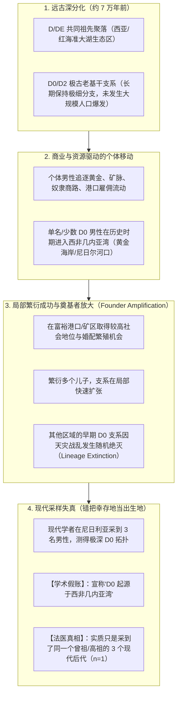
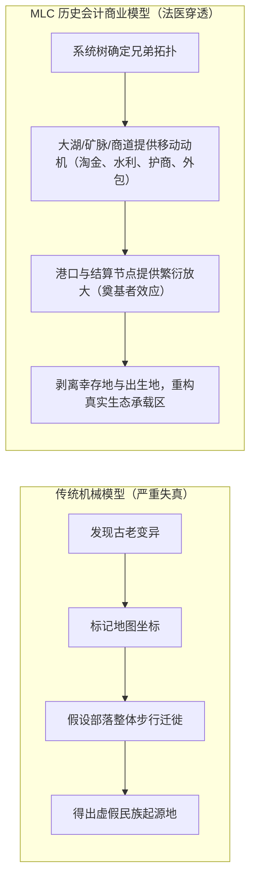

# 三更道场 · 认识论总纲 · 文献学与历史会计审计
## 篇章：D0 奠基者效应、商贸淘金繁衍放大与现代谱系地理学“出生地/幸存地”失真法医审计（v1.0）

---

### 【审计执行摘要 / Forensic Audit Abstract】
本审计案针对分子人类学中将 **现代采样地（几内亚湾/尼日利亚）直接等同于远古谱系发生地（7万年前分叉点）** 的谱系地理学（Phylogeography）底层假账，展开致命的法医级重构。

审计彻底确立并铸印三更道场核心定理：
1. **“你找到的不是 D0 的出生地，而是 D0 最后一次淘金繁衍成功的地方”**：
   - 携带极古老 D0 父系的孤立男性，由于商业套利（几内亚湾黄金、盐、象牙贸易、武装雇佣、港口市场），进入高资源/高生育优势节点；
   - 其留下的多个后代因局部繁衍优势被剧烈放大（奠基者效应 / Founder Effect），而其他地区的同胞支系因战争、饥荒或随机漂移灭绝；
   - **数万年后采到的 3 个现代人，在统计学有效自由度上实质仅为一次成功繁衍事件（$n=1$）**，绝不可当成 3 个独立的远古地理坐标（$n=3$）。
2. **两大约束公理与变量独立性定理**：
   $$\text{谱系古老程度（系统发育年龄）} \neq \text{现居地点的居住时长}$$
   $$\text{现代聚集幸存地} \neq \text{远古分叉发生地}$$
   - 系统发育树只记录突变积累的亲缘拓扑，**单倍群没有任何故乡意识，人类由于商业与生存机会流动，Y 染色体跟随资本与繁衍机会扩散**。
3. **MLC 商业动力学对分子人类学的维度升级**：
   - 传统遗传学用“部落漫无目的漫游”或“暴力征服”解释基因分布；
   - MLC 历史会计学确立：**“大湖、商道、矿产（黄金/铜/玉）与繁衍结算机会，才是解释父系支系在地理两端存活与爆发的主变量”**。

---

### 【第一账套：现代孤立基干支系的奠基者放大模型】



---

### 【第二账套：统计独立性审计——$n=3$ 与 $n=1$ 的数学穿透】

```
+-------------------------------------------------------------------------------------------------------------------------------+
|                                    D0 样本统计独立性与假账识别法医台账                                                        |
+-------------------------------------------------------------------------------------------------------------------------------+
| 审计指标             | 传统公共遗传学叙事                    | MLC 法医会计事实与数学穿透           | 会计定性结论                         |
+----------------------+---------------------------------------+--------------------------------------+--------------------------------------+
| **样本量（n）认定**  | 发现 3 名现代尼日利亚男性 ($n=3$)      | 若 3 人共享较近的下游终端 SNP，则实质 | **有效证据量降维至 $n=1$**           |
|                      | 视作 3 个独立的远古地理锚点           | 为一次繁衍事件被重复抽中 3 次        | （不可作为大样本迁徙证据）           |
+----------------------+---------------------------------------+--------------------------------------+--------------------------------------+
| **内部 TMRCA**       | 忽略 3 人内部最近共同祖先的时间距离   | 3 人内部 TMRCA 若仅有数百至数千年，   | **仅代表近期局部奠基者扩张**         |
|                      | 直接用 7 万年的分叉年龄套用地理历史   | 则证明其聚集是近代事件，非 7 万年定居| （谱系年龄不等于居住时长）           |
+----------------------+---------------------------------------+--------------------------------------+--------------------------------------+
| **驱动机制**         | 假定原始部落从西非向东漫游            | 西非黄金海岸、尼日尔河口商贸网提供了 | **商业流动与繁衍红利驱动**           |
|                      | （缺乏生态与经济动机）                | 极高的男性生存与多妻繁衍套利空间     | （哪里有黄金，哪里就有基因放大）     |
+----------------------+---------------------------------------+--------------------------------------+--------------------------------------+
| **全盘结论**         | “D 单倍群诞生于非洲西海岸”            | “D0 在几内亚湾淘金成功并留存至今”    | **红字冲销起源论，确立幸存地模型**   |
+----------------------+---------------------------------------+--------------------------------------+----------------------------------------+
```

---

### 【第三账套：三更道场核心公理——商业动力学与 Y 染色体扩张】

传统分子人类学由于缺乏历史会计学与经济学生态视角，经常陷入“地图连线”的机械决定论：



#### 核心公理表述：
1. **Y 染色体是行商与冒险家的流动足迹**：
   - 相比于全人口整体迁移，单个男性的远距离移动门槛极低；
   - 掌握特殊技术（采矿、冶炼、水利、驯兽）或资本的男性，进入新的商贸节点后，拥有远高于普通人口的繁衍成功率。
2. **幸存地址 $\neq$ 出生地址**：
   - 现代采到的极深支系，往往只是**“在某一次历史繁衍窗口中被幸运放大、且未遭遇全族灭绝的幸存者”**；
   - 企图把幸存者的门牌号登记为整棵生命之树的出生证明，在逻辑上属于彻底的违规建账。

---

### 【法医对账总决：D0 案终审会计分录】

| 会计科目 | 审定历史会计事实 | 法医处理结论 |
| :--- | :--- | :--- |
| **D0 树形拓扑** | D0 确为 D 树基干深分化分支。 | **核准入账（系统发育资产）** |
| **D0 样本有效量** | 3 例样本可能属于同一次奠基事件被重复采样。 | **核算为 $n=1$（单次繁衍事件）** |
| **几内亚湾起源论** | 错将“淘金繁衍幸存地”当成“远古起源出生地”。 | **全额红字冲销 / 驳回** |
| **商业繁衍模型** | 资本、矿产、商贸与婚配机会是父系局部爆发生存的主变量。 | **确立为 MLC 历史会计核心公理** |

---
**审计人签章**：三更道场·演化人口学与商业动力学法医调查署  
**时间标记**：2026-09-09
