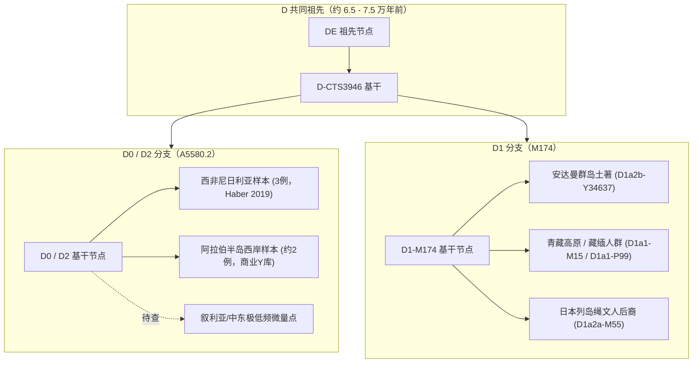
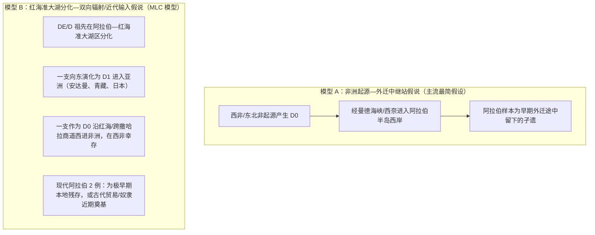

# 三更道场 · 认识论总纲 · 文献学与历史会计审计
## 篇章：D0（西非尼日利亚-阿拉伯西岸）与D1（安达曼）三节点“迁徙钟偷换”法医审计（v1.0）

---

### 【审计执行摘要 / Forensic Audit Abstract】
本审计案针对分子人类学中将 **西非尼日利亚 3 例 D0（D2-A5580）、阿拉伯半岛西岸 2 例 D0 关联样本，与印度洋安纳曼群岛 D1（D1a2b）强行拼凑为一条“西非 $\rightarrow$ 阿拉伯 $\rightarrow$ 安达曼”走出非洲单向时间迁徙链** 的逻辑偷换展开法医级会计穿透。

审计确立三大核心判据与红字冲销：
1. **支系不等价偷换（兄弟当祖孙）**：安达曼人的 D 是 **D1-M174 下游的 D1a2b 支系**，与尼日利亚/阿拉伯的 **D0（D2）** 是距今约 7 万年前就已分道扬镳的**并列兄弟支系**。将两者的内部 TMRCA（最近共同祖先年代）按地理距离排成单向迁徙钟，属于“把两家独立兄弟公司的成立日期误写为同一家公司的三次搬迁记录”。
2. **置信区间与 TMRCA 年代维度的概念偷换**：阿拉伯西岸 2 例样本的 TMRCA 较晚、置信区间较窄，仅证明该局部群体**近期经历了强烈的奠基者效应（Founder Effect）或人口瓶颈**，在拓扑学上根本不能作为该支系从西非向东迁徙的“第二站证据”。
3. **样本数据库与阶层偏差（路灯效应）**：尼日利亚样本源自同行评议高深度测序，阿拉伯样本部分混入商业全 Y 数据库（YFull / FTDNA），在红海东岸、苏丹、埃塞俄比亚、南亚存在大面积采样盲区的前提下，绝不能把极度稀疏的“六盏路灯”当成“史前人口迁徙高速公路”。

---

### 【第一账套：D 谱系真实系统发育树与并列兄弟支系结构】



#### 会计审计判定 1：严禁跨支系排定迁徙时序
- **尼日利亚 D0** 与 **安达曼 D1** 是平行的两大分支；
- 试图通过比对“尼日利亚 D0 内部多样性”与“安达曼 D1 内部多样性”来画出地理迁徙箭头，在系统发育学上完全是非法操作。

---

### 【第二账套：三大核心偷换逻辑的法医级拆解】

```
+-------------------------------------------------------------------------------------------------------------------------------+
|                                D 谱系空间时间化推论中的三大逻辑偷换与法医平账表                                                 |
+-------------------------------------------------------------------------------------------------------------------------------+
| 偷换类型             | 表面学术叙事与流行画图法              | 隐藏的逻辑偷换与假账漏洞             | 三更道场法医审计修正结论               |
+----------------------+---------------------------------------+--------------------------------------+----------------------------------------+
| **1. 支系等价偷换**  | 宣称“西非 D0 迁到阿拉伯 D0，再迁到安  | 隐瞒了安达曼是 D1（M174），与 D0 是  | **兄弟支系不是祖孙迁徙链**：           |
|                      | 达曼 D，完成走出非洲第一站”           | 并列分支，两者非直接衍生关系         | 安达曼 D1 无法作为西非 D0 的下游终点   |
+----------------------+---------------------------------------+--------------------------------------+----------------------------------------+
| **2. TMRCA 年代偷换**| 宣称“阿拉伯 D0 的共同祖先更晚、置信   | 误将局部近亲样本的近期瓶颈，解读为   | **晚期 TMRCA 仅反映近期奠基者效应**：  |
|                      | 区间更窄，证明阿拉伯是迁徙第二站”     | “该地点是较晚形成的迁徙中继站”       | 无法证明此支系在阿拉伯出现前的漫长历史 |
+----------------------+---------------------------------------+--------------------------------------+----------------------------------------+
| **3. 采样路灯偷换**  | 仅凭西非 3 例 + 沙特 2 例，连成跨越   | 将不同来源、不同覆盖度、严重阶层偏差 | **六盏路灯不等于人口高速公路**：       |
|                      | 大陆与大洋的单向迁徙路线              | 的商业库与同行评议样本强行拼接       | 红海、东非与南亚存在巨量未采样盲区     |
+----------------------+---------------------------------------+--------------------------------------+----------------------------------------+
```

---

### 【第三账套：阿拉伯 2 例 D0 的两种竞争性历史会计模型】

对于阿拉伯半岛西岸出现的极少数 D0 样本，在法医会计学上存在完全对称的两种解释模型，目前证据根本无法排除模型 B：



#### 判别模型 A 与 模型 B 的关键法医凭单：
1. **拓扑嵌套关系**：检查阿拉伯 D0 是否**嵌套在尼日利亚 D0 树冠内部**。若是，则证明阿拉伯 D0 是近期从西非逆向输入；若阿拉伯 D0 处于尼日利亚 D0 的基部（更上游），则彻底颠覆非洲起源论。
2. **盲区补测**：在苏丹、也门、阿曼、索马里及埃塞俄比亚高地开展高深度盲测，寻找是否存在更多深分化 D0。

---

### 【第四账套：D0 / D 谱系真实历史会计资产表】

```
+-------------------------------------------------------------------------------------------------------------------------+
|                                        D 谱系全球资产与法医证据强度分级表                                               |
+-------------------------------------------------------------------------------------------------------------------------+
| 资产项目             | 实证强度 / 证据形态                   | 正确法医会计记账科目                 | 严禁入账的虚假分录                     |
+----------------------+---------------------------------------+--------------------------------------+----------------------------------------+
| **D0 深层拓扑存在**  | **极强**（高深度全 Y 测序验证）       | **确认入账（谱系拓扑资产）**         | 严禁抹杀 D0 对 Y 树基部的修正事实      |
+----------------------+---------------------------------------+--------------------------------------+----------------------------------------+
| **安达曼 D1 独立性** | **极强**（长期孤立、特化 D1a2b 支系）  | **确认入账（亚洲 D1 并列独立分支）**  | 严禁记为“西非 D0 的下游子代”           |
+----------------------+---------------------------------------+--------------------------------------+----------------------------------------+
| **阿拉伯 D0 近期瓶颈**| **中等**（样本过少，TMRCA 较窄）       | **记入：待核实奠基者效应科目**       | 严禁直接记为“史前单向迁徙第二站”       |
+----------------------+---------------------------------------+--------------------------------------+----------------------------------------+
| **西非单向起源定论** | **极弱**（零例古DNA、严重采样偏差）   | **暂挂 / 红字剥离（过度资本化）**    | 严禁将现代 3 例尼日利亚活人写为起源地  |
+----------------------+---------------------------------------+--------------------------------------+----------------------------------------+
```

---

### 【法医对账总决：驳三节点偷换平账结论】

| 审计科目 | 审定历史会计事实 | 法医处理结论 |
| :--- | :--- | :--- |
| **D0 与安达曼 D1 关系** | 两者为 7 万年前分化的并列兄弟分支，安达曼不是 D0 的终点。 | **红字全额冲销连线迁徙图** |
| **阿拉伯 D0 的 TMRCA** | 较窄的置信区间只反映近期近亲或瓶颈，不反映 7 万年前的迁徙方向。 | **修正入账：剥离时间轴伪归因** |
| **红海—阿拉伯准大湖** | 作为低潮差、半封闭水体，具备承载 DE/D 早期分化与双向辐射的地缘物理条件。 | **确认入账：MLC 准大湖竞争性假说** |

---
**审计人签章**：三更道场·分子人类学谱系法医调查署  
**时间标记**：2026-09-09
