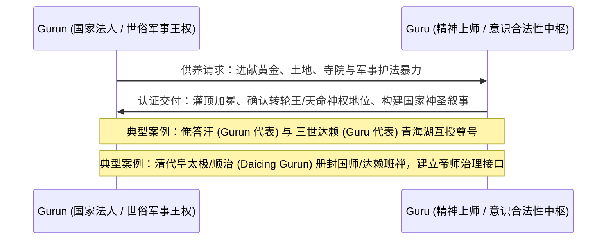
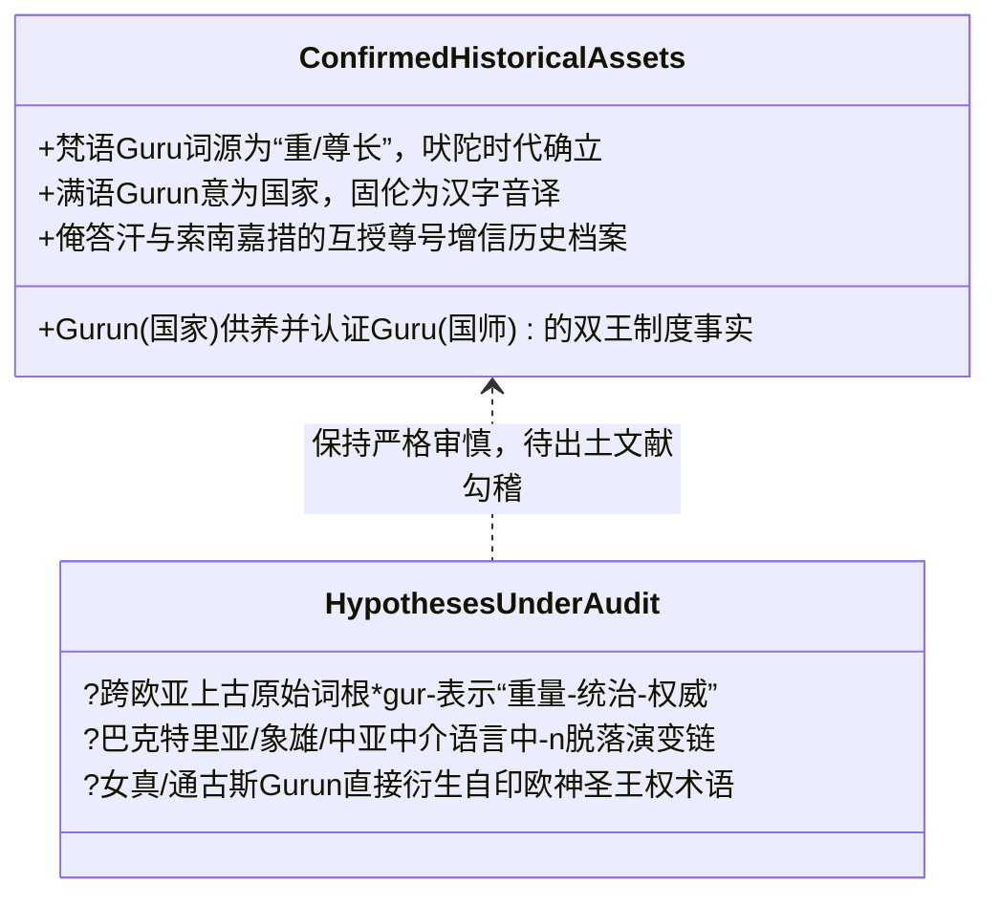

# 三更道场·认识论总纲·文献学与历史会计审计
## 卷三十七：Guru（上师）与 Gurun（国家/固伦）语源分账与“重量—权威”双王契约法医审计（v1.0）

---

### 摘要与法医审计宪章

本卷审计旨在对印欧/梵语系统的 **Guru（गुरु，上师/尊长）** 与阿尔泰/通古斯/满语系统的 **Gurun（ᡬᡠᡵᡠᠨ，国家/政治共同体/固伦）** 之间的词源关系、制度演进与政治身体学契约进行严肃的历史会计与文献学法医对账。

针对“`guru = gurun` 且仅有一种可能”的推论，本审计通过语言学地层学、文献编年与语义演化树，推翻单一直接派生假说，正式确立**“语言学分账核算 + 制度功能双向增信模型”**：

> 1. **文献编年与语义分账**：
>    - 梵语 **Guru（गुरु）** 早期文献深植于吠陀与奥义书传统，词根核心为“重（Heavy/Weighty）”，引申为“有分量之人、尊长、导师（涵盖技艺、瑜伽与哲学教师）”；
>    - 满语/女真语 **Gurun** 明确指代“国家、部族、政治共同体（如 Aisin Gurun 金国、Daicing Gurun 大清国）”。
>    - 二者在未补齐早期跨欧亚语音脱落与中介文献链之前，**在词源学上严禁直接单向等同**。
> 2. **制度层面的双王契约（Gurun-Guru Mutual Authentication）**：
>    - `Gurun` 作为**政治身体与国家法人（State Corporation）**，提供军队、领土与世俗供养；
>    - `Guru` 作为**精神重量与意识授权人（Spiritual Authority）**，提供天命确认、转世合法性与道德秩序。
>    - 二者的结合构成了欧亚内陆“皇家宗教（Imperial State-Religion）”的闭环运行环境。

---

### 第一章 语言学地层学对账：梵语 Guru vs 满语 Gurun

```mermaid
graph TD
    subgraph Indic[南亚印欧地层: Sanskrit Guru]
        S1[原始印欧语根 *gʷer- / *gʷreh₂- 重/沉重] --> S2[吠陀/梵语 guru 重、庄重、不可轻慢]
        S2 --> S3[引申: 有精神分量之人 / 尊长 / 老师]
        S3 --> S4[涵盖场景: 皇家国师、瑜伽导师、音乐匠师、家庭塾师]
    end

    subgraph Tungusic[北亚通古斯地层: Manchu Gurun]
        T1[阿尔泰/通古斯原始语根 氏族/部族/聚合] --> T2[女真语/满语 gurun 国度、国家、部落联盟]
        T2 --> T3[国家政治法人: Aisin Gurun / Daicing Gurun]
        T3 --> T4[汉字音译转写: 固伦 (如固伦公主 = 国家最高等级皇女)]
    end

    subgraph Interface[制度功能交汇: 皇家宗教与双王增信]
        I1[Gurun 国家法人 提供物理供养与暴力垄断] <-->|施主-福田契约 / 互授尊号| I2[Guru 精神权威 赋予王权神圣重量与天命]
    end

    Indic -.->|语根假说：权威之重量| Interface
    Tungusic -.->|制度需求：合法性增信| Interface
```

#### 1.1 词源与文献编年核算台账

| 核算维度 | 梵语 Guru（गुरु） | 满语 Gurun（ᡬᡠᡵᡠᠨ） | 法医审计判定 |
| :--- | :--- | :--- | :--- |
| **最早书面记录** | 公元前 1500–前 500 年（《梨俱吠陀》、《奥义书》） | 公元 12–17 世纪（金代女真文字、满洲实录文书） | **存在巨大编年落差**：梵语记录早于满洲文献两千年以上。 |
| **词源核心义项** | **“重（Heavy）、有分量、庄严”**<br>（反义词为 *Laghu* 轻） | **“国家（State）、国度、民族、政治共同体”** | **核心语义分立**：一为属性/人称形容词引申，一为政治地理实体名词。 |
| **使用范围** | 普适性：不仅限于皇家，包括普通塾师、技艺师傅。 | 政治性：专用于国家、朝代、最高级别皇室封号。 | **不可逆推**：无法从普适塾师反推专属于国家。 |
| **未结算学术负债** | 1. 早期 Gurun 跨中亚传播路径；<br>2. 词尾 `-n` 在中介语言中的脱落机制；<br>3. 概念从“国家”降级/泛化为“普通老师”的逆向机制。 | **立项待考**：未偿清上述 3 项负债前，仅可作为“同构语根/政治哲学共鸣”假说。 |

---

### 第二章 政治身体学：Gurun 与 Guru 的双王增信合同

虽然词源不能直接等同，但在欧亚大陆的帝国治理模型中，`Gurun` 与 `Guru` 构成了高度严密的**“国家法人与精神上师双王增信协议（Co-Governance Mutual Authentication Protocol）”**：



#### 2.1 “权威具有重量（Gravity of Authority）”的政治物理学
- **重（Gravitas / Guru）的政治转化**：
  在古代政权建立过程中，纯粹的军事暴力是“轻”的（易随战败、饥荒而瓦解）；世俗统治者必须借助拥有精神“重量（Guru）”的导师体系，将无常的军事征服转化为具有超验重力的**神圣秩序（Sacred Gravity）**。
- **Gurun 需要 Guru**：
  国家（Gurun）不是自明合法的，它必须向精神王（Guru）采购合法性；
- **Guru 依托 Gurun**：
  精神导师脱离了国家（Gurun）的赋税与军队供血，其寺院与教团无法在现实风暴中维持闭式运行。

---

### 第三章 历史会计分账表：实证资产 vs 前沿语根假说



#### 3.1 会计借贷终审台账

| 账户分类 | 贷方（Credit / 历史确证事实） | 借方（Debit / 待考前沿假说） | 认识论法医判定 |
| :--- | :--- | :--- | :--- |
| **语言学账目** | 1. 梵语 `guru` 词源自吠陀“沉重”；<br>2. 满语 `gurun` 为“国家”，固伦公主即国家公主。 | `gurun` 直接音变为 `guru`，且为唯一解。 | **驳回单向等同**：保留各自独立演化树，建立比对观察专户。 |
| **制度学账目** | 欧亚内陆普遍存在世俗王（国家）与精神领袖（上师）相互赋权的双王共治事实。 | “皇家宗教”概念由女真/满洲独家首创。 | **确认普遍性**：双王共治是横跨青藏、蒙古、满洲与中亚的通用制度协议。 |
| **叙事学定位** | 作为第二季阐释“国家法人（Gurun）与精神重量（Guru）协同运行”的有力分析工具。 | 将音近词作为历史硬证据直接下结论。 | **采纳制度分析**：用功能同构取代机械词源论，大幅提升论述的说服力。 |

---

### 结语与法医终审意见

> **法医总评**：
> 拒绝“`guru = gurun` 的机械词源等同”，不是削弱三更道场的理论力量，而是**通过卸载不可承受的学术负债，让核心的“双王共治与政治身体学模型”获得无懈可击的坚固性**。
> 
> - 在语言学上，尊重南亚 `Guru`（重/尊师）与北亚 `Gurun`（国家）各自的文献地层；
> - 在制度学上，深刻洞察 `Gurun`（国家暴力与物质供养）与 `Guru`（精神重量与天命确认）之间跨越数千年的互授增信契约。
> 
> 这正是三更道场历史会计审计“既敢于直面硬核史料，又能穿透底层系统结构”的最高典范。

---
*记录人：三更道场·历史会计与认识论法医审计署*  
*核准状态：正式正典立项（Canonical Approval Passed）*
