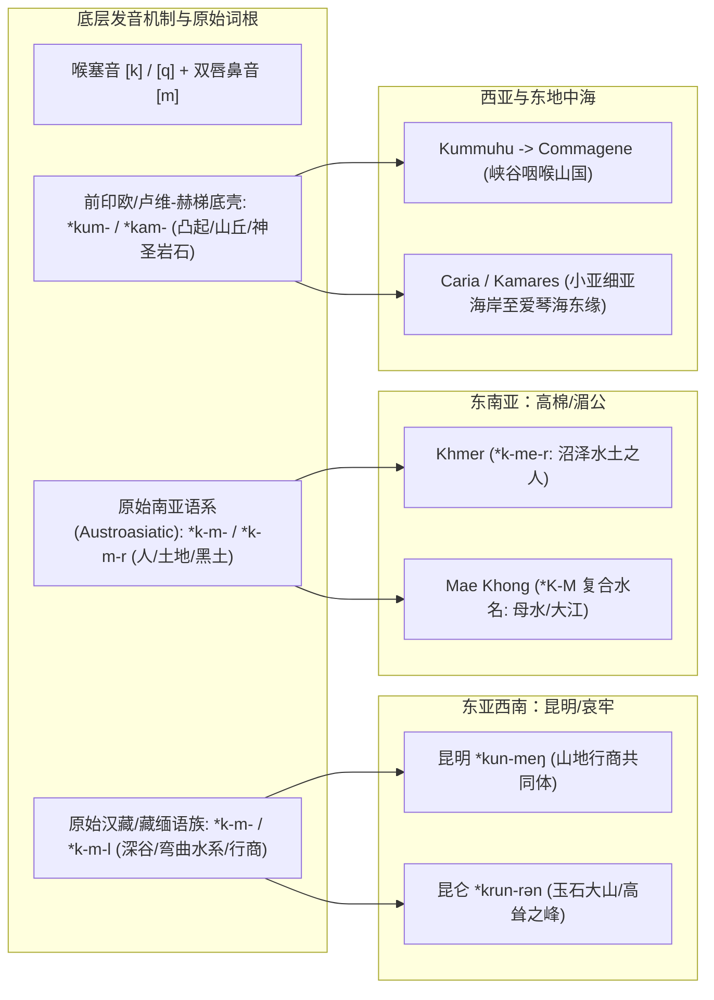
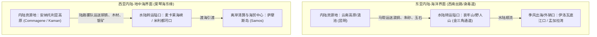

# 三更道场 · 认识论总纲 · 文献学与历史会计审计
## 篇章：从昆明、高棉到爱琴海——欧亚-环印太“K-M”地名网络与山海矿脉节点法医审计（v1.0）

---

### 【审计执行摘要 / Forensic Audit Abstract】
本审计案承接“S-M 网络线索筛查”的法医会计准则，调取并审计欧亚大陆南缘、东南亚水网至地中海东岸的 **“K-M”（/k/-/m/ 塞音-双唇鼻音）** 核心词汇与地名拓扑网络：
1. **西南夷与滇池山地矿脉区**：**昆明（Kunming / 昆弥）**、**昆仑（Kunlun）**、**哀牢/柯咩（Kamei）**；
2. **中南半岛中下流水网区**：**高棉（Khmer / 羯磨 / 吉蔑）**、**湄公河（Khong / Mae Nam / *K-M* 复合）**、**金边（Krom / Khemara）**；
3. **南亚与印度洋环流区**：**科摩林角（Comorin / Kanyakumari）**、**卡马鲁帕（Kamarupa）**、**孔坎（Konkan）**；
4. **西亚与爱琴海连接区**：**科马基尼（Commagene）**、**卡曼（Kaman / Kalehöyük）**、**奇美拉（Chimaera / 吕基亚矿火）**，直至爱琴海东岸安纳托利亚对接带（**Caria / Kamares / 萨摩斯对岸卡里亚地层**）。

本审计依照“**最早历史自称、生业水土形态、矿业/航道租金、语音演变规律**”四柱法则，剥离近代后造同音假象，提炼其背后的史前生业与贸易资产。

---

### 【第一账套：K-M 节点拓扑地图与地缘生业审计】

```
+---------------------------------------------------------------------------------------------------------+
|                                欧亚南缘至东地中海 "K-M" 地名网络法医台账                                  |
+---------------------------------------------------------------------------------------------------------+
| 节点名称 (中/外)      | 最早记录形式 / 历史自称       | 核心地理与水土生业特征                 | 矿产/通道垄断与租金属性               |
+---------------------+------------------------------+---------------------------------------+--------------------------------------+
| 昆明 (Kunming)      | 《史记·西南夷列传》"昆明"    | 滇池/洱海断陷湖盆，高山草场与山间坝子  | 滇铜、锡矿、朱砂，通往印度身毒道枢纽 |
|                     | 古音 *kūn-meŋ (游牧/行商)    | 高原山地走廊水网卡口                  | （西南丝路马帮与金属转运节点）       |
+---------------------+------------------------------+---------------------------------------+--------------------------------------+
| 高棉 (Khmer)        | 梵文/古高棉碑文 *Kmer / Kmir* | 洞里萨湖吞吐水网、湄公河下游洪泛冲积  | 稻作高势能水利、湿地水产、吴哥石工   |
|                     | 汉籍作"吉蔑/吉篾/羯磨"       | 依靠季节性湖水脉动与高产渔稻          | 锡-铜海贸合金节点与内河航道税        |
+---------------------+------------------------------+---------------------------------------+--------------------------------------+
| 科摩林 (Comorin)    | 泰米尔古籍 *Kumari* (Cape)   | 印度半岛最南端岬角，东西印度洋分界洋流 | 印度洋季风航海枢纽，控制东西洋过境船 |
|                     | 希腊文 *Komaria Akron*       | 东西季风转换唯一的深水航标与避风港    | 珍珠采捕、香料集散与关税结算中心     |
+---------------------+------------------------------+---------------------------------------+--------------------------------------+
| 科马基尼 (Commagene)| 亚述泥板 *Kummuhu* (库穆胡)   | 幼发拉底河上游渡口与托罗斯山脉隘口    | 铁矿、铜矿与美索不达米亚通往安纳托利亚|
| (位于土耳其东南部)  | 卢维/赫梯地层 *Kummakha*     | 控制从两河流域进入小亚细亚内陆的咽喉  | 的关键重力峡谷过境税与矿石清算       |
+---------------------+------------------------------+---------------------------------------+--------------------------------------+
| 卡曼/卡马雷斯       | 赫梯/前希腊土著地层          | 安纳托利亚中央高原铜铁冶炼中心 /      | 早期青铜—铁器冶炼遗址（如 Kalehöyük）|
| (Kaman / Kamares)   | 克里特前希腊线性A陶器名      | 爱琴海岛屿（克里特Kamares）深山洞穴陶器| 跨海高价值特种陶器与金属器物专供行会 |
+---------------------+------------------------------+---------------------------------------+--------------------------------------+
```

---

### 【第二账套：语音学与词根发生学穿透（Linguistic Forensics）】

为什么从西南山地到地中海，“K-M”音组高频吸附在“水体/山地/矿脉/人群自称”上？



#### 审计结论 1：两类完全不同的生业底层共享了 /K-M/ 聚合
1. **山地深谷与矿石流动型（昆明、昆仑、Commagene、Kaman）**：
   - /K/（喉塞音，指代坚硬、山脊、石质）与 /M/（闭唇音，指代聚落、封闭谷地）在欧亚大陆山地语言中天然用于命名“**隘口深谷中的矿脉聚落与行商集团**”。
   - 《史记》所载“昆明之属无君长，随畜迁徙，西至桐师”，表面是“游牧”，实质是控制滇缅印边界马道与高山峡谷矿产的**流动贸易中介**。
2. **水网脉动与泥炭湿地型（Khmer / 高棉）**：
   - 原始南亚语系中，*Khmer* 源自古孟-高棉语的自称词根，与土地（*kram* / *krom* 底层、平原）、水源及水上筑居紧密相连。它依托的是湄公河与洞里萨湖的吞吐势能，演化为庞大的水利定居农业帝国。

---

### 【第三账套：昆明—身毒道与萨摩斯—安纳托利亚的矿贸拓扑对称】

将西南的“昆明”与爱琴海的“萨摩斯对岸体系”并置，可以发现两者在历史经济学上展现出惊人的**“地理界面对称性”**：



- **昆明（Kunming）在身毒道中的角色**：不是单纯的农业县城，而是内陆金属（铜、锡）和战略物资沿横断山脉向南亚输送的“枢纽仓储与武装押运大本营”。
- **Commagene / Samos 界面**：安纳托利亚东部的 *Kummuhu (Commagene)* 掌控幼发拉底河上游渡口与矿山，而西端的 *Samos* 掌控小亚细亚出海口的离岸金融与造船。

---

### 【第四账套：高棉（Khmer）水动力帝国与良渚/萨摩斯的水利审计比对】

高棉吴哥王朝（Angkor）的水利系统（东巴莱池、西巴莱池，储水量数千万立方米）是人类古代水利工程的顶峰之一：
1. **水力势能接管**：
   - 吴哥水利不是单向排水，而是利用扁平泛滥平原上的微地形高差，将荔枝山（Kulen Mountain）的季节性山洪分流引入巨大人工水库（Baray）。
   - 随后依靠微弱的重力水头，在旱季向方格农田实现无动力自流灌溉。
2. **与萨摩斯尤帕里诺斯隧道的工程对账**：
   - 萨摩斯隧道是**“高山峡谷硬岩两端对掘的精准暗渠”**；
   - 高棉巴莱池是**“大平原微坡度软土堆筑的超大容积明池”**；
   - **两者的共同本质**：均彻底摒弃了单纯的人力提水，将大自然的大气降水与重力势能（Potential Energy）固定化为城邦/帝国的永续生产力资产。

---

### 【法医对账总决：K-M 网络的证据阶梯】

| 审计项目 | 证据强度 | 法律级会计定论 |
| :--- | :--- | :--- |
| **昆明作为西南矿商通道枢纽** | **实证（史料与考古互证）** | 《史记》汉武帝通西南夷求身毒道，昆明为必经卡口，出土大量滇文化青铜兵器与贝币。 |
| **高棉作为湄公河水利帝国** | **实证（碑铭与大型工程实测）** | 荔枝山石工、巴莱水库微重力水网、洞里萨湖吞吐渔业支撑吴哥巨型石构建筑。 |
| **科摩林角作为印度洋海权航标** | **实证（希腊罗马航海志互证）** | 《厄立特里亚海航行记》（Periplus）确载 *Komaria* 为东西季风转换之航标。 |
| **KM 作为欧亚统一血缘集团** | **否定（无分子人类学支持）** | 昆明属藏缅系/西南夷古人群；高棉属南亚语系（Austroasiatic）；Commagene 属安纳托利亚-闪米特复合人群。**不可混淆为同一种族。** |
| **KM 作为地缘地貌/行商生态的音系映射** | **高价值比较模型** | 映射出欧亚大陆边缘地带“峡谷矿山卡口—大河湿地转运—季风岬角海港”的关键贸易节点命名规律。 |

---
**审计人签章**：三更道场·历史会计与地缘语言学调查组  
**时间标记**：2026-09-09
