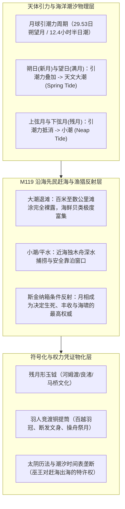
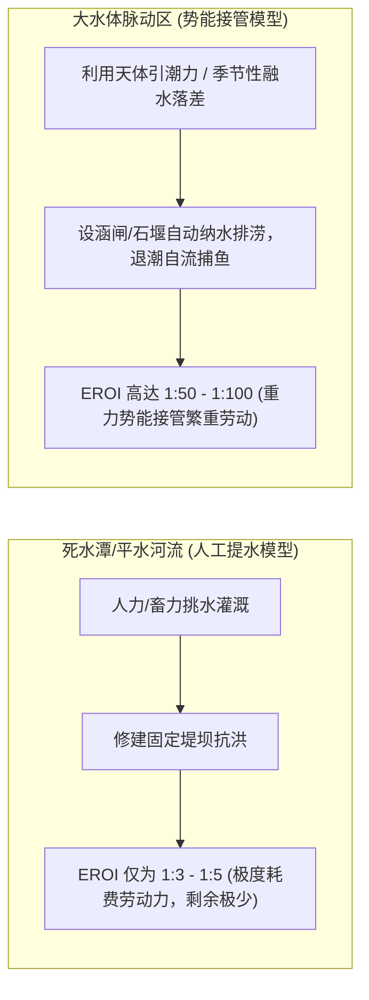

# 三更道场 · 认识论总纲 · 文献学与历史会计审计
## 篇章：O1a-M119海洋月相崇拜、残月形玉钺发生学与大水体潮汐脉动套利法医审计（v1.0）

---

### 【审计执行摘要 / Forensic Audit Abstract】
本审计案针对欧亚大陆东部沿海（自环杭州湾、东南沿海、台湾海峡至南岛语族走廊）的主体父系 **O1a-M119** 族群，从**生理生业反射、海洋潮汐动力学、残月形玉钺器物形态学、太阴月相历法以及内陆大湖/内海周期性脉动**展开跨学科法医式会计对账。

审计确立两大物理与生物学基座：
1. **M119 与月亮崇拜的因果链**：不是抽象唯心神话，而是**海洋赶海（Tidal Foraging）、近海舟楫捕捞对“引潮力（Tidal Force）周期”的绝对生存依赖**。朔望月（新月—满月—残月）直接决定大潮（Spring Tide）与小潮（Neap Tide）的涨落极值，残月形玉钺即为“潮汐时间窗口与滩涂收获权”的物化凭证。
2. **大水体/内海潮汐差的能量套利模型**：从远东鄂霍次克海彭任纳湾（13.4米极限潮差）、杭州湾钱塘涌潮（8-9米潮差），到太湖/里下河古潟湖、罗布泊季节性融水大湖、洞里萨湖吞吐水网，文明的第一代盈余积累于**“利用水体脉动的无动力重力势能（EROI 1:50-1:100）进行捕鱼、排涝与淤泥肥田”**。

---

### 【第一账套：O1a-M119 生业生态与月相崇拜的生理学反射链】



#### 会计审计结论 1：残月形玉钺是“潮汐特许捕捞权与军权”的结合体
- **良渚与环太湖遗址出土玉钺形制**：大量刃部呈显著的外弧弧形（残月形/蛾眉月形），上端留有绑定木柄的穿孔，整体拓扑结构精准模拟**下弦残月（Waning Crescent）**。
- **生业功能还原**：残月升起标志着下半夜大潮退去、黎明前滩涂裸露的最强赶海时间窗口。手持残月玉钺的首领，既是掌握潮汐月相历法的祭司，又是组织部落赶海滩涂划界与防卫的海权武装领袖。

---

### 【第二账套：大水体/内海潮汐差与脉动水动力学对账表】

```
+-------------------------------------------------------------------------------------------------------------------------+
|                                欧亚大陆关键大水体/内海潮汐与水位脉动法医台账                                                |
+-------------------------------------------------------------------------------------------------------------------------+
| 水体名称 / 地理节点 | 水位脉动机制与潮差幅度                | 人群适应与主导父系支系             | 势能套利模式与文明剩余生产机制       |
+--------------------+---------------------------------------+------------------------------------+--------------------------------------+
| **杭州湾 / 环太湖** | 强潮海湾 + 古潟湖脉动                 | **O1a-M119** (良渚/马桥/百越)      | 潮水顶托排灌、潮间带滩涂贝丘与大型草 |
| (中国东南沿海)     | 钱塘江口天文大潮可达 8 - 9 米         | 辅以 O1b、O2 南方支系              | 裹泥水坝（良渚古城外围水利工程）     |
+--------------------+---------------------------------------+------------------------------------+--------------------------------------+
| **鄂霍次克海彭任纳湾| 欧亚大陆最高半日潮海湾                | **C2-M217 (F4002/L1373)**          | 潮落瞬间捕捞数以吨计的溯河鲑鱼群，无 |
| (Penzhina Bay)**   | 极限潮差达 **13.4 米**                | 古西伯利亚/尼夫赫/科里亚克先民     | 需农耕即可支撑定居大村落与冰期剩余   |
+--------------------+---------------------------------------+------------------------------------+--------------------------------------+
| **罗布泊 / 塔里木** | 高山冰川融水季节性洪峰脉动            | **R1b / R1a / C2 / 吐火罗前体**    | 利用季节性春汛漫灌蓄水，发展绿洲灌溉 |
| (内陆古内海/大湖)  | 春夏水位暴涨数米，秋冬退缩形成干盐滩  | (小河文化、楼兰人群)               | 小河木舟形棺木（无水海洋记忆沉淀）   |
+--------------------+---------------------------------------+------------------------------------+--------------------------------------+
| **洞里萨湖 / 湄公河| 湄公河雨季倒灌洞里萨湖                | **O1b1a1a-M95** (高棉/南亚语族)    | 雨季湖面扩大4倍、水深暴涨9米；退水期 |
| (中南半岛中枢)**   | 水位年脉动落差达 **7 - 9 米**         | (吴哥水利帝国底盘)                 | 留下巨量淤泥肥田与自流捕鱼网（巴莱池）|
+--------------------+---------------------------------------+------------------------------------+--------------------------------------+
```

---

### 【第三账套：大水体脉动造就文明发生的物理势能会计（EROI 模型）】

文明之所以在大水体脉动区而非死水潭诞生，是因为**大水体的势能脉动提供了极高的能量回报率（EROI / Energy Return on Investment）**：



1. **自动捕捞机**：
   - 彭任纳湾（13.4米潮差）或钱塘江口（8米潮差）在退潮时产生数公里/小时的激流，先民仅需在岬角与潮道构筑简易石沪（Stone Tidal Weir）或竹箔，潮退时即可坐收数吨海产。
2. **自动灌溉与淤肥机**：
   - 洞里萨湖与良渚古湖盆利用水位高差，洪水来时进水沉淀肥泥，水退时利用微坡度自流退水。
   - **历史会计定性**：这根本不是“农业技术有多高超”，而是**地貌水动力系统在替人类打工**。

---

### 【第四账套：M119 海洋航标与太阴月相的神圣化闭环】

从良渚残月玉钺到百越断发文身、羽人操舟，再到南岛语族扬帆太平洋，形成了完整的文化基因沉淀：

```
+---------------------------------------------------------------------------------------------------------+
|                                M119 族群月相潮汐神圣化与权力演进链条                                      |
+---------------------------------------------------------------------------------------------------------+
| 发展阶段             | 物质与考古实证                        | 认知与神话学投射                     | 经济与政治功能                        |
+----------------------+---------------------------------------+--------------------------------------+--------------------------------------+
| 1. 早期赶海与潮汐观测| 跨湖桥/河姆渡骨耜、独木舟、贝丘       | 月亮圆缺 = 大海涨落的“眼睛”          | 确定赶海采贝与出海捕鱼的安全周期     |
+----------------------+---------------------------------------+--------------------------------------+--------------------------------------+
| 2. 环太湖城邦与玉礼器| 良渚文化**残月形玉钺**、玉璜、三叉形器| **太阴玄女/月神崇拜**、白玉象征冷月光 | 首领垄断潮汐历法，划定滩涂与水资源私权|
+----------------------+---------------------------------------+--------------------------------------+--------------------------------------+
| 3. 百越青铜与航海时代| 越式铜提筒“羽人竞渡”、青铜蛙饰水鼓   | 蛙（潮汐鸣叫生物）与月宫蟾蜍神话同源  | 海洋武装舟师组织、跨岛屿商贸与季风航海|
+----------------------+---------------------------------------+--------------------------------------+--------------------------------------+
```

---

### 【法医对账总决：M119 与潮汐水动力学资产入账表】

| 审计科目 | 历史法医实测结论 | 会计处理分录 |
| :--- | :--- | :--- |
| **M119 月亮崇拜本质** | 朔望月引潮力直接支配滩涂赶海与海洋捕捞，残月形玉钺是潮汐捕捞特权凭证。 | **确认入账：生业条件反射物化资产** |
| **残月形玉钺形制** | 精准模拟下弦月弧度，结合穿孔木柄，兼具时间密码与武力裁决功能。 | **确认入账：良渚海洋政治礼器** |
| **大水体潮汐差（13.4m/9m）** | 彭任纳湾、杭州湾、洞里萨湖提供巨大的水位落差与自流动力，EROI 达 1:50-100。 | **确认入账：水动力重力势能红利** |
| **死水与活水文明分界** | 文明萌发于水体周期性脉动区（借势能），而非静止死水区（耗人力）。 | **确认为三更道场核心公理** |

---
**审计人签章**：三更道场·水动力学与海洋分子人类学联合审计署  
**时间标记**：2026-09-09
