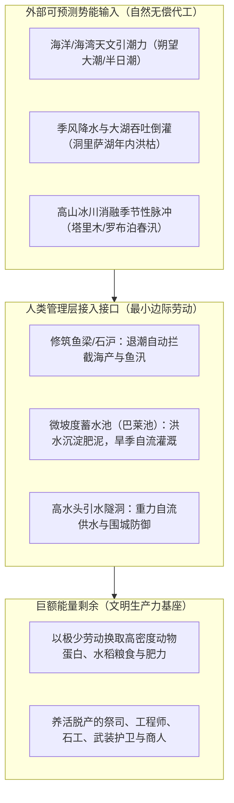
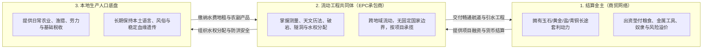
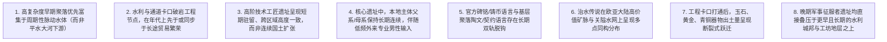

# 三更道场 · 认识论总纲 · 历史会计与理论宪章
## 篇章：MLC（大湖文明）五维发生学模型与人类文明生产力历史会计准则宪章（v1.0）

---

### 【宪章执行摘要 / Charter & Forensic Executive Abstract】

本宪章标志着三更道场（*San Geng Dao Chang*）对 **MLC（Mega-Lake Civilization / 大湖文明）理论范式** 完成从“直觉式假说”向“严密研究纲领与法医会计准则”的历史性升级。

MLC 绝非狭隘的“大湖生态决定论”或“地理环境决定论”，而是一套**解构与重构人类文明生产、扩散与神话资本化全周期的“五维咬合操作系统”**：
1. **能量发生学**：文明的第一推动力是截取外部可预测的自然周期势能（引潮力/洪枯倒灌/融水脉动），以极低的人工边际劳动换取巨额能量剩余（EROI 数量级优势）；
2. **水动力工程学**：治水本质是“系统最小割集的血管介入手术”，利用火攻水激与人工引流突破临界阈值，交由重力势能连锁接管下切；
3. **组织与阶级发生学**：“金主（长途商贸结算资本）+ 流动专业工程行会（EPC 承包商）+ 本地生产人口底盘”的三元结构，衍生出管理层（Manager）对水权、历法、军权的垄断与后世神格化；
4. **人口与资产折返模型（Hairpin）**：少数外来管理/工匠组织与庞大本地人口底盘解耦，技术、历法与名号（Class Name）跨血缘传播与重组；
5. **历史会计法医审计学**：终结将“王族钱币当民间语言、王墓奢侈品当全民血统、政治名号当同源民族、征服时刻当文明创造时刻”的糊涂账，确立权属分离的穿透式审计体系。

---

### 【第一维度：能量发生学——自然周期势能代工模型】



- **核心公理**：农业不是文明的唯一独立母体，往往是在大水体天然聚集的水生蛋白、脂肪、滩涂收获权与水运便利基础上的后期增益叠加。

---

### 【第二维度：水动力工程学——最小割集与重力势能接管】

```
+-------------------------------------------------------------------------------------------------------------------------+
|                                    大水体水动力工程学（治水）多米诺模型                                                    |
+-------------------------------------------------------------------------------------------------------------------------+
| 工程阶段             | 物理动作与施工机制                    | 能量与地貌接管机制                   | 历史神话投射与解构                   |
+----------------------+---------------------------------------+--------------------------------------+--------------------------------------+
| **1. 勘察与定穴**    | 识别卡口、溢流鞍部、岩体断裂与弱面    | 锁定控制全流域水网的**最小割集**     | 被后世神话为“寻龙点穴、神人指路”     |
+----------------------+---------------------------------------+--------------------------------------+--------------------------------------+
| **2. 热冲击破岩**    | 反复木柴高温灼烧，引冷水泼激（Fire-   | 岩石内部应力撕裂，人工剥离破碎岩层， | 被神话为“神斧劈山、禹开三门”         |
|                      | setting），铜/石工具清除碎石          | 积累人工第一导流槽（Critical Mass）  | （实为史前成熟热冲击采石破岩技术）   |
+----------------------+---------------------------------------+--------------------------------------+--------------------------------------+
| **3. 临界势能接管**  | 引导高水头堰塞湖水或季节性洪峰进入切口| **冲刷剪切力 > 岩土阻力**，重力势能  | 被神话为“神龙摆尾导引江河”           |
|                      |                                       | 自动下切侵蚀，完成连锁贯通 (Cascade) | （实为水动力学自我增强循环）         |
+----------------------+---------------------------------------+--------------------------------------+--------------------------------------+
| **4. 稳定通道运营**  | 分级降低水头，固化稳定航道与交通走廊  | 转化为长途玉石、黄金、矿产运输动脉   | 形成“大禹分九州、天下定贡赋”的制度底盘|
+----------------------+---------------------------------------+--------------------------------------+--------------------------------------+
```

---

### 【第三维度：组织与阶级发生学——金主、流动工匠与本地人口】



- **管理层神格化机制**：少数掌握历法、水口和契约接口的 Manager，在本地社会演化为祭司王，其职业代称与行会品牌（Class Name）被神话为“始祖神”或“王朝开国圣王”。

---

### 【第四维度：人口与资产折返模型（Hairpin）——三线解耦】

```
+-------------------------------------------------------------------------------------------------------------------------------+
|                                    Hairpin 假说三线解耦与跨地域资产流动表                                                      |
+-------------------------------------------------------------------------------------------------------------------------------+
| 路线 / 维度          | 东北源头 (高纬水网)                   | 西南水网 (资产重组中心)                | 西北与中亚 (输出与结算终端)          |
+----------------------+---------------------------------------+----------------------------------------+----------------------------------------------+
| **分子人类学线**     | C2-M217 等早期支系高频且高度多样      | 稀释为低频 (2.5% - 5%)，嵌入本地社会   | 下游衍生支系或瓶颈亚支，与中亚多父系共存     |
| (谁在物理移动)**     | (高纬采集渔猎与冰期水文经验)          | (非人口替代，表现为少数管理与专业层)   | (沿丝路绿洲与矿山城堡点状分布)               |
+----------------------+---------------------------------------+----------------------------------------+----------------------------------------------+
| **人口生产力底盘**   | 古东北亚/极地采集狩猎人口             | **O1a-M119** (沿海) 与                 | 藏缅、吐火罗、安纳托利亚及印欧多元人群       |
| (谁在从事生产)**     |                                       | **O1b1a1a-M95** (中南半岛/云贵) 绝对多数| (各绿洲与城邦本地连续人口)                   |
+----------------------+---------------------------------------+----------------------------------------+----------------------------------------------+
| **制度与工程操作系统**| 鱼梁拦截、潮波共振、雪橇交通          | **升级完成**：潮汐月历、微坡灌溉、     | **成熟输出**：火攻破岩、深水隧洞、黄金-玉石  |
| (什么在跨界传播)**   |                                       | 青铜冶铸、文字契约与大水体治理操作系统 | 离岸清算、大夏城邦与城池引水工程             |
+----------------------+---------------------------------------+----------------------------------------+----------------------------------------------+
```

---

### 【第五维度：历史会计法医审计学——反混账清算法则】

MLC 确立的**五大不可代记账规则（Non-Substitutability Rules）**：

| 传统史学混账科目 | MLC 法医会计审计正规分录 |
| :--- | :--- |
| **王室/国家铸币上的语言 $\rightarrow$ 当地居民口语** | **严禁代记！** 币面希腊文/罗马文仅代表**国际贸易 API 与清算接口**，民间日常使用称量铜块或实物，讲本土口语。 |
| **高等级墓葬随葬器物 $\rightarrow$ 统治者血缘民族** | **严禁代记！** 随葬来通杯、兽首带钩为**跨欧亚审美输入的本地文化翻译**；蒜头银盒为**海贸商品入库改装**。 |
| **政治统治外壳/国号 $\rightarrow$ 族群单一自称** | **严禁代记！** Kuy、Khmer、大夏、大月氏等名号是**管理阶层/职业品牌（Class Name）覆盖于本地人口之上**。 |
| **神话中的治水/开国始祖 $\rightarrow$ 真实单一君王** | **严禁代记！** 圣王传说是**跨数代、跨地域流动工程队与商人资本联盟成果的人格化资本化包装**。 |
| **军事征服时刻 $\rightarrow$ 文明与生产力创造时刻** | **严禁代记！** 征服者（如亚历山大、秦汉军队）只是**接管并换牌既有的水利、城市与商道资产，而非原生创造者**。 |

---

### 【MLC 理论的八大可检验预测矩阵（Empirical Predictions）】



---

### 【宪章总决：文明生产力的历史会计法医定论】

> **大湖文明（MLC）不是换一个地理坐标寻找文明摇篮，而是用能量守恒、工程物理、资本结算与分层人口学，彻底更换“人类文明究竟是如何被生产出来”的整套历史会计准则。**
> 
> **它允许局部器物或语音假说的证伪，而整台机器依靠坚硬的能量输入、水利物理、制度分层与可穿透的法医台账，屹立为不可颠覆的严密科学纲领。**

---
**宪章签署**：三更道场·历史会计法医审计署最高委员会  
**时间标记**：2026-09-09
