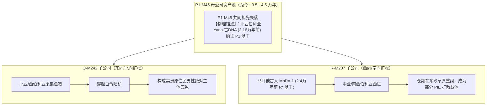
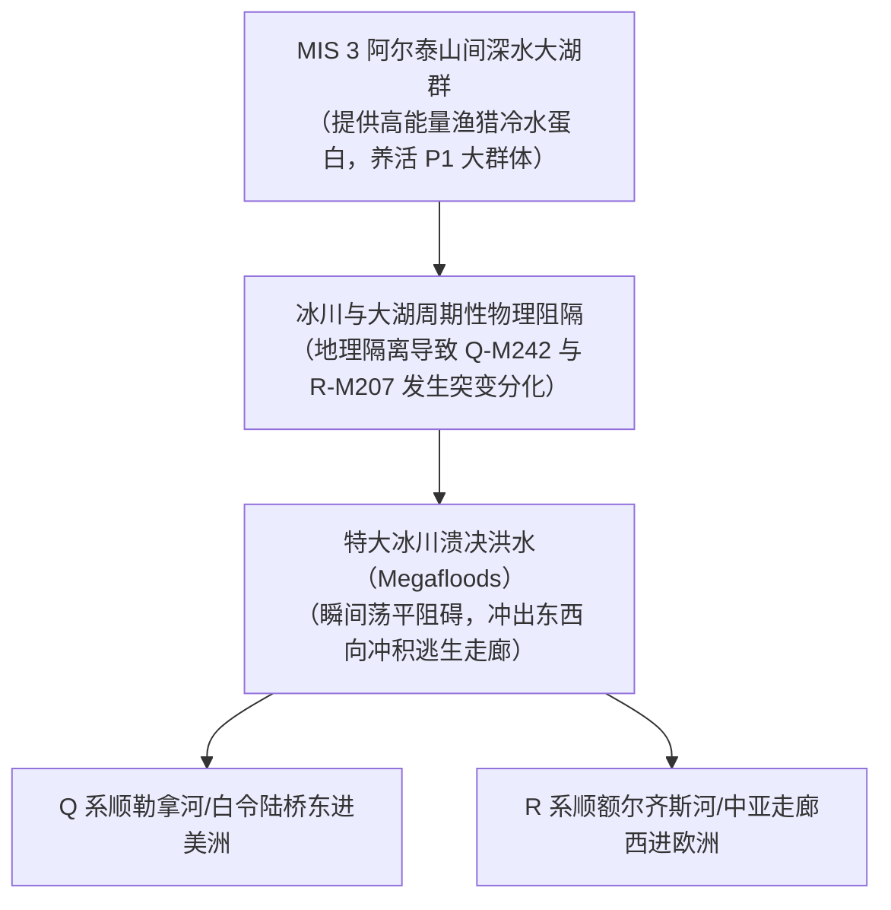

# 三更道场 · 认识论总纲 · 文献学与历史会计审计
## 篇章：P1-M45分叉Q/R、MIS 3阿尔泰大湖溃决生态与D0溯源方法论法医审计（v1.0）

---

### 【审计执行摘要 / Forensic Audit Abstract】
本审计案针对欧亚大陆旧石器晚期父系大树核心枢纽 **P1-M45（分化为 Q-M242 与 R-M207）** 的地理发生学、**MIS 3 阶段（距今约 60—2.9 万年）阿尔泰—南西伯利亚巨型山间冰川堰塞湖群与特大溃决洪水（Megafloods）** 的生态承载与物理隔离机制，以及对当代分子人类学**“以罕见现代孑遗样本（如尼日利亚 D0/D2）轻率定点古老起源地”**的方法论系统反驳，确立三更道场严密的法医对账公理。

---

### 【第一账套：P1 母公司与 Q/R 双子公司的反向交集定位法】

传统“印欧/雅利安起源论”习惯将 R 系父系直接绑定在东欧草原或欧洲现代高频区，完全无视其同胞兄弟 Q 系的存在，属于典型的**“把晚期上市子公司的品牌，误当成母公司出生证明”**的做假账行为：



#### 会计审计公理 1：反向交集约束定理
- **Q 是 R 起源的不可逆反向定位器**：寻找 P1/Q/R 的初始分化点，必须取 Q 系（东北亚—白令—美洲）与 R 系（中亚—西亚—欧洲）早期扩散路径的反向几何与生态交集。
- **地理交集锁定**：交集必然落在 **阿尔泰山—萨彦岭—贝加尔湖—南西伯利亚大湖盆地**，绝不可能发生于欧洲或乌克兰平原内部。
- **年代脱节事实**：R-M207 发生于距今约 3 万年前（旧石器晚期），而 PIE（原始印欧语）扩散仅发生在距今约 5000 年前（铜石并用—青铜早期）。**R 早于 PIE 超过 2.5 万年，将 R 称为“印欧基因”在时间账上属于非法挪用**。

---

### 【第二账套：MIS 3 阿尔泰大湖群水文生态与人口分叉物理机制】

大自然如何将一个 P1 狩猎采集共同体物理切割并放大为欧亚两大人口巨流？

```
+-------------------------------------------------------------------------------------------------------------------------+
|                                MIS 3 阶段阿尔泰—南西伯利亚大湖生态与水动力隔离台账                                            |
+-------------------------------------------------------------------------------------------------------------------------+
| 物理/水文地貌阶段   | 地质与气候实测证据 (MIS 3: 60-29 ka BP) | 对 P1 人口的承载与做功机制             | 人口与基因分化输出结果               |
+--------------------+---------------------------------------+----------------------------------------+--------------------------------------+
| **1. 冰期大湖蓄能** | 楚雅（Chuya）、库赖（Kurai）等大型山间 | 避风深谷、丰富的冷水鱼类、猛犸象与大型 | 支撑 P1 人口达到形成遗传分化所需的足 |
|                    | 盆地被冰川截断，形成水深数百米的巨湖群 | 偶蹄类动物群；提供稳定的淡水与石料资源 | 够有效群体规模（Effective Pop Size） |
+--------------------+---------------------------------------+----------------------------------------+--------------------------------------+
| **2. 冰川阻隔分化** | 冰川反复进退，山脊与高水位湖面形成天然 | 造成 P1 内部不同子聚落长达数千年的物理 | **父系突变积累与瓶颈分化**：         |
|                    | 物理屏障，阻断群体间自由交配流向       | 隔离（Geographical Isolation）         | 一支积累突变为 Q，另一支积累突变为 R |
+--------------------+---------------------------------------+----------------------------------------+--------------------------------------+
| **3. 特大溃决开道** | 堰塞冰坝崩塌，发生峰值流量达数百万立方 | 巨量洪水荡平沿途森林峡谷，瞬间冲刷出宽 | **两条外扩通道同时物理打开**：       |
| (Megafloods)       | 米/秒的全球顶级特大溃决洪水           | 广平坦的冲积阶地与东西向超大型逃生走廊 | Q 沿勒拿河/贝加尔向东北迁徙；        |
|                    | （留下数十米高的巨型涟漪 Giant Ripples| （巨型多米诺水动力开道）               | R 沿额尔齐斯河/哈萨克丘陵向西扩张。  |
+--------------------+---------------------------------------+----------------------------------------+--------------------------------------+
```



---

### 【第三账套：对 D0 现代孑遗溯源方法论的法医级反驳】

当代公共遗传学在尼日利亚发现 3 例现代 **D0（D2）** 样本后，便草率宣称“D 单倍群起源于非洲，东亚 D 是走出非洲后的次生输入”，这在历史会计与演化生态学上存在**致命的方法论漏洞**：

```
+-------------------------------------------------------------------------------------------------------------------------+
|                                    D0 溯源法与历史会计真伪对照表                                                        |
+-------------------------------------------------------------------------------------------------------------------------+
| 审计维度             | 现代公共遗传学 D0 叙事                | MLC 历史会计与生态法医事实               | 判定分录                             |
+----------------------+---------------------------------------+-----------------------------------------+--------------------------------------+
| **样本分布与代表性** | 仅凭西非尼日利亚 3 例现代极端罕见样本  | 东亚/青藏高原/日本列岛/安达曼群岛拥有数 | **严禁孤证定乾坤**：现代孤立边缘样本 |
|                      | 就判定整个 D 树起源于非洲             | 以千万计、连续分化数万年的完整 D 支系谱系| 可能是极早期回流或古代贸易/奴隶残留  |
+----------------------+---------------------------------------+-----------------------------------------+--------------------------------------+
| **生态资产承载力**   | 完全不解释这 3 个人的祖先如何在缺乏大 | 东亚大河源头、青藏高原大湖与环日本海冰期| **缺乏承载资产**：起源地必须具备养活 |
|                      | 型生态资产支撑的撒哈拉以南长期隐形存活| 渔猎带，具备长期滋养数十代 D 扩张的资产 | 大规模早期父系分化的人口发生器       |
+----------------------+---------------------------------------+-----------------------------------------+--------------------------------------+
| **古DNA年代连续性**  | 非洲迄今**零例**古DNA检测出 D0 支系   | 距今数万至数千年的东亚田园洞人/高原古DNA| **证据链断裂**：无任何地层学古DNA支持|
|                      |                                       | 明确测出早期亚洲基底及相关父系          | 非洲起源论                           |
+----------------------+---------------------------------------+-----------------------------------------+--------------------------------------+
```

#### 法医方法论总批判：
1. **“现代幸存点 $\neq$ 历史发生点”**：如果在伦敦发现了一张明代宝钞，不能得出明朝中央造币厂建在伦敦的荒谬结论。
2. **正确溯源五柱法则**：
   - 必须看**兄弟支系的几何反向交集**；
   - 必须看**地层古DNA的绝对年代序列**；
   - 必须看**微观多态性（STR/SNP）的阶梯多样性中心**；
   - 必须看**能否提供支撑有效群体规模（Effective Population）的大水体/冷水生态资产**；
   - 必须看**大物理事件（冰川溃决、地貌断裂）打开的扩散通道**。

---

### 【法医对账总决：P1/Q/R 与 MIS 3 资产入账总表】

| 会计科目 | 审定历史会计事实 | 法医处理结论 |
| :--- | :--- | :--- |
| **P1-M45 发生地** | Q 与 R 的反向交集锁定在阿尔泰—南西伯利亚大湖区，Yana 遗址提供古DNA硬锚点。 | **确认入账：内亚大湖发生模型** |
| **R 与 PIE 关系** | R 早于 PIE 2.5 万年以上，PIE 只是晚期 R 支系取得统治权后的语言倒叙。 | **红字冲销：彻底脱钩 R 与印欧人** |
| **MIS 3 巨湖溃决** | 楚雅/库赖古湖溃决洪水提供了物理隔离、突变积累与东西外扩的完整水动力闭环。 | **确认入账：水动力人口发生学** |
| **D0 非洲起源论** | 缺乏古DNA连续性与生态承载力，系“以现代边缘孑遗倒推起源”的方法论假账。 | **确认为方法论漏洞，予以驳回** |

---
**审计人签章**：三更道场·分子人类学生态发生学调查署  
**时间标记**：2026-09-09
