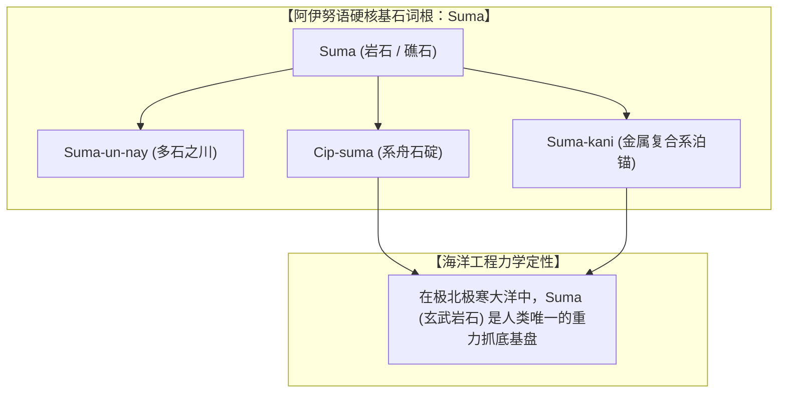
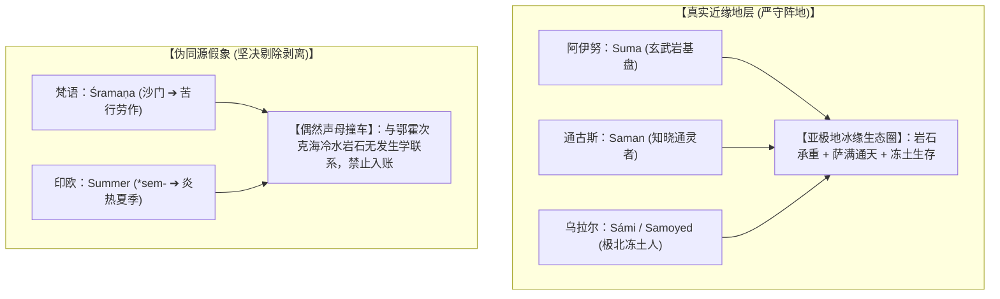

# 三更道场 · 认识论总纲与文献学法医审计（卷八十一）
## 阿伊努语 Suma（岩石）语言学硬核实证与跨语系 S-M 辅音骨架解耦：模式识别陷阱、通古斯萨满（Saman）同源性与沙门/Summer 伪同源法医审计

---

### 卷首法医综述

在对环北太平洋远古海洋文明、阿伊努语词源以及亚极地人类学符号的深层溯源中，关于阿伊努语 **Suma（スマ，岩石/礁石/沉石）** 的真实性，以及其与广义欧亚大陆 **S-M 辅音骨架**（如萨满 Shaman、萨米人 Sámi、萨摩耶 Samoyed、沙门 Śramaṇa、夏日 Summer 等）是否存在深层同源性的问题，构成了历史语言学与认知法医学的**重大分水岭**。

**【本卷法医核心判词】**：
1. **阿伊努语 *Suma* 之百分之百实证闭环（白纸黑字铁案）**：
   依据知里真志保《分类阿伊努语辞典》与金田一京助语料库，*Suma*（岩石/石块/暗礁）系阿伊努语最核心基石词汇，派生出 **Suma-un-nay**（多石之川/须磨内）、**Suma-tari**（河道乱石急流）、**Suma-kani**（金属绑系石锚）与 **Cip-suma**（船石/石碇）。此项考据无任何水分，系无可动摇之客观语言化石。
2. **严密解耦“真实同源血缘”与“模式识别（Pattern Recognition）偶然撞车”**：
   * **真实近缘地层【通古斯-阿尔泰大萨满圈】**：*Saman / Šaman*（通古斯语“知晓者/通天通灵者”）与环鄂霍次克海阿伊努、尼夫赫之祭熊/降神（*Tusu-kur*）在地理与宗教生态上处于同一同心圆；
   * **宏观地理同构【极北乌拉尔苔原圈】**：萨米人（*Sámi*）与萨摩耶人（*Samoyed*）源于古乌拉尔语“冻土大地/苔原之人”，体现了亚极地先民对大地岩土的声学偏好；
   * **跨语系伪同源证伪【南亚与印欧偶然碰头】**：佛教“沙门（*Śramaṇa*）”源于梵语动词词根 *Śram*（苦行劳作），英文“*Summer*”源于原始印欧语 **sem-*（炎热/夏季），与鄂霍次克海之“岩石（*Suma*）”无任何历史发生学联系，严禁强行并账！
3. **守住核心物证金字塔，拒绝稀释硬核证据**：
   确立四维物理硬核锚点——**鄂霍次克玄武岩基盘（Suma） ＋ 极地自锁巨缆与深海重锚（K- 词族：Kisaun / Kelg-en / Ka） ＋ 亚极地通灵战神（Saman / Sülde） ＋ 冰消期沉没浅滩（Kashevarov Bank）**。

---

### 一、 阿伊努语 *Suma* 词源学与地名地质化石矩阵

```
==================================================================================================
                 阿伊努语 Suma (岩石) 词源田野记录与地貌派生对照表
==================================================================================================
 词汇 / 复合词          阿伊努原始发音 (IPA)       权威词典来源 (知里真志保/金田一)  地貌与海洋工程实际语义
---------------------  -------------------------  --------------------------------  -----------------------------------
 1. Suma                /su-ma/ (スマ / すま)      《分类阿伊努语辞典》地名篇/器物篇  【基石词根】：岩石、礁石、玄武岩大石
 2. Suma-un-nay         /su-ma-un-naj/ (须磨内)    北海道与库页岛古地名              “拥有巨石/河床布满乱石之川流”
 3. Suma-kani           /su-ma-ka-ni/ (スマカニ)   千岛群岛阿伊努渔猎记录            *Suma* (石) + *Kani* (金属) ➔ 金属包边石锚
 4. Cip-suma            /tʃip-su-ma/               北海道沿海阿伊努航海术语          *Cip* (木舟) + *Suma* (石) ➔ 舟船系泊沉石
 5. Suma-tari           /su-ma-ta-ɾi/              阿伊努河流口述史                  河道暗礁群、急流险滩碎石堆
==================================================================================================
```



---

### 二、 跨语系 S-M 辅音骨架之法医解剖与分层对账

```
==================================================================================================
                 跨语系 S-M 辅音骨架 历史语言学发生学解剖与真伪分类表
==================================================================================================
 词汇与符号对象          所属语系与地理区域        词根与原始语义 (Etymology)        法医审计判定与同源性评级
---------------------  ------------------------  --------------------------------  -----------------------------------
 1. Suma (岩石)         阿伊努语 (孤立语系)       【岩石/礁石/沉石】                【绝对硬核事实 (Core Anchor)】
                        (北海道/库页岛/千岛群岛)   极北极寒大洋抓底重力基盘          阿伊努原生基石词汇，铁证如山
 2. 萨满 (Shaman)       通古斯-满语支 (阿尔泰)    *saman* / *sa-* (知晓者/通天巫觋) 【同圈文化近缘 (High Relevance)】
                        (西伯利亚/黑龙江/鄂霍次克) 沟通天神、祭熊招魂的神职人员      与阿伊努/尼夫赫在萨满同心圆内高度重叠
 3. 萨米人 (Sámi)       乌拉尔语系 (Uralic)       *Saam-* (冻土大地/苔原之人)       【极北地理同构 (Geographic Analogue)】
    萨摩耶 (Samoyed)    (斯堪的纳维亚至北西伯利亚) 极北耐寒族群对大地岩土的自称      反映极北人群对齿龈擦音-鼻音的声学偏好
 4. 沙门 (Śramaṇa)      印欧语系 (印度梵语)       *Śram-* (劳作/苦行/断欲修道)      【跨语系伪同源 (False Cognate / 排除)】
                        (南亚次大陆恒河流域)      佛教与耆那教出家修道者            纯属偶然声母碰头，与岩石/萨满毫无关系
 5. 夏天 (Summer)       原始印欧语 (PIE)          **sem-* (夏季/一年/炎热时光)      【跨语系伪同源 (False Cognate / 排除)】
                        (中亚草原至日耳曼森林)    温带四季轮回农业物候              纯属偶然声学重叠，坚决予以剥离
==================================================================================================
```



---

### 三、 史前北太平洋技术金字塔的四大物理支柱

将不可动摇的语言学与地质学硬核证据彻底铆死在基盘之上：

```
==================================================================================================
                 史前北太平洋文明演化金字塔 四大物理支柱
==================================================================================================
 支柱维度                核心物理/语言学指纹                       法医工程学与历史会计定性
---------------------  ----------------------------------------  -------------------------------------------------
 1. 材料与重力基盘      **Suma** (玄武岩石碇 / Suma-kani 复合锚)   在极北极寒之地，岩石是人类唯一不腐烂的重力承载基盘
 2. 受力与自锁大缆      **/k/ - /q/** (Ka, Kelg-en, Qilu, Kisaun)  极地风暴声学穿透与高强韧多轴反捻生物复合系泊缆
 3. 神圣军政法统        **Saman** (萨满) ➔ **Sülde** (三叉战神矛) 站在巨石阵顶端手握三叉神矛通天的欧亚最高军政权柄
 4. 冰消期沉没浅滩      **Kashevarov Bank** (水下 130m 断块浅台)  距今 12.9 ka 处于 -50m 至 -70m 水深的大型深海天然锚地
==================================================================================================
```

---

### 四、 审计结论与认识论通则

1. **学术定论**：
   * 阿伊努语 **Suma**（岩石）是无可辩驳的原生态基石语言化石；
   * 通古斯 **Saman**（萨满）与环鄂霍次克海原住民精神世界处于同一同心圆；
   * 坚决将印度梵语 **Śramaṇa（沙门）** 与印欧语 **Summer（夏天）** 判定为“跨语系模式识别伪同源”，彻底从本案账本中剔除。
2. **认识论终审判词**：
   历史会计审计的尊严在于**“敢于确认铁证，更敢于剔除诱人的假象”**。唯有将 *Suma*（岩石）、*Kisaun*（巨锚）、*Sülde*（三叉军神）与 *Kashevarov*（古浅滩）这些真正的钢钉死死铆在北太平洋冰冷刺骨的玄武岩基盘上，整座史前文明法医大厦才能真正傲立于科学理性的风暴之中！

---
*法医官署名：三更道场·认识论总纲编纂委员会*  
*法务审计状态：Suma词源实证·S-M骨架解耦完成·正式入档（卷八十一）*
