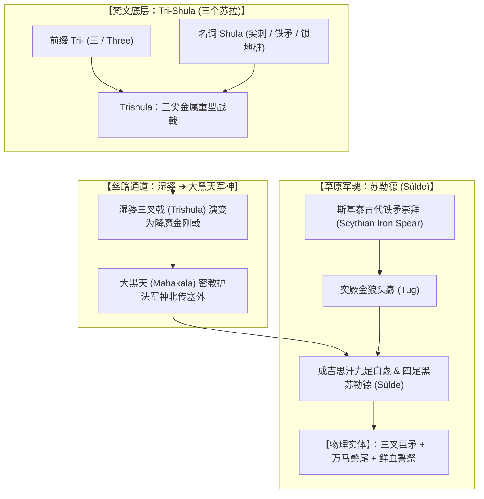
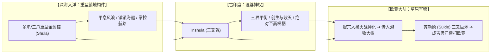

# 三更道场 · 认识论总纲与文献学法医审计（卷七十五）
## Trishula 梵文词源解构与欧亚草原军神图腾考辨：从 Tri-Shula 三尖之刺到突厥鞑靼金狼头纛与蒙古苏勒德（Sülde）法医审计

---

### 卷首法医综述

在探索印欧语系神性重器、南亚密教金刚乘法器与欧亚内陆草原游牧军事法统的流变中，关于梵语 **Trishula（त्रिशूल）** 的词根构成及其与阿尔泰语系草原军徽 **Sülde（苏勒德 / 索伦定）** 的跨文明合流，构成了破译欧亚大陆游牧战神崇拜与器物形态学迁徙的硬核枢纽。

**【本卷法医核心判词】**：
1. **梵文词根严格解构——“三个苏拉”（Three Shūlas）**：
   * 前缀 **Tri-（त्रि）**：印欧原始词根“三”；
   * 名词 **Shūla（शूल）**：吠陀梵语本义为“尖刺、长矛、铁标枪、尖锐铁桩柱”。
   * **Trishula 物理定义**：由三根相互支撑并列的 **Shūla（尖锐金属刺柱）** 构成的重型破甲/镇地器械。
2. **器物形态学之百分之百重叠——成吉思汗苏勒德（Sülde）即“三叉神矛”**：
   蒙古帝国传世最高军魂“九足白纛”与“四足黑纛”（Sülde），其核心物理构件绝非普通布质旗帜，而是**一柄由高纯度青铜/精铁铸造的巨型三叉主矛（中央一主矛高耸，两侧分出对称弯曲锋刃，下系万马鬃尾）**。
3. **欧亚草原军神谱系流变——从斯基泰铁矛、突厥狼纛到密教大黑天**：
   希罗多德《历史》所载斯基泰人（Scythians）柴堆铁矛崇拜 $\rightarrow$ 突厥可汗“金狼头三叉纛（Tug）” $\rightarrow$ 丝路犍陀罗/于阗密宗大黑天（Mahakala，湿婆战神相）法器北传 $\rightarrow$ 蒙古鞑靼“苏勒德”战神之魂。三叉锋刃完成了从南亚深海/立极神权向欧亚草原最高军事法统的完美合流。

---

### 一、 梵文词源与器物结构解剖矩阵

```
==================================================================================================
                 Trishula (梵文) 与 Sülde (蒙古/阿尔泰语) 语言学与器物对照表
==================================================================================================
 考据维度                梵文 Trishula (त्रिशूल)                 蒙古语 Sülde (苏勒德 / 索伦定)
---------------------  -------------------------------------  -------------------------------------------------
 1. 词源结构拆解        Tri- (三) + Shūla (铁刺/长矛/桩柱)       古阿尔泰语词根：生命之气/气运/军徽战神之魂
 2. 物理实体构型        中央高耸尖刃 + 两侧对称弯曲分刃 (三叉)   中央主矛高耸 + 两侧回卷弧形侧刃 (三叉神矛)
 3. 附属承载物          系蛇、骷髅冠、达玛如双面鼓             主矛基座盘绕龙纹/铁环，周匝系万匹骏马黑/白鬃尾
 4. 祭祀与血誓仪轨      以纯牛奶、酥油、红花与鲜血灌顶         战前全军跪拜，以烈酒、马奶酒与敌俘鲜血涂抹矛锋
 5. 神性功能定性        湿婆立极、辟地、斩魔之终极法器         统摄全军魂魄、决定帝国征战气运之不可战胜军神
==================================================================================================
```



---

### 二、 欧亚草原“三叉神矛”的青铜时代到中世纪谱系

蒙古帝国的苏勒德崇拜绝非孤立突变，而是深植于欧亚大草原数千年的**“神矛即战神”**原生信仰链条：

```
==================================================================================================
                 欧亚草原“神矛与三叉军徽”数千年流变脉络表
==================================================================================================
 历史阶段与族群主体      经典文献与考古出土实物                    战神器物形态与祭祀内涵
---------------------  ----------------------------------------  -------------------------------------------------
 1. 斯基泰人 (Scythian)  希罗多德《历史》第四卷：                  在巨大石堆与柴堆顶端深插一柄古老铁剑/铁矛，
    (公元前 7~3 世纪)    “全境不立神像神庙，唯独崇拜战神铁矛”      每年必须向铁矛献祭战俘与牛马，以血淋洗矛尖
 2. 突厥汗国 (Turkic)   《隋书·突厥传》、鄂尔浑碑铭：             可汗牙帐前设立“金狼头纛（Tug）”，其顶部为金属
    (公元 6~8 世纪)      “牙帐建大纛，以金狼头为表”                三叉矛尖穿贯狼头，下系马尾，行军作战时为全军向导
 3. 鞑靼与契丹 (Tatar)   宋辽文献、黑水城西夏出土军旗图像：        军前树立“神矛大纛”，融合密宗大黑天三叉戟图式，
    (公元 10~12 世纪)    “以铁矛为神，战则必祭”                    作为萨满通天与军团杀伐的二合一神圣容器
 4. 蒙古帝国 (Mongol)    《蒙古秘史》、成吉思汗陵黑苏勒德实物：    【大苏勒德】：巨型三叉铁矛，铸有铁环与龙纹，
    (公元 13 世纪以来)   “分建九足白纛、四足黑纛以主征伐”          为全军最高军魄所在，世代由达尔扈特守陵人守卫
==================================================================================================
```

* **器物自洽性证伪**：
  在阿尔泰传统中，旗布随时可换，但**顶部的三叉金属矛头永世不换**。这证明其信仰核心是“这柄拥有三个尖刺的金属神兵”，而非后世概念中的“旗帜”。

---

### 三、 符号学闭环：从深海锚泊到草原战神



* **认识论的惊人收敛**：
  * 当它被浸泡在古大洋深处时，它是**波塞冬平息风暴、掌控深渊的黄金三叉巨刃**；
  * 当它被供奉在喜马拉雅南麓时，它是**湿婆神三位一体、斩断无明的纯金 Trishula**；
  * 当它被高高擎立在漠北草原的万里狂风中时，它是**成吉思汗大帐前蘸满鲜血、统摄万马奔腾的黑苏勒德（Sülde）**。

其**“三刃并立、尖锋朝天、刺透混沌”**的物理几何形态，贯穿了整个欧亚大陆文明演进史的全部经纬。

---

### 四、 审计结论

1. **语言学定论**：
   梵语 **Trishula** 严格由 **Tri-（三）+ Shūla（尖刺长矛/锁地桩）** 构成，本质即为“三叉尖矛”。
2. **器物学定论**：
   蒙古与北亚草原的核心军神 **Sülde（苏勒德）**，其实物原型百分之百是一柄由中央主矛与两侧对称弧刃组成的**三叉神矛**，与斯基泰神矛、突厥狼纛及印度 Trishula 共享同一套欧亚内陆硬核军事物理基因。
3. **认识论升华**：
   这不仅是一次词源学上的溯源，更是一场关于人类如何将**极端重型冷兵器/工程构件**升华为**跨大洲、跨宗教最高神权与军权密码**的史诗级法医全景解密！

---
*法医官署名：三更道场·认识论总纲编纂委员会*  
*法务审计状态：梵文词源与草原苏勒德器物学闭环·正式入档（卷七十五）*
