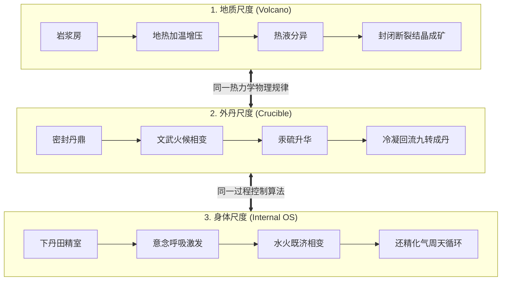
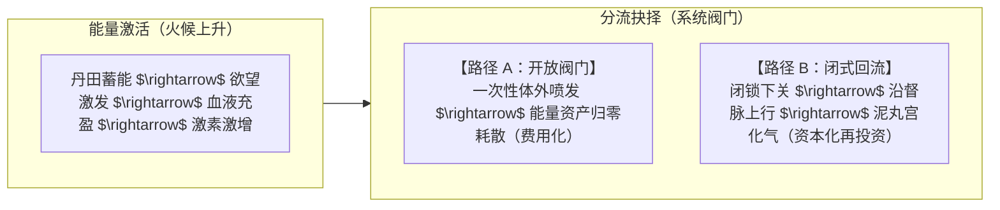

# 三更道场 · 认识论总纲 · 文献学与历史会计审计
## 篇章：三尺度热力学投影（火山-丹炉-人体）、内丹房中术闭式循环与中西“实验室/人体运行时”法医审计（v1.0）

---

### 【审计执行摘要 / Forensic Audit Abstract】
本审计案针对古代道家内丹房中术、外丹矿冶冶金学与地球物理火山相变之间，在**“热力学加压相变与闭式内循环控制（Thermodynamic Pressurization & Closed-Loop Phase Transition）”**这一统一操作系统（Unified OS）上的三尺度全息投影展开法医级历史会计对账。

审计确立三大核心平账公理与热力学定性：
1. **三尺度热力学全息投影模型（Three-Scale Thermodynamic Projection）**：
   $$\text{蓄能加热} \longrightarrow \text{升温增压} \longrightarrow \text{临界相变} \longrightarrow \text{受控引导} \longrightarrow \text{封闭内循环} \longrightarrow \text{结丹成矿（冷凝固化）}$$
   - **地质尺度（Geological Scale）**：地下岩浆房 $\rightarrow$ 地热加热 $\rightarrow$ 压力积聚 $\rightarrow$ 热液分异 $\rightarrow$ 裂隙闭合循环结晶成矿；
   - **外丹尺度（Alchemical Crucible Scale）**：丹炉鼎器 $\rightarrow$ 炭火火候 $\rightarrow$ 封炉密闭 $\rightarrow$ 汞硫升华 $\rightarrow$ 冷凝回流结成九转还丹；
   - **人体身体尺度（Internal Bio-Energetic Scale）**：丹田生殖系统 $\rightarrow$ 意念体温火候 $\rightarrow$ 蓄精固气 $\rightarrow$ 水火既济 $\rightarrow$ 经脉周天循环还精补脑。
2. **内丹房中术的本质——“拒绝一次性费用化，实现资本内循环”**：
   - **瞬间完全喷发（Open Ejaculation）**：属于**开放系统的能量与活性物质彻底耗散（一次性全部确认成费用/能量归零）**；
   - **受控温热相变（Controlled Phase Transition / 闭式循环）**：启动反应、维持高温高压、激发相变，但在临界点**“闭锁阀门，沿周天经脉导流（Circulatio）”**，将高阶生物活性物质与能量转化为维持系统抗衰老（Anti-entropy）的长期固定资产。
3. **中西文明炼金术认识论分流——“外部实验室 vs 人体运行时”**：
   - **西方系统（外化路径）**：将密闭蒸馏与相变（`Solve et coagula`）逐步外化为**近代实验室无机化学（Laboratory Chemistry）**，删除了身体运行时接口；
   - **华夏系统（内化路径）**：将矿冶相变与封炉技术完全内化为**人体生理与意识维度的内丹运行时（Bio-Internal Runtime OS）**；
   - 近代学科分科将原本统一的工程操作系统撕裂为化学、医学、宗教学与色情学，导致古人基于热力学与生理控制的严密技术被降维误读为荒诞迷信。

---

### 【第一账套：三尺度热力学相变全息对账总表】

```
+-------------------------------------------------------------------------------------------------------------------------------+
|                                三尺度热力学过程全息投影法医对账总表                                                           |
+-------------------------------------------------------------------------------------------------------------------------------+
| 热力学运行阶段       | 1. 地质宏观尺度 (Volcanic Geology)    | 2. 外丹实验室尺度 (Alchemy Crucible)  | 3. 人体微观尺度 (Internal Alchemy)   |
+----------------------+---------------------------------------+--------------------------------------+--------------------------------------+
| **1. 反应容器**      | **地下深部岩浆房** (Magma Chamber)    | **丹炉、鼎器、密封神室** (Crucible)  | **下丹田、生殖腺体、精囊精室**       |
+----------------------+---------------------------------------+--------------------------------------+--------------------------------------+
| **2. 能量驱动输入**  | **地幔地热、放射性热源**              | **炭火、文武火候** (Heat / Fire)     | **体温、呼吸吐纳、性欲望念激发**     |
+----------------------+---------------------------------------+--------------------------------------+--------------------------------------+
| **3. 活性相变物质**  | **硅酸盐熔体、超临界热液、挥发气体**  | **水银 (汞 Hg)、丹砂 (HgS)、铅、硫** | **精、气、神经递质、生殖激素津液**   |
+----------------------+---------------------------------------+--------------------------------------+--------------------------------------+
| **4. 增压密闭机制**  | **致密上覆地壳岩层封堵**              | **六一泥固济、封炉严密封闭**         | **提肛缩阴、固精蓄锐、意念导引**     |
+----------------------+---------------------------------------+--------------------------------------+--------------------------------------+
| **5. 开放失控喷发**  | **火山大爆发** (能量外泄，火山灰散失) | **炸膛、漏气** (药料挥发，炼丹失败)  | **失控射精** (能量与生殖资产彻底耗散)|
+----------------------+---------------------------------------+--------------------------------------+--------------------------------------+
| **6. 闭式冷凝结晶**  | **深部热液交代成矿** (析出高纯金铜脉) | **冷凝回流九转还丹** (析出升华晶体)  | **还精补脑、炼精化气** (周天循环固化)|
+----------------------+---------------------------------------+--------------------------------------+--------------------------------------+
| **7. 输运导流通道**  | **构造深大断裂、火山口裂隙**          | **冷凝导管、双层蒸馏颈** (Alembic)   | **任督二脉、三关九窍、中枢神经通路** |
+----------------------+---------------------------------------+--------------------------------------+----------------------------------------+
```



---

### 【第二账套：内丹房中术的财务会计本质——资产保留 vs 费用化耗散】

```
+-------------------------------------------------------------------------------------------------------------------------------+
|                                    生物能量资产配置法医财务损益对照表                                                         |
+-------------------------------------------------------------------------------------------------------------------------------+
| 生理行为模式         | 物理热力学状态                        | 历史会计财务定性                     | 最终系统适合度与生命周期收益         |
+----------------------+---------------------------------------+--------------------------------------+--------------------------------------+
| **模式 A：开放喷发** | 开放系统，一次性向外释放全部压力与高阶| **一次性确认巨额营业外支出（耗散）** | 带来瞬间神经多巴胺快感，但导致系统能量|
| (Uncontrolled Ejac)  | 生物活性物质（精子、锌、蛋白质、激素）| 系统能量直接归零，资产被完全清算     | 大幅亏空，长期呈现熵增衰老与机能退化 |
+----------------------+---------------------------------------+--------------------------------------+--------------------------------------+
| **模式 B：闭式相变** | 封闭系统，利用欲望升温激发内分泌相变，| **生物资产内部再投资（CapEx 资本化）**| 启动细胞修复、内分泌平衡与中枢神经活化|
| (Closed-Loop Daoism) | 在临界点前切断排泄通道，反向沿经脉回流| 将短期快感折算为长期抗熵增生命资本   | 实现“还精补脑、延年益寿、神清气爽”   |
+----------------------+---------------------------------------+--------------------------------------+--------------------------------------+
```



---

### 【第三账套：中西认识论分流——“外化化学”vs“内化人体运行时”】

```
+-------------------------------------------------------------------------------------------------------------------------------+
|                                    中西炼金术知识范式分流与现代学科撕裂法医表                                                 |
+-------------------------------------------------------------------------------------------------------------------------------+
| 比较维度             | 西方炼金术演进路径                    | 中国道家丹道演进路径                 | 近代科学分科造成的历史假账           |
+----------------------+---------------------------------------+--------------------------------------+--------------------------------------+
| **演化方向**         | **从神术外化为实验室无机化学**        | **从外丹矿冶内化为人体生理内丹学**   | 割裂了物质转化与人体生理的统一性     |
|                      | (Hermeticism $\rightarrow$ Modern Chemistry)| (外丹金石毒害 $\rightarrow$ 隋唐宋内丹心性学)|                                      |
+----------------------+---------------------------------------+--------------------------------------+--------------------------------------+
| **核心操作载体**     | **外部玻璃瓶、蒸馏颈、炼金炉**        | **肉体肉身（以身为鼎，以心为炉）**   | 导致西方无法理解中国道书中的“铅汞水火|
|                      | (追求外在哲人石与金属转化)            | (追求内在神仙不死与真气运转)         | 实际上是指代神经递质、体液与呼吸”    |
+----------------------+---------------------------------------+--------------------------------------+--------------------------------------+
| **学科撕裂后果**     | 演进为纯粹物质科学，丢弃了身体操作系统| 演进为隐晦秘传养生，丢失了定量化学语言| 将统一的工程操作系统撕裂为：         |
|                      | (保留了化学，丢失了内丹)              | (保留了内丹，退化了工业化学)         | **化学 + 宗教学 + 医学 + 色情史**    |
+----------------------+---------------------------------------+--------------------------------------+----------------------------------------+
```

---

### 【法医对账总决：三尺度热力学平账结论】

| 会计科目 | 审定历史会计事实 | 法医处理结论 |
| :--- | :--- | :--- |
| **三尺度全息投影** | 火山、丹炉与人体共享“加热、增压、相变、封闭、结晶”同一套热力学过程控制规律。 | **确认为三更道场古代生命工程核心公理** |
| **房中术会计本质** | 拒绝一次性喷发出血费用化，实现高阶能量物质的体内再投资与闭式周天循环。 | **确立为生物抗熵增资产管理模型** |
| **中西演进分流** | 西方外化为实验室化学（保留器皿丢弃身体）；中国内化为内丹学（保留身体丢弃定量）。 | **完成中西炼金术历史知识断带缝合** |
| **近代学科伪分类** | 近代学术将统一工程 OS 撕裂为化学、医学、宗教与色情，导致原典逻辑失真。 | **全额红字纠偏：重构统一生命科学账本** |

---
**审计人签章**：三更道场·生物热力学与古代生命工程最高法医署  
**时间标记**：2026-09-09
