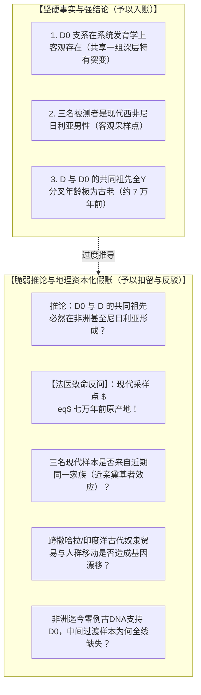
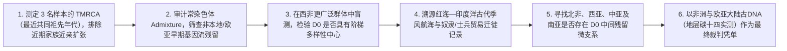

# 三更道场 · 认识论总纲 · 文献学与历史会计审计
## 篇章：三钟审计体系（分子钟/碳十四钟/地层钟）与D0现代样本地理资本化反驳法医审计（v1.0）

---

### 【审计执行摘要 / Forensic Audit Abstract】
本审计案针对分子人类学古DNA与现代全基因组测序中经常出现的“计时器混账”与“地理空间资本化溢出”展开法医级审计。

审计确立两大核心纠偏与标准公理：
1. **三钟独立审计体系（Three-Clock Forensic Framework）**：
   - **分子钟（Molecular Clock）**：测量谱系突变积累与分叉年代（回答“支系何时分化”）；
   - **碳十四钟（Radiocarbon Clock）**：测量被测生物有机体物理死亡年代（回答“人骨何时刻死亡”）；
   - **埋藏/地层钟（Stratigraphic/Burial Clock）**：测量骨骼进入地层与随葬事件的年代（回答“墓葬何时形成”）。
   - **捡骨葬/二次葬的精准归位**：二次葬与迁葬会打破“人骨死亡时间与墓穴建造时间”的对应关系，会污染考古定居语境，但**不会改变个体的物理死亡时间，更不会改变 Y 染色体在系统发育树上的拓扑位置**。
2. **对 2019 年 D0（D2）现代尼日利亚样本论证的法医级重构**：
   - 彻底剥离“拿捡骨葬去套现代活人样本”的逻辑错位；
   - 锁定该研究最脆弱的软肋：**“树的拓扑成立 $\neq$ 发生地定论成立”**。三例来自现代尼日利亚健康男性的全基因组测序样本，足以修整 Y 树的深层分支，却**在统计学和地缘生态学上严重不足以证明 7 万年前 D/D0 的起源地就在西非尼日利亚**。

---

### 【第一账套：三钟独立审计体系与不等式约束公理】

```
+-------------------------------------------------------------------------------------------------------------------------------+
|                                    三钟独立审计体系（Three-Clock Framework）法医台账                                           |
+-------------------------------------------------------------------------------------------------------------------------------+
| 计时器类型           | 物理/生物学测量对象                   | 核心回答的问题                       | 容易发生的混账与误判                   |
+----------------------+---------------------------------------+--------------------------------------+----------------------------------------+
| **1. 分子钟**        | Y-DNA / mtDNA 碱基突变积累率与分支长度| 某父系支系与其兄弟支系何时发生分化   | 误将支系分叉年代直接套用为被测个体的生 |
| (Molecular Clock)    | (由全基因组测序与突变速率模型校准)    | (谱系演化年龄，如 D0 与 D 分化 ~70ka)| 存年代（现代人也能携带 7 万年前的单倍群|
+----------------------+---------------------------------------+--------------------------------------+----------------------------------------+
| **2. 碳十四钟**      | 骨骼胶原蛋白中的碳-14放射性衰变同位素 | 该生物学个体在地球上何时物理停止呼吸 | 误将人骨死亡时间直接等同于墓地建造与人 |
| (Radiocarbon Clock)  | (经树轮校准后的绝对物理死亡日历年)    | (个体死亡年龄，如某古人死于 3000 BCE)| 群定居时间（忽视二次葬与骨骼迁徙）     |
+----------------------+---------------------------------------+--------------------------------------+----------------------------------------+
| **3. 埋藏/地层钟**   | 墓穴地层叠压关系、随葬陶器/金属器形制| 骨骼何时被放入该墓穴、墓地何时封闭   | 误将随葬品年代当成人骨死亡年代，或将骨 |
| (Stratigraphic Clock)| 及地层沉积物释光（OSL）年代           | (社会埋葬事件年龄，如汉代墓葬装先秦骨| 头出现当成该单倍群在此定居的唯一证据   |
+----------------------+---------------------------------------+--------------------------------------+----------------------------------------+
```

#### 会计审计不等式公理：
$$
\text{支系分叉时间（分子钟）} \ge \text{古样本死亡时间（碳十四钟）} \ge \text{最终入墓时间（地层钟）}
$$
- **“捡骨葬”的精准杀伤范围**：针对的是“某墓地发现某古老单倍群骨骼，便断定该人群在墓葬年代定居于此”的非法记账。它证明骨骼可能经历二次迁葬、祖先骨骼随行、战利品收藏或奴隶归葬；**但它不用于评价活人血液样本**。

---

### 【第二账套：D0（Haber et al. 2019）四级证据链与地理资本化剥离】



#### 法医审计分级判定表：
1. **Level 1（客观数据）**：D0 确为 D 树基部的深分化分支。**【核准入账】**
2. **Level 2（采样事实）**：样本取自 3 名现代尼日利亚个体。**【核准入账】**
3. **Level 3（系统发育）**：D/E 节点与 D0 分化早于走出非洲主体事件。**【核准入账】**
4. **Level 4（地理定论）**：断言 D 起源于非洲。**【红字冲销 / 暂挂待查】**：
   - 犯了**“将现代极边缘孑遗样本的坐标，错误资本化为远古始祖地理出生证明”**的方法论大忌。

---

### 【第三账套：现代孤立样本 vs 真正地理原点的法医审计对照表】

```
+-------------------------------------------------------------------------------------------------------------------------+
|                                    Q/R 案与 D0 案在地理溯源上的同构对照表                                               |
+-------------------------------------------------------------------------------------------------------------------------+
| 案例类别             | 现代表面高频/孤立分布                | 错误归因法 (倒叙法)                  | 三更道场法医正解 (生态与反向交集法)    |
+----------------------+---------------------------------------+--------------------------------------+----------------------------------------+
| **Q/R 父系案**       | Q 在美洲原住民中绝对高频；            | 倒叙为“Q 发源于美洲，R 发源于欧洲”， | 必须取 Q 与 R 的反向交集，结合古DNA    |
|                      | R 在欧亚西部/欧洲人群中极高频         | 甚至把 R 称为“印欧基因”              | 锁定在阿尔泰—南西伯利亚大湖生态区      |
+----------------------+---------------------------------------+--------------------------------------+----------------------------------------+
| **D0 / D 父系案**    | D0 在西非尼日利亚仅现 3 例；          | 倒叙为“整个 D 树发源于尼日利亚/西非，| 现代 3 例尼日利亚样本仅代表近期幸存点，|
|                      | D-M174 在东亚/西藏/日本拥有庞大多样性 | 东亚 D 是非洲走出后的次生输入”       | 必须寻找支撑大人口分化的生态承载区，   |
|                      |                                       |                                      | 并在红海、南亚到东亚寻找古DNA链条      |
+----------------------+---------------------------------------+--------------------------------------+----------------------------------------+
```

---

### 【第四账套：检验 D0 真实地缘历史的七大实证审计程序】

要真正坐实 D0 的历史地理属性，严禁停留于 3 个现代样本，必须执行以下审计核验：



---

### 【法医对账总决：三钟审计与 D0 案平账结论】

| 会计科目 | 审定历史会计事实 | 法医处理结论 |
| :--- | :--- | :--- |
| **三钟审计体系** | 分子钟（谱系年龄）$\ge$ 碳十四钟（人骨年龄）$\ge$ 地层钟（埋葬年龄）。 | **确立为三更道场核心法医测定准则** |
| **捡骨葬功能边界** | 用于纠治古DNA墓葬地层与定居语境错位，严禁挪用于活人样本。 | **修正入账：厘清工具使用边界** |
| **D0 拓扑有效性** | 3 例样本在 Y 系统发育树上的深层位置真实有效。 | **确认入账：接受其对大树拓扑的修正** |
| **D0 非洲起源定论** | 现代采样坐标不可直接透支为 7 万年前地理原点，缺乏生态与古DNA链条。 | **暂挂/红字剥离：定性为地理过度资本化** |

---
**审计人签章**：三更道场·分子人类学与年代学法医联合调查署  
**时间标记**：2026-09-09
