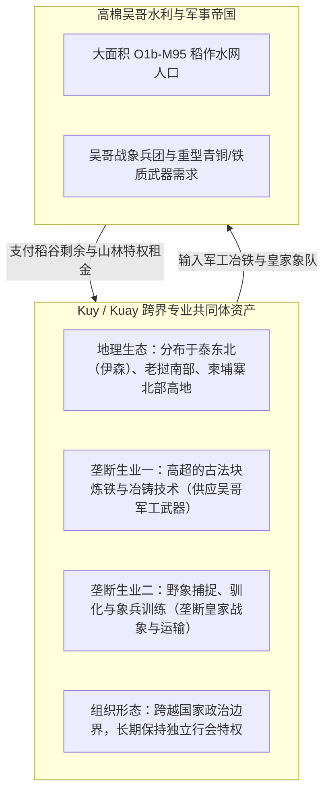
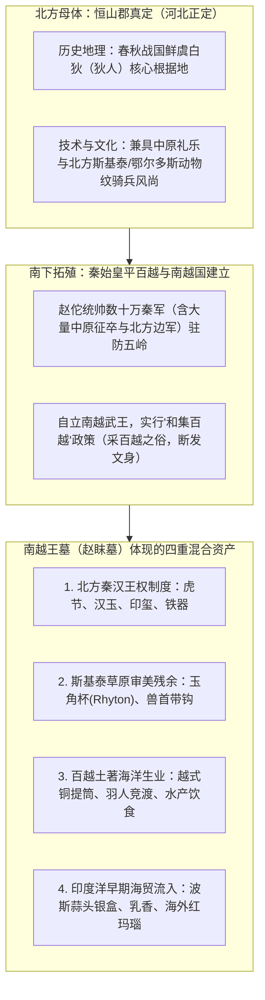

# 三更道场 · 认识论总纲 · 文献学与历史会计审计
## 篇章：中南半岛父系底盘分层、Kuy匠人集团与南越王赵眜墓斯基泰器物法医审计（v1.0）

---

### 【审计执行摘要 / Forensic Audit Abstract】
本审计案针对欧亚大陆南部—中南半岛人群父系结构的分层机制、泰柬老边境特殊工匠共同体 **Kuy（Kuay / 库耶 / 冶铁驯象人群）**、**K-M / K-W 名号外壳与人口底盘分离假说**，以及**南越王（赵佗真定籍贯 / 赵眜墓出土器物）的斯基泰—北方草原风格器物与多元贸易法医证据**进行系统性建账、校正与对账。

---

### 【第一账套：中南半岛父系底盘与“低频高稳定”流动男性层法医审计】

```
+-------------------------------------------------------------------------------------------------------------------------+
|                               中南半岛与岭南父系 Y-DNA 分层结构法医总表                                                    |
+-------------------------------------------------------------------------------------------------------------------------+
| 分层结构           | 主导 Y 染色体支系                  | 频率分布特征                         | 历史社会学与生业形态本质             |
+--------------------+------------------------------------+--------------------------------------+--------------------------------------+
| 1. 岭南/东南沿海底盘| **O1a-M119** (百越/南岛前体)       | 华南沿海、台湾原住民高频             | 赶海、水稻种植、独木舟、贝丘与残月玉钺|
+--------------------+------------------------------------+--------------------------------------+--------------------------------------+
| 2. 中南半岛南亚底盘| **O1b1a1a-M95** (旧称O2a1-M95)    | 柬埔寨南亚语 ~70.7%，泰国南亚语 ~52.5% | 湄公河/洞里萨湖水网定居农耕、水力微坡|
|                    | (Proto-Austroasiatic 核心底盘)     | 构成高棉、孟族人口绝对多数基底       | 度灌溉与平原稻作生产力基座           |
+--------------------+------------------------------------+--------------------------------------+--------------------------------------+
| 3. 汉藏/藏缅南下层 | **O2a2b1a1-M117 / O2a2b1a2-F46**   | 泰国、缅甸、云南 15% - 35%           | 旱作农业、山地马帮、早期城邦军事整合 |
+--------------------+------------------------------------+--------------------------------------+--------------------------------------+
| 4. 流动专业共同体层| **C2-M217 (F4002/L1373 等下游)**   | 泰国北部、柬老边境 ~2.5% - 5% (低频广布)| 冶铁锻造、驯象贸易、山地护商、外来王号|
|                    | 【“芝麻撒在披萨上”的非人口替代模式】 | 散布于 Mon-Khmer、Khon Mueang 诸群体 | 承载者与军事/技术行会组织网络         |
+--------------------+------------------------------------+--------------------------------------+--------------------------------------+
```

#### 会计审计结论 1：名号（Class Name）与人口底盘的分离模型
1. **人口底盘**：柬埔寨高棉人及中南半岛土著以 **O1b-M95**（占 50%—70% 以上）构成庞大的水网稻作生产力底层。
2. **专业工匠与统治名号**：
   - 少数掌握**冶铁（Iron Metallurgy）、造船、驯象（Elephant Domestication）或重力水利**的外来男性（包含低频 C2 或其他北方/外来支系），以技术特权、武装中介或商业行会形式嵌入本地社会。
   - 他们的首领名号、行业品牌或政治头衔（如 *K-M / K-W* 词根簇：**Kuy、Khmer、Kunming、Kumaso/熊袭、Kumo Xi/库莫奚**）在政治重组中演化为全社会的“统称标签”。
   - **几代通婚后，生物学父系被庞大的本地 O1b 稀释为极低比例，但名号与制度外壳被永久保留**。

---

### 【第二账套：泰柬老边境 Kuy（库耶）冶铁—驯象共同体法医审计】



- **法医意义**：Kuy 真实存在并存续至近现代，成为“非主体民族但垄断核心高阶技术（军工冶炼与大型牲畜驯养）的跨国行会”的活化石标本。

---

### 【第三账套：南越王（赵佗籍贯与赵眜墓）斯基泰器物与北方军事要素法医审计】

针对广州象岗山**西汉南越王墓（第二代南越王赵眜 / 赵胡墓）**出土器物与第一代南越武王**赵佗（恒山郡真定人，今河北正定）**的北方白狄—斯基泰地缘网络展开实物审计：

```
+---------------------------------------------------------------------------------------------------------+
|                              西汉南越王墓 (赵眜墓) 核心器物法医台账与多元文化归属                         |
+---------------------------------------------------------------------------------------------------------+
| 器物名称             | 实物形制与工艺特征                    | 风格源流与技术指纹 (北方/斯基泰/海洋/中原)  |
+----------------------+---------------------------------------+-------------------------------------------+
| **透雕龙凤纹重环玉佩**| 双面透雕、同心双环、游丝毛雕           | 战国中原王室玉雕工艺传承（北方汉中原官造） |
+----------------------+---------------------------------------+-------------------------------------------+
| **圆雕玉角杯**       | 犀角形、整块青白玉雕琢、回转盘绕龙形   | **斯基泰/中亚来通杯（Rhyton）造型**       |
| (镇馆之宝)           | 口部微侈、下端为缠枝卷云纹收尾         | 结合欧亚草原金银器形制与汉代温润玉雕工艺   |
+----------------------+---------------------------------------+-------------------------------------------+
| **金角兽头形带钩**   | 兽首凸起、眼镶绿松石、曲颈龙角         | **典型欧亚北方草原斯基泰—鄂尔多斯动物撕咬风格** |
| 及系列动物纹金带扣   | 凶猛肉食动物造型、浮雕立体金工         | 恒山真定（原鲜虞白狄故地）北方骑兵战带遗风 |
+----------------------+---------------------------------------+-------------------------------------------+
| **错金铭文虎节**     | 青铜铸造、错金虎斑、铭文“王命命车驲” | 北方先秦—秦汉符节制度（车马驿传特权凭证）  |
+----------------------+---------------------------------------+-------------------------------------------+
| **波斯蒜头纹银盒**   | 银质捶揲、蒜头纹凸瓣、裂片形焊接       | **古代波斯阿契美尼德/帕提亚金银器**       |
| (海上丝绸之路早期物证)| 盒身与盒盖边缘刻有汉代称重墨书         | 经由印度洋—南海早期海贸进入岭南番禺港     |
+----------------------+---------------------------------------+-------------------------------------------+
| **越式铜提筒与铜鼓** | 几何印纹、羽人竞渡图、百越断发文身     | **岭南土著百越土著青铜重器与海洋潮汐崇拜** |
+----------------------+---------------------------------------+-------------------------------------------+
```

---

### 【第四账套：赵佗真定（鲜虞白狄）地缘背景与南越王室的组织模型】



#### 会计审计裁定 2：南越王室是“多重文化资产组装的高效统治集团”
1. **器物与血缘剥离**：
   - 赵眜墓中的斯基泰风格（玉角杯、猛兽带钩）既是其真定北方骑兵故土文化记忆的延续，也是战国—秦汉时期北方草原与中原技术交流的沉淀。
   - 波斯银盒与越式铜提筒则明确证明了番禺（广州）作为**“海外进口清算港 + 百越本土水产基地”**的双重属性。
2. **制度穿透**：
   - 赵佗/赵眜政权是典型的**“少数北方军事官僚精英 + 巨量南方百越海洋人口 + 欧亚内陆/海外商贸资本结算”**的三元组合体。

---

### 【法医对账总决：两案并账资产损益表】

| 会计科目 | 审定历史会计事实 | 法医处理结论 |
| :--- | :--- | :--- |
| **百越父系底盘** | 岭南以 O1a-M119 为主，中南半岛以 O1b-M95 为绝对多数。 | **严禁混写为 O2-M119，分别立账** |
| **C2在中南半岛** | 2.5%—5% 低频广布，代表流动冶铁、驯象、商贸或统治阶层。 | **确认入账：名号/技术与人口底盘分离模型** |
| **Kuy 工匠共同体** | 泰柬边境跨国冶铁驯象行会，证明专业共同体与主体民族并存。 | **确认入账：流动专业行会活化石** |
| **南越王墓斯基泰器物**| 赵眜墓出土玉角杯、兽首金带钩，反映北方白狄背景与草原交流；波斯银盒反映早期海贸。 | **确认入账：四元资产混合统治模型** |

---
**审计人签章**：三更道场·历史会计与分子人类学联合调查署  
**时间标记**：2026-09-09
