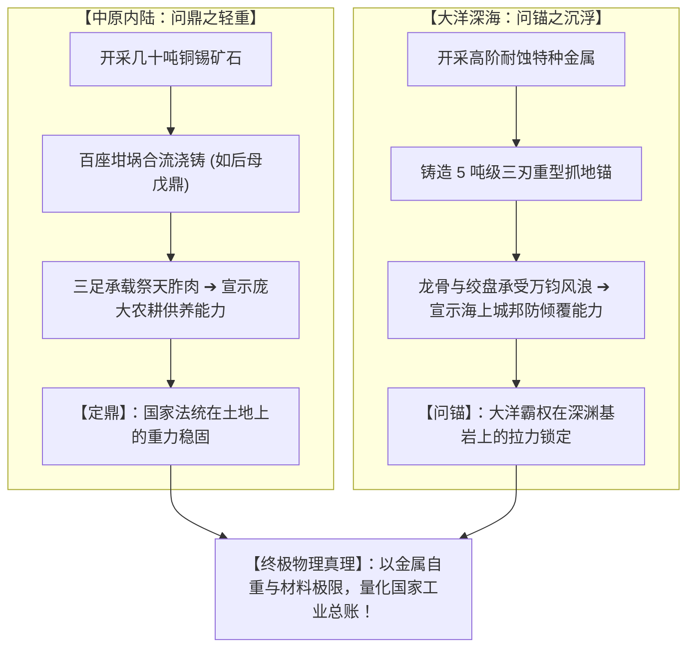
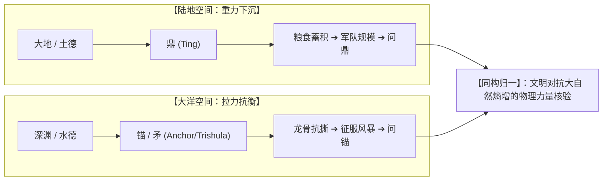

# 三更道场 · 认识论总纲与文献学法医审计（卷八十四）
## 政治人类学法统量化考辨：中原农耕“问鼎之轻重”与大洋海洋“问锚之沉浮”物理应力映射法医审计

---

### 卷首法医综述

在比较政治学、国家起源动力学与硬核权力符号学中，针对华夏中原农耕帝国的“鼎（Tripod / Ting）”与大洋/海洋极地文明的“重型三叉锚/神矛（Anchor / Trident / Sülde）”，长期存在着将二者割裂为“陆地礼制”与“海洋工具”的表层分类误区。

然而，一旦深入到**材料力学极限、国家冶金产能总账与集中应力物理威慑**的底层逻辑，会发现二者是在不同生存介质（土地 vs. 大洋）下，对**“国家至高法统与工业硬实力”**进行的同一套高度同构的物理量化核验机制。

**【本卷法医核心判词】**：
1. **中原“问鼎之轻重”的工业与粮食承载本质**：
   * 楚庄王问鼎之轻重（《左传·宣公三年》），问的绝非空洞美学，而是**“全国最高品位铜锡采矿能力 ＋ 百座坩埚同步合流浇铸工业极限 ＋ 能够调动并供养的剩余农耕军队体量”**；
   * 鼎作为三足空腹重器，其物理功能是**承载祭肉、定极于土**。
2. **大洋“问锚/比矛之沉浮”的抗剪切力与防倾覆本质**：
   * 吃水深度（Draft）具有欺骗性（烂船积水、低技术笨重湿木同样可致深吃水；极地暗礁区高技术反而追求浅吃水宽体稳性）；
   * 唯有**悬挂于船首、直入深渊的数吨级三刃重锚/巨矛**，是绝对不可作假的硬通货。拥有 5 吨重锚，不仅代表万吨级采矿冶金产能，更直接证明**船体主龙骨、绞盘与缆索系统能够承受大洋风暴撕裂时的万钧集中剪切应力**。
3. **“问鼎”与“问锚”的跨文明政治法统闭环**：
   从“受命于天，定鼎中原”（陆地立极）到“以刃击海，大地乃定”（大洋立极），人类在发明现代国际法之前，无一例外采用了**“以巨型金属重器的自重与抗拉强度，核验国家工业总账与防灾抗压极限”**的统一物理法则。

---

### 一、 “问鼎”与“问锚”政治人类学参数对照矩阵

```
==================================================================================================
                 中原农耕“鼎” 与 大洋海洋“锚/矛” 物理力学与政治法统对比表
==================================================================================================
 对照维度                中原内陆农耕体系 (商周华夏)             大洋海洋极地体系 (古波塞冬/北方游牧)
---------------------  ------------------------------------  -------------------------------------------------
 1. 终极生存威胁        旱涝灾荒、土地争夺、城邦覆灭           超级风暴、暗礁海啸、深渊吞没、船体撕裂解体
 2. 核心法定重器        **鼎 (Tripod / Ting)**                 **三刃重锚 / 战矛 (Anchor / Trishula / Sülde)**
 3. 物理力学构型        三足鼎立、空腹容物、承载重物 (重力向下) 三刃并立、实心自重、穿刺抓底 (拉力平衡)
 4. 工业能力质检指标    百座坩埚同步浇铸、高品位铜锡冶炼极值   高强度合金铸造、厚金防腐、高抗拉破断力大缆装配
 5. 船体/国家应力验证   能够供养百万人之定居农业粮食盈余       船体主龙骨、绞盘与系泊结构能承受数千吨涌浪集中撕扯
 6. 量化威慑名言        “楚子问鼎之大小轻重”                 “两王相会于海峡，观其船锚之沉浮与矛重”
 7. 至高神权法统        **“定鼎中原” (立极于厚土)**           **“击海定澜” (立极于大洋)**
==================================================================================================
```



---

### 二、 为什么大洋体系不比“吃水”，而必须“比锚”？

在古航海与海洋政治学中，“吃水深度”在法统核验上存在三大致命缺陷：

```
==================================================================================================
                 航海“吃水深度 (Draft)” 与 “船锚自重 (Anchor Weight)” 法医评估对比
==================================================================================================
 评估维度                吃水深度 (Draft)                        船锚与首矛自重 (Anchor / Spear Weight)
---------------------  ------------------------------------  -------------------------------------------------
 1. 指标真实性          【极度被动且具欺骗性】：               【绝对硬核不可伪造】：
                        烂船渗水、舱底泥沙积重、吸水湿木       纯金属实心铸造，其体积、重量与材质
                        均可造成深吃水假象，实为劣质漂浮棺材   在港口起吊悬挂于船首，肉眼可见，无法虚报
 2. 复杂海况适应力      【深吃水在极地浅滩等于自杀】：         【浅吃水 + 重锚 = 顶级生存构型】：
                        高纬暗礁、流冰与峡湾迫切需要宽体浅吃水 既能在极浅水域自由机动，又能在风暴来临时
                        (Low-draft, High-stability)            抛下重锚死死钉入海底玄武岩，绝不倾覆
 3. 集中抗剪切应力检验  【无法检验船体骨架结构】：             【船体整体材料强度的终极压力测试】：
                        静止浮力分布均匀，无法证明船体抗扭刚度 承受 5 吨锚抓底拉力，倒逼出整船龙骨与肋骨
                                                               的极限抗撕裂工程标准（烂船抛重锚即解体）
==================================================================================================
```

* **法医力学定论**：
  两军会盟或大洋争霸时，船首起吊的那具**通体金光闪烁、数吨沉重的三尖重锚**，就是整艘母舰所有冶金、铸造、龙骨装配、缆索编织工业实力的**“唯一集中物理汇流点”**。

---

### 三、 历史会计与政治人类学终审定论



1. **学术定论**：
   * “问鼎之轻重”与“比锚（矛）之沉浮”，是人类在不同生存地质空间下，对**国家综合工业制造能力与防灾抗破坏极限**发展出的同一套量化核验图腾。
2. **认识论终审判词**：
   * 楚庄王问鼎，问的是中原大地的承重底盘；
   * 远古大洋先民问锚，问的是波涛深渊的锁地权柄。
   * **鼎之三足，立于厚土；锚之三刃，扎入深洋。二者在人类文明破晓时分，共同构成了文明对抗混沌风暴的最高工业勋章！**

---
*法医官署名：三更道场·认识论总纲编纂委员会*  
*法务审计状态：问鼎与问锚政治人类学闭环·正式入档（卷八十四）*
