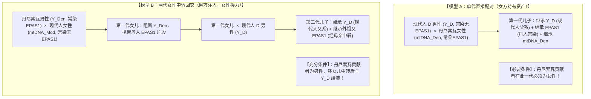
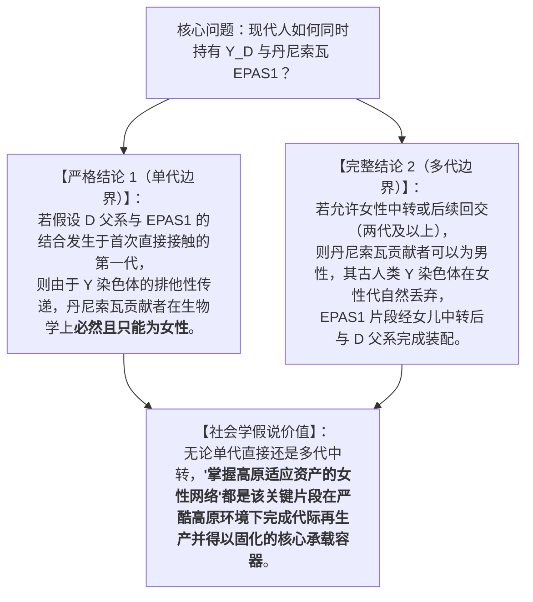

# 三更道场 · 认识论总纲 · 文献学与历史会计审计
## 篇章：丹尼索瓦 EPAS1 渗入与 D-M174 父系配对代际拓扑（单代直接配对 vs 两代女性中转）法医审计（v1.0）

---

### 【审计执行摘要 / Forensic Audit Abstract】
本审计案针对青藏高原史前现代人获取古人类丹尼索瓦人（Denisovan）**EPAS1 耐缺氧常染色体片段**与 **父系 D-M174** 结合的具体交配拓扑（Mating Topology）模型展开严密的法医级代际拆解。

审计确立两大竞争性代际传播模型及判定条件：
1. **模型 A：单代直接配对模型（Single-Generation Direct Model）**
   - **配对公式**：现代人男性（$Y^D$） $\times$ 丹尼索瓦女性（$\text{Denisovan } \female$）；
   - **逻辑约束**：在此严格单代设定下，丹尼索瓦贡献者**必须且只能是女性**。因为若父亲为丹尼索瓦男性，其儿子的 Y 染色体必为丹尼索瓦古人类 Y，不可能同时保留现代人 $Y^D$。
   - **制度映射**：完美自洽于“外来 D 男性进入高原 $\rightarrow$ 融入掌握高原生存与基因资产的本地女性亲属网络 $\rightarrow$ 从妻居/舅权固化”的社会机制假说。
2. **模型 B：两代女性中转回交模型（Two-Generation Female-Relay Model）**
   - **第一代**：丹尼索瓦男性（$\text{Denisovan } \male$） $\times$ 现代人女性（$\text{Modern } \female$） $\rightarrow$ 产下杂交第一代女儿（携带丹人常染色体 EPAS1 片段）；
   - **第二代**：杂交女儿 $\times$ 现代人 D 父系男性（$Y^D$） $\rightarrow$ 产下携带 $Y^D$ 且继承外祖父 EPAS1 的儿子；
   - **逻辑穿透**：丹尼索瓦贡献者**可以是男性**，其古人类 Y 染色体在女儿一代自然阻断，EPAS1 经由女性载体中转后与 $Y^D$ 完成最终资产组装。
3. **法医裁决准则**：区分模型 A 与模型 B，不能仅看 EPAS1 本身，必须依靠 **X 染色体渗入比例偏差、线粒体 mtDNA 连续性、以及全基因组性别偏向渗入系数（Sex-biased Admixture Coefficient）** 严格定谳。

---

### 【第一账套：两大代际配对拓扑模型的数学与遗传学推导】



---

### 【第二账套：模型 A 与 模型 B 的法医证据与判定对照表】

```
+-------------------------------------------------------------------------------------------------------------------------------+
|                                    单代直接配对 vs 两代女性中转法医判别对照表                                                 |
+-------------------------------------------------------------------------------------------------------------------------------+
| 关键法医指标         | 遗传学物理测量机制                    | 更支持【模型 A：单代丹女直接配对】    | 更支持【模型 B：两代丹男女性中转】    |
+----------------------+---------------------------------------+--------------------------------------+--------------------------------------+
| **1. 线粒体 mtDNA**  | 母系单亲遗传，直接追溯最初女性祖源    | **检测出丹尼索瓦样古老 mtDNA 支系**   | **早期高原现代人 mtDNA 完全为现代人群|
|                      |                                       | 在早期高原现代人中留存或高频替代     | 基底（如 M/N 深层支系），无丹人母系**|
+----------------------+---------------------------------------+--------------------------------------+--------------------------------------+
| **2. X 染色体渗入比**| 女性提供 2 条 X，男性仅提供 1 条 X；  | **X 染色体上的丹尼索瓦渗入片段比例**  | **常染色体丹人比例显著高于 X 染色体** |
| (X-vs-Autosome Ratio)| 检验古人类渗入的性别偏向 (Sex Bias)   | **显著高于或等于常染色体**           | (表明主要由古人类男性向现代人群渗入) |
+----------------------+---------------------------------------+--------------------------------------+--------------------------------------+
| **3. 亲属墓葬与同位素| 墓地多代亲属骨骼古DNA + 锶同位素分析  | **母系本地连续 + 外来 D 男性迁入**   | **现代人男女共同定居，偶发外来古人类 |
| (Kinship Archaeology)| 还原从妻居/从夫居的社会学实际运作     | (直接印证女方持有资产与从妻居假说)   | 男性个体与现代人部落发生边界接触**   |
+----------------------+---------------------------------------+--------------------------------------+----------------------------------------+
| **4. 时间与选择同步性| $Y^D$ 瓶颈爆发时间与 EPAS1 强选择时间  | **$Y^D$ 扩张年代与 EPAS1 强选择**    | **EPAS1 渗入时间早于 $Y^D$ 扩张**，   |
|                      | 是否呈现高度同一步调                 | **年代严格重合（同一事件驱动）**     | 后者是在存量基因池中完成二次筛选     |
+----------------------+---------------------------------------+--------------------------------------+--------------------------------------+
```

---

### 【第三账套：三更道场对“丹尼索瓦女方资产假说”的精确化表述】

通过代际拓扑拆解，三更道场对该理论确立了极其精准的学术表达，彻底杜绝概念漏洞：



---

### 【法医对账总决：丹尼索瓦配对拓扑平账结论】

| 会计科目 | 审定历史会计事实 | 法医处理结论 |
| :--- | :--- | :--- |
| **单代直接结合模型** | 在“D男性 $\times$ 丹人”单代设定下，丹尼索瓦个体在数学与遗传上只能是女性。 | **确认入账：单代模型逻辑自洽定理** |
| **两代女性中转模型** | 丹尼索瓦男性 $\rightarrow$ 杂交女儿 $\rightarrow$ 结合 D 男性，同样能产生最终组合。 | **确认入账：多代中转竞争性路径** |
| **判别终审凭单** | X染色体/常染色体渗入比例、早期古线粒体 mtDNA、墓群多代亲属古DNA。 | **确立为裁决 A/B 模型的法定凭单** |
| **母系承载资产本质** | 女性在高原极高婴儿死亡率环境下，是维持抗缺氧基因代际再生产的实体资产池。 | **确认为三更道场核心社会人口学公理** |

---
**审计人签章**：三更道场·代际演化遗传学与亲属制度法医署  
**时间标记**：2026-09-09
