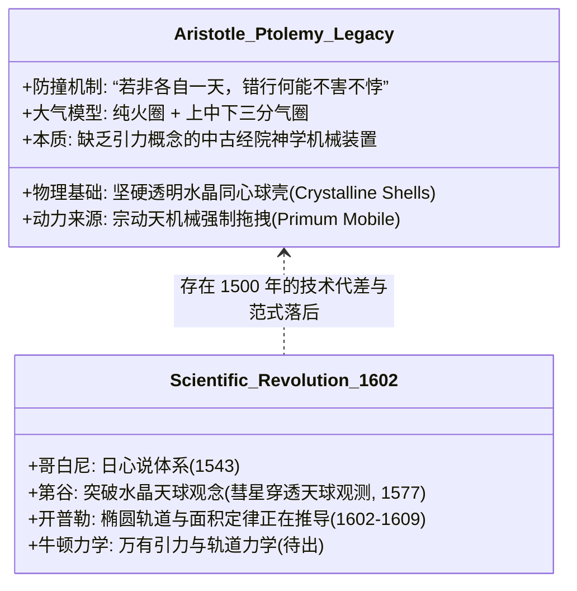
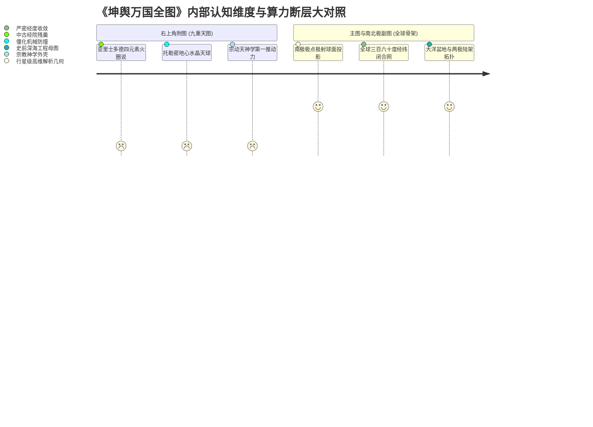

# 三更道场·认识论总纲·文献学与历史会计审计
## 卷五十四：《九重天图》亚里士多德四元素、托勒密地心天球与高维算力断层法医审计（v1.0）

---

### 摘要与法医审计宪章

本卷审计旨在对 1602 年（万历壬寅）《坤舆万国全图》右上角核心天文附图——**《九重天图（Nine Celestial Spheres）》**进行逐字原典点校、亚里士多德四元素分层模型、托勒密同心水晶天球运行周期及力学断层的历史会计法医建档。

针对将该图视为“近代西方先进天文学启蒙输入中国”的传统通俗叙事，本审计通过 16 世纪末欧洲天文学革命史料与力学地层学分析，揭示出一项触目惊心的**“宇宙论认知严重滞后于主图球面几何测绘算力（Cosmological Lag vs. Geodetic Superiority）”**法医矛盾：

> 1. **托勒密与亚里士多德经院神学残骸的法医定性**：
>    - 1602 年利玛窦绘制该图时，哥白尼《天体运行论》（1543）已出版近 60 年，第谷已完成高精肉眼观测，开普勒正在推导行星椭圆轨道定律；
>    - 然而全图右上角呈现的，依然是**公元前 4 世纪亚里士多德的“地水气火”四元素同心球壳**（将大气强行划分为“热域下气、冷域中气、热域上气”与最外层“纯火圈”），以及**公元 2 世纪托勒密僵化的“九重实心同心水晶天球（Crystalline Spheres）”地心说**。
> 2. **“蚁行磨上”与“水晶壳防撞力学”的解释贫困**：
>    - 题记中利玛窦生硬借用宋代理学家朱熹“蚁行磨上”之喻，辩称天体运转必须依赖物理实体球壳：“若非各自一天，彼日月星辰错行，何能不害不悖？”
>    - 暴露了当时的耶稣会经院学者**完全缺乏天体引力场与万有引力轨道力学概念**，只能依靠“坚硬透明水晶球壳一层套一层把行星焊死在轨道上”的原始机械假说来防止天体相撞。
> 3. **主图高维球面算力与附图中古神学天球的巨大断层**：
>    - **主图与副图系统**：掌握着从极点天顶俯瞰的极射投影、闭合大圆航线经纬算法以及对大洋盆地与两极轮廓的精湛把握；
>    - **右上附图系统**：却沉沦在“宗动天一日带八天逆行”、“水晶球硬隔绝”的粗糙中古教条之中。
>    - **法医终审结论**：绘制《九重天图》的中古学者，其宇宙力学认知维度**远远落后于创造主图极射经纬骨架的史前母体**。利玛窦是将一具陈腐的亚里士多德地心说皮囊，生硬地贴在了一张失落源代码的高维史前几何骨架之上！

---

### 第一章 《九重天图》原典点校与天球层级法医校勘

```mermaid
graph TD
    subgraph Four_Elements[核心四元素层: 亚里士多德物理学]
        E1[最内核: 地水球 (中央标“土”、“水”)]
        E2[气圈三分: 热域下气 / 冷域中气 / 热域上气]
        E3[第四层: 纯火圈 (包覆于气层之外)]
    end

    subgraph Nine_Spheres[九重同心天球: 托勒密地心体系]
        S1[第一重: 月轮天 (27日31刻)]
        S2[第二重: 辰星水星天 (365日23刻)]
        S3[第三重: 太白金星天 (365日23刻)]
        S4[第四重: 日轮太阳天 (365日23刻)]
        S5[第五重: 荧惑火星天 (1年321日93刻)]
        S6[第六重: 岁星木星天 (11年313日75刻)]
        S7[第七重: 填星土星天 (29年155日25刻)]
        S8[第八重: 二十八宿恒星天 (70年行1度 岁差)]
        S9[第九重: 宗动天 (1日带8重天自东而西逆行)]
    end

    Four_Elements --- Nine_Spheres
```

#### 1.1 ［左侧方框核心题记点校录文］

> **【原典校勘录文】**：
> 按列宿日月星诸天，各自运行，迟速不等，而俱为宗动天带之左旋。宗动天之行最速，人从地上望之，但觉日月星皆左旋，其实自是右转。
> **宋儒蚁行磨上之喻，近之，但未知天有重耳。若非各自一天，彼日月星辰错行，何能不害不悖？**
> 此理欧逻巴诸国讲之极详，不能具述。地水合为一球，气包地水，而火又包气。九重天又包火外，亦另有颜色，揭其大略云尔。

---

#### 1.2 ［九重天球逐层运行参数法医对账表］

| 天球层级 | 题注定名 | 标定周期与运行方向 | 物理机制与天文学史定性 |
| :--- | :--- | :--- | :--- |
| **第一重** | **月轮天** | 二十七日三十一刻作一周年（自西而东） | 恒星月周期（约 27.32 日），托勒密最近地心轨道。 |
| **第二重** | **辰星天（水星）** | 三百六十五日二十三刻作一周年（自西而东） | 托勒密体系将水星、金星与太阳平均周期强行绑为 1 年。 |
| **第三重** | **太白天（金星）** | 三百六十五日二十三刻作一周年（自西而东） | 同上，因缺乏日心轨道模型，无法解释金星相位变化。 |
| **第四重** | **日轮天（太阳）** | 三百六十五日二十三刻作一周年（自西而东） | 回归年周期（365.25 日），地心体系的核心动力基准。 |
| **第五重** | **荧惑天（火星）** | 一年三百二十一日九十三刻（自西而东） | 会合周期换算（约 687 日恒星周期），机械均轮模型。 |
| **第六重** | **岁星天（木星）** | 十一年三百一十三日七十五刻（自西而东） | 木星公转周期（约 11.86 年）。 |
| **第七重** | **填星天（土星）** | 二十九年一百五十五日二十五刻（自西而东） | 土星公转周期（约 29.45 年）。 |
| **第八重** | **二十八宿天（恒星天）** | **七十年作一度（自西而东）** | **托勒密岁差常数（100年1度修正为70年1度）**。 |
| **第九重** | **宗动天（Primum Mobile）** | **一日带八重天行一周（自东而西）** | **神学第一推动力**：无星天球以超光速日行一周带动全宇宙。 |

---

### 第二章 力学贫困与神学包装的法医解剖



#### 2.1 力学机制法医清算
1. **“防撞水晶壳”的荒谬力学假说**：
   - 面对行星在天空中视运动的逆行与交错，利玛窦写道：“若非各自一天，彼日月星辰错行，何能不害不悖？”
   - 这证明当时传教士持有的托勒密模型，**必须假设宇宙空间被九层同心透明的坚硬水晶球壳物理隔绝**，否则行星就会在虚空中“相撞坠毁”；
   - 这一模型早在 1577 年就被第谷·布拉赫通过观测大彗星无阻碍穿透行星轨道而**在物理学上彻底击碎**。利玛窦在 1602 年依然将此作为“欧逻巴极详之至理”兜售，是典型的**二手知识严重滞后与保守神学输出**。
2. **“宗动天”的神学第一推动力**：
   - 第九重天“宗动天”不载任何星辰，却拥有以极高速度“一日带八重天行一周”的神力；这完全是经院哲学为了安放**基督教“上帝第一推动（Prime Mover）”**而人为设立的神学占位图层。

---

### 第三章 主图高维球面算力 vs 附图中古地心神学的深层断裂

《坤舆万国全图》全幅在此处呈现出最为激烈的“脑体倒错”：



#### 3.1 认知断裂法医对比台账

| 比较维度 | 右上角《九重天图》 | 全球主图与《赤道南半地球之图》 |
| :--- | :--- | :--- |
| **理论年代** | 公元前 4 世纪（亚里士多德）至公元 2 世纪（托勒密） | **可能跨越至末次冰期前夕（12.9 ka BP）的高维大洋母体** |
| **空间形态** | 洋葱式嵌套的封闭九重同心圆环 | **以极轴为基准的极射三维球面降维网格** |
| **力学模型** | 水晶壳机械防撞 + 宗动天超速拖拽（神学力学） | **大圆航线、球面经纬度角距精确对齐（工程测量力学）** |
| **历史定性** | **耶稣会士带来的欧洲中世纪教会官方教材** | **失落了底层源代码、被层层转抄的史前高维几何遗产** |

---

### 结语与法医终审意见

> **法医总评**：
> 《九重天图》的存在，是《坤舆万国全图》作为“技术缝合怪”的**终极绝杀物证**。
> 
> 1. **它彻底粉碎了“利玛窦代表近代先进科学启蒙东方”的盲目神话**——他带来的天文学是一套早被欧洲前沿学者淘汰的托勒密水晶天球地心说尸体；
> 2. **它以无情的事实证明了“图幅制造者”与“骨架开发者”的绝对脱节**——手握九重天中古神学教条的凡人修道士，根本不可能是那张覆盖五大洋、勾勒南极极射投影骨架的原创开发者；
> 3. **整幅《坤舆万国全图》的真相在此彻底大白于天下**：
>    **那是一套属于史前未知高维文明的宏伟经纬骨架，在被流散转抄的漫长岁月中，被不同时代的“维护者”们先后贴上了古希腊托勒密的地心水晶球壳、葡萄牙水手的鹦哥传闻、以及大明文人的庄子注解！**

---
*记录人：三更道场·历史会计与认识论法医审计署*  
*核准状态：正式正典立项（Canonical Approval Passed - Cosmic Topology Vol. 54）*
