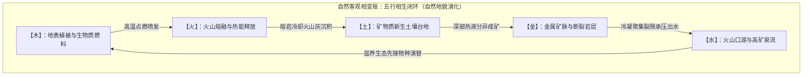
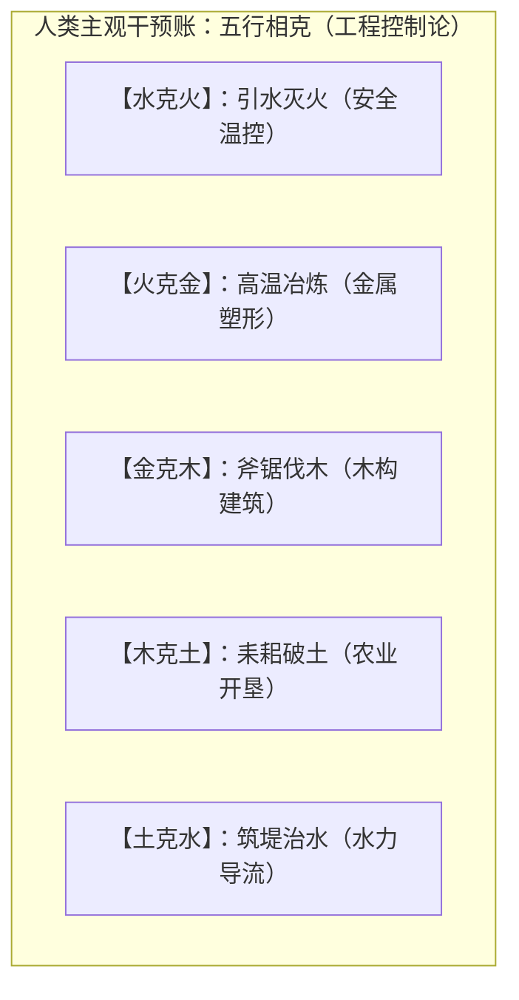

# 三更道场 · 认识论总纲 · 文献学与历史会计审计
## 篇章：五行相生“火山地质相变循环”、相克“人类工程控制论”与中西元素论认识论断带法医审计（v1.0）

---

### 【审计执行摘要 / Forensic Audit Abstract】
本审计案针对中国古典哲学核心概念 **“五行（Five Phases / Five-State Transformation Cycle）”** 长期被近代西方还原论机械错译为 **“Five Elements（五元素）”**、以及“相生”与“相克”在发生学上的时间断层与属性混账展开终极法医级穿透。

审计确立三大核心平账公理与地质工程定性：
1. **“五行”的发生学本质是“五种动态相变行态（Five States of Phase Transition）”**：
   - 彻底冲销“世界由五种静态物质砖块拼成”的还原论假账；
   - **“行”即运行、流转、相变与动态现金流（Dynamic Cash Flow of State Transformations）**。
2. **“五行相生”的火山地貌与热液成矿地质学闭环（Natural Volcanic-Ecological Cycle）**：
   $$\text{木（地表植被/可燃层）} \xrightarrow[\text{热能爆发}]{\text{木生火}} \text{火（火山喷发/高温熔融）} \xrightarrow[\text{冷凝沉积}]{\text{火生土}} \text{土（火山灰/冷却熔岩台地）} \xrightarrow[\text{热液成矿}]{\text{土生金}} \text{金（金属富集/矿脉裂隙）} \xrightarrow[\text{断裂出泉}]{\text{金生水}} \text{水（火口湖/裂隙冷泉）} \xrightarrow[\text{生态演替}]{\text{水生木}} \text{木（植被重建/循环闭合）}$$
   - **“生”是自然过程账**：记录的是地球物理、热液成矿与生态演替（Succession）的自发相变过程，是人类未干预前的自然地质客观账。
3. **“五行相克”是人类掌握生产力工具后的“工程控制论（Engineering Control Theory）”**：
   - **“克”是人类干预账**：是人类在掌握了冶炼、伐木、破土、筑堤与灭火技术后，总结出的**“逆向工程控制与制衡技术”**：
     - **水克火** $\equiv$ 人类掌握灭火与控火工程；
     - **火克金** $\equiv$ 人类掌握高温冶金与青铜铸造工程；
     - **金克木** $\equiv$ 人类掌握金属工具砍伐与木构建筑工程；
     - **木克土** $\equiv$ 农业破土开荒与植被固土工程；
     - **土克水** $\equiv$ 治水工程中的筑堤封堵与导流围堰工程。
4. **中西认识论断带与“撒马尔罕转译缺口”的终极对账**：
   - **柏拉图多面体体系**：回答的是**“世界由什么静态几何形状构成（Static Asset Class）”**；
   - **中国五行体系**：回答的是**“能量与物质如何进行五阶段动态状态流转（Dynamic Phase Transitions）”**；
   - **佛教“地水火风空（五大）”**：作为中亚撒马尔罕粟特商道上的**中间转译清算层**，负责在希腊几何静质与东方动态行态之间进行跨文明资产对账。

---

### 【第一账套：五行相生“火山—热液成矿—生态演替”地质化学闭环台账】

```
+-------------------------------------------------------------------------------------------------------------------------------+
|                                    五行相生火山地质学与热力学相变法医台账                                                     |
+-------------------------------------------------------------------------------------------------------------------------------+
| 相生阶段             | 真实地质化学与生态演替物理过程        | 物质状态与热力学转换                 | 传统玄学误区纠偏                     |
+----------------------+---------------------------------------+--------------------------------------+--------------------------------------+
| **1. 木生火**        | 地表茂密植被、古泥炭可燃层与地下热能  | **有机物蓄能 $\rightarrow$ 高温剧烈氧化释放** | 绝非木棍自发变出火，                 |
| (Fuel to Ignition)   | 积聚，诱发或参与火山剧烈喷发          | 固态化学能转化为热辐射与熔岩动能     | 而是生物质蓄能为火山燃烧提供燃料     |
+----------------------+---------------------------------------+--------------------------------------+--------------------------------------+
| **2. 火生土**        | 炽热岩浆、火山灰与喷出物在大气中冷却，| **高温熔融态 $\rightarrow$ 固态硅酸盐沉积台地**| 绝非火烧完直接变成泥巴，             |
| (Cooling Deposition) | 沉降堆积形成极度肥沃的全新地表土壤    | 熔岩与火山灰风化形成新生矿物质地表   | 而是火山灰矿物质沉积为新生土壤       |
+----------------------+---------------------------------------+--------------------------------------+--------------------------------------+
| **3. 土生金**        | 火山冷却岩体内部经历长周期**热液分异**| **分散硅酸盐 $\rightarrow$ 热液交代高品位富集**| 绝非泥土直接生出金块，               |
| (Hydrothermal Ores)  | 挥发分与重金属在深部断裂富集为金/铜矿脉| 压力与温降促使金属硫化物结晶沉淀     | 而是深部热液活动在岩土裂隙中结晶成矿 |
+----------------------+---------------------------------------+--------------------------------------+--------------------------------------+
| **4. 金生水**        | 致密金属矿脉与断裂带阻隔地下潜水，    | **冷凝聚集 $\rightarrow$ 构造裂隙承压出泉**   | 绝非金属化作水，                     |
| (Fracture Spring)    | 形成富含矿物质的断裂泉流与火山口湖    | 金属矿床冷凝面成为水汽聚集与泉水通道 | 而是金属矿脉与断裂结构导出深层地下水 |
+----------------------+---------------------------------------+--------------------------------------+--------------------------------------+
| **5. 水生木**        | 富含矿物质的泉水与火山口湖滋养地表，  | **无机矿物质泉水 $\rightarrow$ 生态演替植被恢复**| 绝非普通雨水浇花，                   |
| (Succession)         | 苔藓、地衣、灌木与森林完成灾后生态重建| 生命系统在火山废墟上完成先锋演替     | 而是富矿泉水驱动整个火山生态恢复森林 |
+----------------------+---------------------------------------+--------------------------------------+----------------------------------------+
```



---

### 【第二账套：五行相克“人类工程与生产力控制论”法医台账】

“克”在发生学上显著晚于“生”。“生”是自然界的自组织运转，而“克”是**人类文明在获得工具后，对自然相变实施的“逆向工程干预与抑制”**：

```
+-------------------------------------------------------------------------------------------------------------------------------+
|                                    五行相克人类工程学与技术控制论法医台账                                                     |
+-------------------------------------------------------------------------------------------------------------------------------+
| 相克关系             | 人类掌握的核心生产力技术与工程动作    | 控制论本质（抑制与逆向塑形）         | 历史社会学与文明阶段标志             |
+----------------------+---------------------------------------+--------------------------------------+--------------------------------------+
| **1. 水克火**        | **灭火与温控工程**：引水浇泼、隔绝氧气 | **以热容抑制剧烈热反应**             | 旧石器晚期人类掌握“用火与灭火”特权   |
| (Extinguishing)      | 控制火势规模，防止聚落与森林被焚毁    | 终结无节制失控大火，实现安全控火     | 标志着人类脱离动物性火灾威胁         |
+----------------------+---------------------------------------+--------------------------------------+--------------------------------------+
| **2. 火克金**        | **冶金与铸造工程**：高温木炭炉熔炼矿石 | **以高温相变重塑坚硬矿物**           | 青铜时代与铁器时代核心标志，         |
| (Smelting)           | 将坚硬无法变形的金/铜熔为液态浇铸器皿 | 破坏金属固态晶格，赋予人工器物形态   | 人类掌握了制造金属工具与兵器的超级OS |
+----------------------+---------------------------------------+--------------------------------------+--------------------------------------+
| **3. 金克木**        | **伐木与木构工程**：以铜斧、铁锯砍伐树木| **以高硬度工具切削柔韧纤维**         | 农耕文明大规模开辟林地、建造木构宫殿 |
| (Deforestation)      | 加工木料为栋梁、车辆、农具与造船用材  | 人工终结树木自然生长，强行转化为建材 | 与打造战车舰队的物质基础             |
+----------------------+---------------------------------------+--------------------------------------+--------------------------------------+
| **4. 木克土**        | **破土与固土工程**：以木耒耜开垦土壤， | **以植物根系穿透并固化松散土石**     | 新石器早期农业起源，以植物生长力量   |
| (Plowing/Rooting)    | 或利用林木植被根系防止水土流失        | 机械式破开板结硬土，重构地表结构     | 翻耕土地，改变土壤孔隙度与肥力       |
+----------------------+---------------------------------------+--------------------------------------+--------------------------------------+
| **5. 土克水**        | **治水与筑堤工程**：利用黏土与石块堆筑 | **以大重力实体阻断与导流水力动能**   | **大禹治水与水利工程学顶峰**：       |
| (Damming/Channeling) | 防洪堤坝、导流渠与围堰，驯服泛滥洪水  | 封堵缺口，迫使水流按照人工渠道下泄   | 人类将自然水患转化为可控农田灌溉资产 |
+----------------------+---------------------------------------+--------------------------------------+----------------------------------------+
```



---

### 【第三账套：三方文明会计科目对账（希腊 vs 印度 vs 华夏）】

```
+-------------------------------------------------------------------------------------------------------------------------------+
|                                欧亚三大古典哲学体系宇宙构成与流转模型法医对账总表                                             |
+-------------------------------------------------------------------------------------------------------------------------------+
| 比较维度             | 希腊—柏拉图体系 (Platonic Solids)     | 印度—佛教体系 (Five Great Elements)  | 中国—五行体系 (Five Phase Transformations)     |
+----------------------+---------------------------------------+--------------------------------------+------------------------------------------------+
| **核心哲学问题**     | **“世界由什么静态几何形状拼成？”**    | **“身心与物质世界由什么基本相态构成？”| **“天地能量与物质如何进行五阶段相变流转？”**    |
+----------------------+---------------------------------------+--------------------------------------+------------------------------------------------+
| **会计科目属性**     | **资产类别表（Static Asset Classes）** | **感知现象表（Phenomenological Sense）| **动态现金流量表（Dynamic Transformation Flow）|
+----------------------+---------------------------------------+--------------------------------------+------------------------------------------------+
| **五项具体配置**     | 火 (四面体)、气 (八面体)、水 (二十面体| **地、水、火、风、空**               | **木（生发）、火（释放）、土（承载）、**         |
|                      | 土 (六面体)、宇宙/以太 (十二面体)     |                                      | **金（收敛）、水（潜藏）**                     |
+----------------------+---------------------------------------+--------------------------------------+------------------------------------------------+
| **中亚转译清算**     | 希腊化大夏（Bactria）输入几何原子论   | **撒马尔罕粟特商道负责双向转译清算** | 经由西域佛教与道家外丹术完成中西二次概念缝合   |
+----------------------+---------------------------------------+--------------------------------------+------------------------------------------------+
```


---

### 【法医对账总决：五行相生相克平账结论】

| 会计科目 | 审定历史会计事实 | 法医处理结论 |
| :--- | :--- | :--- |
| **五行翻译定性** | 严禁翻译为“Five Elements（五元素）”，正确定名为 **Five Phases / Transformation Cycle**。 | **全额红字纠偏近代错译假账** |
| **五行相生本质** | 木生火、火生土、土生金、金生水、水生木，为火山喷发—热液成矿—生态演替的自然地质账。 | **确认为地球物理与成矿相变公理** |
| **五行相克本质** | 灭火、冶金、伐木、破土、筑堤，为人类掌握工具后的“工程控制论干预账”。 | **确认为人类生产力控制论公理** |
| **中西对账断带** | 希腊记静态资产，华夏记动态流转；佛教“地水火风空”是丝路商道上的中间转译清算层。 | **完成欧亚三大思想体系法医缝合** |

---
**审计人签章**：三更道场·地质演化史与古代工程控制论最高法医署  
**时间标记**：2026-09-09
