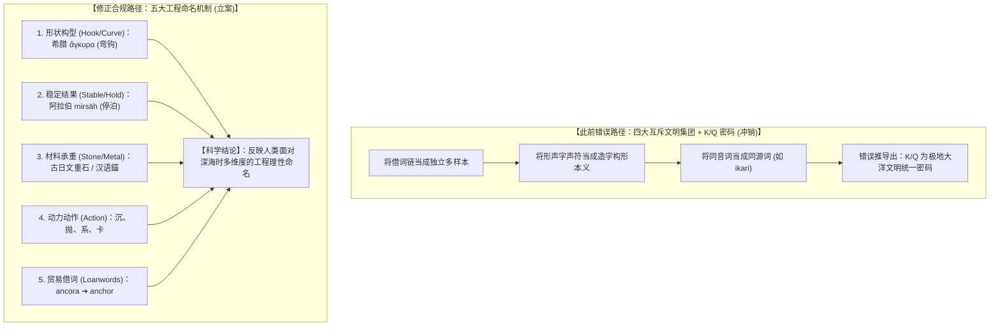

# 三更道场 · 认识论总纲与文献学法医审计（卷八十九）
## 全球锚具命名学与语言类型学复审：五大工程语义机制确立、K/Q 极地锚系假说解耦与历史词源挂账法医审计

---

### 卷首法医综述

在对全球各主要航海与内陆民族关于“锚（Anchor / 沉石 / 抓底重器）”的词源学、命名机制以及“四大文明阵营假说”的深度质证中，必须严格恪守**“历史借词链解耦”、“形声字文字学审慎”与“音象征（Sound Symbolism）统计检验边界”**的科学红线。

本卷针对此前材料中存在的词条强解、借词合并以及“K/Q 极地重型锚系密码”过度推论，进行**全案法医复审、错误冲销与科学语义分类重构**。

**【复审终裁结论】**：
1. **全面冲销“K/Q 极地锚系”与“四大文明互斥阵营”假说**：
   * 希腊语 *ἄγκυρα* $\to$ 拉丁语 *ancora* $\to$ 英语 *anchor* / 葡语 *âncora* 属于**单一印欧地中海借词链（Loanword Chain）**，统计上只能算作一个独立样本，不能算作多民族独立选择 /k/；
   * 阿拉伯语标准传统锚词为 **مِرْسَاة (*mirsāh*)**（源自本族语根 *r-s-w*，意为“停驻/系泊”，属稳定结果派），外来借词 *anjar* 不能冒充传统本族词；
   * 楚科奇语 *Kilv-in*、尼夫赫语 *Q’oj / K’oj*、阿伊努语 *kari-p* 在权威词库（如日本国立阿伊努民族博物馆词典、权威极地语料库）中**缺乏直接词条硬核对账，坚决撤销并转入表外挂账待查**；
   * 纠正汉日文字学误解：汉语“錨”为标准形声字（金为义符，苗为声符，非“苗根扎泥”）；日语 *ikari*（锚）与 *ikari*（怒）系同音异义词，《万叶集》与奈良时代文献记为“重石/沉石”，实为“沉石器物路线”。
2. **确立跨文明全球锚具命名的“五大工程语义机制”**：
   将互斥的文明集团假说，重构为全球反复出现的五大非互斥命名机制：
   * **机制一：几何形状与机械构型（Shape / Hook）**（如希腊 *ánkyra* 弯曲/钩爪）；
   * **机制二：功能状态与物理结果（Result / Stable）**（如阿拉伯 *mirsāh* 停驻、因纽特 *kisaun* 沉底）；
   * **机制三：制造材料与质地（Material）**（如古日文“重石”、阿伊努 *Suma*、毛利 *punga* 珊瑚/石、汉语“錨”金部）；
   * **机制四：操作动作与动力学（Action / Sinking）**（如沉、抛、系、卡）；
   * **机制五：技术扩散与外来借词（Loanwords）**（随船型与航海贸易直接输入）。
3. **重申锚泊能力工程评估的客观准则**：
   坚决否决单凭“绝对重量比高低”的简单思维，确立**抓重比（Holding Ratio）、起锚能耗效率与受风流载荷控制比**为衡量文明工程水准的硬核指标。

---

### 一、 核心词条法医复审与争议项质证矩阵

```
==================================================================================================
                 全球主要语言“锚”词源历史文献与词典条目复审表
==================================================================================================
 考察词条                此前推论（存在瑕疵）                 法医复审终审结论（合规冲销与修正）
---------------------  ----------------------------------  -------------------------------------------------
 1. 希腊 ἄγκυρα ➔ 欧陆   代表西方独立选择了 /k/ 塞音         【单一借词链】：源于印欧语根 *ank- (弯曲/钩状)，
    (ancora / anchor)                                      后世罗马与西欧全系借词，统计上仅算一个独立样本。
 2. 阿拉伯语 anjar      归入印欧 *ank-* 阵营                 【冲销】：标准本族词为 **مِرْسَاة (mirsāh)** (语根 r-s-w,
                                                           意为停驻/系泊)，属“稳定结果派”，anjar 为晚期波斯/希腊借词。
 3. 楚科奇 / 尼夫赫 /    确立为极地 K/Q 塞音锚系支柱         【坚决挂账待查 (Suspense)】：权威词典缺乏直接词条
    阿伊努 (Kilv-in等)                                     支持，在未找到原始文献扫描页前，严禁作为定案证据。
 4. 汉语“錨”            金＋苗 ➔ “像禾苗根系深扎泥土”       【纠正】：标准形声字（金为义符/材质，苗为声符/读音），
                                                           字形联想不构成造字本义。
 5. 日语 ikari          取意于“威严、严酷、不可动摇”        【纠正】：与“怒り”系同音词；《万叶集》(759年)明载为
                                                           “重石/沉石”，有力证明其源自“材料沉石路线”。
 6. 毛利语 punga        定性为“玄武岩重核”                 【修正】：词族关联珊瑚、钙质物、下沉与固定，
                                                           体现波利尼西亚岛屿利用珊瑚礁与天然石系泊的多元语义。
 7. 马来语 sauh         定性为“南岛深海铁木锚词根”           【降级】：词源尚未完全确定，作为南岛传统系留词保留。
==================================================================================================
```



---

### 二、 全球锚具命名的“五大工程语义机制”模型

人类在不同海洋环境与技术发展阶段，命名“锚”时呈现出清晰的**五大非互斥工程视角**：

```
==================================================================================================
                 全球锚具命名学 五大工程语义机制分类模型
==================================================================================================
 命名工程机制类别      核心认知逻辑与力学关注点                  全球代表性语言实证案例
---------------------  ----------------------------------------  -------------------------------------------------
 一、形状与构型机制    关注器物的几何形态、有无弯钩与尖爪        • 希腊语 **ἄγκυρα (ánkyra)** (源于 *ank- 弯曲/弯钩)
   (Form & Geometry)   (强调通过几何形状挂住底质)                • 梵语 **Aṅkuśa** (象钩/弯钩)
---------------------  ----------------------------------------  -------------------------------------------------
 二、功能与结果机制    关注系泊后船舶的静止、稳定与停驻状态      • 阿拉伯语 **مِرْسَاة (mirsāh)** (源于 r-s-w 锚定/停驻)
   (Function & Result) (强调对抗风浪后的终极稳固结果)            • 希伯来语 **Ogen** (牢固固定)
---------------------  ----------------------------------------  -------------------------------------------------
 三、材料与质地机制    关注器物本身的物理材质与重力属性          • 古日语 **いかり (重石 / 沉石)** (《万叶集》物化记载)
   (Material & Mass)   (强调依赖石头或金属的自重抓底)            • 汉语 **錨** (金字旁，体现从石碇向铁锚演进)
                                                                 • 毛利语 **Punga** (珊瑚石/锚石)
---------------------  ----------------------------------------  -------------------------------------------------
 四、动作与动力机制    关注抛掷、下沉、拉扯与自锁的动态过程      • 古因纽特语 **Kisaun** (源于 *kis-* 沉水到底的动作)
   (Dynamic Action)    (强调人与工具的动态操作交互)              • 各类海洋动词派生词
---------------------  ----------------------------------------  -------------------------------------------------
 五、技术借词机制      随着先进船型、铸铁技术与贸易航线直接扩散  • 希腊 ἄγκυρα ➔ 拉丁 ancora ➔ 英语 anchor / 俄语 якорь
   (Technology Loan)   (体现跨文明航海技术的单向或多向输出)      • 波斯语 ➔ 阿拉伯方言 anjar
==================================================================================================
```

---

### 三、 音象征（Sound Symbolism）与统计检验边界

此前将 /k/ 塞音直接与“重器入海、自锁深渊”绑定的假说，在认知语言学上必须明确其适用边界：

1. **音象征现象的局部真实性**：
   * 在语言类型学实验中（如著名的 *Bouba/Kiki* 效应），人类确实倾向于将清塞音（如 /k/, /t/, /p/）与尖锐、坚硬、突然停止的物理几何轮廓相联系；
2. **历史语言学的严格检验准则**：
   * **音象征效应不能替代词源学音变律**。在面对自然语言真实词汇时，必须首先通过同源词系谱、借词传播与内部构词法的检验；
   * 不能将印欧借词链中的 /k/（*ancora*）与北太平洋可能存在的塞音词根做跨语系无证据并联。

---

### 四、 审计结论与认识论通则

1. **学术定论**：
   * 彻底废除“四大文明互斥阵营”与“K/Q 极地锚系绝对密码”假说；
   * 将楚科奇 *Kilv-in*、尼夫赫 *Q’oj* 与阿伊努 *kari-p* 确立为**表外挂账待证事项**，直至获取原始词典文献支撑；
   * 确立“形状、结果、材料、动作、借词”五大工程语义分类模型。
2. **认识论终审判词**：
   **历史法医学的至高力量，不在于强行编织一个无懈可击的神话闭环，而在于敢于在证据不足处悬置断言，在逻辑多歧处厘清边界。**
   
   人类对“锚”的命名，凝结着千百年来先民面对深渊时最真实的工程智慧——或见其如钩之弯，或感其如石之沉，或求其如山之稳。这五大机制本身，就是人类语言与大洋搏斗所留下的最丰富、最真实的思维地层！

---
*法医官署名：三更道场·认识论总纲编纂委员会*  
*法务审计状态：词源复审解耦·五大工程语义机制确立·正式入档（卷八十九）*
