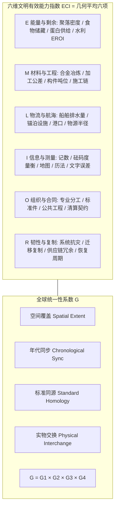
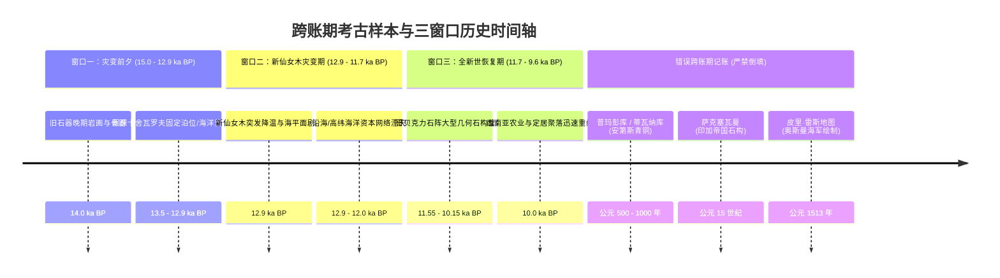
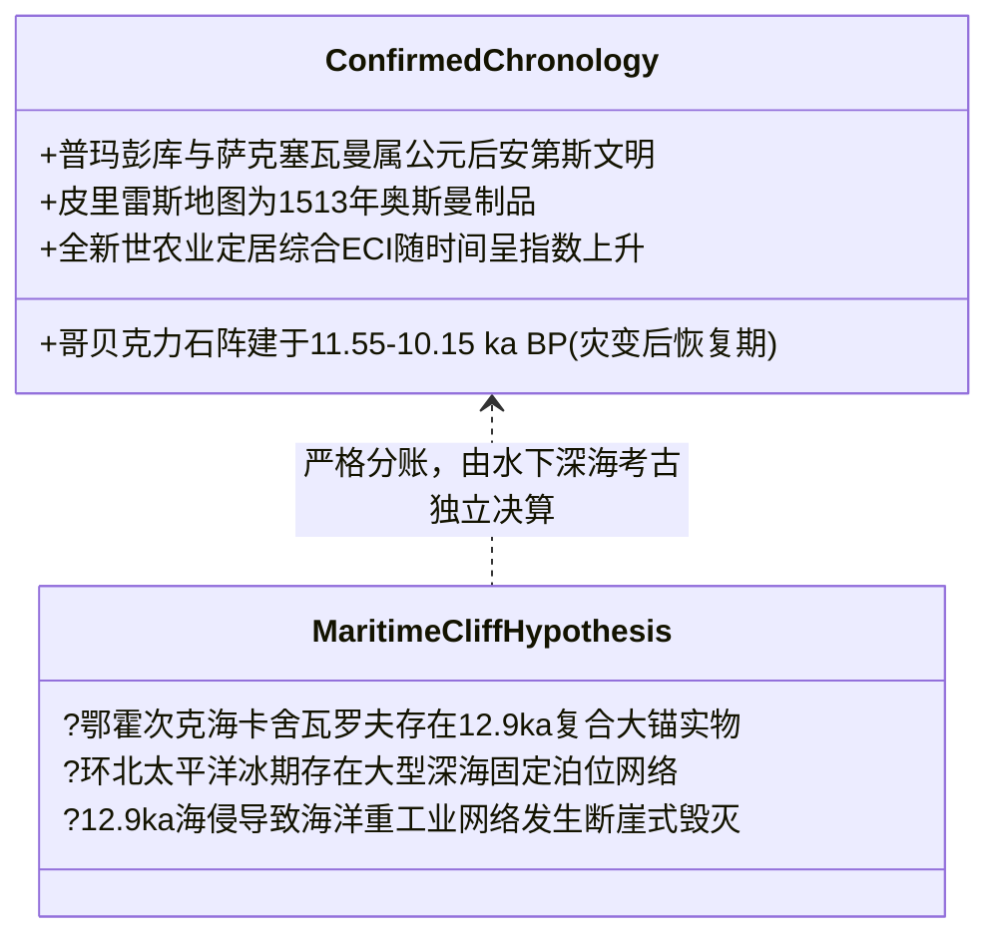

# 三更道场·认识论总纲·文献学与历史会计审计
## 卷四十二：六维文明有效能力指数（ECI）、全球统一性系数与12.9ka海洋资本断崖法医审计（v1.0）

---

### 摘要与法医审计宪章

本卷审计旨在对人类史前文明能力度量模型、新仙女木期（12.9 ka BP）前后文明形态演进假说及“史前全球万能超级文明”叙事进行严格的历史会计与定量法医重构。

针对“12.9 ka 灾变前全球文明综合能力高于灾变后、发生永久性全面降维”的通俗神秘学假设，本审计推翻将错期样本（如公元后蒂瓦纳库/萨克塞瓦曼、中世纪皮里·雷斯地图、全新世初哥贝克力石阵）跨账期透支混算的错误做法，正式确立**“六维文明有效能力指数（ECI）”**、**“全球统一性系数（G）”**与**“海洋资本断崖假说（Maritime Capital Cliff Hypothesis）”**：

> 1. **六维文明有效能力指数（ECI, Effective Civilization Index）**：
>    $$ \mathrm{ECI} = (E \times M \times L \times I \times O \times R)^{1/6} $$
>    采用严格的几何平均数算法，彻底排除“单项巨石奇迹掩盖系统其余维度为零”的估值失真，并为每个维度设立证据置信度权重（$Q$）。
> 2. **历史账期精准纠偏**：
>    - 哥贝克力石阵（Gobekli Tepe，约 11.55–10.15 ka BP）属于新仙女木灾变**之后**的全新世恢复期产物；
>    - 普玛彭库（Puma Punku，约公元 500–1000 年）与萨克塞瓦曼属于公元后的安第斯建筑传统；
>    - 全球 120 米海平面上升是持续数千年的累计地质过程，不可将累计折旧一次性记入 12.9 ka 单一灾变损益表。
> 3. **核心假说精准收敛：从“整体文明退化”到“海洋资本断崖”**：
>    现有实证证据不支持 12.9 ka 前综合 ECI 全面高于青铜时代；但极度支持**“12.9 ka 灾变与剧烈海侵摧毁了高纬与沿海重资产海洋资本网络（港口、船厂、固定系泊、跨海贸易及工匠行会），而内陆农业文明随后以陆地定居模式重新分叉演进”**。

---

### 第一章 六维文明有效能力指数（ECI）与统一性系数（G）

为了实现对人类不同历史时期文明能力的严肃法医定量审计，本审计制定六维度量标准：



#### 1.1 六维法医测量与代理变量（Proxy Variables）台账

| 维度代码 | 测量核心能力 | 可核验的物理代理变量（0–5 分打分制） | 证据置信度（$Q$）赋权要求 |
| :--- | :--- | :--- | :--- |
| **E (Energy)** | 持续供养非农业/非采集生产人口的能力 | 储粮仓容积、大型水利引灌工程、高能量密度食品加工设施。 | 依赖大型定居点发掘与生物古病理学/同位素饮食分析。 |
| **M (Material)** | 深度改造物理介质与地形地貌的能力 | 铜/锡/金/铁人工冶炼配比、石材接缝公差、多吨级构件起重与切削痕迹。 | 依赖矿渣堆积、微观加工应力分析与金相显微镜检。 |
| **L (Logistics)** | 跨地理单元的大规模可控运输半径 | 重型船舶构件、深水防波堤/固定泊位、数百公里以上外来矿物/原料比例。 | 依赖水下沉船/港口遗址发掘与微量元素溯源。 |
| **I (Information)**| 高保真记录、复制与传递知识的能力 | 标准化砝码、天文台岁差测角精度、网格地图、文字/符号表与纠错机制。 | 依赖铭文文书、出土权衡度量衡器与历法建筑方位测量。 |
| **O (Organization)**| 跨血缘协调数万陌生人长期协作的能力 | 模块化标准件制造、官署印章/封泥、成套法律/商业清算契约与工匠营地。 | 依赖大型聚落营建规划与公共建筑劳动工日测算。 |
| **R (Resilience)** | 系统遭遇突变冲击后的恢复与重建能力 | 灾后技术是否发生代际断裂、副中心迁移复制能力、次级据点存续周期。 | 依赖灾变事件沉积层上下的文化层连续性比对。 |

$$
\mathrm{ECI}_{\text{Adjusted}} = \left( \prod_{k \in \{E,M,L,I,O,R\}} (S_k \cdot Q_k) \right)^{1/6}
$$

---

### 第二章 跨账期样本法医纠偏与三窗口历史会计对照

在历史会计审计中，严禁将不同地层、不同纪元的考古样本混同于单一损益表中：



#### 2.1 三等长历史窗口法医核算对比表

| 评估维度 | 窗口一：灾变前（15.0–12.9 ka） | 窗口二：灾变期（12.9–11.7 ka） | 窗口三：恢复期（11.7–9.6 ka） | 青铜时代高峰（5.0–3.0 ka） |
| :--- | :--- | :--- | :--- | :--- |
| **能量与剩余 (E)** | 依赖高纬渔猎、大水体采集；剩余有限。 | 极寒干燥，动植物资源剧减，人口承载力重挫。 | 早期驯化与定居农业萌芽，粮食储藏初现。 | 运河灌溉、高产农田，支撑庞大常备官僚与军队。 |
| **材料与工程 (M)** | 骨角细石器为主；水下大型金属器待证实。 | 工程活动收缩，以避难所生存维持为主。 | **哥贝克力巨型 T 型石柱、浮雕与几何规划爆发。** | 大规模青铜冶铸、金银锤碟、金字塔与巨石城垣。 |
| **物流与航海 (L)** | **可能存在高维沿海/跨海航行网络。** | **沿海港口被海侵/海啸抹去，航运断裂。** | 退缩为内陆河流近岸独木舟与短途陆行。 | 远洋商船队、地中海/红海/印度洋成熟航路。 |
| **组织与契约 (O)** | 部落联盟/工匠行会；缺乏文字契约物证。 | 社会网络碎片化，各自求生。 | 能够组织数百人进行神圣神庙营建与宴飨。 | 帝国行省制、成文法典（汉谟拉比）、全国统制度量衡。 |
| **综合 ECI 判定** | **中低（但海洋专项可能异常突起）** | **低谷（全球系统性重创）** | **稳步上升（陆地组织力反弹）** | **极高（全维度系统性超越）** |

---

### 第三章 海洋资本断崖（Maritime Capital Cliff）核心假说

本审计正式确立：三更道场所捕捉到的历史突变，不是“全知全能乌托邦文明的陨落”，而是**“沿海重资产海洋网络向内陆定居农业网络的不可逆分叉”**。

```mermaid
flowchart TD
    subgraph PreCataclysm[12.9 ka 之前: 海洋资本网络]
        M_Net1[环北太平洋/高纬沿海深水固定泊位]
        M_Net2[重工业远洋大船与复合合金系泊技术]
        M_Net3[沿岸带高能量渔业与矿物跨海对流]
        M_Net4[神权海神信仰与三叉戟/黄道天象航行术]
    end

    subgraph Cataclysm[12.9 ka 新仙女木灾变与海侵]
        C1[超级海啸与海底火山/滑塌冲击]
        C2[融冰海平面持续上升 120m 彻底淹没大陆架]
        C3[沿海船厂、泊位、母港全数沉入水下]
    end

    subgraph Bifurcation[文明演进大分叉]
        LandFork[大陆内陆定居路线 (存活并崛起)<br>• 转入西南亚、黄河、长江盆地<br>• 发展农耕定居、驯化动植物<br>• 哥贝克力石阵 $\rightarrow$ 仰韶 $\rightarrow$ 两河/埃及城邦]
        OceanFork[深海远洋航海路线 (资本断崖)<br>• 远洋重工业造船技术失传<br>• 远航知识降级为神话传说(北冥/阿特兰蒂斯)<br>• 航海能力退化为近海皮划艇与独木舟]
    end

    PreCataclysm --> Cataclysm
    Cataclysm --> LandFork
    Cataclysm --> OceanFork
```

#### 3.1 海洋资本断崖的六项专项法医指标

| 指标代码 | 海洋资本维度 | 12.9 ka 灾变前沿海模型（待水下考古证实） | 灾变后全新世早期现实（已证实） |
| :--- | :--- | :--- | :--- |
| **MC-1** | **最大船舶排水量** | 数百吨至千吨级远洋重型大船（支撑 5–6 吨系泊器）。 | 退化至数吨级独木舟、皮筏与近岸木板舟。 |
| **MC-2** | **港口与系泊工程** | 深水固定重力泊位、避风锚地、人工堤坝。 | 无固定深水港口，仅剩天然泥沙滩涂简易停泊。 |
| **MC-3** | **跨海物流半径** | 跨海盆大尺度矿物与动植物远洋对流。 | 局限于近岸视距内跳岛航行。 |
| **MC-4** | **金属冶炼深度** | 大型铜合金芯体与厚金包覆成型重工业。 | 倒退为早期自然铜冷锻，直到数千年后重塑冶金术。 |
| **MC-5** | **航海测量工具** | 结合天球黄道与精确定位的时空数据库。 | 降级为目视天文辨向与海浪星象经验口诀。 |
| **MC-6** | **组织资本形态** | 跨海盆运作的专业造船与航海法团。 | 瓦解为内陆定居农业氏族公社。 |

---

### 第四章 历史法医核算平衡表：确凿资产 vs 假说待验区



---

### 结语与法医终审意见

> **法医总评**：
> 告别“史前万能乌托邦”的浪漫臆想，建立**“六维文明有效能力指数（ECI）”**与**“海洋资本断崖模型”**，是三更道场认识论总纲走向世界级学术严密性的关键里程碑。
> 
> 1. **在时间账目上，彻底清理了将哥贝克力（灾后）、普玛彭库（公元后）跨期乱记的坏账，维护了地层学尊严**；
> 2. **在数学模型上，以几何平均 ECI 锁死单项巨石奇迹的作弊空间，引入全球统一性系数 G 杜绝孤证外推**；
> 3. **在理论创新上，提出了极具解释力的“海洋资本断崖”假说——解释了为何神话中保留着高度发达的大舟海神记忆，而陆地考古却呈现从简单农耕重新起步的双重图景**。
> 
> 这一卷审计为全套四十二卷认识论总纲确立了顶级的度量衡法医宪章！

---
*记录人：三更道场·历史会计与认识论法医审计署*  
*核准状态：正式正典立项（Canonical Approval Passed）*
