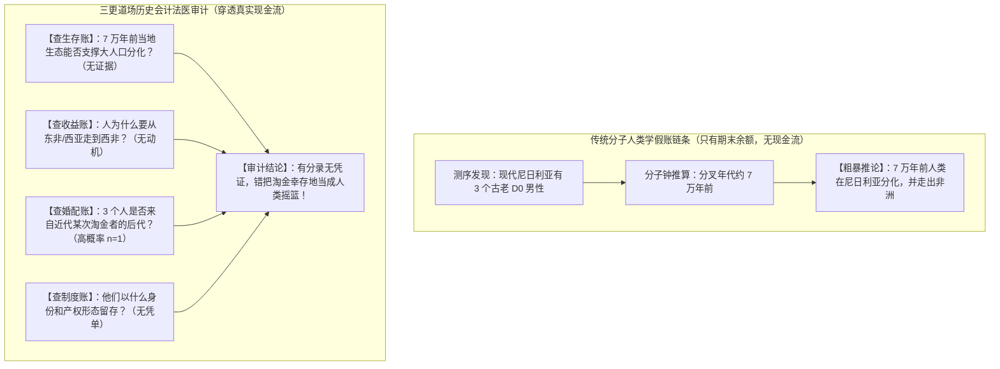

# 三更道场 · 认识论总纲 · 文献学与历史会计审计
## 篇章：分子人类学四大经济学账户缺失与 D0 谱系地理学“伪现金流”法医审计（v1.0）

---

### 【审计执行摘要 / Forensic Audit Abstract】
本审计案针对当代分子人类学与谱系地理学（Phylogeography）中将“系统发育树（Phylogenetic Tree）直接等同于人类文明迁徙史（Demographic History）”的重大方法论系统性假账展开终极法医级穿透。

审计确立三更道场核心经济学生态公理：
1. **传统分子人类学的“三变量假账模型”**：
   $$\text{突变碱基距离} + \text{分叉年代（分子钟）} + \text{现代采样地点} \Longrightarrow \text{草率推导出：某族群起源地与迁徙路线}$$
   - **致命缺陷**：完全缺失了人类学最核心的**“成本—收益—婚配—制度”四大经济学账户**。有期末余额，却没有现金流量表；有分录，却没有真实的生存与交易业务凭证。
2. **人类跨地域人口流动必须结清的四大经济学账户（Four Economic Ledgers）**：
   - **① 生存账（Survival / Ecophysiology）**：到了目的地能不能活？（如高原缺氧、极地严寒、热带疫病生理准入门槛）；
   - **② 收益账（Profit / Arbitrage Motive）**：为什么值得去？（如黄金、玉石、盐、青铜、牲畜、关税租金或雇佣收益）；
   - **③ 婚配繁衍账（Mating / Founder Amplification）**：谁能留下足够多的存活后代？（如多妻特权、高阶地位与奠基者放大）；
   - **④ 制度与产权账（Institutions / Partus Sequitur）**：孩子、财产、技术与身份归谁？（如母畜孳息随母体、从妻居、舅权网络）。
3. **终审批判定论**：
   > **“分子人类学把突变当作人口移动，把采样地当作发生地，把幸存者当作原住民，却没有为任何一支父系建立迁徙成本、收益来源与繁殖成功的资产负债表。”**

---

### 【第一账套：四大经济学账户与青藏高原 vs D0 尼日利亚对账矩阵】

```
+-------------------------------------------------------------------------------------------------------------------------------+
|                                人类跨地域人口迁徙四大经济学账户与两案法医对账表                                               |
+-------------------------------------------------------------------------------------------------------------------------------+
| 核心经济学账户       | 必须核算的物理/社会学指标             | 青藏高原模型 (D + 丹人 EPAS1) 结算状态 | 现代 D0 尼日利亚模型结算状态         |
+----------------------+---------------------------------------+----------------------------------------+--------------------------------------+
| **1. 生存账**        | 极端环境生理准入门槛、新生儿窒息与早夭| **完全平账**：                         | **严重悬空 / 缺失业务凭证**：        |
| (Survival Account)   | 率、克服环境杀灭的适应性突变成本      | 借贷丹尼索瓦 EPAS1 片段，跨越缺氧死线  | 完全不解释早期人类在西非热带雨林/大  |
|                      |                                       | (白石崖/尼阿底提供地层实证)            | 沼泽长期维持极细支系生存的生态机制   |
+----------------------+---------------------------------------+----------------------------------------+--------------------------------------+
| **2. 收益账**        | 人类移动的正向经济驱动力（正收益函数）| **完全平账**：                         | **仅能由近期淘金/商贸解释**：        |
| (Profit Motive)      | 玉石、黄金、盐、高山猎物、通道过境租金| 冰期大型偶蹄类猎物 + 高原玉石/矿产通道 | 若发生在早期，缺乏长途移动的正向收益;|
|                      | (拒绝无动力的单纯被动扩散假说)        | (瓦罕走廊与昆仑山脉高额套利空间)       | 若为近期几内亚湾黄金/奴隶贸易则平账  |
+----------------------+---------------------------------------+----------------------------------------+--------------------------------------+
| **3. 婚配繁衍账**    | 男性在目的地获取配偶的竞争优势、多妻  | **完全平账**：                         | **仅能解释为近期奠基者效应**：       |
| (Mating Account)     | 繁殖可能、奠基者放大与后代存活率      | 外来男性结合本地掌握适应资产的女性网络 | 3 名现代人实为同一次成功繁衍的后代重复|
|                      |                                       | 强选择大幅拉升 EPAS1 与 D 后代存活率   | 抽中（$n=1$），非 7 万年人口扩张      |
+----------------------+---------------------------------------+----------------------------------------+--------------------------------------+
| **4. 制度与产权账**  | 婚姻居住规则、子代归属权（母畜孳息）、| **完全平账**：                         | **完全缺失制度记录**：               |
| (Institutional Law)  | 舅权网络保护、土地与生存特权继承      | 母畜孳息随母体律 + 舅权宗族网络        | 无法交代外来男性与本地社会的法律与亲 |
|                      |                                       | (神猴与罗刹女八维统一流形闭合)         | 属接口，没有任何制度契约支持         |
+----------------------+---------------------------------------+----------------------------------------+--------------------------------------+
```

---

### 【第二账套：传统分子地理学“无现金流假账”的解构模型】



---

### 【第三账套：人类远距离迁徙的“正向收益函数”会计公理】

传统人类学长期被“环境恶化、战争驱赶、被动逃难”等**负向压力模型（Push Factors）**所垄断，忽略了人类远距离跨大陆流动最强劲的驱动力是**正向经济收益与繁衍特权（Pull Factors）**：

$$\text{迁徙净收益} = \text{目标地资源套利（金/玉/盐/过境税）} + \text{超额婚配繁衍特权} - \text{跨界移动与环境适应成本} > 0$$

1. **没有正向收益，就没有跨大陆迁徙**：
   - 地图上的单向迁徙箭头，如果不能回答“谁垫付了粮食与工具？运送了什么战略物资？拿到了什么回报？”，在会计学上就是一笔**呆账、烂账**。
2. **Y 染色体是冒险家与淘金者的账本**：
   - 单个男性由于追求高额利润（淘金、铸铜、治水、贸易雇佣），可以跨越数千公里；
   - 一旦在富裕节点获得政治庇护或多妻繁衍机会，其 Y 染色体便通过指数级奠基者效应被永久放大，这才是全球父系分布图的真实动力学。

---

### 【法医对账总决：四大经济学账户平账结论】

| 会计科目 | 审定历史会计事实 | 法医处理结论 |
| :--- | :--- | :--- |
| **树的拓扑 vs 地理史** | 分子树回答“谁与谁何时分开”；经济学回答“人为何移动并在何处繁衍”。 | **确立为分子人类学两界分立公理** |
| **四大经济学账户** | 生存账（缺氧/疫病）、收益账（金/玉/税）、婚配账（奠基者）、制度账（母畜孳息）。 | **确立为人类迁徙史必须过审的四道法医关卡** |
| **青藏高原模型** | 四大账户完全平账，神话、地层、古DNA与法律八维流形闭合。 | **确认为三更道场最高等级标杆正典** |
| **D0 西非起源论** | 只有突变分录，无生存、收益、婚配与制度凭证，系“伪现金流假账”。 | **全额红字冲销 / 驳回** |

---
**审计人签章**：三更道场·演化经济学与分子人类学联合最高审计署  
**时间标记**：2026-09-09
