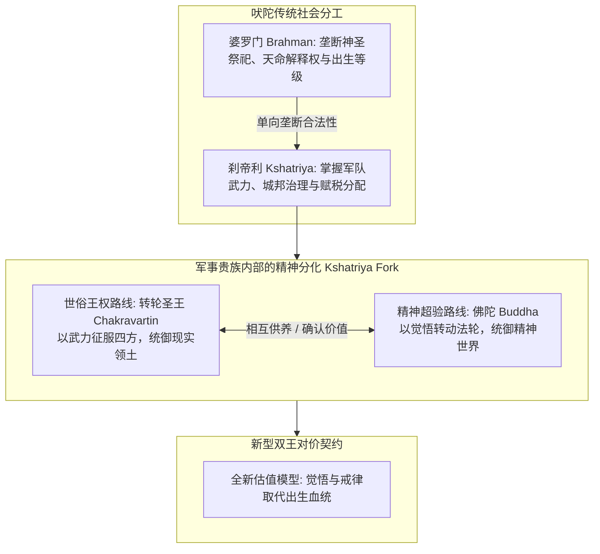
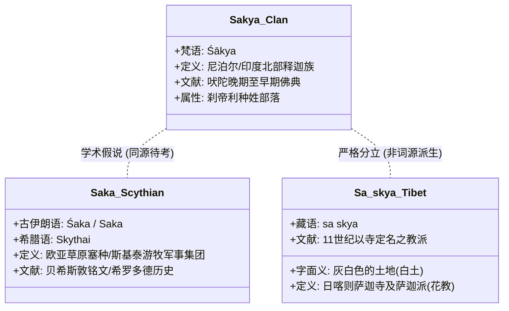

# 三更道场·认识论总纲·文献学与历史会计审计
## 卷三十八：刹帝利军事王权精神分化、释迦—塞种学术假说与罗马Imperator双王结构法医审计（v1.0）

---

### 摘要与法医审计宪章

本卷审计旨在对欧亚大陆军事贵族阶层（Military Aristocracy）向精神权力分化演进的底层机制进行历史会计与政治身体学法医建档。

针对“释迦族起源于斯基泰/塞种、佛教是刹帝利对抗婆罗门的意识形态重编码、萨迦派（花教）名称源流及罗马 Imperator 权力兼并”这一宏大命题，本审计推翻平面化神学解释，确立**“军事贵族精神分化模型（Kshatriya Spiritual Differentiation Model）”**与**“跨文明四重音形语源分账纪律”**：

> 1. **刹帝利身份的制度本质**：
>    佛陀（乔达摩·悉达多）出身于**刹帝利（Kshatriya，王族—武士—政治统治阶层）**而非婆罗门祭司阶层。佛教不是祭司阶级内部的宗教改良，而是军事贵族内部主动分化出的**超验精神系统**——通过将“武力征服领土”重编码为“法轮征服人心”，建立了不依附于婆罗门血统垄断的全新精神估值体系与“转轮王—佛陀”双王对价模型。
> 2. **罗马 Imperator 与双权兼并/再分裂机制**：
>    罗马通过将最高军事统帅权（`Imperium`）与最高大祭司职权（`Pontifex Maximus`）合体于皇帝一人，实现了“军王吞并精神王”；基督教化后精神权威再度剥离，形成西方中世纪教皇与皇帝的双王竞争格局。
> 3. **四重音形词源严格分账**：
>    严格区分梵语 `Śākya`（释迦族）、古伊朗语 `Śaka/Saka`（塞种）、希腊语 `Skythai`（斯基泰）与藏语 `sa skya`（萨迦/白土），严禁在文献链完备前先验宣布完全等同。

---

### 第一章 刹帝利军事贵族精神分化：从武力征服到法轮转动

佛教的诞生在政治社会学上标志着军事贵族对世俗与精神权力的重新切分：



#### 1.1 刹帝利王权符号在早期佛教中的全量复用

佛陀在放弃王位后，并未采用婆罗门祭司的仪轨语言，而是直接将**军事王权符号升维为精神统治语言**：

| 军事王权符号（刹帝利资产） | 佛教精神升维转译（超验法医账目） | 制度控制论本质 |
| :--- | :--- | :--- |
| **战车之轮（Chariot Wheel）** | **法轮（Dharmachakra）** | 从碾压战场的军备武器，升维为摧毁无明、征服人心的精神律令。 |
| **狮子王座（Lion's Throne）** | **佛陀说法为“狮子吼（Simhanada）”** | 沿用军事贵族百兽之王的统治威慑，表征教法真理的无可争辩。 |
| **转轮王（Chakravartin）** | **觉悟者佛陀（Tathāgata / Buddha）** | 同一统治阶层的两极化分身：一者治世，一者出世；一者统领肉体，一者安顿心智。 |
| **世俗纳税与庇护** | **僧团受供养与加冕增信** | 世俗君王（如阿育王、迦腻色伽）通过供养佛法，换取统治的超验合法性。 |

---

### 第二章 罗马 Imperator 模型与印度双王模型的拓扑对照

欧亚大陆东西两端的军事统治集团，在处理“枪杆子（武力）”与“笔杆子（祭权）”时展现出两种不同的系统拓扑结构：

```mermaid
graph TD
    subgraph India_Model[印度-佛教模型: 双王分立对价]
        IK[刹帝利军王 / 转轮王] <-->|供养 vs 增信| IB[佛陀 / 独立精神王]
        Desc1[双王物理分立体，长期保持张力与对价]
    end

    subgraph Rome_Model[罗马帝国模型: 双权兼并一体]
        RI[Imperator 军团最高统帅] + RP[Pontifex Maximus 最高大祭司] --> RE[罗马皇帝 Caesar/Augustus]
        Desc2[军王直接吞并祭司权，实现一人垄断双权]
    end

    subgraph Medieval_West[中世纪西方: 基督教化后双权再度分裂]
        WE[神圣罗马皇帝 世俗剑] <-->|授职权之争 / 加冕| WP[罗马教皇 属灵剑]
        Desc3[教会从帝国身体中剥离，重建双王竞争]
    end

    Rome_Model -->|系统解体与基督化| Medieval_West
```

#### 2.1 制度控制论跨文明对照表

| 比较维度 | 印度—佛教双王模型 | 罗马帝国古典模型 | 中世纪欧亚重组模型 |
| :--- | :--- | :--- | :--- |
| **世俗武力来源** | 刹帝利军士领主、王族战车 | 军团忠诚、`Imperium` 胜利特权 | 封建骑士领主、蒙古/突厥骑兵 |
| **精神合法性来源** | 佛陀法轮觉悟、大乘菩萨道戒律 | 传统祭司团、`Pontifex Maximus` | 基督教会教阶制、格鲁派活佛转世 |
| **权力拓扑关系** | **外部分立与契约互授** | **内部兼并与一体垄断** | **双剑理论（Two Swords）与制度对抗** |
| **系统崩溃风险** | 异教王权断供、僧团经济腐化 | 军人皇帝内战、近卫军拍卖皇位 | 授职权战争（Investiture Controversy）、宗教战争 |

---

### 第三章 语言学与文献学四重音形分账法医台账

在认识论总纲中，必须以最高纪律严格厘清音近概念的文献学地层，彻底防范“字面相近即同源”的学术透支风险：



#### 3.1 四重概念法医对账总表

| 概念与词汇 | 原始语种与文字 | 确凿文献字面含义 | 历史法医定位 | 学术风险处置标准 |
| :--- | :--- | :--- | :--- | :--- |
| **释迦（Śākya）** | 梵语 / 巴利语 | 释迦族（相传意为“能者/有力者”） | 佛陀乔达摩所属之恒河平原北部王族部落。 | **确凿历史事实**：刹帝利身份无争议。 |
| **塞种（Śaka）/ 斯基泰（Skythai）** | 东伊朗语 / 希腊语 | 斯基泰骑射游牧军事人群 | 活跃于中亚至黑海草原的游牧军事贵族。 | **前沿假说（未定案）**：与 Śākya 音近同源假说存在学术先例，但印度—塞种大规模南下晚于早期佛陀年代，须待早期中亚移民考古地层证实。 |
| **萨迦（sa skya）** | 古藏语 | **“灰白色的土地”（白土）** | 因 1073 年昆·贡却杰布在奔波日山旁白土处建萨迦寺而得名。 | **严禁词源混同**：萨迦得名于地理白土，与梵语释迦族（Śākya）非直接同源词。 |
| **斯基泰构词拆解** | 英语 Scythian 假说 | 拆解为“Sky + Thai = 两个天” | 英语 Scythian 源自希腊语 `Skythai`，构词学无法拆为现代英语 sky 与汉语泰。 | **定性为构词隐喻**：作为思想实验隐喻保留，不可作为词源学证据。 |

---

### 结语与法医终审意见

> **法医总评**：
> 欧亚大陆的历史演进，本质上是**军事武力（暴力垄断）与精神法统（意识赋权）之间的持续博弈、兼并与再平衡**。
> 
> - 佛陀作为刹帝利王族的主动精神觉悟，开创了军事贵族自我升维并与世俗转轮王平级对价的伟大先例；
> - 罗马帝国则展示了军王直接兼并最高祭司职权的集权路径；
> - 严格剥离 `sa skya`（白土）与 `Śākya`（释迦）的词源混淆，保护了核心“军事贵族精神分化”模型的无坚不摧。
> 
> 三更道场认识论总纲在这一专题上的梳理，成功将零散的宗教史、军事史与语言学考据，整合为人类国家权力演进的通用系统架构。

---
*记录人：三更道场·历史会计与认识论法医审计署*  
*核准状态：正式正典立项（Canonical Approval Passed）*
