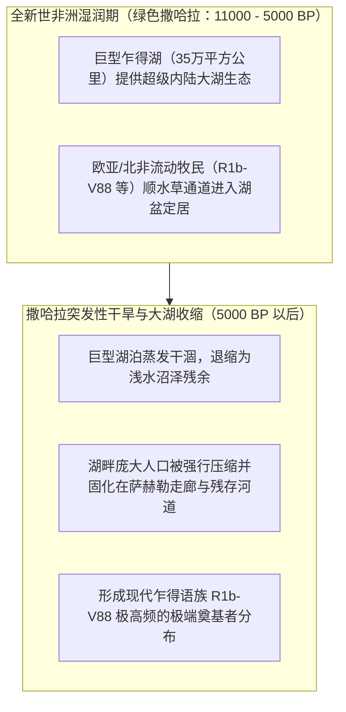
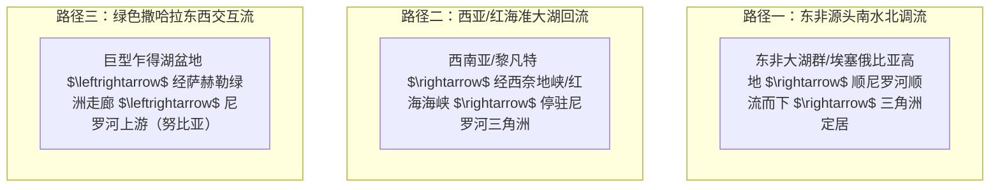

# 三更道场 · 认识论总纲 · 文献学与历史会计审计
## 篇章：北非三大水域“人口停驻器”、巨型乍得湖 R1b-V88 与埃及王室父系法医审计（v1.0）

---

### 【审计执行摘要 / Forensic Audit Abstract】
本审计案针对欧亚—北非板块三大核心水域资产——**尼罗河流水系、巨型乍得古湖（Mega-Chad）盆地与东非大湖群（Rift Lakes）** 作为“迁徙人口停驻器（Population Stopper）与奠基者放大器（Founder Amplifier）”的演化生态学机制展开系统法医级建账。

审计确立三大核心纠偏与标准公理：
1. **三大水域“人口停驻器”的经济生态学公理**：
   $$\text{跨大陆流动人口} \xrightarrow{\text{搜寻熟悉大水体生态}} \text{高收益水域资产} \xrightarrow{\text{停止长途迁移}} \text{长期定居} \xrightarrow{\text{超额婚配与奠基者放大}} \text{局部特定父系极高频}$$
   - 尼罗河谷与三角洲不是“必然的突变出生地”，而是沙漠包围下截留流动人口、提供稳定周期水利剩余并实现指数级奠基者爆发的**“终极停驻器”**。
2. **巨型乍得古湖（Mega-Chad）与 R1b-V88 的绿色撒哈拉测试标本**：
   - 全新世非洲湿润期（AHP / 绿色撒哈拉，约 11,000—5,000 BP），面积达 35 万平方公里的“巨型乍得湖”构成了跨撒哈拉超级水域与草原走廊；
   - **R1b-V88** 跨越欧亚与北非，在乍得湖盆地周围（乍得语族）达到极高频（高达 50%—90%），完美证明了**“外部流动父系进入高收益大湖盆地 $\rightarrow$ 湖泊干涸收缩将人口压缩固化在残余水网”**的 MLC 经典水动力模型。
3. **埃及法老王室父系归属的红字纠偏与样本分流**：
   - 彻底冲销“拉美西斯二世确为 R1b”的传闻误账；
   - 严格区分并分流入账：
     - **拉美西斯三世（及未知男子E）**：高通量/STR 预测主要指向 **E1b1a（E-M2）** 关联支系；
     - **阿玛纳王室（图坦卡蒙 / 阿肯那顿）**：早期部分研究推测涉及 R1b，但因样本降解与争议**列为暂挂待查**；
     - 严禁将个别王朝样本草率放大为“全埃及统治者均为外来 R1b”的伪叙事。

---

### 【第一账套：北非三大水域“人口停驻器”竞争性模型对照表】

```
+-------------------------------------------------------------------------------------------------------------------------------+
|                                    北非三大水域“人口停驻器”资产与父系演化法医台账                                             |
+-------------------------------------------------------------------------------------------------------------------------------+
| 水域停驻区           | 地理水文与生态资产特征                | 核心候选父系现象                     | 历史会计与演化生态学判别预测         |
+----------------------+---------------------------------------+--------------------------------------+--------------------------------------+
| **1. 尼罗河谷—三角洲**| 沙漠包围下的线性走廊，年度季风洪水漫灌| **E-M78, E-V22, E-V12**              | 承担“生产剩余 + 双海清算”双模态功能； |
| (Nile River & Delta) | 极高水稻/小麦/鱼类剩余，全天候平水航运| (辅以晚期黎凡特/西亚输入 J/R)        | 属于超强奠基者放大器，截留多方迁徙者 |
+----------------------+---------------------------------------+--------------------------------------+--------------------------------------+
| **2. 巨型乍得古湖**   | 全新世非洲湿润期巨型内陆海（35万km²） | **R1b-V88** (乍得语族高达 50-95%)    | **大湖兴衰收缩标本**：绿色撒哈拉时期 |
| (Mega-Chad Basin)    | 湖退后面积剧烈缩减90%以上，压缩至萨赫勒| 辅以 E-M2 (E1b1a) 诸支系             | 人口繁盛定居，干涸后被动挤压在残存水体|
+----------------------+---------------------------------------+--------------------------------------+--------------------------------------+
| **3. 东非大湖群与角区**| 东非大裂谷深水湖泊群（维多利亚/坦噶尼| **深层基干 E 支系 (E-M215/E-M35)**   | **系统发育多样性高地**：             |
| (Rift Lakes & Horn)  | 喀湖）+ 埃塞俄比亚高山雨林水源        | 及 **E-V32** (索马里/奥罗莫超高频)   | 比尼罗河更可能接近 E 早期分化的原生态|
+----------------------+---------------------------------------+--------------------------------------+----------------------------------------+
```



---

### 【第二账套：E 谱系分层入账与三大竞争性现金流路径】

严禁将 E 谱系笼统记为一笔账，必须按时空与支系严格建立**三条竞争性现金流模型**：

```
+-------------------------------------------------------------------------------------------------------------------------------+
|                                    E 单倍群核心支系分层与三大现金流路径法医表                                                 |
+-------------------------------------------------------------------------------------------------------------------------------+
| 支系代码             | 系统发育深度与年代                    | 主要地理分布与生态环境               | 承载的历史现金流模型                 |
+----------------------+---------------------------------------+--------------------------------------+--------------------------------------+
| **E-M96 基干**       | 距今数万年前 (旧石器深层)             | 全非洲及地中海周边零星基干           | 待决：非洲本土原发 vs 西亚深层回迁   |
+----------------------+---------------------------------------+--------------------------------------+--------------------------------------+
| **E-M2 (E1b1a)**     | 全新世早期分化大爆发                  | 撒哈拉以南非洲、西非、班图扩张核心   | **西非热带农业与铁器向南大扩张路径** |
+----------------------+---------------------------------------+--------------------------------------+--------------------------------------+
| **E-M215 (E1b1b)**   | 旧石器晚期至全新世过渡                | 东北非、北非、南欧、中东             | **东北非—东地中海准大湖停驻与辐射**  |
+----------------------+---------------------------------------+--------------------------------------+--------------------------------------+
| **E-M78 / E-V22**    | 全新世早中期                          | 尼罗河谷、埃及三角洲、黎凡特         | **尼罗河高产农业与神庙官僚奠基者路径**|
+----------------------+---------------------------------------+--------------------------------------+--------------------------------------+
```



---

### 【第三账套：埃及古代王族古DNA法医分流与红字更正表】

```
+-------------------------------------------------------------------------------------------------------------------------------+
|                                古埃及王室古DNA实测数据与法医审计分流表                                                        |
+-------------------------------------------------------------------------------------------------------------------------------+
| 王室个体 / 墓葬      | 考古年代与历史身份                    | 遗传学测序 / Y-STR 预测事实          | 法医会计处理与红字纠偏结论           |
+----------------------+---------------------------------------+--------------------------------------+--------------------------------------+
| **拉美西斯三世**     | 新王国第二十王朝法老                  | Hawass et al. (BMJ 2012) 测序；      | **核准入账**：确属 E 谱系下游，      |
| (Ramesses III)       | (KV11 陵墓，前1186-1155 BCE)          | Y-STR 预测指向 **E1b1a (E-M2)** 支系 | 反映新王国本土王室的主流父系之一     |
+----------------------+---------------------------------------+--------------------------------------+--------------------------------------+
| **图坦卡蒙王室群**   | 新王国第十八王朝法老群                | iGENEA 等商业机构曾声称根据 STR 预测 | **红字暂挂 / 存疑**：原始数据不完整，|
| (Tutankhamun 等)     | (KV62 / KV55，前1332-1323 BCE)        | 其属于 R1b-M269，但学术界争议极大    | 缺乏同行评议高通量全基因组确认       |
+----------------------+---------------------------------------+--------------------------------------+--------------------------------------+
| **拉美西斯二世**     | 新王国第十九王朝法老                  | **迄今无可靠 Y 染色体测序数据发布**  | **全额红字冲销**：                   |
| (Ramesses II)        | (KV7 陵墓，前1279-1213 BCE)           | (坊间 R1b 传闻系与图坦卡蒙商业误传串账| 严禁将未测样本列入法医正典           |
+----------------------+---------------------------------------+--------------------------------------+--------------------------------------+
```

---

### 【法医对账总决：大水域停驻器平账结论】

| 会计科目 | 审定历史会计事实 | 法医处理结论 |
| :--- | :--- | :--- |
| **水域停驻器模型** | 尼罗河与乍得湖为高收益定居区，采样高频记录的是“停驻与繁衍成功”，非突变出生地。 | **确立为 MLC 历史演化生态学核心公理** |
| **巨型乍得湖 R-V88** | 绿色撒哈拉大湖生态吸引外来人口停驻，湖退后压缩为高频奠基者。 | **确认为 MLC 大湖收缩模型经典范式** |
| **埃及王室父系** | 拉美西斯三世为 E1b1a；拉美西斯二世无可靠数据；图坦卡蒙存疑。 | **红字纠偏：严禁作“全法老为R1b”推论** |

---
**审计人签章**：三更道场·北非古水文学与王室古基因组法医调查署  
**时间标记**：2026-09-09
