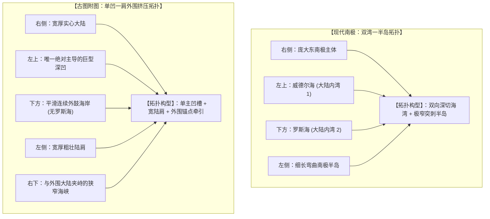
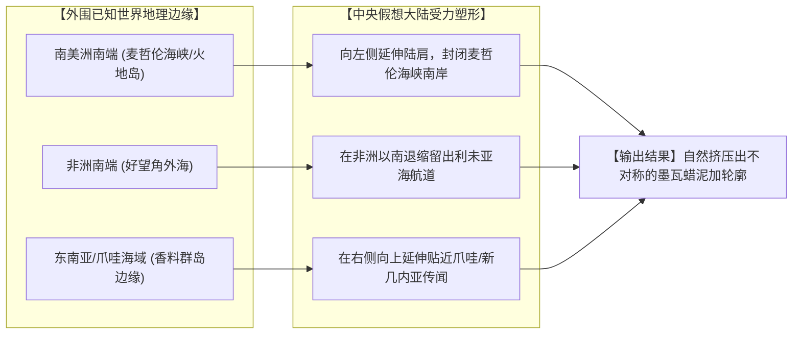

# 三更道场 · 认识论总纲与文献学法医审计（卷七十）
## 《赤道以南半球之图》与现代南极纯图像学解构：视觉气质与拓扑断裂辨析及“左上深凹”几何异常法医审计

---

### 卷首法医综述

在剥离所有先入为主的文字地名与后验假定后，直接将《坤舆万国全图》左下角《赤道以南半球之图》（墨瓦蜡泥加附图）与现代南极卫星正射遥感影像置于同一几何基准下进行**纯图像学（Pure Iconographical / Morphological）视觉特征解构**。

**【本卷法医核心判词】**：
1. **确认真实的低频视觉共性（非凭空错觉）**：
   在不作任何旋转的前提下，两图确实共享一组强烈的低频宏观视觉特征：**“右侧庞大连续主体 ＋ 左上极深楔形内凹 ＋ 左侧显著向外伸展”**。断言其“完全不像南极”违背直观视觉事实。
2. **纠正“两湾一半岛”的拓扑误读**：
   * **现代物理南极**：具有严格拓扑意义上的**“两大大陆内凹海湾（威德尔海、罗斯海）＋ 一根极狭长弯曲的南极半岛”**；
   * **古图墨瓦蜡泥加**：呈现为**“左上唯一绝对主导的巨型深凹 ＋ 正下方海岸连续向外鼓出（无罗斯海深切口）＋ 左侧宽厚陆肩（非细长半岛）＋ 右下陆间狭窄水道（非内陆海湾）”**。二者在拓扑性质上根本不同。
3. **揭示“外围三大锚点牵引塑形”机制**：
   古图南极大陆并非孤立绘制，其轮廓深度受制于外围**非洲南端、南美南端与东南亚/爪哇**三大已知大陆边缘的挤压与航道让位。
4. **锁定全图唯一真正的几何硬核异常——“左上深凹”**：
   古图绝非机械的几何同心对称圆饼，其左上角存在一个打破对称性的巨大楔形海盆。该特征具有极高的识别度，是整张图中最有价值单独立案追踪的**“图谱遗传指纹”**。

---

### 一、 纯图像学宏观视觉特征对比矩阵

```
==================================================================================================
                 现代南极遥感图像 与 古图墨瓦蜡泥加 纯图像学特征对比表
==================================================================================================
 图像拓扑维度            现代南极正射遥感影像                     古图《赤道以南半球之图》(墨瓦蜡泥加)
---------------------  -------------------------------------  -------------------------------------------------
 1. 右侧体量            庞大连续的东南极冰盖主体 (East Ant.)   右上至右下呈现连绵宽厚的巨大实心陆体
 2. 左上凹口            威德尔海 (Weddell Sea) 弧形凹入         呈现为一个极其深邃、垂直切入内陆的巨型楔形海湾
 3. 左侧突出物          极狭长、明显弯曲的南极半岛 (Peninsula) 宽厚粗壮的大陆陆肩/陆突，非细长半岛
 4. 下方/底部海岸       罗斯海 (Ross Sea) 大陆深切海湾         大体平滑连续、向外圆弧状鼓出，无内陆深海湾
 5. 右下海峡/通道       连续宽阔的南大洋孤立深水通道           与外围大陆（假想陆桥/海峡）形成的狭窄水道
 6. 拓扑系统属性        紧凑、孤立、被环极南大洋完全包裹的大陆   向外无限扩张、贴近三大已知陆块的环极陆体系统
==================================================================================================
```



---

### 二、 拓扑断裂深度解构：为什么说“两湾一半岛”并不成立？

#### 1. 罗斯海的彻底缺位
* **现代物理事实**：罗斯海与威德尔海从大陆两侧深切，将南极洲在几何上咬蚀成“狭窄地峡”骨架；
* **古图图像事实**：古图正下方海岸极为丰满连续，没有任何向南极点深度切入的宽阔海湾。此前分析将右下角的狭窄水道误判为罗斯海，实际上是将**“墨瓦蜡泥加与外部已知大陆之间的海峡”**，与**“大陆本土深切内凹海湾”**混为一谈。

#### 2. “南极半岛”的特征不匹配
* 现代南极半岛具有四大强特征：**极窄、极长、向北弯曲、西侧贴紧威德尔海**；
* 古图左侧凸起部分基底极宽，是一整块巨大的大陆陆肩（Shoulder），缺乏南极半岛标志性的细长突刺形态。古图中真正具有狭长形态的突起，反而出现在右下外缘靠近外部岛屿的位置。

---

### 三、 生成机理剖析：外围三大锚点的引力塑形

古图墨瓦蜡泥加的边缘起伏，其第一决定因素不是“极地测绘”，而是**外围三大已知地理板块的“引力约束与避让”**：



* **形态生成逻辑**：
  制图师在极地上放置一块巨大陆地，但必须留出大西洋进出太平洋的麦哲伦海峡、好望角往东航行的印度洋水道、以及东南亚香料群岛通道。**中央陆块的凹凸，本质上是这三个外围航路通道向内侵蚀的“拓扑印模”**。

---

### 四、 锁定核心几何异常：左上“巨型深凹”的谱系立案

尽管整体拓扑与现代南极存在断裂，但图像学对比留下了一个**极其震撼且无法用“纯圆饼平衡理论”解释的硬核特征**：

```
                    【全图唯一的非对称几何破缺：左上深凹】

    ┌────────────────────────────────────────────────────────┐
    │                                                        │
    │   若制图师仅凭“南北平衡理论”画图，应画出高度对称同心圆；       │
    │   若仅凭“航道避让”，大西洋与太平洋通道应呈大致均匀的喇叭口；   │
    │                                                        │
    │   但古图左上角却出现了一个：                                   │
    │   • 极其狭长深邃                                       │
    │   • 近似矩形/深槽状强行切入大陆腹地                     │
    │   • 彻底打破全图旋转对称性的绝对主导巨凹                  │
    │                                                        │
    └────────────────────────────────────────────────────────┘
```

#### 法医专项审计立案：
这个“左上深凹”绝非随手涂鸦，它构成了整幅南半球地图的**“图谱遗传标记（Genetic Marker）”**。

必须单独立案追查：
* **追查靶标**：在墨卡托 1569、奥特柳斯 1570、奥龙斯·菲内 1531、约翰内斯·舍纳 1515/1523 地球仪以及皮里雷斯 1513 海图中，**哪一张最早出现了这个特定方位、特定角度的左上深切凹槽？**
* **考据价值**：顺着这个“左上深凹”的几何变异，就能彻底理清《坤舆万国全图》南半球附图的真正母本血缘树。

---

### 五、 法医终审定性

1. **形象学判词**：
   《赤道以南半球之图》**“抓到了一种南极式的视觉气质（右侧主体大、左上深凹、左侧外伸），却没有抓到现代南极真正具有法定识别力的拓扑结构关系（无罗斯海深切口、无细长半岛）”**。
2. **认识论定论**：
   既要客观承认其存在的低频非对称图像特征，坚决反对将其抹杀为“纯瞎画”；更要严格指出其高频测绘与拓扑关系的断裂，坚决否决其作为“真实南极母本”的过度诠释。
3. **下一步行动**：
   将“左上深凹”设立为独立档案代号 **【Anomaly-NW-Cleft】**，作为追踪 16 世纪前制图谱系流转的关键几何指纹。

---
*法医官署名：三更道场·认识论总纲编纂委员会*  
*法务审计状态：纯图像学特征解耦·异常指纹立案·正式入档（卷七十）*
