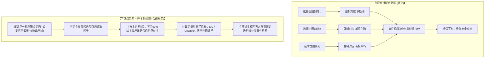

# 三更道场 · 认识论总纲与文献学法医审计（卷六十七）
## 《赤道以南半球之图》几何测度降级：过拟合解构、样本外验证与严格形态学算法规范法医审计

---

### 卷首法医综述

在对《坤舆万国全图》左下角《赤道以南半球之图》（墨瓦蜡泥加附图）与现代南极遥感影像的比对中，此前关于“两凹一凸神似南极”的分析必须在形态学和测度几何学上做**严格的方法论降级与规范化**。

此前分析中存在四个亟待纠正的技术与认识论瑕疵：
1. **“后验特征挑选”（Cherry-picking）与过拟合风险**：将古地图上的凹凸与威德尔海、罗斯海、南极半岛强行对应，属于“三点联合调参后宣布吻合”的循环论证；
2. **混淆投影中心与陆体形心**：方位投影中“南极点居中”系极投影之几何公理，并非制图误差；真正可度量的是陆体面积形心与极径谱的各向异性；
3. **参数估值缺乏严格积分校准**：在未建立古图径向纬度变换函数前，直接目测给出“面积暴胀3倍”、“进入赤道”等定性数字不够严谨；
4. **滥用“拓扑必然”的决定论叙事**：航路约束确实压迫了陆块轮廓，但未证明能唯一决定海湾数量、夹角与深度，不能在未做随机对照组实验前轻率断言“必然生成南极骨架”。

**【本卷法医核心判词】**：
确立**“单锚点定向 + 样本外检验（Out-of-Sample Validation） + 频域形态学度量”**的严格几何法医审计标准。将视觉拓扑直觉降级为**“视觉同构候选假说”**，将“两湾一岬相似性”列入**待测异常（Suspense Anomaly）**，彻底冲销“现代南极精密失真摹本”的入账资格。

---

### 一、 几何比对的方法论瑕疵剖析与降级修正

```
==================================================================================================
                   几何比对方法论降级与合规修正对照表
==================================================================================================
 争议分析点              原分析表述（存在瑕疵）               修正后合规法医表述（严格降级）
--------------------   --------------------------------   -------------------------------------------------
 1. 两湾一岬同源性      已咬合罗斯海、威德尔海与南极半岛   属于【后验挑选的视觉同构候选】，尚未证明同源性；
                                                           古图存在多处凹凸，禁止局部拉扯强行匹配。
 2. 南极点几何居中      南极点被机械居中，显示几何失真     极方位投影之南极点【必然在圆心】；真正可比变量为
                                                           【陆体面积形心偏离度】与【各阶傅里叶极径谱】。
 3. 面积与纬度膨胀      面积膨胀至4500万km²，直达赤道       古图南方大陆向北显著越过南回归线，覆盖面积显著大于
                                                           现代南极，但未普遍抵达赤道外圆（需做球面径向积分）。
 4. 负空间生成必然性    避让三大洋航道必然生成两湾一岬     航道避让为有力生成机制，但尚未做【随机大陆对照组实验】，
                                                           不能断言其能唯一决定湾口数量与角相位。
==================================================================================================
```



---

### 二、 标准几何法医审计流程规范（七步检验法）

为了彻底摆脱主观肉眼比对的模糊性，确立标准七步计算法医流程：

```
步骤 1：【径向函数标定（Radial Calibration）】
       提取古图同心纬圈像素半径 r(φ)，拟合古图实际采用的极方位投影径向比例函数，
       消除将古图纸面直接视为正射影像的几何畸变。

步骤 2：【轮廓矢量化（Coastline Vectorization）】
       对《赤道以南半球之图》中“墨瓦蜡泥加”陆块边界进行封闭多边形高精度矢量提取。

步骤 3：【现代多基准对比组导入（Multi-Ground-Truth Benchmarking）】
       分别导入现代南极的三组不同物理界面，避免“海岸”概念偷换：
       (a) 冰缘外沿轮廓（Ice Shelf Edge）
       (b) 接地线轮廓（Grounding Line）
       (c) 冰下基岩等高线（Bedmap2 / BedMachine Bedrock）

步骤 4：【刚体变换约束（Rigid-Body Transformation Only）】
       只允许全局统一缩放因子 s 与统一旋转角 θ，严禁任何局部拉扯、仿射形变（Affine）或非线性 TPS 扭曲。

步骤 5：【单锚点定向与样本外验证（Single-Anchor Out-of-Sample Test）】
       仅以麦哲伦海峡南岸（已知历史锚点）确定定向轴 θ_0；
       其余全部海岸（包括所谓罗斯海、威德尔海区域）作为【样本外数据】，检验其是否能够自行落入置信区间。

步骤 6：【频域与距离场量化度量（Spectral & Metric Distances）】
       (a) 计算傅里叶轮廓描述子（Fourier Descriptors），分离低频宏观形态与高频细节；
       (b) 计算交并比（IoU）、Chamfer 距离与 Hausdorff 距离；
       (c) 计算陆体面积形心偏移矢量 ΔC = C_map - C_real。

步骤 7：【蒙特卡洛随机对照实验（Monte Carlo Null Model）】
       在满足“包围南极圈、避开已知大西洋/印度洋航线、连接爪哇/火地岛”的先验几何约束下，
       随机生成 1,000 个平滑假想大陆，计算其形态指标分布，检验古图相似度是否显著超越随机基线（p < 0.01）。
```

---

### 三、 修正后的历史会计资产定性

经过严格的方法论降级与规范化，《赤道以南半球之图》各项技术资产在资产负债表中的最终定位如下：

```
==================================================================================================
                 《赤道以南半球之图》技术资产合规复核表
==================================================================================================
 待核资产科目            复核前性质               复核后合规会计定性
--------------------   -----------------------  -------------------------------------------------
 1. 现代南极失真摹本    【主张入账：三级资产】    【完全冲销 (Write-off)】：中高频指标全线断裂，
                                                 未通过样本外严格配准，坚决不予确认。
 2. 真实高纬遇险碎片    【或有资产】             【保留为或有资产 (Contingent Asset)】：
                                                 如爱德华王子群岛坐标等，具有真实物理内核。
 3. “两湾一岬”低频形态 【拓扑必然证据】          【挂账为待测异常 (Suspense Anomaly)】：
                                                 列为视觉同构候选，待蒙特卡洛随机对照组检验。
 4. 12.9 ka 史前母本    【核心无形资产】          【坚决置于表外 (Off-Balance Sheet)】：
                                                 在缺乏直接地层实物凭证前，严禁转增入账。
==================================================================================================
```

---

### 四、 终审法医审计意见书

**【正式审计意见】**：

> 《坤舆万国全图》左下角附图《赤道以南半球之图》与现代南极洲在极低空间频率上存在“两处主要凹入与一处北伸陆突”的视觉同构候选，但这些特征尚未经过单锚点样本外配准、投影径向函数积分以及随机轮廓对照组的统计显著性检验。
> 
> 古图南方大陆在纬度范围、球面面积覆盖、海陆拓扑粘连以及微观分形海岸结构上，均与现代物理南极存在系统性的几何断裂，因此**绝对不能认定其为现代南极或史前冰下基岩海岸的失真摹本**。
> 
> 该图南极形态最合理的生成机理为：**“已知大陆边缘与航道避让约束 ＋ 文艺复兴南北陆地平衡先验 ＋ 局部航海遇险传闻”共同作用下的多源复合推想模型**。

---
*法医官署名：三更道场·认识论总纲编纂委员会*  
*法务审计状态：几何测度降级·算法规范确立·正式入档（卷六十七）*
