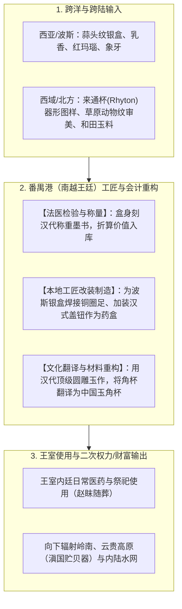
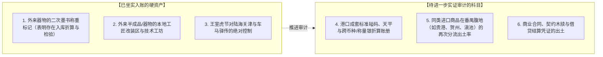

# 三更道场 · 认识论总纲 · 文献学与历史会计审计
## 篇章：南越王赵眜墓四层资产结构、番禺港“文化翻译与改装制造”及离岸清算口岸法医审计（v1.0）

---

### 【审计执行摘要 / Forensic Audit Abstract】
本审计案承接对广州象岗山西汉南越王墓（第二代南越王赵眜/赵胡墓，前122年）的法医级器物与制度对账指令。

审计确立三大核心会计结论：
1. **器物证明力阶梯化与去神话化**：彻底剥离“南越王单件器物直接推导斯基泰/C2血缘”的溢出记账。将“角形玉杯”精准定性为**“跨欧亚审美输入的本地最高工艺翻译器物”**；将“波斯蒜头纹银盒”定性为**“海外输入—番禺入库称重—本地加装铜足改制—王室二次使用”的完整商品生命周期标本**；将“错金铜虎节”铭文核实为**“王命命车徒”（秦汉式军政与车马调动接口）**。
2. **南越王室的四层控制结构资产表**：由“**北方秦汉军政接口层 + 跨区域北方/草原审美工匠层 + 本地百越海洋与水产生业底盘层 + 印度洋远程海贸转运层**”组装而成。
3. **番禺港作为离岸清算与工匠重构口岸的制度证据**：通过二次称重墨书、外来器物结构改装、玉石/青铜再加工，证明番禺不仅是货物被动接收地，更是**“验货、称量、折算、改制与二次输出”的价值重估节点**。

---

### 【第一账套：赵眜墓核心器物法医证据阶梯表】

```
+-------------------------------------------------------------------------------------------------------------------------------+
|                                西汉南越王赵眜墓核心器物法医证据强度与功能分流入账表                                                |
+-------------------------------------------------------------------------------------------------------------------------------+
| 器物名称             | 实物形制与技术指纹                    | 可以确证的历史会计事实                  | 严禁溢出推导的边界 (红字警戒线)        |
+----------------------+---------------------------------------+-----------------------------------------+----------------------------------------+
| **错金铭文铜虎节**   | 错金虎纹，铭文“王命命车徒”           | 证明南越王室继承秦汉军政制度，具备合法  | **非草原斯基泰器物**，证明的是中央/王国|
|                      | 符节制度，调动驿传车马与人员的凭证   | 调动车徒与控制陆路交通的执行接口        | 级别国家行政与军事调动接口             |
+----------------------+---------------------------------------+-----------------------------------------+----------------------------------------+
| **波斯蒜头纹银盒**   | 西亚捶揲工艺、蒜头凸瓣；             | **完整商品生命周期**：西亚制造 -> 跨洋运| 不能仅凭单件器物断定特定商队性质；     |
|                      | **番禺本地加装盖钮与铜圈足**，刻称重墨书| 输 -> 番禺检验称重 -> 本地改装 -> 王室使用| 需结合更多贸易记账与入库标记综合入账   |
+----------------------+---------------------------------------+-----------------------------------------+----------------------------------------+
| **圆雕透雕角形玉杯** | 新疆和田/本地青白玉，汉代游丝毛雕；   | **跨欧亚审美输入的“文化翻译器物”**：    | **严禁直接推出赵氏为斯基泰血缘**；     |
| (Rhyton 造型)        | 模拟欧亚草原/西亚来通杯（角杯）器形   | 用本地最高级玉雕工艺翻译西向角形饮器    | 反映的是商贸网络中的图样、订单与审美流动|
+----------------------+---------------------------------------+-----------------------------------------+----------------------------------------+
| **金角兽首带钩/金扣**| 浮雕猛兽、凸眼角龙、镶绿松石；       | 属于**北方系/欧亚草原动物风格平行特征**；| 不能直接等同为真定白狄专属性格，更不能  |
|                      | 呈现北方草原猛兽撕咬艺术传统         | 反映战国—秦汉北方骑兵审美与工匠记忆     | 作为分子人类学父系支系的替代证据       |
+----------------------+---------------------------------------+-----------------------------------------+----------------------------------------+
| **越式铜提筒/铜鼓**  | 几何印纹、羽人竞渡舟楫纹饰、百越文身  | 证明百越土著的海洋崇拜、舟师生业与地方  | 不代表全社会单一血缘，而是王室吸收并   |
|                      | 本地铸造青铜重器                     | 势力在王国中保留重要礼仪与权力位置      | 嵌合本土社会的政治妥协凭证             |
+----------------------+---------------------------------------+-----------------------------------------+----------------------------------------+
```

---

### 【第二账套：番禺港“商品生命周期与文化翻译制造”模型】

波斯银盒与角形玉杯揭示出番禺港作为高阶商贸口岸的核心机制——**不仅是“货物终点”，而是“加工重构与价值重估中心”**：



---

### 【第三账套：南越王国的四层资产与控制结构对账】

```
+-------------------------------------------------------------------------------------------------------------------------+
|                                    南越王国四层资产与控制结构对账表                                                        |
+-------------------------------------------------------------------------------------------------------------------------+
| 控制层级             | 承载物质与制度实体                    | 人口与阶级属性                       | 功能本质与政治经济学角色             |
+--------------------+---------------------------------------+--------------------------------------+--------------------------------------+
| **1. 政治军政接口层**| 汉式金印（文帝行玺）、**“王命命车徒”虎节**| 少数北方秦汉官僚与军事贵族精英       | 提供合法性、维系郡县/王国行政、控制陆|
|                    | 汉铁剑、弩机、标准中原度量衡礼器       | (赵佗、赵眜家族及中原边防将领)       | 路关隘与驿传调动能力                 |
+--------------------+---------------------------------------+--------------------------------------+--------------------------------------+
| **2. 跨区域工匠精英层| 角形玉杯、草原兽首金带钩、透雕龙凤玉佩| 汇聚中原、北方及本地的高级专业工匠行会| 负责高阶奢侈品制造、文化符号翻译、   |
|                    | 黄金捶揲与镶嵌工匠、玉雕大师           | (流动工匠共同体，跨越地域藩篱)       | 外来商品的本地化改造与增值           |
+--------------------+---------------------------------------+--------------------------------------+--------------------------------------+
| **3. 本地人口生业层**| 越式铜提筒、百越铜鼓、羽人竞渡舟楫纹、| 庞大的岭南百越土著水网人口           | 提供农业水稻、海洋捕捞、内河舟楫运力 |
|                    | 贝丘、水产饮食遗存（禾花雀、螺贝等）  | (父系以 O1a-M119 等为主体的生产底盘)  | 与基层税收，构成王国的实体底座       |
+--------------------+---------------------------------------+--------------------------------------+--------------------------------------+
| **4. 远程海贸清算层**| 波斯蒜头银盒（墨书称重）、乳香、红玛瑙| 印度洋季风水手、跨洋番商与港口验货官 | 垄断早期海上丝绸之路离岸结算，获取高 |
|                    | 象牙、平板玻璃牌饰                     | (连接南亚、东南亚与西亚的贸易中介)   | 额过境关税、特种药物与全球稀缺奢侈品 |
+--------------------+---------------------------------------+--------------------------------------+--------------------------------------+
```

---

### 【第四账套：番禺作为“离岸清算口岸”的法医判定清单】

要将番禺从“普通贸易集散地”升格为“离岸清算中心”，确立以下法医审计标准：



---

### 【法医对账总决：南越王室模型的历史审计定论】

| 会计科目 | 审定历史会计事实 | 法医处理结论 |
| :--- | :--- | :--- |
| **赵氏族源与血统** | 籍贯真定（北方白狄故地），但墓葬器物不可直接替代个人 DNA。 | **严禁作 C2 单一归因，按北方军政精英入账** |
| **角形玉杯属性** | 跨欧亚来通杯（Rhyton）审美的本地玉雕翻译，展现高超文化消化能力。 | **确认入账：文化翻译器物（本地顶级玉雕）** |
| **波斯蒜头银盒属性** | 涵盖制造、运输、称重、改装到使用的完整链条，为早期海贸硬证据。 | **确认入账：跨海贸易与本地改装标本** |
| **南越国社会结构** | 北方军政外壳 + 跨界工匠 + 百越人口底盘 + 远程海贸接口。 | **确认入账：四层资产控制结构标准范式** |

---
**审计人签章**：三更道场·历史会计与物质文化法医审计署  
**时间标记**：2026-09-09
