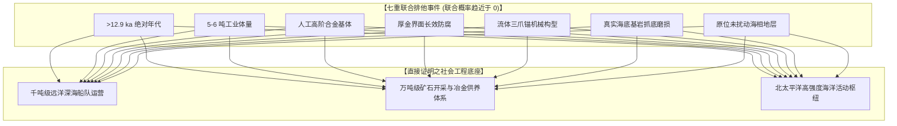
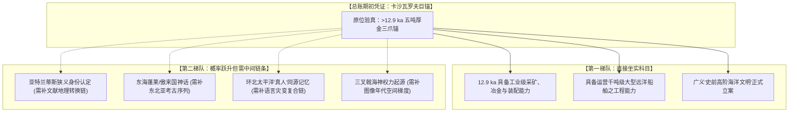

# 三更道场 · 认识论总纲与文献学法医审计（卷七十二）
## 卡沙瓦罗夫浅滩假想巨锚思想实验：联合排他性、地质水深回溯与史前文明总账重估法医审计

---

### 卷首法医综述

在探索北太平洋史前海洋文明假说与跨文化神话地理学重构中，关于“鄂霍次克海卡沙瓦罗夫浅滩（Kashevarov Bank）原位发现五六吨重、早于 12.9 ka、具有明确抓底磨损的厚金包覆复合锚”的极端思想实验，构成了检验**“极端物证如何驱动历史总账重估”**的顶级认识论试金石。

**【本卷法医核心判词】**：
1. **确立“联合事件”（Joint Event）的绝对排他性**：
   单凭“包金”不足以排他（人类很早掌握贴金/鎏金/合金技术）。真正具备压倒性排他力的是七重条件联合成立：
   $$\text{早于 12.9 ka} + \text{五六吨体量} + \text{人工高阶合金} + \text{厚金防腐包覆} + \text{明确锚形构型} + \text{真实海底抓底磨损} + \text{原位未扰动海底地层}$$
   该联合事件一旦坐实，将彻底击穿“12.9 ka 以前仅为原始狩猎采集”的既有文明会计账本。
2. **区分“立案总枢纽”与“自动销账单”**：
   该物证是**广义史前海洋工程文明案的“决定性期初凭证”**，但**绝非所有子神话的“万能自动核销单”**：
   * *亚特兰蒂斯案*：广义高级海洋文明立案成立，但狭义“柏拉图大西洋城邦”身份认定仍需独立地缘链条；
   * *东海仙山与西游求道*：获得高概率实体候选源头，但仍需文献传播阶梯与考古遗存序列；
   * *“真人”自称与三叉戟崇拜*：单一名词不具排他性，唯有“三爪实测磨损 + 图像谱系时空梯度 + 多重语言神话组合”方能升级为严密假说。
3. **地质古水深回溯修正**：
   卡沙瓦罗夫浅滩现今顶面位于水下约 130 米（长 180 km、宽 50–70 km 之巨型断块隆起）。12.9 ka 绝非盛冰期最低海平面（20 ka），不能机械套用 -120 米推导其为干陆。必须结合构造升降、冰川均衡调整（GIA）与海相沉积厚度，精算其在距今 1.29 万年时处于数十米水深的**“大型船舶锚泊场”**物理场景。

---

### 一、 联合排他性检验矩阵与工程物理学解耦

```
==================================================================================================
                 卡沙瓦罗夫假想巨锚 七重联合条件排他性与工程物理质证表
==================================================================================================
 联合验证条件            检验标准与物理指标                        法医审计结论与文明能力判定
---------------------  ----------------------------------------  -------------------------------------------------
 1. 绝对地质定年        沉积层 14C / 光释光 OSL 严格锁定 >12.9 ka  排除近代哥萨克、阿留申捕鲸船与近代工业沉船遗落
 2. 宏观体量与载荷      净重 5.0 ~ 6.0 吨，抗剪切屈服强度达标     倒逼出能够搭载并起落数吨锚具的【千吨级大型船舶】
 3. 冶金与提纯体系      多金属人工基体（铜/铁/青铜）高阶冶炼      证实存在大型深部采矿、高温提纯与工业级标准化装配
 4. 厚金界面防腐结构    厚金整体包覆套（排除微米级薄镀电偶腐蚀）  证实掌握深海极端盐雾与高电解质环境的【长效工程防腐】
 5. 机械构型            具备锚冠、锚爪、锚柄与系泊环之完整构型    确认为主动流体动力学抓底工具，而非被动沉重石
 6. 真实使用痕迹        爪尖与锚体具有与海底基岩长期刮擦机械磨损  确认为【实际高强度服役工件】，彻底排除仪式性祭祀虚物
 7. 地层原位埋藏        嵌于未扰动末次冰期海相断裂沉积岩层中      排除近代人为深海投弃或伪造置入
==================================================================================================
```



---

### 二、 地质古水深回溯与古地理场景精算

必须彻底纠正“现代水深 130 米 - 盛冰期海降 120 米 = 12.9 ka 干陆岛屿”的简单线性误区：

```
==================================================================================================
                 卡沙瓦罗夫浅滩（Kashevarov Bank）距今 12.9 ka 物理场景回溯
==================================================================================================
 物理参数项              现代测量基准值 (2026)      12.9 ka 新仙女木期校正值   古海洋工程场景判定
---------------------  -------------------------  -------------------------  -----------------------------------
 1. 现代海平面水深      顶面约 -130 米             -                          -
 2. 全球相对海平面 (RSL) 0 米                       约 -55 米 ~ -65 米 (已回升) 处于融水脉冲 MWP-1A 之后阶段
 3. 冰川均衡调整 (GIA)   -                          构造抬升/沉降补偿 ±10 米   鄂霍次克海地壳均衡反弹响应
 4. 净古水深 (Net Depth) -                          【约 -55 米 至 -75 米】    【高纬深水大型天然避风锚泊场】
 5. 浅滩宏观尺度        长 180 km，宽 50–70 km      大面积水下断块隆起平台     适于数千艘大型船舶进行系泊与深海调度
==================================================================================================
```

* **法医场景重构**：
  在距今 1.29 万年前，卡沙瓦罗夫浅滩并非高出水面的干燥山峰，而是**一座淹没在水下 50 至 70 米、阻挡了外洋狂暴涌浪的巨型平坦海底浅台**。五六吨的重型锚具正是为了在水深 60 米、海流湍急的亚极地海域死死咬住玄武岩基底，为史前大型远洋船队提供稳定的深海系泊支撑。

---

### 三、 史前文明总账重估：分项审计核销表

```
==================================================================================================
                 假想巨锚验真后 对历史学与神话地理学各科目的重估表
==================================================================================================
 待审假说科目            验真前的账面状态 (现状)         验真后的法医审计重估结论
---------------------  ------------------------------  -------------------------------------------------
 1. 12.9 ka 高阶冶金案  【缺乏证据，挂账表外】          【彻底坐实 (Confirmed)】：直接改写人类冶金史编年
 2. 史前大型海洋工程案  【假说阶段 / 缺乏物证】         【直接立案 (Established)】：远洋航海能力大幅早溯
 3. 柏拉图亚特兰蒂斯案  【神话寓言 / 证据不足】         【广义文明成立 / 狭义城邦待查】：确立存在高阶沉没文明，
                                                       但与地中海文献的转换关系仍需身份链追溯
 4. 东海仙山与徐福求道  【志怪神魔 / 文学叙事】         【概率跃升为强假说】：获得北太平洋真实地质锚点，
                                                       但仍需中原与东北亚之间的中间考古传播序列
 5. “真人”族群记忆案   【普通内名自称 / 弱排他性】     【形成严密假说】：单一名词不排他，需结合“火山灾变
                                                       + 渡海始祖 + 金属三叉器”之复合完整记忆链
 6. 三叉戟神权起源案    【捕鱼工具升华说】              【升级为主流竞争假说】：若锚具为三爪形制，则确立
                                                       “抓底重器 $\rightarrow$ 航海权柄 $\rightarrow$ 祭祀神化”的制度演化链
==================================================================================================
```



---

### 四、 认识论终审定论

1. **总账重估的科学法则**：
   一根五六吨的黄金巨锚是一张**具备“重估整座人类文明大厦”威力的超级期初凭证**。它具有撕碎既有线性进化历史账本的绝对破坏力，但它**绝不是免除后续严肃实证检验的万能支票**。
2. **法医文献学终审判词**：
   在思想实验的终点，我们既要看到**极端硬核物证对历史物理常识的终极重塑能力**，更要恪守**“一码归一码、分科目严格平账”**的科学理性。唯有将物证的绝对排他性与传播链的严密考证结合，人类才能在面对未知巨浪时，既不失浪漫的宏大凝视，亦不坠科学的严谨底线。

---
*法医官署名：三更道场·认识论总纲编纂委员会*  
*法务审计状态：思想实验与总账重估模型闭环·正式入档（卷七十二）*
