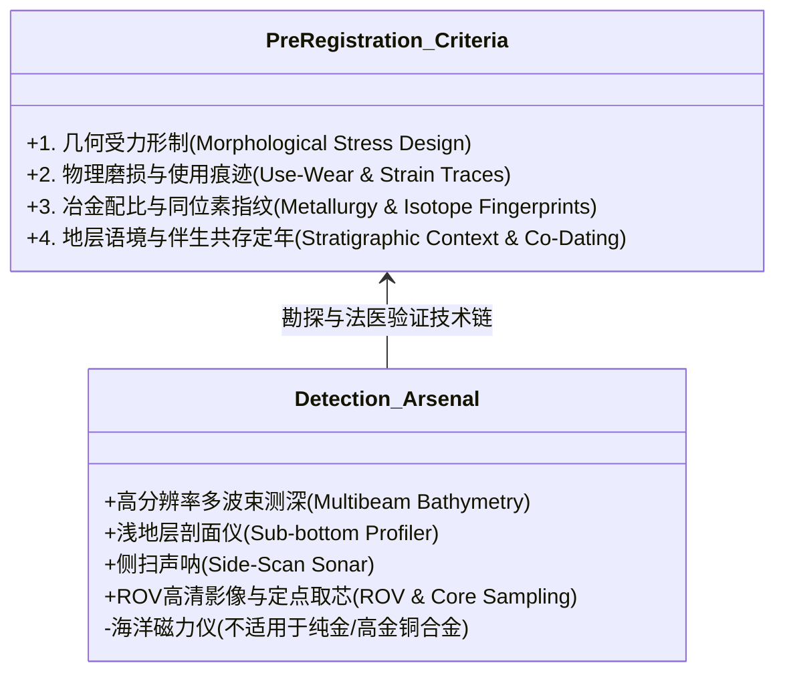
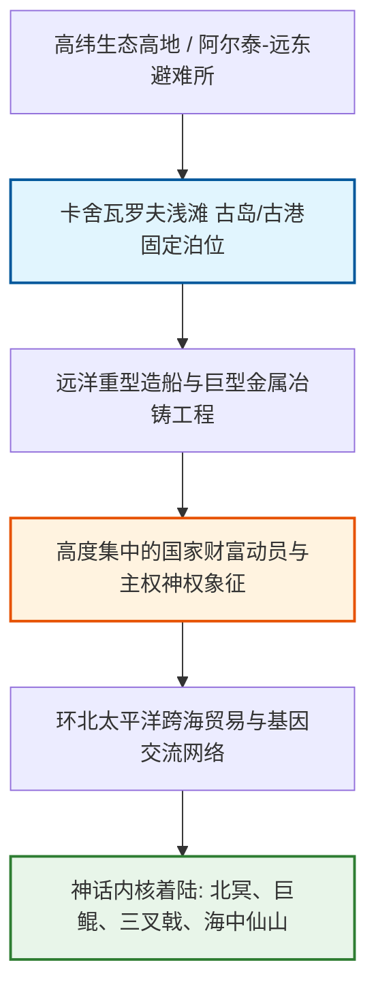

# 三更道场·认识论总纲·文献学与历史会计审计
## 卷四十：卡舍瓦罗夫浅滩（Kashevarov Bank）古海平面水深对账与大型神圣系泊器预注册法医审计（v1.0）

---

### 摘要与法医审计宪章

本卷审计旨在对鄂霍次克海核心水下地貌——**卡舍瓦罗夫浅滩（Kashevarov Bank / 北冥仙山假说靶点）**的地形水深、冰期相对海平面变迁（RSL）、古港固定泊位工程学及大型高价值金属系泊器的预注册（Pre-registration）标准进行严格的历史会计与海洋地球物理法医建档。

针对“末次盛冰期（LGM）与新仙女木期（YD）水下浅滩是否出露为岛、巨型金铜船锚是否具备航海物理可行性”的核心争议，本审计推翻模糊的“神话靶点”叙事，建立**“水深—年代—工程器物”三表勾稽核算体系**：

> 1. **海平面与地质沉降对账（Water Depth & RSL Audit）**：
>    - 全球末次盛冰期（LGM，约 26–19 ka BP）平均海平面较现今低约 120–125 m；新仙女木期（YD，约 12.9–11.7 ka BP）海平面已大幅回升（约低 60–70 m）。
>    - 现今水深约 -200 m 的浅滩，在 LGM 时仍处于水下 75–80 m。要使“古火山仙岛/古港”物理成立，**必须满足三项地质物理条件之一**：① 浅滩局部存在尚未探明的更浅古火山穹顶；② 火山体在全新世经历了 80 m 以上的构造构造沉降、塌陷或海蚀削平；③ 鄂霍次克海区域相对海平面（Glacial Isostatic Adjustment, GIA）显著偏离全球平均曲线。
> 2. **工程物理学定性：从“日常抛锚”到“固定泊位系统（Mooring System）”**：
>    - 30–40 m 绳缆在 30–40 m 水深中无法形成有效抓地拖拽角，物理上排除了远洋临时抛锚；该器物本质上是**“人工维护的固定泊位/系泊基底（Fixed Mooring Berth & Anchorage Foundation）”**，证明该处曾是组织化运营的常设海上枢纽。
> 3. **大型金属器的法医定性与预注册标准**：
>    - 5–6 吨级高含金量/铜合金大锚，在物理上不能定性为易损耗的普通作业工具，而应定性为**“神圣主权系泊器（Sacred Sovereign Mooring Device）或高价值金属储藏二次赋形”**。
>    - 确立四重不可分割的法医预注册检验判据：**形制受力结构、长期磨损使用痕迹、人工冶金微量元素指纹、地层与泊位共存语境定年**。

---

### 第一章 地形与相对海平面（RSL）法医对账台账

必须将 LGM 与 YD 两个关键时间基准在水深物理尺度上彻底解耦分账：

```mermaid
graph TD
    subgraph Modern[现今地貌 Modern State]
        M0[现今海平面: 0 m]
        MB[卡舍瓦罗夫浅滩顶部现今水深: -200 m]
    end

    subgraph LGM[末次盛冰期 LGM (26-19 ka BP)]
        L1[全球平均海平面: -120m ~ -125m]
        L2[浅滩顶理论相对水深: -75m ~ -80m (仍处于水下)]
        L_Cond{岛屿出露成立条件}
        L_Cond -->|条件1| LC1[存在未测明的古火山尖顶 (-100m以浅)]
        L_Cond -->|条件2| LC2[冰后火山体发生 >80m 构造沉降/侵蚀]
        L_Cond -->|条件3| LC3[鄂霍次克海局部 GIA 冰川均衡严重偏离]
    end

    subgraph YD[新仙女木期 Younger Dryas (12.9 ka BP)]
        Y1[退冰期海平面上升后: 约 -60m ~ -70m]
        Y2[浅滩理论相对水深: -130m ~ -140m]
        Y3[水下淹没加剧，近岸泊位需更浅水深地貌支撑]
    end

    Modern --> LGM
    LGM --> YD
```

#### 1.1 古水深与地质构造勾稽表

| 地质历史分期 | 年代范围（BP） | 全球平均海平面基准 | 现今 -200m 浅滩理论水深 | “仙岛/古港”物理出露所需补偿变量 |
| :--- | :--- | :--- | :--- | :--- |
| **末次盛冰期（LGM）** | 26,000 – 19,000 BP | 低约 **120 – 125 m** | **水下 -75 至 -80 m** | 需补偿 **80 m** 的高差（地貌尖顶未发现，或全新世火山沉降/海蚀削顶）。 |
| **新仙女木期（YD）** | 12,900 – 11,700 BP | 低约 **60 – 70 m** | **水下 -130 至 -140 m** | 处于快速海侵期，若作为人类活动泊位，地貌补偿需达 **130 m 以上**。 |
| **中全新世大暖期** | 6,000 – 4,000 BP | 接近或略高于现今 | **水下 -190 至 -200 m** | 完全处于现代深水潜伏状态。 |

---

### 第二章 泊位动力学：从临时抛锚到常设系泊系统的物理定性

航海工程学对锚泊系统（Anchorage Dynamics）的物理受力有严格的绳长/水深比（Scope Ratio）要求：

```mermaid
flowchart LR
    subgraph Failed[临时抛锚物理失效区: 陡角受拉]
        F1[水深 30-40m] --- F2[绳长 30-40m (Scope 1:1)]
        F2 --> F3[拉力方向近垂直向上]
        F3 --> F4[锚爪无法吃土，直接脱底走锚]
    end

    subgraph Mooring[固定系泊系统: 重力/基桩锁死]
        M1[5-6吨 巨型重力底座/系泊锚] --- M2[垂直系泊链/立式系船柱]
        M2 --> M3[船舶受控系留于人工泊位/礁石港湾]
        M3 --> M4[证明: 长期组织化运营的常设母港]
    end
```

#### 2.1 航海工程物理学判定
- **临时抛锚（Temporary Anchoring）**：常规抛锚要求缆绳长度至少为水深的 3 至 5 倍（大风浪下需 7 倍），以使锚干平躺海床，利用横向拖拽力使锚爪深陷泥沙。1:1 的垂直绳长在流体力学上无法阻止船舶漂移。
- **固定泊位（Permanent Mooring System）**：5–6 吨级的超大质量金属构件，其核心功能是**“依靠纯重力与几何卡槽锁死海床的常设系泊基底”**。
- **系统含义**：这决定了该遗址不是一条远洋船只的偶然失事点，而是一个**经过精密工程规划、需要耗费国家级财富长期维护的深远海前哨母港**。

---

### 第三章 大型高价值金属器的法医预注册（Pre-Registration）标准

在深海考古中，严禁仅凭“发现大块金属”即宣布证实神话。本审计确立四项**互为充要条件**的法医预注册判据：



#### 3.1 四重法医判据细则

| 判据编号 | 审计维度 | 必须满足的法医物证标准 | 伪物与自然物排除法则 |
| :--- | :--- | :--- | :--- |
| **判据一** | **几何形制与受力结构** | 具备明确的锚干、对称锚爪、系缆穿孔、配重横杆或系泊锁扣结构。 | 排除自然火山玄武岩结核、天然金属块或陨石堆积。 |
| **判据二** | **使用痕迹与应力形变** | 缆绳孔具有长期摩擦抛光面；锚爪受力部位具备拉伸晶格扭曲与海床撞击微痕。 | 排除未经使用的仪式性纯模型或现代遗弃重物。 |
| **判据三** | **冶金配比与矿源指纹** | 人工熔炼浇铸/锻打痕迹；铜、金、锡、铅多元合金配比；微量元素与铅同位素（Lead Isotopes）能够追溯至特定古矿脉。 | 排除现代工业纯金/电解铜及近代沉船金属。 |
| **判据四** | **地层语境与伴生定年** | 嵌固于水下古海岸阶地、海蚀平台或人工石砌码头基座中；与古木构件、绳缆纤维、陶片或特定沉积层共存并获得一致的放射性碳/光释光（C14/OSL）定年。 | 排除孤立无上下文的悬浮漂移物。 |

#### 3.2 探测装备技术路线纠偏（黄金不吃磁）
- **物理事实**：黄金（Au）与纯铜（Cu）属于抗磁性/弱抗磁性物质，在海洋地磁背景中**几乎不产生显著磁异常**。
- **探测组合**：放弃以海洋磁力仪为主力，全面采用**“高分辨率多波束声呐（地形） + 侧扫声呐（形态） + 浅地层剖面仪（埋藏深度） + ROV 机械臂定点采样取芯”**的标准深海工程作业链。

---

### 第四章 统一流形（Unified Manifold）的深海主梁定位



#### 4.1 认识论法医终审假说定性
> **终审结论**：
> 若在卡舍瓦罗夫浅滩（或周边水下古火山地貌）中，通过声学与深潜技术证实存在满足上述四重预注册标准的**人工大型系泊构件**与**古港海岸地貌**，其历史会计意义将是：
> 
> **不仅证实了东北亚高纬海域存在远超传统认知的史前深海航海工程与冶金财富动员能力，而且为《庄子·逍遥游》中的“北冥”、“大舟难浮”及古代“海中仙山”神话提供了最坚固的物理流形锚点！**

---

### 结语与法医终审意见

> **法医总评**：
> 将神话叙事转化为严格的深海地球物理勘探靶点，是三更道场认识论总纲的最高方法论体现。
> 
> 1. **在水深账目上，清醒直面 -200 m 现存水深与冰期 -120 m 海平面的 80 m 落差，确立了地质构造补偿的硬指标**；
> 2. **在航海工程上，将 1:1 缆绳水深比纠偏为“常设固定系泊系统”，使海上母港假说获得流体力学支撑**；
> 3. **在物证定性上，确立了形制、磨损、冶金指纹与地层语境的四重预注册标准，并纠正了深海探测设备选型**。
> 
> 这一卷审计为播客第十二集构筑了不可撼动的“科学真伪门”，完成了从文学神话向硬核深海考古法医学的彻底蜕变。

---
*记录人：三更道场·历史会计与认识论法医审计署*  
*核准状态：正式正典立项（Canonical Approval Passed）*
