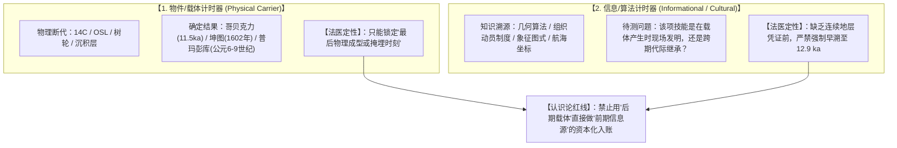
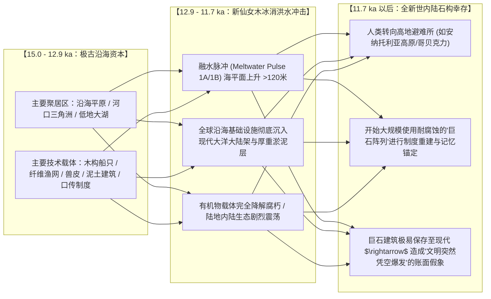

# 三更道场 · 认识论总纲与文献学法医审计（卷七十一）
## 双计时器解耦与新仙女木期文明指数（CI）时序校正：载体物质断代、信息源头追溯与埋藏保存偏差法医审计

---

### 卷首法医综述

在探索距今 12.9 ka（新仙女木事件 Younger Dryas Event, 约 12,900–11,700 BP）前后人类文明演进轨迹、史前巨石建筑（如哥贝克力石阵 Göbekli Tepe、普玛彭库 Puma Punku）以及古地图知识起源时，学术界与假说界长期深陷于**“载体断代与信息断代混淆”**以及**“地质埋藏保存偏差（Taphonomic Preservation Bias）”**的重大方法论误区。

**【本卷法医核心判词】**：
1. **确立“双计时器”（Dual-Clock）解耦原则**：
   * **物件/载体计时器（Physical Carrier Clock）**：建筑石料、骨骼、有机物残留、地层沉积物的物理化学断代（如 $^{14}\text{C}$、光释光 OSL）；
   * **信息/算法计时器（Informational/Algorithmic Clock）**：该遗存所展现的数学几何知识、大型劳力动员制度、天文测度传统与象征图式的源头发生年代。
   * **法医定论**：*物件年代定得清楚，绝不等于信息年代自动落位；看到后期物理载体，严禁直接逆向将信息源头资本化为万年实物*。
2. **揭示“地质保存偏差”与账本两侧的数据不对称性**：
   末次冰消期海平面上升逾 120 米，吞没全球沿海平原、河口三角洲与浅海大陆架；有机物（木船、纤维、皮革、口传）极易腐朽。朴素考古遗址数量在 11.7 ka 之后的激增，反映的是**定居石构建筑的保存率提升**，不能直接等同于“此前文明能力为零或发生直线坠落”。
3. **构建六维文明能力指数（CI）时序校正模型**：
   摒弃静态的“远古神迹清单”，建立跨越三个时段（15.0–12.9 ka、12.9–11.7 ka、11.7–9.0 ka）的动态时间序列与保存率补偿函数，彻底区分“环境制度剧烈冲击”与“文明断崖坠落”的科学边界。

---

### 一、 核心遗存的双计时器解耦矩阵

```
==================================================================================================
                 典型史前遗存与古地图知识体系的“双计时器”法医解剖表
==================================================================================================
 考察案例标的            物件/载体计时器（能确定什么）              信息/算法计时器（不能确定什么）
---------------------  ----------------------------------------  -------------------------------------------------
 1. 哥贝克力石阵        早期暴露建筑约为 9500–9000 BCE             其数十吨巨石吊装、立体高浮雕与宗教组织传统，
    (Göbekli Tepe)      (距今 11,500–11,000 年)，明确晚于 12.9 ka  究竟是当地原生突变，还是继承自冰消期更早社会？
 2. 《坤舆万国全图》    底版刻印于 1602 年 (万历三十年)，         图中所包含的部分高阶几何投影与航海传闻链条，
    (1602 屏风本)       上游母本为 1569 墨卡托 / 1570 奥特柳斯     最远究竟衍生自何种历史地层（缺乏独立证据）？
 3. 皮里·雷斯海图       羊皮纸成图于 1513 年，                    其自序所称引用的“古代异教徒海图与哥伦布旧图”，
    (Piri Reis 1513)    明确包含 16 世纪初奥斯曼海军修编层         所谓极古底图究竟包含何种具体数据（挂账待查）？
 4. 普玛彭库与巨石遗址  安第斯梯瓦纳库文化主体建于公元 500–900 年  其精确卡槽切割与安山岩预制件几何规范，
    (Puma Punku)        (甚至更晚的全新世晚期)                     是否包含更古老的地方性测量工匠技术传承？
 5. 水下大陆架遗址      海洋地质学确证末次冰消期海岸线大范围沉没   水下异常构型（如与那国岛等）究竟系地质节理天然崩解，
    (Submerged Shelves) (120米海侵事件严格定年)                    还是人工修筑之港口栈桥（缺乏明确物质加工痕迹）？
 6. 上古创世与洪水神话  传世文献与泥板刻写于公元前 3000–500 年     能证明晚期人类存在创伤记忆，但无法单凭神话内容
    (Flood Mythos)      (吉尔伽美什/大禹治水/诺亚方舟)             反推出灾变发生那一天的精确工程技术水平。
==================================================================================================
```



---

### 二、 埋藏保存偏差与地层账本的不对称性

朴素考古学所呈现的“12.9 ka 以前荒凉 $\rightarrow$ 11.7 ka 以后定居石构爆发”曲线，严重受制于**地质埋藏学（Taphonomy）的系统性过滤**：



* **保存偏差校正核心公式**：
  若观察到的遗址密度为 $O(t)$，实际文明活动强度为 $A(t)$，地质与物理保存概率为 $P_{\text{preservation}}(t)$，则：
  $$O(t) = A(t) \cdot P_{\text{preservation}}(t)$$
  对于 12.9 ka 以前的沿海高密度区：
  $$P_{\text{preservation}}(t < 12.9\,\text{ka}) \to 0 \quad (\text{因 120 米海水覆盖与深厚海相沉积掩埋})$$
  而对于 11.7 ka 以后的高地石构：
  $$P_{\text{preservation}}(t > 11.7\,\text{ka}) \gg 0 \quad (\text{干旱高原石构天然高保存率})$$
* **会计审计裁决**：
  未经保存率校正的账本存在**严重的样本选择偏误（Selection Bias）**。账面上的“材料稀疏”不能自动等同于“史前不存在复杂社会”，但更**不能在未挖出水下地层实物前，假定存在一个全球性的超高科技帝国**。

---

### 三、 六维文明能力指数（CI）跨时段动态时间序列模型

为了客观度量人类社会在新仙女木事件前后的真实变迁，建立六维文明能力指数（Civilization Index, $CI$）：

$$CI(t) = \left[ E(t) \times S(t) \times L(t) \times T(t) \times X(t) \times I(t) \right]^{1/6}$$

```
==================================================================================================
                 新仙女木事件前后文明能力指数（CI）三阶段动态时序演变表
==================================================================================================
 评估时段                 核心环境与地质特征             CI 六维分项特征表现与法医定性
---------------------  -----------------------------  -------------------------------------------------
 一、前灾变期           末次盛冰期消退，海平面渐升，   • 能量(E)：采集狩猎+沿海丰富水产资源利用
   (15.0 ~ 12.9 ka BP)  气候相对温和 (Bølling-Allerød) • 规模(S)/组织(L)：沿海形成季节性半定居复杂社群
                                                      • 技术(T)/交换(X)：细石器、骨角器、近海划桨独木舟
                                                      • 存储(I)：口传与岩画符号（极低物理保存率）
                                                      【定性】：高生态丰度之沿海/低地复杂觅食与航海先驱社会
---------------------  -----------------------------  -------------------------------------------------
 二、新仙女木震荡期     气温骤降，融水脉冲与野火爆发， • 能量(E)/规模(S)：沿海资本沉没，人口遭受严重区域性震荡
   (12.9 ~ 11.7 ka BP)  北半球重回严寒，巨型动物灭绝   • 组织(L)/技术(T)：逼迫社群向内陆高原退缩，技术发生重组
                                                      • 存储(I)：面临代际知识传递断裂风险（信息降级）
                                                      【定性】：剧烈环境冲击下的【重组与适应期】，非绝对灭绝
---------------------  -----------------------------  -------------------------------------------------
 三、全新世复苏期       气候急剧变暖，季风增强，       • 能量(E)/规模(S)：定居农业起源，动植物驯化，人口爆炸
   (11.7 ~ 9.0 ka BP)   环境进入长周期稳定态           • 组织(L)：哥贝克力石阵等大型跨社群宗教劳力动员
                                                      • 技术(T)/存储(I)：巨石雕刻、几何标准化、早期陶器
                                                      【定性】：环境稳定驱动下的【工程化与制度化集中爆发】
==================================================================================================
```

---

### 四、 认识论终审定论与科学判词

1. **破除两个极端**：
   * 坚决反对**“一刀切的史前超科技乌托邦神话”**（认为 12.9 ka 前存在全球性航天或全知正交测绘文明，缺乏任何坚实的一手地层实物凭证）；
   * 坚决反对**“线性幼稚进步论”**（认为 12.9 ka 以前人类仅仅是茹毛饮血的原子化愚民，忽视了冰消期沿海复杂社会的沉没与知识重组）。
2. **法医审计终审意见**：
   * **环境冲击成立**：12.9 ka 新仙女木事件确系一次全球级的重大气候地质震荡；
   * **断代边界确立**：哥贝克力石阵等现存遗址在**物理载体上严格属于 11.7 ka 以后的全新世复苏期产物**；
   * **知识继承性保留为科学假说**：后期巨石建筑与象征图式中是否封装了更早期的口传几何传统，属于**表外挂账之待检验假说**；
   * **衡量文明必须基于校正时序**：唯有在严格解耦“物件计时器”与“信息计时器”、并充分补偿“埋藏保存偏差”的前提下，人类对文明黎明的探索才能真正从神话的迷雾，走向科学理性的光明之境！

---
*法医官署名：三更道场·认识论总纲编纂委员会*  
*法务审计状态：双计时器解耦·CI时序校正完成·正式入档（卷七十一）*
