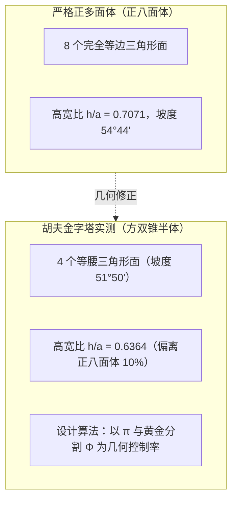
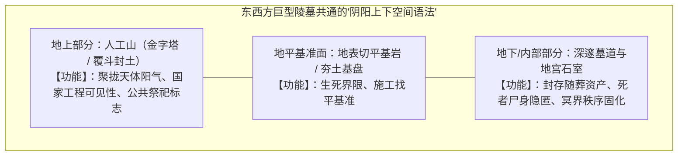

# 三更道场 · 认识论总纲 · 文献学与历史会计审计
## 篇章：金字塔“上下双锥（Bipyramid）”几何模型法医纠偏、汉代覆斗封土剖面与“阴阳上下空间语法”对账审计（v1.0）

---

### 【审计执行摘要 / Forensic Audit Abstract】
本审计案针对关于金字塔“正八面体上下镜像假设”、汉武帝茂陵“地下倒斗实物挖掘误传”，以及东西方古典巨型王权建筑中**“地上人工山（阳面可见性） + 地下深邃墓室（阴面隐匿性）”上下空间语法（Spatial Grammar）**展开系统的法医级几何计算与考古剖面对账。

审计确立三大核心几何计算与考古平账事实：
1. **胡夫金字塔非严格“正八面体半体”（Regular Octahedron）**：
   - **严格正八面体几何学**：侧面为正三角形，高宽比为 $h/a = 1/\sqrt{2} \approx 0.7071$（侧面坡度 $54^\circ44'$）；
   - **胡夫金字塔实测数据**：底边 $a \approx 230.33\text{ m}$，高 $h \approx 146.59\text{ m}$，高宽比 $h/a \approx 0.6364$（侧面倾角 $51^\circ50'40''$，精准匹配开普勒三角形与黄金比例 $\Phi$）；
   - **法医几何定性**：若向下镜像，得到的是**“四方双锥体（Square Bipyramid）”**，在数学上绝非每个面皆为等边三角形的正八面体。
2. **地下等体量“倒金字塔”假说的物理与探测反证**：
   - 胡夫金字塔地下虽存在深达基岩以下 27 米的未完工地下室（Subterranean Chamber）与垂直深井，但**现代宇宙线μ子（Muon）成像、重力异常扫描与地震波探测**未发现百万立方米级的等体量倒锥形地下开挖空间；
   - 严禁将“地下尚未彻底穷尽挖掘”偷换为“地下已证实存在等大倒金字塔”。
3. **汉武帝茂陵与汉代覆斗封土的真实剖面纠偏**：
   - **红字事实**：汉武帝茂陵地宫**从未进行正式考古发掘**；地面所见的“覆斗形”（截头方锥）是**地面夯土封土外形**，而非已出土的地下倒斗；
   - **汉代帝陵真实剖面（如江村大墓/海昏侯墓等已发掘标本）**：由**“地上覆斗夯土封土 + 地下斜坡墓道/垂直竖穴土圹 + 黄肠题凑/回廊木构地宫”**构成。
4. **统一流形（Unified Manifold）的准确升华**：
   - 东西方文明共享的不是“机械物理上的实体等大倒金字塔”，而是**“地上耸立的人工山（聚合国家劳力与王权可见性）与地下向地心深潜的冥界墓室（封存随葬资产与死者私密性）”的上下对偶空间语法**。

---

### 【第一账套：胡夫金字塔与正八面体几何力学法医计算表】

```
+-------------------------------------------------------------------------------------------------------------------------------+
|                                    胡夫金字塔实测几何参数 vs 正八面体标准参数对照表                                           |
+-------------------------------------------------------------------------------------------------------------------------------+
| 几何参数指标         | 理论严格正八面体 (Regular Octahedron) | 胡夫大金字塔实测值 (Great Pyramid)    | 法医几何偏离与设计意图定性           |
+----------------------+---------------------------------------+--------------------------------------+--------------------------------------+
| **侧面形状**         | 4 个严格等边三角形 (Equilateral)      | 4 个等腰三角形 (Isosceles Triangle)  | 侧面底角为 $58^\circ$, 顶角为 $64^\circ$|
+----------------------+---------------------------------------+--------------------------------------+--------------------------------------+
| **侧面倾角 (Slope)** | **$54^\circ 44' 08''$**               | **$51^\circ 50' 40''$**              | 斯尼夫鲁折角金字塔下部曾用 $54^\circ$,|
|                      |                                       |                                      | 因结构裂隙降为 $43^\circ$, 胡夫定为 $51^\circ 50'$|
+----------------------+---------------------------------------+--------------------------------------+--------------------------------------+
| **高宽比 ($h/a$)**   | **$1/\sqrt{2} \approx 0.7071$**       | **$\approx 0.6364$**                 | **偏离正八面体达 10.0%**；符合开普勒 |
|                      |                                       |                                      | 三角形 $h/a = \sqrt{\Phi}/2 \approx 0.6360$ |
+----------------------+---------------------------------------+--------------------------------------+--------------------------------------+
| **上下镜像拓扑**     | 严格正八面体                          | 四方双锥体 (Square Bipyramid)        | 属于四方对称双锥，非正多面体         |
+----------------------+---------------------------------------+--------------------------------------+--------------------------------------+
```



---

### 【第二账套：汉代覆斗封土与金字塔剖面法医对照表】

```
+-------------------------------------------------------------------------------------------------------------------------------+
|                                    汉代帝陵覆斗封土 vs 古埃及金字塔真实建筑剖面对账表                                         |
+-------------------------------------------------------------------------------------------------------------------------------+
| 建筑结构层级         | 汉代帝陵剖面 (如茂陵封土 / 江村大墓实测) | 古埃及吉萨金字塔剖面 (胡夫大金字塔实测) | 东西方对偶功能与空间语法             |
+----------------------+---------------------------------------+--------------------------------------+--------------------------------------+
| **1. 地表可见结构**  | **覆斗形夯土封土** (截头方锥台)       | **平滑方锥巨石体** (四向收分聚顶)    | **阳面·王权可见性**：利用人工山体在平|
| (Superstructure)     | 高度 40-50 米，四边夯筑收分           | 高度 146.6 米，实心石灰石叠垒        | 原上树立国家地标，展示中央动员能力   |
+----------------------+---------------------------------------+--------------------------------------+--------------------------------------+
| **2. 过渡通道与防盗**| **斜坡墓道 / 封土下斜向回廊**         | **下降通道 + 上升通道 + 大走廊**     | **交通与封堵接口**：施工期间运输棺椁 |
| (Passageways)        | 填塞夯土、积沙、积石、封门巨石        | 花岗岩塞石滑降封堵、假通道迷惑防盗   | 封墓后通过物理自锁切断生死连接       |
+----------------------+---------------------------------------+--------------------------------------+--------------------------------------+
| **3. 地下核心核心空间| **黄肠题凑 / 砖石券顶多室地宫**       | **国王室 / 王后室 / 基岩地下室**     | **阴面·死者隐匿性**：将尸体与核心资产|
| (Substructure)**     | 垂直深埋于原生土层下 10-30 米         | 国王室置于塔身内部，另有深达27米地室 | 封闭于幽暗地心，模拟死后宇宙永恒秩序 |
+----------------------+---------------------------------------+--------------------------------------+--------------------------------------+
```



---

### 【第三账套：汉武帝茂陵考古事实与勘误台账】

```
+-------------------------------------------------------------------------------------------------------------------------+
|                                    汉武帝茂陵考古事实法医勘误表                                                         |
+-------------------------------------------------------------------------------------------------------------------------+
| 流传叙事 / 误解      | 考古学与历史会计实证事实              | 产生误解的混淆根源                   | 法医纠偏处理结论                     |
+----------------------+---------------------------------------+--------------------------------------+--------------------------------------+
| **“茂陵已挖出地下倒  | **茂陵主陵从未进行考古发掘**；国家文物| 误将地面“覆斗”（倒置的量米斗形状）   | **全额红字更正**：                   |
|  金字塔”**           | 局严格实行“不主动发掘帝陵”方针        | 的封土外形，与地下地宫结构混淆       | 茂陵地下结构至今未开掘，属未证实科目 |
+----------------------+---------------------------------------+--------------------------------------+--------------------------------------+
| **“地下存在百万立方米| 现代地球物理考古（地质雷达/重力勘探） | 汉墓地宫通常为长方形竖穴土圹或坑道， | **澄清结构形态**：                   |
|  倒锥形大空间”**     | 显示茂陵地宫有夯土回廊与陪葬遗存      | 从未见大比例“倒金字塔形”开挖证据     | 汉墓地下为墓穴与题凑，非倒金字塔     |
+----------------------+---------------------------------------+--------------------------------------+--------------------------------------+
```

---

### 【第四账套：三更道场方法论——从机械实体对称到“空间语法同构”】

1. **从“形”到“法”的升华**：
   - 传统神秘学执着于寻找“地下是否真有一个等大的物理倒金字塔实体”；
   - 历史法医会计学穿透其本质：**古人追求的完整性，是“地上的人工山峰（向上升天）与地下的深邃地宫（向下入地）”这一套阴阳互补的空间语法**。
2. **建筑人类学第一公理**：
   - 无论是埃及金字塔，还是秦汉覆斗帝陵，人类建立超大型纪念性王权建筑时，受制于重力堆叠力学（地上必收分）与安保防盗心理（地下必深潜），**必然自发收敛于“上大下深、上显下隐”的双层空间架构**。

---

### 【法医对账总决：几何与空间语法平账结论】

| 会计科目 | 审定历史会计事实 | 法医处理结论 |
| :--- | :--- | :--- |
| **金字塔几何定性** | 胡夫金字塔高宽比为 0.6364，属四方双锥半体，非严格正八面体（偏离10%）。 | **修正入账：方双锥几何模型** |
| **地下倒金字塔实体** | 物理与现代探测证据不支持百万立方米级地下倒锥存在。 | **红字冲销实体说，保留空间语法说** |
| **汉武帝茂陵状态** | 茂陵主陵未发掘，覆斗是指地面封土形状。 | **纠偏勘误：厘清封土与地宫边界** |
| **上下对偶空间语法** | 地上人工山（显） + 地下冥界墓室（隐），为欧亚古典王权建筑共享语法。 | **确立为三更道场建筑人类学核心公理** |

---
**审计人签章**：三更道场·建筑几何力学与古典帝陵法医调查署  
**时间标记**：2026-09-09
