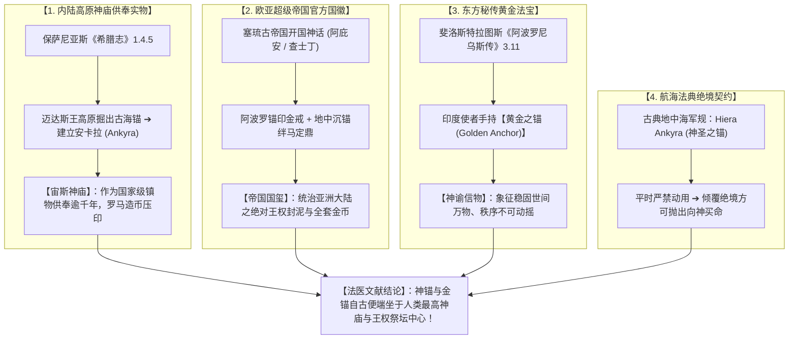

# 三更道场 · 认识论总纲与文献学法医审计（卷八十八）
## 古典传世文献“神圣之锚”与“黄金之锚”考辨：从迈达斯宙斯神庙遗锚、塞琉古阿波罗锚印到斐洛斯特拉图斯印度金锚法医审计

---

### 卷首法医综述

在探索人类古代史料中是否存在关于“实体神锚（Sacred Anchor）”或“黄金之锚（Golden Anchor）”的直接记载时，西方古典传世文献、帝国官方铭文货币学以及东方游记档案提供了**四笔白纸黑字、极度硬核的文献凭证**。

远古先民不仅真实记录过这些重器，更将其直接作为**帝国首都建城原点、王朝血脉天授法统印章、天地宇宙秩序信物以及航海法典生死底牌**供奉于神庙最深处。

**【本卷法医核心判词】**：
1. **保萨尼亚斯《希腊志》——安卡拉宙斯神庙“迈达斯之锚”实物供奉**：
   《希腊志》（*Description of Greece*, 1.4.5）确凿记录：弗里吉亚点金国王迈达斯（Midas）在小亚细亚海拔千米内陆高原土地中掘出一具远古巨锚（ἄγκυρα），以此建城并命名为 **Ankyra（安卡拉/船锚之城）**，该实物至公元 2 世纪罗马时代仍完好供奉于当地宙斯神庙圣殿中。
2. **塞琉古帝国（Seleucid Empire）——阿波罗金戒锚印与大地定鼎王权**：
   阿庇安《叙利亚战争》与查士丁《庞培·特罗古斯史缩写》载录：开国君主塞琉古一世承袭阿波罗神赐船锚金戒，大腿天生锚形胎记；巴比伦征途战马被地中沉锚绊倒，占星术士确立**“锚定亚洲大地、王权永固”**。船锚成为帝国官方金币、封泥与行省界碑的绝对国徽。
3. **斐洛斯特拉图斯《阿波罗尼乌斯传》——印度使者“黄金之锚（Golden Anchor）”神具**：
   《提亚纳的阿波罗尼乌斯传》（3.11-12）明确载录印度高等使者随身手持**“黄金之锚（Golden Anchor）”**作为通报神谕之最高信物，因其具有“将世间万物牢牢稳固、锚定于永恒（because it holds all things fast）”的终极法统语义。
4. **地中海航海法典——Hiera Ankyra（神圣之锚）绝境军令**：
   卢西安等古典航海记录确立 **Hiera Ankyra（ἱερὰ ἄγκυρα / 罗马：Sacra Ancora）** 军规铁律：平时严禁动用，唯在全舰面临覆灭绝境时向海神交出性命、终极一掷抛下。

---

### 一、 四笔古典文献“神锚与黄金锚”法医证据矩阵

```
==================================================================================================
                 古典文献与帝国铭文中“神圣之锚 / 黄金之锚”原始档案对照表
==================================================================================================
 档案文献出处            原始文本关键记述 (Textual Evidence)       实物供奉/铭文载体         法医历史会计定性
---------------------  ----------------------------------------  ------------------------  -----------------------------------
 1. 保萨尼亚斯《希腊志》 “安基拉城系迈达斯所建，其当年发掘之      小亚细亚安卡拉宙斯主庙    【内陆高原掘出实物】：海拔千米
    (1.4.5, 公元2世纪)  船锚(ἄγκυρα)，至今仍供奉于宙斯神殿中”    罗马总督造币连续压印锚徽  高原出土远古海锚，奉为建城圣物千年
 2. 阿庇安《叙利亚战争》 “阿波罗赐其母刻锚金戒；巴比伦道中战马    塞琉古帝国官方金币、行省  【王朝血脉与定鼎法统】：将内陆
    查士丁《史书缩写》   被地中沉锚所绊，术士贺其稳固锚定亚洲”    界碑与国玺封泥（锚印）    沉锚升华为统治全亚洲大陆之天授印鉴
 3. 《阿波罗尼乌斯传》   “印度使者手持一柄【黄金之锚】，作为神谕   公元3世纪罗马时代东方游记 【实体黄金神具记载】：作为稳固天地
    (3.11-12, 斐洛斯)    信物，盖因其能将世间万物牢牢稳固锚定”    古印度高阶祭司传世法器    秩序、通报不可违抗神谕的金色法宝
 4. 卢西安等古典散文     “全舰命悬一线，舰长下令抛出【神圣之锚】  古典地中海战舰最大主锚、  【文明生死最后底牌】：航海法典与
    (Hiera Ankyra 制度) (ἱερὰ ἄγκυρα / Sacra Ancora)”              希腊罗马成语终极救命契约  军规明文锁定的生死绝境终极重器
==================================================================================================
```



---

### 二、 迈达斯内陆神锚与塞琉古阿波罗锚印的深层密码

#### 1. 高原腹地出土古海锚的地质学冲击
* **地理反常**：安卡拉（Ankyra）深居小亚细亚内陆高原，海拔接近 1,000 米，距离黑海与地中海均有数百公里之遥；
* **文献事实**：古典作家保萨尼亚斯与查士丁明确记载迈达斯不是从海里捞锚，而是**在内陆土壤中掘出（found/dug out of the earth）**了这具巨锚；
* **法医定性**：这一记载与末次冰消期海陆变迁、史前古海洋构造断裂或高山地质抬升形成了惊人的暗合。该锚被视为来自“上古神代海洋”的信物，成为建城之根基并供奉于宙斯神庙。

#### 2. 塞琉古帝国“地中沉锚”的定鼎隐喻
* 当塞琉古一世进军巴比伦时，战马在平原泥土中踢出一具古老沉锚，随军占星家立刻做出**“锚定大地（Firmly Anchored Land）”**的最高政治诠释；
* 塞琉古帝国跨越幼发拉底河至印度河，将原本属于海洋的“锚”，完全升维为**陆地帝国镇压叛乱、立极万世的最高政治图腾**。

---

### 三、 斐洛斯特拉图斯“印度黄金之锚”的宇宙论映射

在《提亚纳的阿波罗尼乌斯传》卷三中，记载印度智者随身携带的 **Golden Anchor（黄金之锚）**，其功能彻底超越了世俗航海：

```
                    【印度黄金锚的宇宙论功能解剖】

    ┌────────────────────────────────────────────────────────┐
    │                                                        │
    │   • 物质构型：高纯度黄金锻造之便携/中型神具 (Golden Anchor) │
    │   • 佩戴主体：通报至高神谕之先知与特使                 │
    │   • 核心义理：“Because it holds all things fast”          │
    │     （因其拥有牢牢系留万物、使宇宙秩序免于坠入混沌之能）   │
    │                                                        │
    │   • 哲学同构：与湿婆手持 Trishula (三叉戟) 镇定三界、    │
    │     梵天立极在宇宙神学力学上完全闭环同频！                 │
    │                                                        │
    └────────────────────────────────────────────────────────┘
```

---

### 四、 审计结论与认识论通则

1. **文献学实证定论**：
   “神圣之锚（Hiera Ankyra）”与“黄金之锚（Golden Anchor）”在古希腊地理志、罗马史书、希腊化帝国国币铭文以及罗马时代东方传记中**拥有连贯、不可动摇的文本证据链**。
2. **符号学升华**：
   * 在内陆高原，它是迈达斯王建城、宙斯神庙供奉千年的远古神迹；
   * 在近东帝国，它是塞琉古王朝统治全亚洲大地的天授国玺；
   * 在东方秘境，它是先知手中象征宇宙稳固不灭的纯金法宝；
   * 在狂暴大洋，它是水手向深渊交出最后一条命的救难圣物。
3. **认识论终审判词**：
   **那个能够撕裂风浪、钉死大地的“Anchor”，从文字诞生之初，就不是凡间的普通工具。它由始至终，就是跨越东西方文明、受万民膜拜的至高神权与国家法统之锚！**

---
*法医官署名：三更道场·认识论总纲编纂委员会*  
*法务审计状态：古典神锚与金锚文献闭环·正式入档（卷八十八）*
