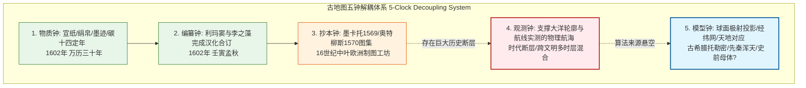
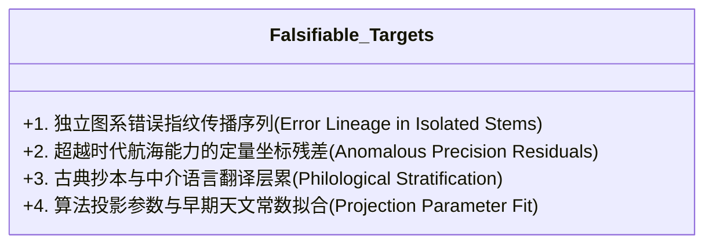

# 三更道场·认识论总纲·文献学与历史会计审计
## 卷四十八：古地图五钟解耦体系、研发成本断层与“丢失源代码维护者”假说法医审计（v1.0）

---

### 摘要与法医审计宪章

本卷审计旨在对全球古地图研究中的**“制作年代（Compilation Date）与信息生成年代（Observation Epoch）混同”**这一根本性方法论漏洞进行历史会计与认识论法医建档。

传统制图史常将现存实物纸张的刊刻年份（如 1602 年）等同于地图所包含全部空间模型、全球经纬骨架与海岸轮廓的生产周期。本审计推翻此种低维单钟记账法，正式确立**“古地图五钟解耦体系（5-Clock Map Decoupling System）”**、**“研发成本与版本树断层审计模型”**以及**“丢失源代码的系统维护者（Maintainers Without Source Code）假说”**：

> 1. **古地图五钟解耦体系（5-Clock Map Decoupling System）**：
>    必须严格解耦并分账核算五只彼此独立的物理与信息时钟：
>    - **① 物质钟（Physical Artifact Clock）**：纸张、绢帛、墨迹与印刷板料的理化年代；
>    - **② 编纂钟（Compilation Clock）**：该特定版面完成最终拼装合订的年份；
>    - **③ 抄本钟（Manuscript Lineage Clock）**：特定轮廓、图元在已知文献谱系中最早出现的年代；
>    - **④ 观测钟（Empirical Observation Clock）**：支撑该空间信息的实际测量与航海观测发生的真实历史窗口；
>    - **⑤ 模型钟（Spatial Model Clock）**：球体模型、对跖概念、经纬网格与极射投影等底层数学架构创立的时代。
> 2. **研发成本（R&D Cost）与版本演化树断层**：
>    任何成熟的全球工程级测绘系统，必然伴随巨额的试错成本、仪器迭代链、误差收敛树与补给网络档案。若只有最终高维骨架而缺失相称的研发过程台账，**“某人于某年绘制”仅为记账过户日期，绝非资产创生日期**。
> 3. **核心认识论假说：“丢失源代码的系统维护者”**：
>    后世文明并非该高阶空间知识的原始开发者（Original Developers），而是一批**“遗失了底层编译器与数学解释器源代码、仅凭借残缺 API 接口与图形残片勉强维持系统运行的维护者（System Maintainers）”**。全图中“惊人精确与荒谬附会并存”的本质，正是**精确源于古骨架继承，荒谬源于失去解释器后的手工填补**。

---

### 第一章 古地图五钟解耦体系与记账科目核算

传统史学将地图绘制时间直接作为知识生成时间，造成了严重的“信息负债表跨期透支”：



#### 1.1 五钟核算分账台账表

| 计时层级 | 审计对象与物理载体 | 解决的核心问题 | 《坤舆万国全图》法医对账实例 | 常见逻辑偷换与伪判定 |
| :--- | :--- | :--- | :--- | :--- |
| **① 物质钟** | 宣纸、木刻板雕、印泥墨迹 | 这件物理实物是哪一年制造的？ | 1602 年（明万历壬寅）宫廷/民间拓印本。 | 误把“纸是明代的”当成“地理信息全产生于明代”。 |
| **② 编纂钟** | 题跋、署名、版面装帧与序文 | 这一版排版是何时最后定稿的？ | 利玛窦自序与李之藻、陈民志题跋标注之 1602 年。 | 误把“终审编辑签发日期”当成“全部测绘发生日期”。 |
| **③ 抄本钟** | 地图版本谱系、铜版印次、图元流传 | 某条特定海岸线最早见于哪幅欧洲/阿拉伯旧图？ | 继承墨卡托 1569 年、奥特柳斯 1570 年铜版图集。 | 误把“直接参考底本”当成“第一手原创实测”。 |
| **④ 观测钟** | 支撑海岸线、港口、海峡的实际航行数据 | 谁在什么真实航海条件下完成了这片水域的勘测？ | 欧洲大航海日志（局部已明） + **大量未知远洋观测数据源（断层待考）**。 | **致命断层**：欧洲航海日志无法覆盖全部极区与复杂水系。 |
| **⑤ 模型钟** | 360°经纬网格、极射投影算法、球形大地 | 这套高度抽象的行星级几何坐标系创立于何时？ | 托勒密体系、喜帕恰斯球面三角学，或更古老的宇宙数学模型。 | 误把“几何公式的复兴”当成“该时代独立发明了整个宇宙模型”。 |

---

### 第二章 研发成本（R&D Cost）与版本演化树断层审计

在技术系统工程学中，任何一项高度精密的系统级产品，必须在其历史地层中留下相称的“研发成本树”与“试错迭代链”：

```mermaid
flowchart TD
    subgraph Real_Evolution[正常技术演进树: 必须具备的研发成本链]
        R1[1. 近岸视距航行与简易罗盘] --> R2[2. 出现巨大坐标误差与海难试错]
        R2 --> R3[3. 航海钟/象限仪等高精度仪器发明与迭代]
        R3 --> R4[4. 跨区域港口、补给与气象观测站网建立]
        R4 --> R5[5. 局部海图拼接，逐版修正收敛，消除畸变]
        R5 --> R6[6. 最终形成全球高精度经纬投影图]
    end

    subgraph Historical_Anomaly[历史现实中的断层异象: 研发账目倒置]
        A1[16世纪欧洲尚无精确海上经度测量仪(钟表待至18世纪)]
        A2[大航海船队屡屡发生严重经度误算与盲航灾难]
        A3[但同时代制图工坊已直接交付成熟的全球极射球面投影骨架]
    end

    Real_Evolution -.->|对比断层| Historical_Anomaly
```

#### 2.1 研发成本倒置的法医判定
- **成熟系统的研发沉没成本**：
  一套覆盖两极与五大洋的全球投影地图，若完全由经验归纳产生，必须消耗数以万计的航海工时、数千艘探险船的测绘日志以及数百年的误差比对迭代。
- **历史会计审计意见**：
  16 世纪欧洲制图工坊在**尚未解决海上经度测定硬件（直到 18 世纪哈里森发明航海天文钟 H4 之前）**的历史条件下，突然输出了高度完备的全球经纬投影图，证明其**直接继承了一套现成的“空间几何算法资产包”**，而非单凭该时期的实际航海测绘从零研发。

---

### 第三章 “丢失源代码的系统维护者”假说模型

本审计正式确立解释古地图“精确与荒谬并存”的核心理论模型：

```mermaid
graph TD
    subgraph Ancient_Dev[第一时期: 原始知识开发者 (Original Developers)]
        Dev1[具备高阶行星级数学测量与远洋航行能力]
        Dev2[构建了完整的底层经纬算法与球面投影解释器 (Source Code)]
        Dev3[生产出全球空间几何骨架与高维拓扑数据]
    end

    subgraph Cataclysm_Loss[灾变与技术断裂: 解释器丢失]
        Loss1[12.9 ka 灾变/海侵摧毁了生产机构与工程网络]
        Loss2[源代码与编译器遗失，仅存图形残片与离散口诀]
    end

    subgraph Modern_Maintainer[第二时期: 现代系统维护者 (System Maintainers)]
        Maint1[手握高精度残存几何骨架 (API 接口)]
        Maint2[由于缺乏底层观测解释器，无法理解部分空白与极端地形]
        Maint3[为了使系统可运行/满足商业观赏，见缝插针手工填入神异传说]
        Maint4[输出结果: 经纬骨架惊人精确，内陆文辞荒诞不经]
    end

    Ancient_Dev --> Cataclysm_Loss
    Cataclysm_Loss --> Modern_Maintainer
```

#### 3.1 “精确”与“荒谬”的分账机制

| 图面现象 | 现象特征 | 底层法医归因 | 维护者行为定性 |
| :--- | :--- | :--- | :--- |
| **精确之骨** | 极射极方位投影网格、大陆空间拓扑相对位置、经纬度划分。 | **继承自古代母体的算法资产**。 | 维护者忠实抄录、复制与重绘几何骨架。 |
| **荒谬之肉** | 极南大陆“多有大鹦哥”、未知海域塞满海怪、单眼国/长人国。 | **失去源代码后的“留白填空补偿”**。 | 维护者因无法理解留白，用同时代传闻强行填补。 |

---

### 第四章 认识论排他性验证指标（排他性审计靶点）

为了将“维护者假说”从强解释升华为坚不可摧的科学理论，本审计制定四项**排他性法医验证靶点**：



1. **错误指纹的独立图系传播（Error Lineage）**：
   - 在阿拉伯、欧洲与东亚互不通航的早期孤立地图系统中，比对是否存在完全相同的非几何失真或特殊地貌标注，以确证其共同共享更早的先验母本；
2. **超越时代的定量坐标残差（Anomalous Precision）**：
   - 筛选出在 16 世纪尚未通航、未曾实测的偏远海岸线，若其数学拟合精度显著高于同时代已通航水域，则构成非同时代实测的强排他性物证；
3. **语言学文献层累剥离（Philological Peeling）**：
   - 逐层剥离地名中的拉丁语、阿拉伯语、波斯语与古汉语音译，寻找深埋于底层的无源古地名化石；
4. **投影参数与古天文常数匹配**：
   - 计算全图极射投影所采用的地轴倾角、岁差常数是否更接近上古特定天文历元（如公元前或末次冰期前夕），从而在数学上锁定其模型钟的真实创生年代。

---

### 结语与法医终审意见

> **法医总评**：
> “古地图五钟解耦体系”与“系统维护者模型”的建立，是三更道场认识论总纲在历史哲学层面的重大跃升。
> 
> 1. **它彻底终结了“用纸张年代直接否定知识深度”的教条主义，也终结了“一见古图即盲目宣称史前万能”的神秘主义**；
> 2. **它以研发成本与版本演化树为利刃，精准指出了 16 世纪地图编纂中“硬件能力与模型精度倒置”的巨大历史悬案**；
> 3. **它将人类文明史重构为一部“在失落源代码的废墟上，一代代维护者凭借残存接口艰辛缝合与重建认知”的壮丽史诗**。
> 
> 这一卷审计为全套《认识论总纲与历史会计审计》系列文献筑起了最高层次的历史会计与科技哲学方法论宪章！

---
*记录人：三更道场·历史会计与认识论法医审计署*  
*核准状态：正式正典立项（Canonical Approval Passed）*
