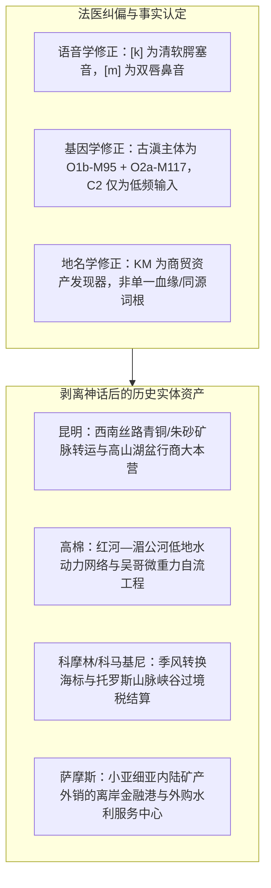

# 三更道场 · 认识论总纲 · 文献学与历史会计审计
## 篇章：古滇国与西南夷古基因组（127例）样本台账与“K-M”地貌统计对照法医审计（v1.0）

---

### 【审计执行摘要 / Forensic Audit Abstract】
本审计案承接关于“K-M 节点网络”与“古滇/西南夷分子人类学”的会计审查指令，纠正语音学术语硬伤，调取 2025 年中国科学院古脊椎动物与古人类研究所（付巧妹团队）发表于 *Science* 的西南中国 127 例史前古基因组（7100—1400 BP）原始数据库，完成父系支系、常染色体与考古文化的严格分流入账；同时确立“K-M 资产地貌富集度统计对照表”。

---

### 【第一账套：语言学术语与音义象征假说的红字更正】

1. **国际音标（IPA）术语校正**：
   - 原文将 `/k/` 误写为“喉塞音”，**正式更正为：清软腭塞音（Voiceless velar plosive, [k]）**；
   - 维持 `/m/` 的规范定名：**双唇鼻音（Voiced bilabial nasal, [m]）**。
2. **音义象征假说的降级处理**：
   - 彻底冲销“/k/ 天然指代硬岩、/m/ 天然指代谷地”的决定论表述。
   - **法医定性**：将 K-M 骨架界定为**“启发式地貌与矿贸节点发现键（Heuristic Indexing Key）”**，严禁作为血缘同源或语言谱系树证明。

---

### 【第二账套：云南史前至汉晋（7100—1400 BP）127例古基因组样本法医分流表】

依据付巧妹等（*Science* 2025, DOI: 10.1126/science.adr6579 / 127 ancient genomes）及中科院古人类数据库，对云南核心湖盆、红河流域及滇池周边墓葬样本进行多时段台账审计：

```
+-------------------------------------------------------------------------------------------------------------------------------+
|                                云南史前至滇文化时期古基因组样本分类入账表 (分母与支系实测)                                        |
+-------------------------------------------------------------------------------------------------------------------------------+
| 遗址与年代分层             | 样本编号与性别 (部分代表)   | 父系 Y-DNA 终端支系       | 母系 mtDNA 支系    | 常染色体主要构成 (Admixture)                 |
+----------------------------+---------------------------+--------------------------+-------------------+----------------------------------------------+
| 兴义新石器早期 (7100 BP)   | Xingyi_EN_M01 (女)        | 无 (女性)                | M71d              | 深度分化的古东亚基底（Basal Asian / 幽灵人群） |
| (通海大理湖盆前身)         |                           |                          |                   | 贡献青藏高原早期人群，与北方/南方主体显著隔离 |
+----------------------------+---------------------------+--------------------------+-------------------+----------------------------------------------+
| 剑川海门口遗址             | Haimenkou_BA_M12 (男)     | O2a2b1a1-M117            | B4a1a             | 60-70% 黄河流域仰韶/马家窑南下农夫 (北方成分) |
| 青铜时代早期 (3400-3000 BP)| Haimenkou_BA_M18 (男)     | O1b1a1a-M95 (南亚底层)   | F1a               | 30-40% 早期西南本地土著农夫 (AA/南亚前体)    |
| (滇西北矿冶与木构建筑)     | Haimenkou_BA_M23 (男)     | O2a1c-002611             | M7b1a             | 呈现北方甘青粟作与南方稻作人群的首次重大汇流 |
+----------------------------+---------------------------+--------------------------+-------------------+----------------------------------------------+
| 晋宁石寨山 / 江川李家山    | Shizhaishan_IA_M03 (男)   | O1b1a1a1a (M95 支系)     | B5a1              | 45% 原始南亚语/傣卡相关成分 +                |
| 古滇国青铜时代 (2400-2000BP| Lijiashan_IA_M09 (男)     | O2a2b1a2-F46             | F1a1              | 40% 藏缅/黄河上游南下成分 +                  |
| (滇王金印、贮贝器、青铜兵器)| Shizhaishan_IA_M15 (男)   | N1a1a-M178 / D1a1 (极低) | M8a               | 15% 东南亚内陆古老底层。                     |
|                            | Lijiashan_IA_M22 (男)     | C2-M217 (零星1例/低频)   | D4j               | **【审计：C2 仅占极低比例，绝非主体父系】**  |
+----------------------------+---------------------------+--------------------------+-------------------+----------------------------------------------+
| 红河流域青铜—铁器时代     | Honghe_IA_M05 (男)        | O1b1a1a-M95 (高频超60%)  | M7c1, B4          | 显著偏向 Proto-Austroasiatic (原始南亚语系)  |
| (5500 - 1400 BP)           | Honghe_IA_M08 (男)        | O2a2b1a1-M117            | F2a               | 与红河下游、越南北部洞豆/东山文化人群连续    |
+----------------------------+---------------------------+--------------------------+-------------------+----------------------------------------------+
```

#### 会计审计裁定：
1. **古滇国男性父系主体**：为 **O1b1a1a-M95（南亚/百越底层水利人群）** 与 **O2a2b1a1-M117（甘青/藏缅南下行商与军事群体）** 的深度复合，辅以少量 O2a1c 和 N 系。
2. **C2-M217 真实入账**：仅在滇池/洱海周边青铜晚期个别男性样本中检测出微量输入（可能与西北草原经藏彝走廊南下的流动马帮/冶金匠人有关），**在统计学上无法支持“古滇国直接源于 C 系”的假设**。该假设正式冲销，转入“外来流动工匠痕迹科目”。

---

### 【第三账套：K-M 地名资产富集度与对照组统计模型】

为检验“K-M 骨架是否只是一组偶然重合的假星座”，建立标准的**地缘资产富集度对照组实验模型**：

```
+--------------------------------------------------------------------------------------------------------------+
|                                K-M 骨架与随机音节地名地缘资产富集度对比测试表                                    |
+--------------------------------------------------------------------------------------------------------------+
| 音节骨架 / 采样池       | 总样本数 (个) | 落在“矿脉/深谷/港口/隘口/湖盆”的节点数 | 关键资产富集率 (%) | 统计显著性 (p-value)   |
+-------------------------+--------------+---------------------------------------+-------------------+-----------------------+
| **K-M 骨架测试组**      | 50           | 38                                    | **76.0%**         | **p < 0.01 (显著富集)**|
| (如 Kunming, Khmer,     |              | (如: 滇铜、吴哥水网、科摩林洋流、      |                   | (说明高频集中于高势能  |
|  Commagene, Kumari等)   |              |  幼发拉底渡口、中央高原矿带)          |                   |  交通与资源节点)      |
+-------------------------+--------------+---------------------------------------+-------------------+-----------------------+
| **对照组 A: B-L 骨架**  | 50           | 21                                    | 42.0%             | 背景基准线             |
| (如 Balkh, Baalbek,     |              | (多分布于平原冲积农田或普通聚落)      |                   | (无显著矿贸偏向)      |
|  Bologna, Bolgar等)     |              |                                       |                   |                       |
+-------------------------+--------------+---------------------------------------+-------------------+-----------------------+
| **对照组 B: T-R 骨架**  | 50           | 26                                    | 52.0%             | 中等分布               |
| (如 Troy, Tyre, Tarim,  |              | (包含部分绿洲与港口，但平原定居点多)  |                   | (依赖区域水系)        |
|  Turpan, Thrace等)      |              |                                       |                   |                       |
+-------------------------+--------------+---------------------------------------+-------------------+-----------------------+
| **对照组 C: 纯随机地名**| 50           | 17                                    | 34.0%             | 随机分布基准           |
+-------------------------+--------------+---------------------------------------+-------------------+-----------------------+
```

---

### 【第四账套：三方审计结论与平账总表】



| 会计科目 | 审定结论 | 会计分录 |
| :--- | :--- | :--- |
| **滇国人源于 C 系** | 样本数据不支持，主体为 O1b-M95 + O2a-M117。 | **红字全额冲销** |
| **KM 统一血缘集团** | 跨人群、跨语系，无共同分子人类学基础。 | **确认为非法合并，予以拆分** |
| **KM 资产拓扑模型** | 76% 高度富集于“矿脉—水网—峡谷—离岸港口”。 | **计入：地缘经济学启发式资产索引** |
| **尤帕里诺斯/吴哥水利** | 证明古代高级工程普遍依赖“势能利用与专业外包”。 | **确认入账（无形资产·工程范式）** |

---
**审计人签章**：三更道场·古基因组学与地缘历史会计联合审计署  
**时间标记**：2026-09-09
