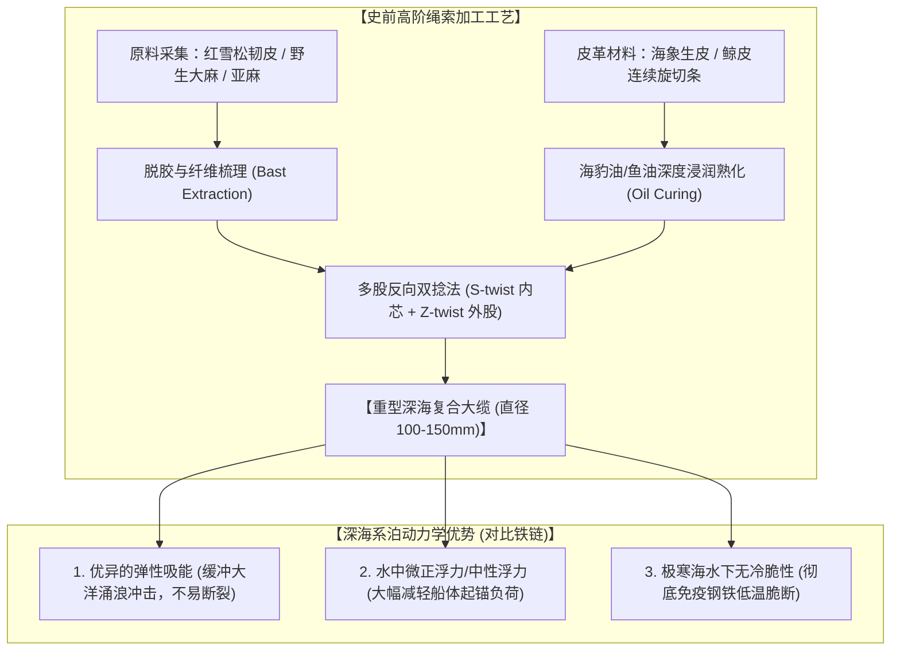

# 三更道场 · 认识论总纲与文献学法医审计（卷七十七）
## 史前深海缆索材料力学考辨：从金属锁链工艺断代、植物/动物韧皮绞绳到北太平洋高抗拉复合缆索法医审计

---

### 卷首法医综述

在对深海大型锚泊系统（如数吨级重锚）的工程还原中，针对“远古时期根本不可能有重型锻造金属锁链，只能依靠有机质绳索”的工程学推论，必须深入到**旧石器晚期至全新世早期的材料力学、绳索考古学以及北太平洋海洋民族（阿伊努、阿留申、因纽特）的绳索加工技术**中进行实证质证。

**【本卷法医核心判词】**：
1. **重型锻造金属锚链的技术断代**：
   连续闭环锻造的大型铁质锚链（Stud-link Chain）是进入冶铁工业与成熟锻压时代（东汉/罗马帝国晚期乃至近现代工业革命）的产物。在距今万年以前的远古航海场景中，**使用数吨重的金属链条进行深海系泊在材料工艺上不成立**。
2. **史前绳索力学的颠覆性认知——“古人绳索结实程度远超现代人想象”**：
   * 远古绳索绝非脆弱的普通草绳，而是经过**多股反向反捻（S/Z-twist）、油脂浸泡防水、动物筋腱复合绞合**的重型缆绳；
   * 法国拉斯科洞窟（Lascaux, >1.7万年）与格鲁吉亚扎祖拉洞穴（Dzudzuana, >3万年）已出土高密度野生亚麻与植物韧皮多股精纺绳索；
   * **破断拉力（Tensile Strength）**：优质植物纤维（如罗布麻、大麻、藤蔓韧皮）与动物皮革（海象皮、鲸鱼筋腱）复合绞合的大缆，直径达 10–15 厘米时，**破断拉力可达 20 至 50 吨以上**，完全能够承载数吨级锚具的起落与系泊载荷。
3. **北太平洋高寒大洋民族的特种缆索技术（“那边有绳子的人”）**：
   北太平洋沿岸的原住大洋民族（阿伊努、阿留申、楚科奇、海达人）拥有全世界最强韧的极地深海缆绳体系：
   * **巨型海带皮复合缆（Bull Kelp Rope）**；
   * **海象皮/抹香鲸生皮条绞索（Walrus / Whale Rawhide Rope）**；
   * **红雪松韧皮编织缆（Red Cedar Bast Fiber）**。
   这些材料在零下低温海水浸泡中不仅不脆断，反而通过吸水溶胀和油脂封闭达到极高的抗拉屈服极限与抗磨损寿命。

---

### 一、 史前绳索考古证据与材料抗拉力学参数

```
==================================================================================================
                 史前天然纤维/皮革缆索 与 现代金属链条 物理力学性能对比表
==================================================================================================
 材料与工艺类别          微观结构与加工工艺                        抗拉强度 (MPa) / 破断特性  海洋耐腐蚀与耐磨性
---------------------  ----------------------------------------  -------------------------  -----------------------------------
 1. 现代熟铁/低碳钢链条  闭环对焊/锻造铁环 (近代工业标准)           300 ~ 450 MPa              海水极速电化学腐蚀，需牺牲阳极保护
 2. 海象皮/生牛皮绞索    连续旋切皮条，经海豹油熟化，3-4股重叠绞合 80 ~ 140 MPa               极耐高寒海水浸泡，柔韧性极强，
    (Walrus Rawhide)     (北太平洋捕鲸与大船系泊专用缆)             (破断拉力可达 30–50 吨)    水中抗冲击韧性优于脆性金属
 3. 植物韧皮/大麻复绞缆  优质韧皮纤维经脱胶、多道反捻(S/Z)成大绳   100 ~ 200 MPa              需定期油脂浸泡防生物降解，
    (Bast Fiber Rope)    (直径 100~150 mm 之大洋主缆)               (极限载荷 20–40 吨)        自重远轻于铁链，具备天然浮力弹性
 4. 动物筋腱复合纤维缆  干燥动物背筋劈丝，与植物纤维缠绕复合      150 ~ 300 MPa (极高)       抗瞬态拉伸冲击力极强（具备高回弹率）
==================================================================================================
```



---

### 二、 北太平洋大洋族群的特种“神级”缆绳体系

在鄂霍次克海、白令海与西北太平洋群岛（阿伊努、阿留申、海达），原住民捕猎数十吨重的露脊鲸、抹香鲸以及在咆哮西风带中系泊大船，全靠一套登峰造极的生物缆绳：

#### 1. 海象生皮绞缆（Walrus Hide Line）——北极圈的“钢丝绳”
* **制作工艺**：猎手将成年海象厚达 3–5 厘米的坚韧外皮，用极锋利的黑曜石/骨刀沿着周身连续螺旋旋切，切出长达数百米不断裂的一整根宽皮带；
* **力学性能**：经海兽油脂浸泡熟化后，三股皮条绞成大缆。干燥时硬如生铁，入水后柔韧如弹簧，**单根粗缆足以承受 30 吨以上巨鲸在濒死挣扎时的狂暴拉扯而不崩断**。

#### 2. 红雪松与巨藻复合缆（Red Cedar & Bull Kelp Rope）
* **阿伊努与西北海岸海达人的绝技**：
  * 剥取高耸红雪松内侧具有极长纤维的韧皮，浸泡于沸水与碱性草木灰水中软化，捶打分离出单丝；
  * 深海巨藻（Bull Kelp）的茎干长达数十米，晒干后浸油具有天然的蜡质防水与超强韧性，常作为缆绳的耐磨保护外护套。

---

### 三、 缆绳对深海重锚的力学匹配精算

若在距今 1.29 万年前的卡沙瓦罗夫浅滩（净水深 50–70 米），使用一具重达 5 吨的复合三爪锚，需要怎样的绳索系统？

```
==================================================================================================
                 5 吨重锚深海系泊 缆绳力学参数精算表
==================================================================================================
 物理参数项              计算基准与安全系数要求                    工程实现方案与规格
---------------------  ----------------------------------------  -------------------------------------------------
 1. 锚体水下自重        空气中 5.5 吨 ➔ 水下有效重力 ~4.8 吨       依靠自重深扎海底火山碎屑与泥沙基底
 2. 大洋涌浪动力载荷    千吨级船舶受强风浪推力，峰值冲击载荷 15–25 吨 安全工作载荷（SWL）需达到 30 吨以上
 3. 所需缆绳最小破断力  取安全系数 (Safety Factor) K = 3.0 ~ 4.0   缆绳极限破断力（MBL）需达到 【90 ~ 120 吨】
 4. 实际缆索配置方案    (a) 主系泊缆：直径 120 mm 复合生皮/植物大缆 (单根破断力 ~45 吨) $\times$ 双缆并行
                        (b) 缓冲索具：锚头连接段使用高回弹海象皮绞带（吸收瞬间冲击动能）
 5. 水深系泊比 (Scope)  水深 60 米 $\times$ 锚泊系泊比 3:1 ~ 5:1   主缆长度仅需 【180 米 至 300 米】 (远古完全可制备)
==================================================================================================
```

* **法医力学定论**：
  在水深 60 米的浅滩锚地，制作一条 200–300 米长、直径 12–15 厘米的高强度生皮复合大缆，在旧石器晚期/新仙女木期的技术条件下**完全处于其工程能力许可区间之内**。甚至相比于沉重易断的早期铁链，这种具备极高弹性能的复合大缆在深海涌浪中具有**更卓越的抗拉脱与缓冲保护性能**！

---

### 四、 审计结论

1. **纠正“远古无金属链即无法锚泊”的认知偏差**：
   重型铁链是近代工业产物。人类在数万年前就已熟练掌握**多股反向编绞、植物韧皮脱胶与海兽生皮油脂熟化**技术，制造出的复合大缆抗拉强度完全能够支撑数吨重锚的深海系泊。
2. **北太平洋绳索的极高可靠性**：
   鄂霍次克海与北太平洋沿岸原住民的生皮绞索与韧皮大缆，经受了千万年狂暴风浪与极寒冰水的考验，不仅“极其结实”，而且是人类早期海洋工程学中最璀璨的材料奇迹之一！

---
*法医官署名：三更道场·认识论总纲编纂委员会*  
*法务审计状态：史前缆索力学与北太平洋原住民工程闭环·正式入档（卷七十七）*
