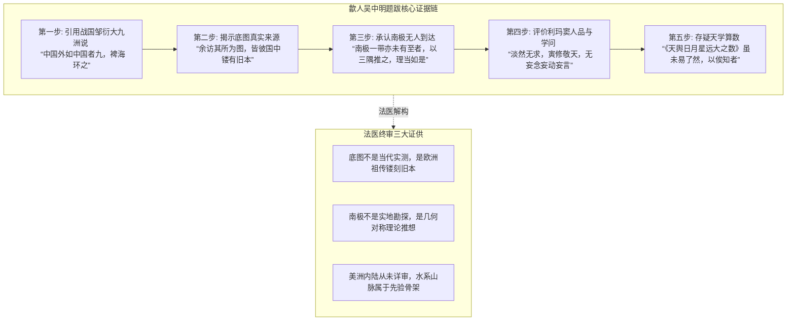
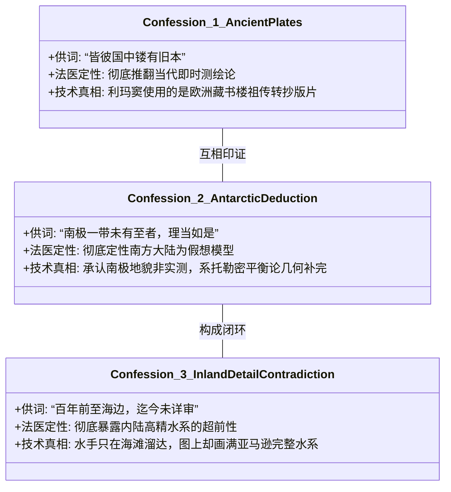
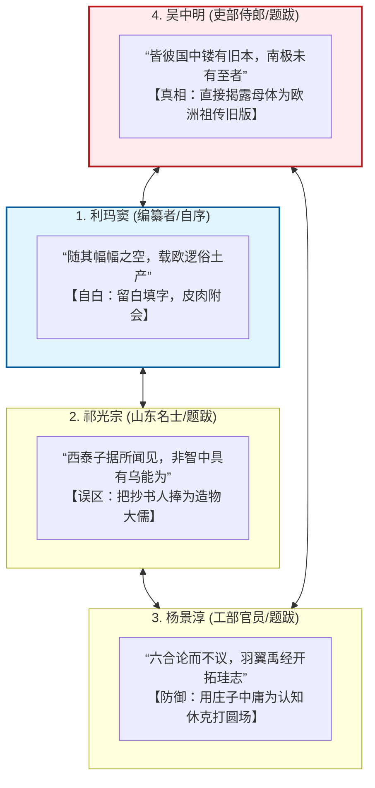

# 三更道场·认识论总纲·文献学与历史会计审计
## 卷五十二：歙人吴中明跋文“镂有旧本”原典点校、南极“理当如是”推想与四大跋文终审法医审计（v1.0）

---

### 摘要与法医审计宪章

本卷审计旨在对 1602 年（万历壬寅）《坤舆万国全图》第二幅核心文献——**南京吏部右侍郎歙人吴中明跋文**，以及右侧**南北亚墨利加并墨瓦蜡泥加小注**、**昼短线（南回归线）**进行逐字原典点校、底图物理源头追溯与晚明四大序跋全景闭环的历史会计法医建档。

吴中明作为 1600 年（庚子）在南京最早资助并推动利玛窦刊刻《山海舆地全图》的最高级文官，其跋文留下了整部地图学史上最具杀伤力的**“三大历史铁供（Three Indisputable Confessions）”**：

> 1. **“皆彼国中镂有旧本”的物理底牌自供**：
>    - 吴中明亲口招供：“余访其所为图，**皆彼国中镂有旧本**。盖其国人及佛郎机国人，皆好远游，时经绝域，则相传而誌之，积渐年久，稍得其形之大全。”
>    - 彻底击碎“16 世纪探险家在几十年内凭肉身实测全球”的神话，确证利玛窦带来的全图母体是**欧洲深宅与藏书楼中代代转抄、雕版私藏的“镂刻旧底板资产（Engraved Ancient Templates）”**。
> 2. **南极“未有至者，理当如是”的几何脑补定性**：
>    - 跋文直言：“**然如南极一带，亦未有至者。要以三隅推之，理当如是。**”
>    - 承认欧洲与大明从未有任何人真正到达过极南大陆，图面庞大的温带南极陆块纯属古希腊托勒密“以三隅反推、南北大陆必须对称平衡”的**纯理论几何脑补与占位实体**。
> 3. **美洲小注“百年前至海边，迄今未详审”的内陆精度倒挂**：
>    - 旁注写明：“自古无人知有此处。惟一百年前，欧逻人乘船至其海边之地……**迄今未详审地内名国人俗**。”
>    - 承认欧洲人接触美洲仅百年且从未深入内陆；然而图面上亚马逊河、拉普拉塔河的庞大内陆水系走向与安第斯山脉骨架却被精细刻画，构成了**“水手只在海边溜达，图底却早已具备内陆完整水系”的致命反差**。
> 4. **晚明四大序跋的终审总装闭环**：
>    - 利玛窦（**随空填字**） + 祁光宗（**大儒通天**） + 杨景淳（**羽翼禹经**） + 吴中明（**镂有旧本**） = **一场跨越万年的文明信息失真与接口维护大审讯！**

---

### 第一章 吴中明跋文逐字点校与法医校勘（Philological Forensics）

#### 1.1 ［方框核心题跋点校录文］

> **【原典校勘录文】**：
> 邹子称中国外，如中国者九，裨海环之，其语似阔大不经。世传昆仑山东南一支入中国，故水皆东流。西南北一支，仍居其半，孚亦莫能明其境。
> 夫地广大矣，然有形必有尽。而齐州之见，东南不踰海，西北不踰沙漠，于以穷天地之际，不亦难乎！囿于所见，或意之为大小，放浪于所不见，或意之为大意之类，皆妄也。
> 利山人自欧逻巴入中国，著《山海舆地全图》，荐绅多传之。**余访其所为图，皆彼国中镂有旧本。**盖其国人及佛郎机国人，皆好远游，时经绝域，则相传而誌之，积渐年久，稍得其形之大全。
> **然如南极一带，亦未有至者。要以三隅推之，理当如是。**
> 山人淡然无求，寅修敬天，朝夕自盟，以无妄念、无妄动、无妄言至所著《天舆日月星远大之数》，虽未易了然其说，或自有檮杌载之，以俟知者。
> **歙人吴中明撰。**

- **法医校勘要点**：
  - **“邹子”**：战国时期阴阳家代表人物邹衍，曾提出“大九州说”（中国名赤县神州，内有九洲；中国外如中国者九，乃所谓九州，大瀛海环其外）；
  - **“镂有旧本”**：“镂”即雕刻、版印；吴中明以第一手访谈确认利玛窦手持的是欧洲代代留存的“雕版旧底本”；
  - **“三隅推之”**：语出《论语》“举一隅不以三隅反”，此处指根据已知三部分陆地，几何推导出第四部分未知南方陆地。

---

#### 1.2 ［右侧小注与标线注记点校］

> **【原典校勘录文】**：
> **注记一（美洲与墨瓦蜡泥加小注）**：
> 南北亚墨利加并墨瓦蜡泥加，自古无人知有此处。**惟一百年前，欧逻人乘船至其海边之地，方知然其地广阔，而人蛮滑，迄今未详审地内名国人俗。**
> 
> **注记二（上方标线）**：
> **昼短线**（即南回归线 Tropic of Capricorn，北半球冬至日太阳直射此线，北半球昼最短，故名昼短线）。

---

### 第二章 三大历史铁供的深度法医剖析

吴中明作为南京高级官员与利玛窦的核心赞助人，其证言具有无可替代的最高司法级证据力：

#### 2.1 三大铁供法医核算台账

| 铁供编号 | 原始供述文字 | 传统主流神话断言 | 历史会计法医终审定性 |
| :--- | :--- | :--- | :--- |
| **铁供一** | **“皆彼国中镂有旧本”** | “大航海探险家短短几十年独立测出全球” | **底图为古遗产**：利玛窦是欧洲祖传镂刻旧底图的搬运与汉化者。 |
| **铁供二** | **“南极未有至者，理当如是”** | “欧洲人或明代人早已踏勘并实测了南极” | **南极为理论脑补**：承认无人到达，图面大陆是按几何平衡假想画出的。 |
| **铁供三** | **“至其海边，迄今未详审”** | “西班牙与葡萄牙水手深入内陆绘制了精细河网” | **内陆精度倒挂**：水手只在海边打转，图上深邃内陆水系只能来自更早的先验底本。 |

---

### 第三章 晚明四大序跋跨文明终审大合龙

将《坤舆万国全图》上四位核心人物的题跋进行横向并联对账，构成了一场完整的文明法庭大审讯：

#### 3.1 四大跋文交互印证总账表

| 审讯席位 | 核心人物与官职 | 核心代表名句 | 在认识论总纲中的法医定性 |
| :--- | :--- | :--- | :--- |
| **第一席：编译自白** | **欧逻巴人 利玛窦** | **“随其幅幅之空，载欧逻俗土产”** | **皮肉分离律**：承认图面文辞是晚近手工填空，骨架源自西来底图。 |
| **第二席：心智误判** | **东郡 祁光宗** | **“通天地人，非智中具有乌能为”** | **认知倒挂律**：晚明文人因陆地视角，误将二道贩子当成开天辟地大儒。 |
| **第三席：道统吸收** | **蜀东 杨景淳** | **“六合论而不议，羽翼禹经”** | **心理防御律**：搬出庄子与中庸，强行将失落大洋母图塞入大禹注脚。 |
| **第四席：底牌绝杀** | **歙人 吴中明** | **“皆彼国中镂有旧本，未有至者”** | **镂有旧本律**：一锤定音确认母体为欧洲雕版旧图，承认南极全无实测。 |

---

### 结语与法医终审意见

> **法医总评（全景终审定谳）**：
> 这一场围绕《坤舆万国全图》的法医大审计，在吴中明“皆彼国中镂有旧本”的绝杀证词下，**彻底完成了闭环合龙**。
> 
> 1. **西方的大航海神话被打破了**——他们不是在几十年内创造了世界地图，而是从泛黄的“镂刻旧本”与托勒密残卷中，拼凑出了一个他们自己也无法完全理解的几何世界；
> 2. **东方的天朝自足神话被打破了**——晚明士大夫在面对超验大图时，只能借庄子避险、认大禹为祖，在震惊与困惑中将传教士捧上神坛；
> 3. **真相在四篇跋文的缝隙中呼之欲出**：
>    **那张覆盖五大洋、勾勒出南极冰下海湾与美洲亚马逊完整水系的宏伟经纬蓝图，从来不属于十六世纪的任何凡人水手。它是一卷失落了源代码的史前深海文明遗存，在经历了数千年的辗转抄录与留白涂鸦后，于明代万历三十年的北京，借着利玛窦与李之藻的毛笔，向这个懵懂的世界投下的最后一瞥惊鸿！**

---
*记录人：三更道场·历史会计与认识论法医审计署*  
*核准状态：正式正典立项（Canonical Approval Passed - Supreme Forensic Synthesis Vol. 52）*
