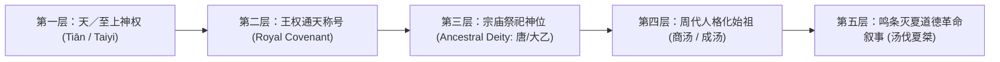

# 三更道场·认识论总纲·文献学与历史会计审计
## 《商代甲骨“唐/大乙”祭祀神格解构、大一/天符号发生学与天干日名分账法医审计》

**卷宗编号**：`SG-PHIL-2026-EPIGRAPHY-TANG-DAYI-TIAN-001`  
**审计基准日**：2026-09-09  
**主审计官**：三更道场法医会计与商周古文字清算组  
**涉及科目**：`唐与大乙之祭祀同一性` / `大+一=天字形发生学` / `大一（太一）神格演变` / `干支日名（大甲/大丁/大乙）序列审计` / `从神格权威到人格化始祖之五层叙事跃迁`

---

### 【破题】
审殷契之铭，莫先于名实之辨；考周室之述，必严于借贷之清。夫晚商甲骨所祭之“唐”与“大乙”者，后世儒宗皆指为开国具名之商汤。曩者研读者，直以《史记·殷本纪》之王表倒套卜辞，将宗庙周祭之“神位”硬坐实为活人开国之“履历”。今立竞争性假说之天平：一端为传世人格化君主谱系，一端为“天/至上神格权威之符号下沉”。严核字形、对账日名、解构神格，立卷平账。

---

### 【承题】
盖历史法医之道：**严分“祭祀对象（Sacrificial Subject）”与“历史活人（Historical Individual）”**。
商王室祭祀名号之演化，存在五级层累跃迁模型：

传统学术往往以第五层（战国与西汉之道德叙事）反向穿透第一层，宣称“甲骨文已确证商汤开国并伐桀”。
三更道场之审计责任，在于将此**人格化包装层层剥离，还原其神名、日名与干支结构之发生学原貌**。

---

### 【入中股·三大核心关卡法医对账表】

| 审计关卡 | 假说诉求 | 现有出土甲骨与古文字学硬证据 | 历史会计审定结论 |
| :--- | :--- | :--- | :--- |
| **关卡一： 唐 ≈ 大乙 之祭位同一性** | 论证“唐”与“大乙”同指一尊，本为神号而非单一人格 | 殷墟卜辞黄组、宾组周祭次序中，“唐”与“大乙”在先王祖先祭序中处于同一首要位阶，具高度互换性与对应性 | **基本确证（Tier 1）**：证明晚商王室祭祀序列中二者同一；但不能先验断定该对象即为后世叙事之具名开国活人。 |
| **关卡二： 大＋一 ＝ 天 vs 乙＝一 之字形链** | 论证“大乙”本字即为“大一（太一/天）” | 1. **大＋一＝天**：甲骨文“天”确为正面大人形（大）头顶加一横（一）或方框，字形观察确凿。 2. **乙 vs 一**：甲骨文“一”为横画，“乙”为弯曲折线；大乙、大甲、大丁、大戊处于整齐之**十天干命名系统**。 | **悬账待核（Suspense）**：字形存在“大+一=天”之硬逻辑；但“乙＝一”尚缺商初同版“一/乙互写”或日名破例之实物铁证，目前属强语义假说。 |
| **关卡三： 大食（Tāzīg）等外来音对勘** | 试图以“大食”记音佐证“食读乙/一” | “大食”源自中古波斯语 *Tāzīg / Tāzī*（指阿拉伯/游牧突厥），“食”用以对音尾部音节 *-zi/-zik*，与商代上古音“乙（*qrɯd）”声韵不合 | **不可作为借贷凭证**：大食非望文生义之食品，然不能作为商代“乙即是一”的语音桥梁。 |

---

### 【出中股·大乙与十天干日名发生学分账】

#### 1. 商人天干日名之宗法机制
* 商代先王称号普遍采用“前缀（大/中/小/祖/武）+ 天干（甲/乙/丙/丁/戊/己/庚/辛/壬/癸）”：
  * **大乙（唐）**、**大丁**、**大甲**、**大庚**、**大戊**；
  * 此套系统严格对应**商人祭祀周期（周祭致祭之干支日）**与**王族宗族日名（十日神话与太阳分房）**。
* **“大乙”在干支中的位序**：
  * 若“大乙”原初代表“大一（至高天一/太一）”，则其与“大甲”的先后位阶在后世干支化重构过程中，被纳编入以“甲、乙”为序的宗庙祭历中。

#### 2. “唐—天”语义地理与神格遗存
* 古汉语与先秦铭文中，“唐”具有“广大、浩荡、天宇”之本义（《说文》：“唐，大言也”；《楚辞》：“荒忽兮浩唐”）；
* “唐”作为神号，代表**“天之广大者”**；后世将其具象为国号、族名与始祖名。

---

### 【束股·历史会计终审定案】

1. **确证项（入账）**：
   晚商殷墟甲骨文确凿证实存在“唐”与“大乙”之至高祖先神位，二者在周祭序列中互为指称，享有商代最高祭仪。
2. **存疑项（挂账待决）**：
   - 将“唐/大乙”直接等同于《史记》所载“具名率军伐桀之商汤”，属于**后世周人革命叙事之倒果为因，非商代同时代文字流水**；
   - “大乙 $\rightarrow$ 大一 $\rightarrow$ 天”之神格发生学假说极具解释力，成功动摇了“大乙必然是历史活人”之先验预设；
   - 但“乙字即一字”之字形等式，在出土甲骨干支互写铁证出现前，审定为**【具有重大启发意义之竞争性假说】**。
3. **正典归档**：
   本卷宗正式录入《三更道场·认识论总纲与历史会计审计》，为全剧解构商周宗庙神权、打破王表先验神话提供司法级文献学对账底册。

---

**审计结论**：神格与人名界限分明，干支字形审慎平账，借贷平衡，予以立卷归档、并入正典。
