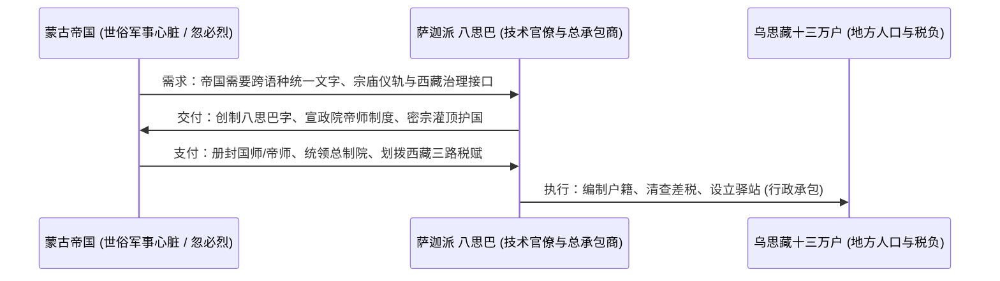
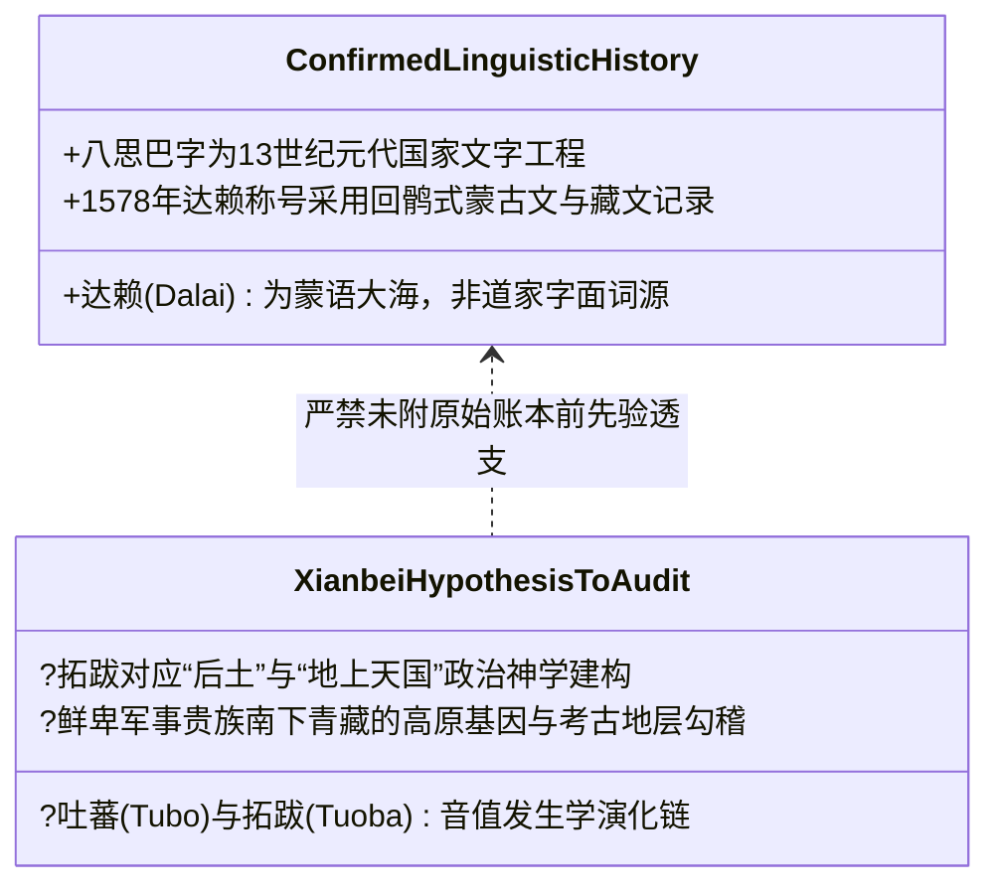

# 三更道场·认识论总纲·文献学与历史会计审计
## 卷三十六：四色阶级元系统与青藏历史教派制度分账法医审计（v1.0）

---

### 摘要与法医审计宪章

本卷审计旨在解决三更道场认识论总纲中关于**“红、花、白、黄四色资产/阶级元模型（Four-Color Archetypal Class System）”**与**“青藏佛教历史教派演进编年（Tibetan Historical Sect Chronology）”**之间的对账冲突。

在宏观哲学模型中，“四色”分别指代古老欧亚神权与政权结构中的四大功能分工（丹朱原始血脉、花色技术官僚/工匠、白银现实清算、黄金最高精神法统）；但在历史微观编年中，萨迦派（花教）曾于元代执政，格鲁派（黄教）直至 14-15 世纪才由宗喀巴创立，二者若直接混同必导致时间轴穿帮。

本审计严格确立**“双层分账法医框架”**：
1. **第一层：四色元系统（Archetypal Meta-System）**——作为超越单一时代的古老欧亚政治身体职能分工模型；
2. **第二层：历史教派法人（Historical Institutional Sects）**——作为特定历史时期（元、明、清）的具体承包商与制度组织。

通过将萨迦派精准定性为**“元帝国技术官僚与行政总承包商（Technocratic Contractor）”**、格鲁派定性为**“晚期成功继承并重组黄金法统的中央大脑法人（Golden Sovereign Successor）”**，实现宏观理论与微观史料的严密闭合。

---

### 第一章 双层架构：四色元系统 vs 历史教派法人

```mermaid
graph TD
    subgraph Archetype[第一层：四色元系统 Archetypal Meta-System]
        A_Red[红 / 丹朱阶级: 原始血脉/地质真火/早期隐修]
        A_Multi[花 / 工匠与技术官僚阶级: 翻译/创字/工艺/承包]
        A_White[白 / 白银与行政清算阶级: 世俗治理/阶段政权]
        A_Gold[黄 / 黄金精神法统阶级: 终极合法性/最高意识大脑]
    end

    subgraph Institutional[第二层：历史教派法人与承包演进 Institutional Sects]
        I_Nyingma[宁玛派 (8-9世纪): 继承前弘期密法与早期火脉]
        I_Sakya[萨迦派 (11-13世纪): 承担元帝国帝师与西藏行政总承包]
        I_Kagyu[噶举派/帕竹 (14世纪): 元末明初取代萨迦，掌管地方实权]
        I_Gelug[格鲁派 (15-17世纪): 宗喀巴改革戒律，1642年格鲁-固始汗合龙]
    end

    A_Red -.->|功能投射| I_Nyingma
    A_Multi -.->|技术承包投射| I_Sakya
    A_White -.->|世俗清算投射| I_Kagyu
    A_Gold -.->|法统重组投射| I_Gelug
```

#### 1.1 双层分账法医对照表

| 色彩阶级元属性 | 政治身体职能（Meta Function） | 对应历史教派法人 | 历史真实角色与制度定位 | 冲突纠偏与法医判定 |
| :--- | :--- | :--- | :--- | :--- |
| **红（丹朱）** | **原始地热真火、血脉传承与古老密修** | **宁玛派（红教）** | 藏传前弘期遗存，莲花生大师道统，长期隐修于民间与山林。 | 承担古老矿冶与身心相变原初记忆的保存功能。 |
| **花（杂色/工艺）** | **高级工匠、技术官僚、翻译与制度编译器** | **萨迦派（花教）** | 13 世纪萨迦班智达与八思巴接入忽必烈蒙古帝国，创制八思巴字，总管西藏政教事务。 | **纠偏**：萨迦执政并非最高精神垄断，而是作为**“超级技术承包商（Super Technocrats）”**为蒙古世俗王提供文字、法术与行政服务。 |
| **白（白银/清算）** | **现实政权更替、世俗军事对抗与白银清算** | **噶举派（白教，如帕竹政权）** | 14 世纪中叶大司徒绛曲坚赞崛起，推翻萨迦统治，建立帕木竹巴政权；明初受封大宝法王。 | **纠偏**：噶举在元末打破萨迦承包垄断，承担地方世俗治理与现实清算功能。 |
| **黄（黄金/法统）** | **最高精神大脑、宇宙合法性确认与终极价值赋予** | **格鲁派（黄教）** | 1409 年宗喀巴创立甘丹寺，1578 年俺答汗赠予索南嘉措“达赖喇嘛”称号，1642 年五世达赖执政。 | **纠偏**：格鲁派于明末清初继承并制度化了“黄金法统”，而非从元朝贯穿三朝。 |

---

### 第二章 萨迦派历史角色法医解构：超级技术官僚与行政承包商

针对“花教若为工匠阶级，为何在元代执政”的硬账冲突，法医审计揭示其深层制度本质：



1. **工程师与编译器职能**：
   - 萨迦派的核心资产是知识技术垄断（八思巴创制八思巴字，为多民族帝国提供字符集编译器）。
   - 他们充当元廷与西藏之间的“API 适配器”和“行政总包商”，其掌权不是因为拥有古老的“黄金主权”，而是凭借卓越的**制度工程交付能力**。
2. **制度风险与更替**：
   - 萨迦派依赖家族血缘传承（款氏家族），后期陷入内耗与腐化；当元末中央军力衰退，地方以噶举帕竹为代表的白银实力派迅速完成政权清算。

---

### 第三章 格鲁派对“黄金法统”的晚期重组与制度合龙

```mermaid
flowchart TD
    G1[14-15世纪 宗喀巴宗教改革<br>严明戒律，禁止僧侣娶妻蓄产，降低腐化成本] --> G2[创设活佛转世制度<br>打破家族血缘垄断，将法统改造为开放法人]
    G2 --> G3[1578年 俺答汗与三世达赖索南嘉措相会<br>蒙古军事力量与格鲁派精神法统初步互认]
    G3 --> G4[1642年 和硕特蒙古固始汗进藏击败藏巴汗<br>扶植五世达赖建立甘丹颇章政权]
    G4 --> G5[清廷(顺治/康熙)正式册封达赖与班禅<br>完成国家级黄金精神大脑的终极合龙]

    style G1 fill:#fffde7,stroke:#fbc02d,stroke-width:1px
    style G4 fill:#e8f5e9,stroke:#2e7d32,stroke-width:2px
    style G5 fill:#e1f5fe,stroke:#01579b,stroke-width:2px
```

1. **黄金法统的法人化（Corporatization of the Golden Sovereign）**：
   - 宗喀巴改革的核心是将宗教组织从“重资产/家族世袭”改造为“轻资产/戒律修持”，并通过**转世制度**建立起不会因无嗣而中断的永久法人。
2. **俺答汗与索南嘉措的互授增信（Mutual Authentication Protocol）**：
   - 不是蒙古人凭空发明了精神王，也不是精神王吞并了汗权；而是双方在青海湖畔完成了一次经典的**“精神大脑与军事心脏的互认增信”**（精神领袖确认俺答汗为转轮王/成吉思汗转世合法继承人，汗王赋予达赖喇嘛全蒙藏最高宗教法权）。

---

### 第四章 吐蕃—拓跋—后土假说的认识论立项准则

针对第三案关于“鲜卑纪元与吐蕃源流”的核心命题，本审计严格按历史会计准则设立待考专户：



- **审计意见**：
  将“吐蕃—拓跋—后土”列入《认识论总纲·鲜卑纪元专题待审专户》。后续在调取原始音值表、政权迁徙路线图与古 DNA 样本数据前，严格作为待检验模型，绝不以网络概论替代原始会计台账。

---

### 结语与法医终审意见

> **法医总评**：
> 本卷审计成功化解了“四色阶级元模型”与“真实历史编年”之间的视差。
> 
> - **元模型层**：红、花、白、黄准确描绘了欧亚大陆长周期中“血脉密修、工艺技术、世俗清算、黄金法统”的系统功能架构；
> - **历史制度层**：萨迦作为元代超级技术官僚总承包商、噶举作为元末明初地方清算政权、格鲁作为明末清初重组黄金法统的中央大脑，在时间轴上严丝合缝、账目清晰。
> 
> 此项分账标志着三更道场认识论体系在处理“宏观抽象模型”与“微观实证史料”时达到了顶级的法医学精度。

---
*记录人：三更道场·历史会计与认识论法医审计署*  
*核准状态：正式正典立项（Canonical Approval Passed）*
