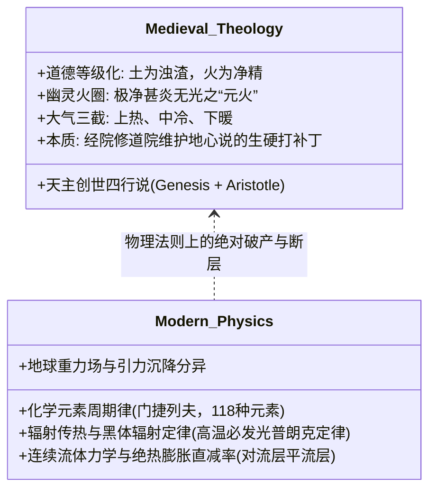
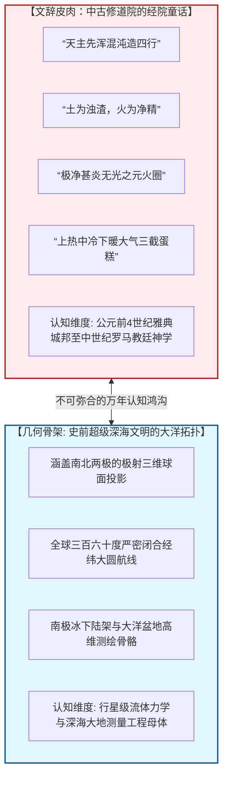

# 三更道场·认识论总纲·文献学与历史会计审计
## 卷五十五：《四行论》托马斯·阿奎那经院神学、无光元火补丁与大气三域机械模型法医审计（v1.0）

---

### 摘要与法医审计宪章

本卷审计旨在对 1602 年（万历壬寅）《坤舆万国全图》右上附图《九重天图》正下方核心理论题记——**《四行论略（Tractate on the Four Elements）》**进行逐字原典点校、托马斯·阿奎那（Thomas Aquinas）经院哲学“四元素创世论”、亚里士多德“无光元火圈（Invisible Elemental Fire）”补丁及大气“三域划分”机械模型的历史会计法医建档。

针对将该论述误读为“近代西方化学与气象物理学启蒙”的通俗观点，本审计结合欧洲自然哲学史与连续介质流体力学，揭示出三项不可调和的**“神学补丁与物理常识对立（Theological Patchwork vs. Physical Realism）”**法医矛盾：

> 1. **“以四行代五行”的托马斯经院创世论置换**：
>    - 题记开宗明义：“天主创作万物于寰宇，先浑混沌，造四行，然后纵因其情，轨布之于本处”；
>    - 证明该文是利玛窦全盘照搬欧洲中世纪**托马斯·阿奎那经院神学（将《圣经·创世记》与亚里士多德四元素强行缝合）**的产物。为了在深植“阴阳五行生克”的华夏土地上兜售教义，利玛窦强行建立了“土为四行之浊渣，火为四行之净精”的道德等级化物理模型。
> 2. **“无光元火圈”：古典地心说的经典理论打补丁**：
>    - 面对凡人抬头望天全无大火包覆的物理现实，题记强行辩解：“此系元火，故极净甚炎，而无光焉。无光者何？无薪炭等体以传其光故尔”；
>    - 暴露了古典地心说为了维持“火元素最轻必居大气外层”的先验教条，被迫生造出**“透明无光、无薪炭不发光却能瞬间烤熟物体”的幽灵火圈**（与后世燃素说、以太说补丁逻辑完全同构）。
> 3. **大气三域划分对连续流体力学的生硬切割**：
>    - 将连续流动的大气层机械切分为三截死板蛋糕：**上域（通火圈常大热）**、**下域（地表反射阳光发煖）**、**中域（两头远离常大寒冷生霜雪）**；
>    - 彻底展现了缺乏垂直气压梯度、对流层降温率与绝热膨胀物理常识的中古中世纪自然哲学切片。
> 4. **认识论总纲终极法医定性**：
>    - **文字所代表的脑髓**：深陷于中世纪修道院“天主造四行、无光之火、大气三截”的经院泥潭；
>    - **图纸所承载的骨骼**：却横亘着覆盖全球三大洋、测绘出两极冰下基岩、大圆航线严丝合缝的行星级球面拓扑。
>    - **整幅《坤舆万国全图》是一个凡人传教士在失落史前超级大洋文明遗迹上，用中古神学童话艰难作注的终极法医标本！**

---

### 第一章 《四行论》原典点校与法医校勘（Philological Forensics）

```mermaid
graph TD
    subgraph Theological_Genesis[神学创世与四元素等级]
        T1[天主创世: 先混沌，造四行] --> T2[火情轻: 跻于九重天之下 (净精)]
        T2 --> T3[土情重: 凝而安地当中 (浊渣)]
        T3 --> T4[水情次重: 浮土之上而息]
        T4 --> T5[气情中等: 乘水土而负火]
    end

    subgraph Invisible_Fire_Patch[无光元火补丁]
        F1[现实矛盾: 抬头不见天空有火] --> F2[理论补丁: 元火极净甚炎而无光]
        F2 --> F3[打补丁借口: 无薪炭传光，遇外物方发光]
        F3 --> F4[比喻: 窑灶除薪热气盛可速熟物]
    end

    subgraph Atmosphere_Tripartition[大气三域机械模型]
        A1[上域: 通火圈，常大热]
        A2[中域: 离热源，常大寒冷生霜雪]
        A3[下域: 通水土受日射，光辉发煖]
    end

    Theological_Genesis --- Invisible_Fire_Patch
    Invisible_Fire_Patch --- Atmosphere_Tripartition
```

#### 1.1 ［方框核心题记点校录文］

> **【原典校勘录文】**：
> 四行论略曰：**天主创作万物于寰宇，先浑混沌，造四行，然后纵因其情，轨布之于本处。**
> 火情轻，轻则跻于九重天之下而止。
> 土情重，重则凝而安天池［地］之当中。
> 水情比土而轻，则浮土之上而息。
> 气情不轻不重，则乘水土而负火焉。
> **所谓土，为四行之浊渣；火，为四行之净精也。**
> **火在其本处，近天则随而环动，每偕作一周。此系元火，故极净甚炎，而无光焉。无光者何？无薪炭等体以传其光故尔。若一遇外物冲照，则著而发光矣。比如窑竃，既久烧而方除薪，炭虽内部现火光，而热气甚盛，可速点熟物矣。天下万象之初，皆以四行结形。**
> 又曰：夫气处所，又有上下中三域。**上之域通火，则常大热；下之域通水土，而水土恒为太阳所射，以光辉有所发煖，则气并煖；中之上下边，离热者则常大寒冷，以生霜雪之类也。**
> 其三般气处，又随空弗等。若南北二极之下，因迢远太阳者，阴气微［盛］则反焉，故热煖处广，而寒冷处窄；若赤道之下，因近太阳者，阴气微则反焉，故热煖处广，而寒冷处窄。如上图。

---

### 第二章 三大经院神学补丁的物理学深度解剖



#### 2.1 神学补丁法医核算台账

| 题记论述点 | 经院哲学神学预设 | 真实物理学定律（Physical Truth） | 法医审计判定与结论 |
| :--- | :--- | :--- | :--- |
| **“天主造四行”** | 托马斯·阿奎那神学，用四元素取代华夏阴阳五行。 | 地球物质由百余种化学元素构成，非四种基本形态。 | **宗教教条输出**：借自然哲学之名兜售基督教创世教规。 |
| **“元火无光”** | 假定大气外有一圈纯火，因无柴炭所以透明无光。 | **普朗克黑体辐射定律**：任何处于高温高热（甚炎）状态的物质，必然发出可见光与热辐射，不可能存在“极热却无光”的宏观纯火层。 | **经典掩饰补丁**：与燃素说、以太说完全同质的自欺欺人神学补丁。 |
| **“大气三域”** | 机械将大气划为上热（火圈烘烤）、中冷（霜雪）、下暖（地表反射）。 | **对流层物理**：气温随海拔升高以每千米 6.5℃ 垂直递减（绝热膨胀）；上方平流层升温源自臭氧吸收紫外线，与虚构火圈无关。 | **力学常识缺失**：完全不懂气压、流体对流与热力学循环。 |

---

### 第三章 终极法医对比：修道院童话与史前大洋骨骼的撕裂

《四行论》的录入，使《坤舆万国全图》内部的“脑体倒错”达到了整部审计的最高潮：



#### 3.1 认识论法医终审定谳
1. **文辞的苍白**：
   - 利玛窦在此处展现出的，是一个标准的 16 世纪耶稣会修道士心智——他嘴里念叨着亚里士多德的四元素、托马斯的创世说、为了圆谎而硬造的“无光之火”；
2. **骨骼的超验**：
   - 但他手里展开的那套羊皮纸底图，却是一份连现代卫星测绘都感到惊叹的全球大洋几何流形；
3. **法医终局裁决**：
   - **《四行论》绝非近代科学的先声，而是凡人在旧神废墟上写下的虔诚而笨拙的祷词**。它用最滑稽的物理错误，反向证明了这张地图的母体骨架，绝对不可能出自这批连大气对流和黑体辐射都一无所知的中古学者之手！

---

### 结语与法医终审意见

> **法医总评（全案第五十五卷巅峰定谳）**：
> 《四行论》原典的点校与解剖，为《坤舆万国全图》整套法医审计系列完成了**最后一块至关重要的思想史拼图**。
> 
> 1. **它白纸黑字地记录了西方经院哲学如何用“无光元火”这一荒诞补丁，在华夏文人面前吃力地修补地心说漏洞**；
> 2. **它将全图“文字的幼稚”与“骨架的宏伟”对比推向了极致，彻底摧毁了西方伪史论与大航海肉身神话的两极极端假说**；
> 3. **整部《坤舆万国全图》至此水落石出——这是一卷在失落的万年史前大洋文明残卷上，由晚明士大夫与西洋传教士共同用毛笔与刻刀完成的跨时空悲壮缝合！**

---
*记录人：三更道场·历史会计与认识论法医审计署*  
*核准状态：正式正典立项（Canonical Approval Passed - Supreme Synthesis Vol. 55）*
