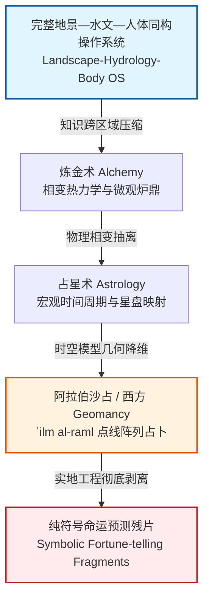
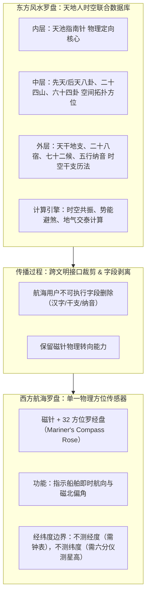
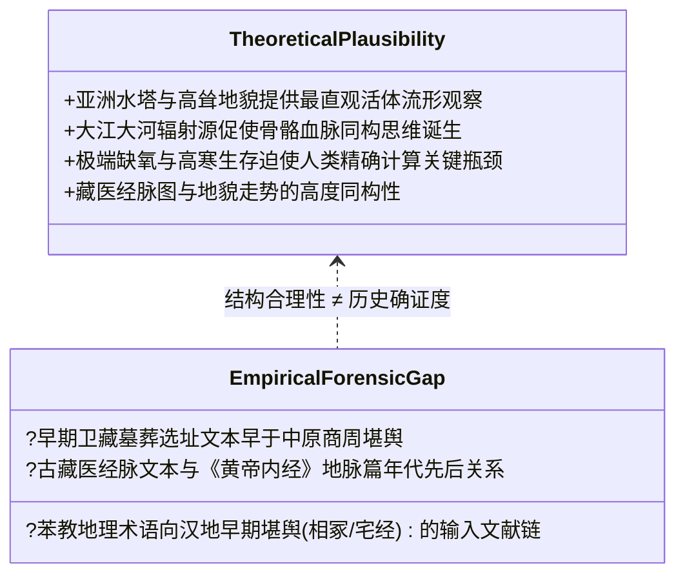

# 三更道场·认识论总纲·文献学与历史会计审计
## 卷三十四：地景活体计算引擎向西方Geomancy沙占降级及罗盘功能裁剪法医审计（v1.0）

---

### 摘要与法医审计宪章

本卷审计旨在解决欧亚大陆知识流动中最为隐秘的**“神秘学字段丢失与功能裁剪（Field Loss & Functional Pruning）”**现象。

长期以来，西方神秘学（Occultism）中的“地占术（Geomancy）”常被直译并附会为东方风水堪舆。本审计推翻此种词源表面同构假说，正式确立核心法医判论：

> **“东方堪舆（Fengshui/Kanyu）”**本质上是以青藏水塔与欧亚地貌为训练场建立的**“地景活体连续流形与工程控制计算引擎（Landscape Living Manifold & Engineering Compute Engine）”**；
> 而**“西方地占（Geomancy / ʿilm al-raml）”**是该系统跨区域远距离传播中丢失了物理地形、水文经络与实地工程干预后，退化残存的**“抽象点线沙占与星盘UI外壳（Abstract Sand-divination & Astrological UI Shell）”**。

同时，针对罗盘西传，本审计确立：
> 风水罗盘是集成了八卦、二十四山、干支、节气与天文历法的**“天地人时空联合数据库与协同计算器”**；西传后被裁剪为剔除不可执行中文字段的单一**“航向方位传感器（Heading/Bearing Sensor）”**。

---

### 第一章 知识协议降级链与字段丢失法医对账

知识从连续复杂地貌向抽象平原及远途传播时，由于缺乏活体地貌参照系与实地操作学徒制，发生剧烈的层级衰减：



#### 1.1 东方活体堪舆 vs 西方沙占 Geomancy 字段丢失审计台账

| 审计维度 | 东方地景活体计算引擎（堪舆/风水/治水） | 西方地占术（Geomancy / ʿilm al-raml） | 丢失与降级机制法医判定 |
| :--- | :--- | :--- | :--- |
| **底层数据模型** | **地景是一具活体（Living Manifold）**：<br>• 山脉为骨骼与经络<br>• 江河为血管与津液<br>• 气沿地形势能梯度流动 | **平面几何点阵与占星宫位**：<br>• 16 种点线排列图形（Geomantic Figures）<br>• 映射至黄道十二宫与行星属性 | **丢失“活体地貌”字段**：<br>将真实地表三维连续流形压缩为二维随机点阵，丢失了地形水文物理载体。 |
| **核心算法** | **寻龙点穴与势能干预算法**：<br>$\text{识别流形}\rightarrow\text{追踪势能}\rightarrow\text{锁定瓶颈(穴位)}\rightarrow\text{最小干预}$ | **矩阵递归推演算法**：<br>4 初始卦（Mothers）生成 16 卦图，按占星宫位查表解释吉凶。 | **丢失“工程控制”算法**：<br>从“改变全局势能流动的物理手术”，降级为“查表推演概率的桌面算法”。 |
| **物理应用场景** | **大规模水利、都城营建、矿脉追踪、阴阳宅产权选址**（如都江堰、长安城、秦陵）。 | **个人命运测算、失物寻找、战争胜负与日常吉凶占问**。 | **应用场景降维**：<br>从国家级土木基建工程决策，降级为微观个体心理咨询。 |
| **操作界面与工具** | **同心圆多维时空罗盘 + 实地勘探杖 + 水法观测仪**。 | **沙盘（Sand board）、羊皮纸点阵、骰子/掷偶**。 | **硬件降维**：<br>从多维时空数据库降级为单向点阵生成器。 |

---

### 第二章 罗盘西传：从多维时空数据库到方位传感器的功能裁剪

必须厘清罗盘在航海化过程中的精确技术边界：



#### 2.1 罗盘降级与功能裁剪的法医定性
1. **数据库字段剥离**：
   - 风水罗盘的二十四山、天星二十八宿与干支层，是用来计算“特定时间节点在特定地理坐标上的气运与势能共振”（Spatio-Temporal Resonance Calculation）。
   - 跨区域流动到地中海与欧洲航海者手中时，因其缺乏中国阴阳干支历法运行环境（Runtime Environment），这些字段成为**不可执行代码（Dead Code）**，被物理裁剪。
2. **传感器精确定位**：
   - 航海罗盘从“天地人联合计算器”精简为**“纯方位传感器（Bearing Sensor）”**。
   - 它解决的是航向保持问题；经度测量依赖后续机械航海钟，纬度测量依赖星盘/六分仪。

---

### 第三章 寻龙点穴与大湖治水算法的数学与流形同构

东方堪舆的“寻龙点穴”绝非唯心迷信，其底层与大湖流域治理（如禹贡治水、都江堰、郑国渠）共享完全一致的连续介质力学与拓扑学算法：

```mermaid
flowchart LR
    Step1["1. 识别整体流形<br>(Identify Manifold)"] --> Step2["2. 追踪势能路径<br>(Trace Potential Flow)"]
    Step2 --> Step3["3. 锁定奇点/穴位<br>(Locate Critical Point)"]
    Step3 --> Step4["4. 实施最小干预<br>(Minimal Intervention)"]
    Step4 --> Step5["5. 触发全局重排<br>(Global Equilibrium)"]

    subgraph Fengshui[堪舆实践]
        F1[太祖山-少祖山-龙脉走势] --> F2[束气-过峡-水流环抱]
        F2 --> F3[融结之穴-气聚之所]
        F3 --> F4[培土-开渠-立向-培气]
        F4 --> F5[藏风聚气-家族生生不息]
    end

    subgraph Hydraulic[水利工程]
        H1[大江发源-高山深谷流域] --> H2[重力势能-水沙比动能传导]
        H2 --> H3[咽喉狭口-分水瓶颈(如鱼嘴/离堆)]
        H3 --> H4[筑堰-分流-排沙-引水]
        H4 --> H5[自动排沙分流-沃野千里]
    end

    Step1 --- F1
    Step1 --- H1
    Step3 --- F3
    Step3 --- H3
    Step4 --- F4
    Step4 --- H4
```

$$
\text{Algorithm}_{\text{Geomantic}} \equiv \text{Algorithm}_{\text{Hydraulic}} = \nabla \Phi(x, y, z) \xrightarrow{\text{locate } \nabla\Phi=0 \text{ or bottleneck}} \delta_{\text{action}} \rightarrow \Delta \text{Global Manifold}
$$

---

### 第四章 地理发生学假说与法医分账纪律

关于地景活体计算引擎是否起源于**卫藏/青藏高原南部**，本审计严格确立“理论适配性”与“历史证实度”的审计分界：



#### 4.1 历史会计核算分账表

| 账户属性 | 已证实历史法医资产（Credit） | 待审定前沿假说（Debit） | 审计处置意见 |
| :--- | :--- | :--- | :--- |
| **知识模型** | 东方堪舆为地景水文连续流形模型；<br>西方 Geomancy 为离散沙占星盘模型；<br>罗盘经历过从数据库到传感器的功能裁剪。 | 东方堪舆的单一起源绝对发生于卫藏/乌思藏南部。 | **立项待考**：作为第二季高原生态容器模型的高优先级检验假说，严禁在文献链补齐前宣称“已完全证明”。 |
| **容器理论** | 贵霜大交换是跨文明协议容器；<br>可名物化的符号（星盘/元素）易流通；<br>依赖地景经验的隐性知识（寻龙点穴）易丢失。 | 西方神秘学完全是从东方流失的“残本”。 | **客观定性**：西方接收方进行了主动的“功能裁剪”，而非单纯的被动遗失；两端分别演化为不同的应用体系。 |

---

### 结语与法医终审意见

> **法医总评**：
> “地占术（Geomancy）”的欧亚分叉，是知识从高维具身复杂系统（Embodied Complex System）向低维抽象符号系统（Abstract Symbolic System）降维的教科书级案例。
> 
> 东方保留并发展了**“山河为活体经络、工程为外科干预”**的超级地景计算引擎；西方在接收过程中裁剪了不可执行的环境依赖，将其纯化为**“航海方位传感器”**与**“桌面符号占卜术”**。
> 
> 在《鲲鹏志》第二季中，这一审计成果将彻底打通“大湖治水、金字塔工程、经脉内丹与西方神秘学流变”的技术底层，建立真正严肃的欧亚知识发生学统一坐标系。

---
*记录人：三更道场·历史会计与认识论法医审计署*  
*核准状态：正式正典立项（Canonical Approval Passed）*
