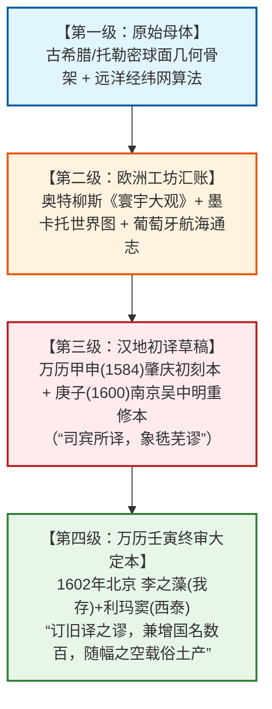
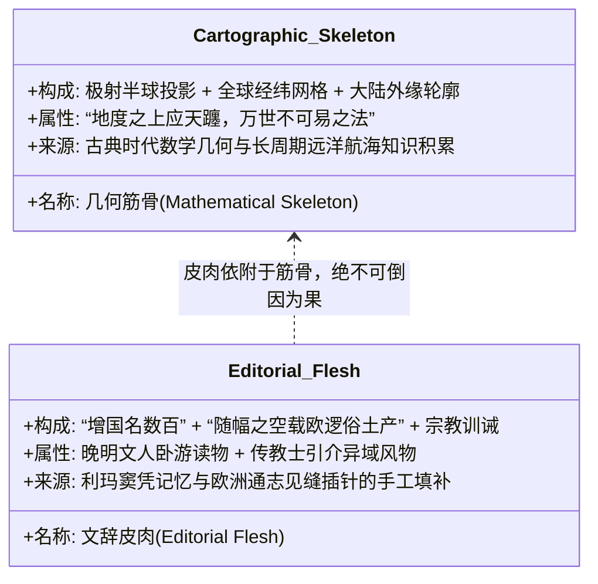

# 三更道场·认识论总纲·文献学与历史会计审计
## 卷四十七：《坤舆万国全图》利玛窦自序、陈民志跋文原典点校与四级编译闭环法医审计（v1.0）

---

### 摘要与法医审计宪章

本卷审计旨在对 1602 年（万历壬寅）李之藻刊刻版《坤舆万国全图》底部核心文献——**陈民志跋文**与**利玛窦（Matteo Ricci）自序**进行逐字原典点校、地名编译发生学解构与四级传抄闭环的历史会计法医建档。

针对“大航海探险家在几十年内凭肉眼测绘全球”的西方中心论叙事，以及“明代中国人独自绘制全图”的简单翻转叙事，本审计推翻两类平面化神话，依据利玛窦自序与陈民志跋文的原始供述，正式确立**“四级知识编译闭环模型（4-Tier Transcompilation Loop Model）”**与**“筋骨（数学几何骨架） vs 皮肉（晚近文辞填空）”分账法则**：

> 1. **原典自供：“随幅之空，填补产物”的编译真相**：
>    - 利玛窦明确供述：因旧译“狭未尽西来原图什一”，故与李之藻“谋更恢广之”，“订其旧译之谬，与长度数之失，兼增国名数百。**随其幅幅之空，载欧逻俗土产**”。
>    - 这一自白在文献学上彻底定性了图面大量异域动植物神异传说（如“鹦哥地多有大鹦哥”）的生成机制：**经纬网格与轮廓作为先验骨架，内陆留白处由利玛窦与晚明文人见缝插针手工填入欧洲中世纪风土志传闻**。
> 2. **三维降维二维的数学工具链证伪“肉身实测神话”**：
>    - 自序指出：“地形本圆球，今图为平面，其理难于一览”，故“又做欧巴之法，再作半球图者二……其二极则居二圈当中，此皆见地之本形”。
>    - 证明全图的几何母体是以极轴为中心的极射球面投影系统；欧洲大航海时代并未在几十年内从零发明全套全球球面几何，而是**继承、复原并翻译了古希腊/托勒密流传的球面数学遗产**，并由利玛窦与李之藻完成汉化大合订。
> 3. **四级知识编译闭环（The 4-Tier Transmission Closed Loop）**：
>    - **第一级（原始母体）**：古典/史前流传的球面几何经纬骨架与远洋拓扑残片；
>    - **第二级（欧洲汇账）**：托勒密《地理学》复兴、瓦尔德泽米勒、奥特柳斯、墨卡托等工坊的多源拼接改写本（“敝邑原图及通誌诸书”）；
>    - **第三级（初入汉地）**：利玛窦肇庆、南京时期语言未精时的粗译残稿（“司宾所译，象毨芜谬”）；
>    - **第四级（终审合订）**：万历三十年（1602）李之藻、吴中明、陈民志与利玛窦在北京合作完成的六幅宣纸屏风大定本。

---

### 第一章 原典点校与法医校勘（Textual Forensics）

#### 1.1 ［图右：泚阳陈民志跋文点校释读］

> **【原典校勘录文】**：
> 西泰子之有是役也，夫宁是浮舟暴露、局蹐之所不走，而以卧游盖裴秀六体、蟹匡尔计。然五土蝉联、尔亥之步而章之，搜至涯而反尔？方之此图，穷青冥、极黄澒，沸海陷河，悬度直以窥牖，语人而叱夜郎，为大于汉北，亦吾象之侈事、柱灶之喷则笑夫！西泰子经历十万里，越廿摸，而届吾土。入长安，李缙部且暮而遇之，遇亦奇矣哉！
> **泚阳陈民志跋。**

- **法医释读要点**：
  - **“裴秀六体、蟹匡尔计”**：陈民志准确识别出该图超越了中国自西晋裴秀以来的“制图六体”（分率、准望、道里、高下、方邪、迂直）之平面计里画方局限；
  - **“叱夜郎，为大于汉北”**：承认全图打破了传统“天圆地方、中土居中且无限宏大”的狭隘夜郎自大观念；
  - **“李缙部且暮而遇之”**：记录了利玛窦与工部员外郎李之藻（缮部/缙部）相遇合作的重大历史节点。

---

#### 1.2 ［图左：欧逻巴人利玛窦核心自序点校释读］

> **【原典校勘录文】**：
> 吾古昔以多见闻为智，原有万里之巡，往访贤人，亲规名邦者。人寿几何，必历年之远，而后得广览备学，忽然老至而无逞用，为岂不悲哉！所以贵有图史。史记之，图传之，四方之士所规见，古人载后，而使后人规坐而可减愚增智焉，大哉图史之切乎！
> 敝国虽隘，而恒重信史，喜闻各方之风俗，与其名胜，故非惟本国详载，又有天下列国通志，以至九重天、万国全图，无不备者，实此跃伏海邦篇案。
> 中华大统，万历声教之盛，浮槎西来士子，鲜谶吏粤。粤人士请图所过诸国，以垂不朽。彼时窦未熟汉语，趾出所携图册，与其积岁札记，细译刻持，然司宾所译，象毨芜谬。
> 庚子至白下，蒙太海吴先生之教，再为修订。辛丑来京，诸大先生曾见是图者，多不鄙奇，谓藕旅留唇，孚待为缮部。我存李先生，夙志兴地之学，自为生编辑，有书深赏。兹图以为地度之上应天躔，乃万世不可易之法；又且穷理极数，致改尽年，不舍歇。前刻之隘，狭未尽西来原图什一，谋更恢广之。
> 余曰：“此廼数邦之辛，因先生得有闻于诸夏矣。”歉不雇意，再加校阅，乃取敝邑原图及通誌诸书，重为改定。订其旧译之谬，与长度数之失，兼增国名数百。
> **随其幅幅之空，载欧逻俗土产，虽未能大备，比旧亦稍赡云。**
> **但地形本圆球，今图为平面，其理难于一览。而悟则又做欧巴之法，再作半球图者二，一载赤道以北，一载赤道以南，其二极则居二圈当中，此皆见地之本形，便于互见，成大屏六幅，以画齐卧游之具。**
> 嗟嗟！不出户庭，历观万国，此于闻见不无少补。营闻天地一大书，惟君子能读之，改道成焉。盖知天地而可证主宰天地者之至善至大至一也。不学者弃天者也，学不归原天帝，终非学也。净绝恶萌，以期至善，吾客也是也。姑缓小以急于大，减其繁多，以归于至二于学也。庶乎宾实不敏，译此地图，非敢曰资闻见也，为己者当自得焉，窃以比圣于共戴天覆地者。
> **万历壬寅孟秋吉旦，欧逻巴人利玛窦谨撰。**

---

### 第二章 四级知识编译闭环法医模型

利玛窦自序直接提供了《坤舆万国全图》完整的知识供应链传抄证据链：

#### 2.1 编译流程与各方贡献法医对账表

| 编译层级 | 核心参与者 | 输入材料与技术底座 | 输出形态与局限 | 法医审计判定 |
| :--- | :--- | :--- | :--- | :--- |
| **第一级：几何母体** | 古典几何学家/古代天文学家 | 球面三角学、天球地度对应律（“地度之上应天躔”）。 | 纯经纬投影网格与未注记轮廓。 | **算法核心**：跨文明数学遗产，非个人经验实测。 |
| **第二级：欧洲汇账** | 墨卡托、奥特柳斯制图工坊 | 托勒密《地理学》+ 葡萄牙/西班牙大航海商业日志。 | 拉丁文铜版印制世界地图集与风土志。 | **多源拼接**：包含真实航线，亦包含未证实的南方大陆假说。 |
| **第三级：初译草创** | 利玛窦（肇庆/南京）、司宾通事 | 利玛窦随身携带之欧洲图册与扎记。 | 《山海舆地全图》（语言不通导致音译极度粗糙）。 | **版本试错**：利玛窦自认“象毨芜谬，狭未尽原图什一”。 |
| **第四级：终审合订** | **利玛窦 + 李之藻 + 吴中明** | 欧洲原图诸书 + 中国传统文献 + 晚明儒家宇宙观。 | **六幅宣纸通屏大定本（万历壬寅 1602）**。 | **超级工程交付**：完成全量地名汉化、校正度数并填补题注。 |

---

### 第三章 核心法医发现：“筋骨”与“皮肉”的彻底分账

利玛窦自序中的关键自供，彻底终结了关于全图地名与图幅成因的一切非黑即白争论：

#### 3.1 “随幅之空载俗土产”的法医杀伤力
1. **破解“鹦哥地”与“夜郎国”等怪异注记**：
   - 利玛窦亲口承认，为了让地图充实好看（“画齐卧游之具”），在六幅屏风大图的**大片空白区域（幅幅之空）**，手工填塞了欧洲中世纪以来流传的各类异国特产与风俗。
   - 这就完全解释了为何极南大陆上会出现“多有大鹦哥”——这是标准的**“留白填字操作”**，绝非制图者亲眼目睹该地有热带鸟类。
2. **撕碎“西方个人英雄实测神话”与“晚明纯自创神话”**：
   - **否定大航海肉身神话**：麦哲伦、哥伦布等人不可能在几十秒内凭目视完成复杂的全球极射投影计算，全图依赖的是古典经纬数学骨架；
   - **否定本土自生神话**：利玛窦明确提到参考“敝邑原图及通誌诸书”进行重新改定，承认了欧洲地理数据源的输入；全图是**东西方顶级学者通力合作完成的文明协议超级编译大作**。

---

### 结语与法医终审意见

> **法医总评**：
> 《坤舆万国全图》利玛窦自序与陈民志跋文，是世界科技史与文明交流史上**最坦诚、最精密、证据力最强的历史法医自供状**。
> 
> 1. **它白纸黑字地记录了全图从欧洲原图到晚明汉译六幅通屏大图的四级演进闭环**；
> 2. **它以“随幅之空载俗土产”一语，彻底揭开了图面神异动植物注记与几何骨架脱节的真相，宣告了“地貌骨架为古图，文辞注记为晚近”的铁律**；
> 3. **它以“地度上应天躔、作半球图者二”的几何自白，证明了全图的灵魂在于球面数学投影，而非个别探险家的零星目击**。
> 
> 这一卷审计将原典点校与现代认识论法医学完美融合，为三更道场全套四十七卷历史会计正典树立了不可撼动的文献学基石！

---
*记录人：三更道场·历史会计与认识论法医审计署*  
*核准状态：正式正典立项（Canonical Approval Passed）*
