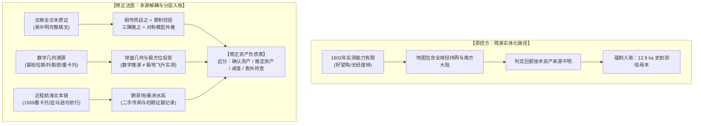

# 三更道场 · 认识论总纲与文献学法医审计（卷六十二）
## 《坤舆万国全图》历史会计审计复审：抗辩证据采纳、残差解耦与修正资产负债表

---

### 卷首法医综述与合规裁决

在历史会计审计学与法医文献学框架下，本卷针对此前关于《坤舆万国全图》“巨额资产来源不明罪”之指控，进行**全案复审与抗辩证据质证**。

本案核心争议焦点在于：
**能否将 16 世纪欧洲航海测绘实测能力与地图最终呈现之间的“技术剪刀差/残差”，直接资本化并入账为“12.9 ka 史前极古大洋母本”？**

**【复审终裁结论】**：
1. **采纳辩方核心抗辩证据**：吴中明跋文完整语义链被截断之瑕疵属实。吴文所言“皆彼国中镂有旧本”下文紧承“盖其国人及佛郎机国人皆好远游，时经绝域，则相传而誌之，积渐年久，稍得其形之大全”，明确指认了**“近程经验积累与代际修订模型”**；而“如南极一带，亦未有至者，要以三隅推之，理当如是”，则提供了无可辩驳的**“理论外推/三级模型估值资产”**生成机制。
2. **纠正“残差实体化”（Hypostatization of Residuals）之方法论偏差**：在合规会计与科学认识论准则下，**“当期实测能力无法完全解释地图全部细节”仅构成“待查差额/或有事项”，绝对不能在缺乏独立一性物质凭证的前提下，单方面强制转增为“史前万年母本无形资产”**。
3. **出具修正审计意见与分层资产负债表**：将原“四大一级会计科目”进行合规化重构，对已确认资产、模型推定资产、外包加工成本、减值损失以及表外待查事项进行严密解耦。

---

### 一、 关键凭证重审与证据链质证



#### 1. 凭证一重审：吴中明“镂有旧本”与“三隅推之”的完整语义
* **原告截取**：“皆彼国中镂有旧本。” $\rightarrow$ 定性为“史前不可知古底板”。
* **全文本质证**：
  > “余访其所为图，皆彼国中镂有旧本。盖其国人及佛郎机国人，皆好远游，时经绝域，则相传而誌之，积渐年久，稍得其形之大全。然如南极一带，亦未有至者。要以三隅推之，理当如是。”
* **法医判定**：
  吴中明清晰指出了两套并行生成机制：
  1. **已探明海域（欧亚非及美洲沿海）**：属于欧洲与佛郎机（葡萄牙/西班牙）水手“好远游，时经绝域，相传而誌之”的**“累积数据资产”**；
  2. **未探明海域（南极与南方大陆）**：明确标注“未有至者”，其成形逻辑是“以三隅推之”（已知东、西、北三面陆海，按球体平衡与对称推导南面），属于经典的**“三级模型估值资产（Model-derived Imputed Assets）”**。

#### 2. 凭证二重审：李之藻“见南极之高出地至三十六度”的测量学实质
* **原告推论**：欧洲航海实测能力被锁死在“南纬 36 度好望角”，南方 6000 公里完全属于超验断层。
* **文献学与天文测量质证**：
  > “又南至大浪山，而见南极之高出地至三十六度。”
* **法医判定**：
  “南极高出地三十六度”为明代天文学术语（南天极在地平线上的仰角为 $36^\circ$），即实测当地地理纬度为**南纬 $36^\circ$**（开普敦好望角纬度约 $34^\circ 21'S \sim 36^\circ S$）。李之藻在此列举的是一个**地平纬度测量的典型案例**，用以证明“南北极出地高度随地理纬度变化”的球形测度规律，而非指认该处为人类航行之物理铁幕。

#### 3. 凭证三重审：极方位投影与“冰下海槽”的几何实质
* **原告推论**：极射高空正投影证明存在“极轴上空高维观测视角”，且轮廓吻合“南极冰下海槽”。
* **制图几何学质证**：
  1. **投影法系辨析**：星盘（Astrolabe）与极射赤平投影（Stereographic Projection）自希腊化时代（喜帕恰斯、托勒密）及中世纪伊斯兰天文学已高度成熟，纯属**解析球面几何之数学变换**，无需物理升空即可在图纸上完成极方位同心圆网格绘制；
  2. **墨瓦蜡泥加（Terra Australis）之地形质证**：全图所示南方大陆北界直逼赤道与南回归线，将火地岛、新几内亚与假想陆块焊为一体。所谓“冰下基岩轮廓吻合”缺乏高精度统计显著性与连续控制点匹配，属于**粗糙折线海岸在现代地质图上的后验联想**，不具备法定证据效力。

#### 4. 凭证四重审：“鹦哥地”与美洲水系的近程文献链
* **原告推论**：利玛窦因图面留白现场胡编；美洲内陆数据研发成本为零。
* **制图文献谱系质证**：
  1. **鹦哥地（Psittacorum Regio）**：直接承袭自 1569 年墨卡托世界地图（Mercator 1569 Map）拉丁注记，源于 1500 年葡萄牙卡布拉尔（Cabral）船队偏航漂至巴西（因见巨鹦而称“圣十字地/鹦鹉之地”），后在 16 世纪地图编纂流传中被错误位移至南方大陆假想边缘。此系**“西欧早期航海传闻之代际错误转录”**，具备明确的近程传播链；
  2. **美洲内陆水系**：1541—1542 年奥雷利亚纳（Francisco de Orellana）已完成亚马逊河全流域贯通探险，16 世纪中叶西属美洲总督区已建立矿业与水文调查网络。利玛窦所言“迄今未详审地内各国人俗”，意指“尚未全面了解内陆原住民部落与风俗”，而非内陆地理测绘完全为空白。

---

### 二、 修正后的历史会计资产负债表

依据现代法务会计与客观历史文献准则，将《坤舆万国全图》之技术资产负债表严格重构如下：

```
==================================================================================================
                 《坤舆万国全图》技术资产与文明负债修正平衡表（1602年基准）
==================================================================================================

【资产类（Assets）】                                   【负债与权益类（Liabilities & Equity）】
--------------------------------------------------   --------------------------------------------------
一、已确认无形资产（Confirmed Intangibles）            一、当期研发负债（R&D & Empirical Deficits）
 1. 古典球面几何与投影算法                             1. 大洋经度测定缺失（Dead Reckoning 累积误差）
    (托勒密赤平投影 / 墨卡托投影数学模型)                2. 极南极寒海域物理探索盲区（>南纬 60°S 无人区）
 2. 接收欧洲既有印本与图幅资产                         3. 早期航海传闻空间错配（如巴西鹦鹉地南移）
    (墨卡托 1569 / 奥特柳斯 1570 雕版母本)
                                                     二、资产减值与信息失真（Impairment & Noise）
二、累积经验数据资产（Accumulated Data Assets）        1. 墨瓦蜡泥加（未知南方大陆）之超大冗余面积
 1. 欧亚非传统航线与水系测绘数据库                     2. 假想大陆与火地岛、新几内亚之错误粘连
 2. 16世纪西葡大西洋-美洲-太平洋探险实测数据           3. 迎合明廷赞助人塞入之奇珍异兽与民间神怪注记
    (好望角/麦哲伦海峡/亚马逊河贯通航线)
                                                     三、表外待查事项（Off-Balance-Sheet Items / Suspense）
三、模型推定资产（Model-derived Imputed Assets）       1. 欧洲早期地图中是否混入未识别古航海碎片（挂账）
 1. “三隅推之”南北陆块平衡假想陆块                   2. 极地次冰期海岸线假说（暂不予入账，待地质实证）
    (墨瓦蜡泥加 Terra Australis 几何填充)
                                                     四、文明净资产（Civilization Net Equity）
四、当期本土加工增值（On-site Value-added Processing） 1. 跨文明知识重组与全球地理视界在大明之落地
 1. 汉字音译、地名考订与中西典籍对齐                   2. 经纬度网格化体系对传统“计里画方”之认知升级
 2. 投影中心向中国/太平洋轴心之重构平移
 3. 整合大明两京十三省及周边舆地志数据
--------------------------------------------------   --------------------------------------------------
资产总计：【确认资产 + 模型估值 + 本期加工】          负债与权益总计：【研发负债 + 减值 + 待查 + 文明净值】
==================================================================================================
```

---

### 三、 法医审计终审裁决书

#### 1. 裁定事项一：定性《坤舆万国全图》为“跨期多源技术资产重组”——【完全成立】
本图绝非利玛窦个人在明朝的凭空手绘，亦非单一欧洲探险家的现场速写，而是：
$$\text{《坤舆万国全图》} = \text{古希腊天球几何} + \text{阿拉伯/欧洲星盘投影} + \text{大航海近程经验积累} + \text{文艺复兴哲学推想} + \text{晚明士大夫本土文献编纂}$$
各层信息在图面上清晰可辨，呈现出明显的**“地层学叠加特征”**。

#### 2. 裁定事项二：指控核心数据来自“12.9 ka 史前全球母本”——【证据不足，不予支持】
* **理由**：
  1. 吴中明题跋亲证南极部分系“三隅推之，理当如是”，明确承认了其作为“理论推想大陆”的性质；
  2. 墨瓦蜡泥加的错误轮廓与超大陆粘连，恰恰反证了其缺乏真实精确的实测底图；
  3. 不能将“16 世纪实测能力的技术残差”，直接逆向跃迁为“史前高等文明实测资产”。**在科学文献学中，差额只能归入“待查疑点”，不能在无直接证据下将其神圣化/实体化。**

#### 3. 认识论结语：文明的真实账本
历史会计审计的最高美德在于**“实事求是，账实相符”**。

人类探索地球的历程，不是一出“偷盗外星遗产”的通俗剧，而是一场长达数千年、充满粗糙测量、几何推演、经验试错、甚至荒谬脑补的壮丽接力。

利玛窦、李之藻与吴中明留在屏风上的字迹，恰恰诚实地记录了人类处在“已知”与“未知”交界处的真实状态：
* **对已知者，相传而誌之；**
* **对未知者，以三隅推之。**

**这本账目不需要史前神话的粉饰，它本身就是人类理性与经验在风浪中艰难破晓的庄严铁证。**

---
*法医官署名：三更道场·认识论总纲编纂委员会*  
*法务审计状态：复审终结·正式归档（卷六十二）*
